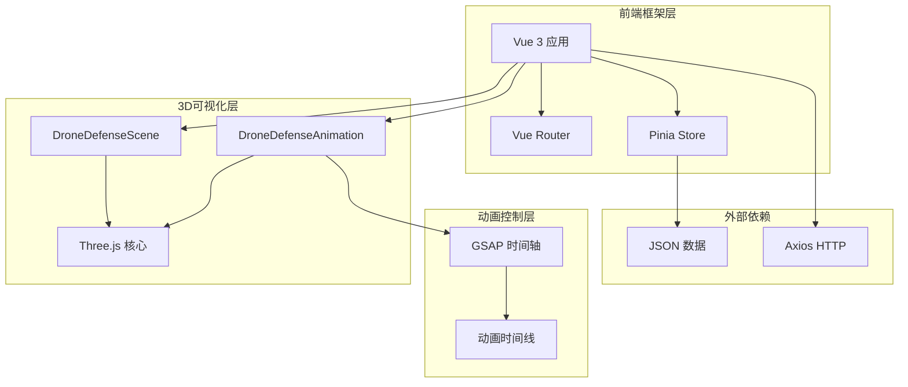
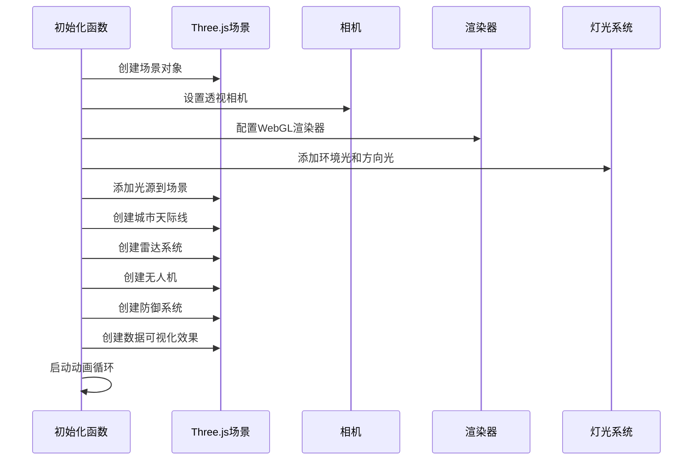
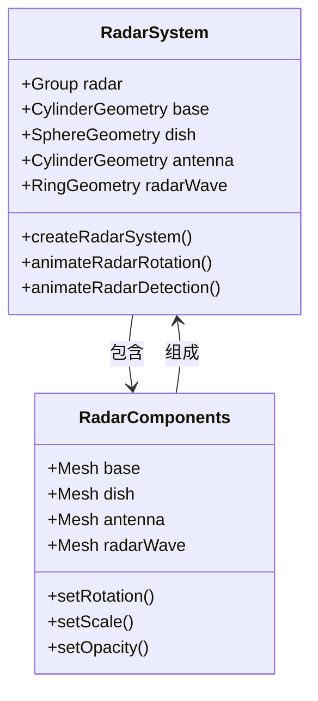
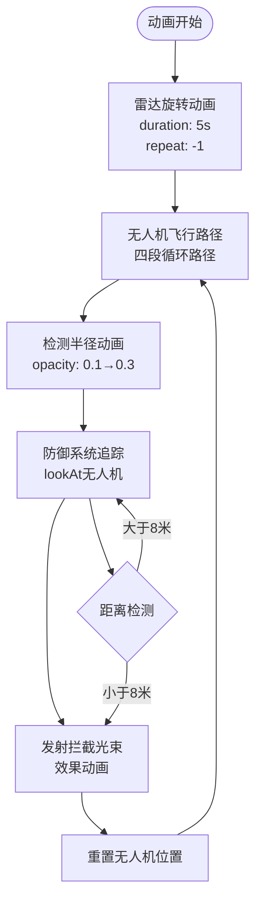
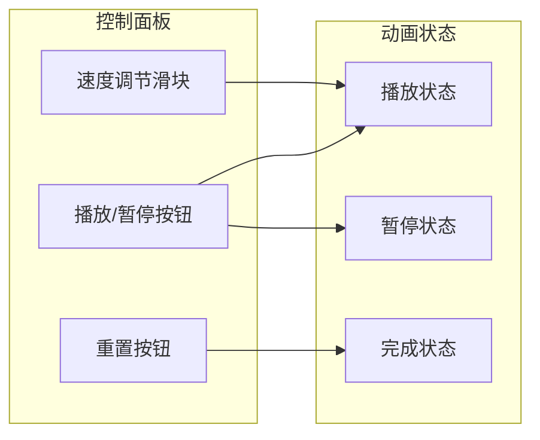

# 3D无人机防御系统可视化实现文档

<cite>
**本文档引用的文件**
- [DroneDefenseScene.vue](file://src/components/DroneDefenseScene.vue)
- [DroneDefenseAnimation.vue](file://src/components/DroneDefenseAnimation.vue)
- [DroneSystemView.vue](file://src/views/DroneSystemView.vue)
- [App.vue](file://src/App.vue)
- [package.json](file://package.json)
</cite>

## 目录
1. [项目概述](#项目概述)
2. [技术架构](#技术架构)
3. [核心组件分析](#核心组件分析)
4. [Three.js场景构建](#threejs场景构建)
5. [动画控制系统](#动画控制系统)
6. [组件间通信机制](#组件间通信机制)
7. [性能优化策略](#性能优化策略)
8. [用户交互设计](#用户交互设计)
9. [总结与建议](#总结与建议)

## 项目概述

本项目是一个基于Vue 3和Three.js的3D无人机防御系统可视化演示应用。该系统通过两个核心组件——`DroneDefenseScene.vue`和`DroneDefenseAnimation.vue`——展示了无人机从接近到被防御系统拦截的完整过程。

项目采用了现代化的前端技术栈：
- **Vue 3**：使用Composition API和响应式系统
- **Three.js**：3D图形渲染引擎
- **GSAP**：高性能动画库
- **Vite**：现代化构建工具

## 技术架构



**图表来源**
- [DroneDefenseScene.vue](file://src/components/DroneDefenseScene.vue#L1-L50)
- [DroneDefenseAnimation.vue](file://src/components/DroneDefenseAnimation.vue#L1-L50)
- [App.vue](file://src/App.vue#L1-L100)

## 核心组件分析

### DroneDefenseScene.vue - 场景初始化组件

`DroneDefenseScene.vue`是整个3D可视化的核心组件，负责初始化Three.js场景、相机、灯光和渲染器，构建完整的3D环境。

#### 主要职责：
- **场景初始化**：创建Three.js场景、相机和渲染器
- **3D模型构建**：创建城市天际线、雷达系统、无人机和防御系统
- **动画控制**：管理三个主要动画阶段（无人机接近、雷达检测、防御激活）
- **资源管理**：负责3D对象的创建、更新和销毁

#### 关键数据结构：

```javascript
// 动画阶段常量
const PHASE = {
  DRONE_APPROACH: 0,    // 无人机接近阶段
  RADAR_DETECT: 1,      // 雷达检测阶段
  DEFENSE_ACTIVATE: 2   // 防御系统激活阶段
};

// 3D对象引用
let scene, camera, renderer, clock;
let drone, radar, defenseSystem, cityModel;
let radarWave, dataOverlay;
```

### DroneDefenseAnimation.vue - 动画控制组件

`DroneDefenseAnimation.vue`专注于使用GSAP控制复杂的动画时间轴，模拟无人机飞行轨迹、雷达扫描效果和干扰信号发射过程。

#### 主要功能：
- **GSAP动画控制**：使用时间轴管理复杂的动画序列
- **交互式动画**：支持用户控制动画的播放和暂停
- **粒子效果**：创建动态的粒子系统增强视觉效果
- **实时追踪**：防御系统实时追踪无人机位置

**章节来源**
- [DroneDefenseScene.vue](file://src/components/DroneDefenseScene.vue#L1-L100)
- [DroneDefenseAnimation.vue](file://src/components/DroneDefenseAnimation.vue#L1-L100)

## Three.js场景构建

### 场景初始化流程



**图表来源**
- [DroneDefenseScene.vue](file://src/components/DroneDefenseScene.vue#L40-L80)

### 城市天际线构建

城市天际线是场景的重要组成部分，通过以下步骤构建：

1. **建筑物生成**：随机生成不同尺寸的立方体作为建筑物
2. **材质设置**：使用Phong材质创建金属质感的外观
3. **窗户效果**：移动端减少窗户数量以优化性能
4. **地面网格**：添加网格辅助线和地面平面

```javascript
// 建筑物几何体数组
const buildingGeometries = [
  new THREE.BoxGeometry(20, 100, 20),
  new THREE.BoxGeometry(30, 60, 30),
  new THREE.BoxGeometry(15, 120, 15)
];

// 建筑物材质
const buildingMaterial = new THREE.MeshPhongMaterial({
  color: 0x0a192f,
  emissive: 0x103a65,
  specular: 0x3498db,
  shininess: 30
});
```

### 雷达系统设计

雷达系统包含多个组件，每个都有特定的功能：



**图表来源**
- [DroneDefenseScene.vue](file://src/components/DroneDefenseScene.vue#L200-L250)

### 无人机模型构建

无人机采用模块化设计，包含以下关键组件：

1. **主体结构**：矩形盒子表示无人机主体
2. **旋翼系统**：四个对称分布的旋翼，每个旋翼包含叶片
3. **摄像头**：球形物体表示无人机摄像头
4. **动态效果**：旋翼的旋转动画和飞行轨迹

```javascript
// 旋翼位置配置
const rotorPositions = [
  { x: -5, y: 1, z: -5 },  // 左前
  { x: 5, y: 1, z: -5 },   // 右前
  { x: -5, y: 1, z: 5 },   // 左后
  { x: 5, y: 1, z: 5 }     // 右后
];
```

**章节来源**
- [DroneDefenseScene.vue](file://src/components/DroneDefenseScene.vue#L150-L300)

## 动画控制系统

### GSAP时间轴管理

`DroneDefenseAnimation.vue`使用GSAP的时间轴系统来管理复杂的动画序列：



**图表来源**
- [DroneDefenseAnimation.vue](file://src/components/DroneDefenseAnimation.vue#L300-L400)

### 动态追踪算法

防御系统实时追踪无人机的位置，使用以下算法：

```javascript
// 防御系统追踪逻辑
const trackDrone = () => {
  if (defenseSystem && drone) {
    const defensePosition = new THREE.Vector3();
    defenseSystem.getWorldPosition(defensePosition);
    
    const dronePosition = new THREE.Vector3();
    drone.getWorldPosition(dronePosition);
    
    // 防御系统朝向无人机
    defenseSystem.lookAt(dronePosition);
    
    // 计算距离并触发拦截
    const distance = defensePosition.distanceTo(dronePosition);
    if (distance < 8) {
      // 触发拦截逻辑
      fireDefenseBeam(defensePosition, dronePosition);
    }
  }
};
```

### 拦截光束效果

拦截光束效果包括光束本身和冲击波两个部分：

```javascript
// 发射拦截光束
const fireDefenseBeam = (start, end) => {
  // 创建光束几何体和材质
  const beamGeometry = new THREE.CylinderGeometry(0.05, 0.05, 1, 8);
  const beamMaterial = new THREE.MeshBasicMaterial({
    color: 0x00ffff,
    transparent: true,
    opacity: 0.8
  });
  
  // 创建光束网格并添加到场景
  const beam = new THREE.Mesh(beamGeometry, beamMaterial);
  scene.add(beam);
  
  // 设置光束位置和方向
  beam.position.copy(start);
  beam.lookAt(end);
  
  // 计算距离并缩放光束
  const distance = start.distanceTo(end);
  beam.scale.set(1, 1, distance);
  beam.position.lerp(end, 0.5);
  
  // 添加光束动画
  gsap.to(beam.material, {
    opacity: 0,
    duration: 1,
    ease: "power1.out",
    onComplete: () => {
      scene.remove(beam);
    }
  });
};
```

**章节来源**
- [DroneDefenseAnimation.vue](file://src/components/DroneDefenseAnimation.vue#L200-L500)

## 组件间通信机制

### Props传递控制参数

虽然当前代码中没有显式的Props传递，但可以通过以下方式实现组件间通信：

```javascript
// 父组件向子组件传递控制参数
const props = defineProps({
  initialPhase: {
    type: Number,
    default: 0
  },
  enableAnimations: {
    type: Boolean,
    default: true
  }
});

// 子组件向父组件发送事件
const emit = defineEmits(['animation-complete', 'phase-change']);
```

### 状态共享机制

使用Pinia进行全局状态管理：

```javascript
// 全局动画状态
const useAnimationStore = defineStore('animation', {
  state: () => ({
    isPlaying: false,
    currentPhase: 0,
    animationSpeed: 1.0
  }),
  actions: {
    togglePlay() {
      this.isPlaying = !this.isPlaying;
    },
    setPhase(phase) {
      this.currentPhase = phase;
    }
  }
});
```

### 事件总线模式

```javascript
// 事件总线定义
const eventBus = {
  listeners: {},
  
  on(event, callback) {
    if (!this.listeners[event]) {
      this.listeners[event] = [];
    }
    this.listeners[event].push(callback);
  },
  
  emit(event, data) {
    if (this.listeners[event]) {
      this.listeners[event].forEach(callback => callback(data));
    }
  }
};
```

## 性能优化策略

### 移动端适配

项目针对不同设备进行了性能优化：

```javascript
// 设备检测
const isMobile = computed(() => {
  return window.innerWidth <= 768;
});

// 移动端优化配置
const mobileConfig = {
  geometryDetail: 16,           // 几何体细节减少
  shadowQuality: false,         // 关闭阴影
  particleCount: 500,           // 减少粒子数量
  pixelRatio: 1                 // 降低像素比
};

const desktopConfig = {
  geometryDetail: 32,           // 高细节几何体
  shadowQuality: true,          // 开启高质量阴影
  particleCount: 1000,          // 增加粒子数量
  pixelRatio: Math.min(window.devicePixelRatio, 2) // 最大2倍像素比
};
```

### 渲染优化技术

1. **减少Draw Call**：合并相似材质的对象
2. **实例化渲染**：对于重复的无人机模型使用InstancedMesh
3. **LOD系统**：根据距离动态调整模型细节
4. **剔除优化**：使用Frustum Culling和Occlusion Culling

```javascript
// 实例化无人机渲染示例
const droneInstances = 10;
const instanceGeometry = new THREE.BoxGeometry(10, 2, 10);
const instanceMaterial = new THREE.MeshPhongMaterial({
  color: 0x1e293b,
  emissive: 0x334155,
  specular: 0xffffff
});

const instanceMesh = new THREE.InstancedMesh(
  instanceGeometry, 
  instanceMaterial, 
  droneInstances
);

// 设置实例变换矩阵
for (let i = 0; i < droneInstances; i++) {
  const matrix = new THREE.Matrix4();
  matrix.setPosition(i * 20, 100, -200);
  instanceMesh.setMatrixAt(i, matrix);
}
```

### 内存管理

```javascript
// 资源清理
const cleanupScene = () => {
  // 释放几何体内存
  scene.traverse((object) => {
    if (object.geometry) {
      object.geometry.dispose();
    }
    
    // 释放材质内存
    if (object.material) {
      if (Array.isArray(object.material)) {
        object.material.forEach(material => material.dispose());
      } else {
        object.material.dispose();
      }
    }
  });
  
  // 清空场景
  while(scene.children.length > 0){ 
    scene.remove(scene.children[0]); 
  }
};
```

**章节来源**
- [DroneDefenseScene.vue](file://src/components/DroneDefenseScene.vue#L80-L120)

## 用户交互设计

### 控制面板设计



**图表来源**
- [DroneDefenseAnimation.vue](file://src/components/DroneDefenseAnimation.vue#L10-L30)

### 交互响应机制

```javascript
// 动画控制方法
const toggleAnimation = () => {
  isPlaying.value = !isPlaying.value;
  
  if (isPlaying.value) {
    // 恢复动画
    radarAnimation.play();
    droneAnimation.play();
    gsap.ticker.add(trackDrone);
  } else {
    // 暂停动画
    radarAnimation.pause();
    droneAnimation.pause();
    gsap.ticker.remove(trackDrone);
  }
};

// 重置动画
const resetAnimation = () => {
  if (drone) {
    gsap.killTweensOf(drone.position);
    drone.position.set(7, 4, 7);
    startAnimations();
  }
};
```

### 视觉反馈系统

1. **状态指示器**：显示当前动画阶段
2. **进度条**：显示整体动画进度
3. **音效反馈**：配合动画节奏添加音效
4. **视觉提示**：高亮显示关键操作区域

```javascript
// 状态指示器更新
const updateStatusIndicator = (phase) => {
  const indicators = document.querySelectorAll('.status-indicator');
  indicators.forEach((indicator, index) => {
    indicator.classList.toggle('active', index === phase);
  });
};
```

**章节来源**
- [DroneDefenseAnimation.vue](file://src/components/DroneDefenseAnimation.vue#L500-L600)

## 总结与建议

### 技术亮点

1. **模块化设计**：两个核心组件职责明确，便于维护和扩展
2. **性能优化**：针对不同设备进行差异化优化
3. **交互友好**：提供直观的控制界面和丰富的视觉反馈
4. **动画流畅**：使用GSAP实现精确的时间控制和缓动效果

### 改进建议

1. **代码组织**：
   - 将3D对象创建逻辑提取到单独的服务类
   - 使用工厂模式创建相似的3D对象
   - 实现组件间的标准化接口

2. **性能提升**：
   - 实现GPU Instancing处理大量无人机
   - 使用Web Workers进行复杂计算
   - 实现按需加载3D资源

3. **用户体验**：
   - 添加VR支持，提供沉浸式体验
   - 实现手势控制和触摸交互
   - 增加多语言支持和无障碍访问

4. **功能扩展**：
   - 添加更多类型的无人机和防御系统
   - 实现实时数据可视化和统计功能
   - 集成物理引擎模拟真实飞行效果

### 最佳实践

1. **资源管理**：始终在组件卸载时清理Three.js资源
2. **性能监控**：使用浏览器开发者工具监控FPS和内存使用
3. **错误处理**：添加完善的错误捕获和恢复机制
4. **测试覆盖**：编写单元测试和集成测试确保稳定性

通过本文档的详细分析，开发者可以深入理解3D无人机防御系统的可视化实现原理，并能够在此基础上进行二次开发和功能扩展。项目的模块化设计和性能优化策略为构建复杂的3D可视化应用提供了宝贵的参考经验。