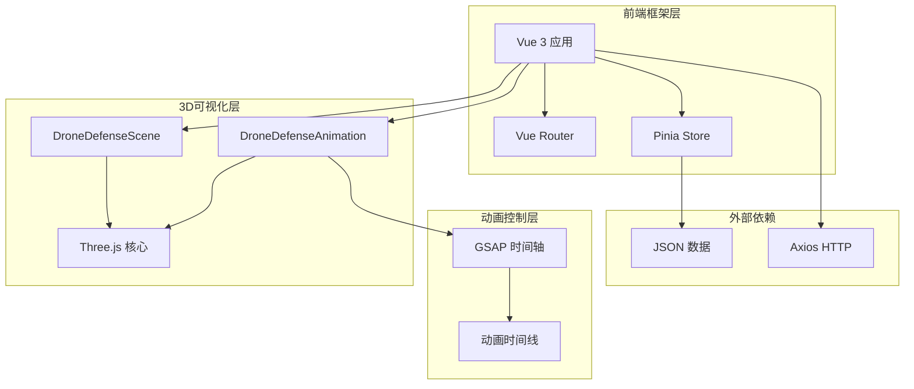
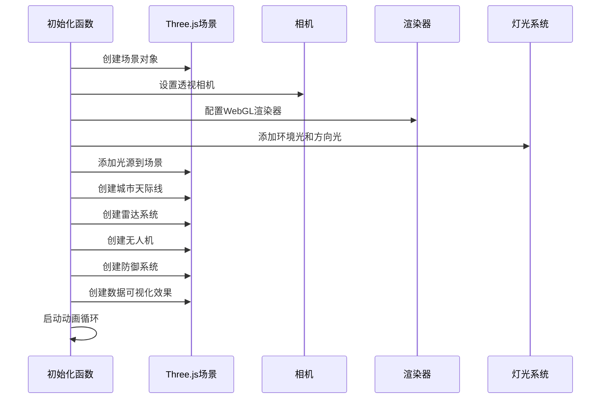

<docs>
# 3D可视化实现

<cite>
**本文档引用的文件**
- [DroneDefenseScene.vue](file://src/components/DroneDefenseScene.vue)
- [DroneDefenseAnimation.vue](file://src/components/DroneDefenseAnimation.vue)
- [DroneSystemView.vue](file://src/views/DroneSystemView.vue)
- [App.vue](file://src/App.vue)
- [package.json](file://package.json)
</cite>

## 目录
1. [项目概述](#项目概述)
2. [技术架构](#技术架构)
3. [核心组件分析](#核心组件分析)
4. [Three.js场景构建](#threejs场景构建)
5. [动画控制系统](#动画控制系统)
6. [组件间通信机制](#组件间通信机制)
7. [性能优化策略](#性能优化策略)
8. [用户交互设计](#用户交互设计)
9. [总结与建议](#总结与建议)

## 项目概述

本项目是一个基于Vue 3和Three.js的3D无人机防御系统可视化演示应用。该系统通过两个核心组件——`DroneDefenseScene.vue`和`DroneDefenseAnimation.vue`——展示了无人机从接近到被防御系统拦截的完整过程。

项目采用了现代化的前端技术栈：
- **Vue 3**：使用Composition API和响应式系统
- **Three.js**：3D图形渲染引擎
- **GSAP**：高性能动画库
- **Vite**：现代化构建工具

## 技术架构



**图表来源**
- [DroneDefenseScene.vue](file://src/components/DroneDefenseScene.vue#L1-L50)
- [DroneDefenseAnimation.vue](file://src/components/DroneDefenseAnimation.vue#L1-L50)
- [App.vue](file://src/App.vue#L1-L100)

## 核心组件分析

### DroneDefenseScene.vue - 场景初始化组件

`DroneDefenseScene.vue`是整个3D可视化的核心组件，负责初始化Three.js场景、相机、灯光和渲染器，构建完整的3D环境。

#### 主要职责：
- **场景初始化**：创建Three.js场景、相机和渲染器
- **3D模型构建**：创建城市天际线、雷达系统、无人机和防御系统
- **动画控制**：管理三个主要动画阶段（无人机接近、雷达检测、防御激活）
- **资源管理**：负责3D对象的创建、更新和销毁

#### 关键数据结构：

```javascript
// 动画阶段常量
const PHASE = {
  DRONE_APPROACH: 0,    // 无人机接近阶段
  RADAR_DETECT: 1,      // 雷达检测阶段
  DEFENSE_ACTIVATE: 2   // 防御系统激活阶段
};

// 3D对象引用
let scene, camera, renderer, clock;
let drone, radar, defenseSystem, cityModel;
let radarWave, dataOverlay;
```

### DroneDefenseAnimation.vue - 动画控制组件

`DroneDefenseAnimation.vue`专注于使用GSAP控制复杂的动画时间轴，模拟无人机飞行轨迹、雷达扫描效果和干扰信号发射过程。

#### 主要功能：
- **GSAP动画控制**：使用时间轴管理复杂的动画序列
- **交互式动画**：支持用户控制动画的播放和暂停
- **粒子效果**：创建动态的粒子系统增强视觉效果
- **实时追踪**：防御系统实时追踪无人机位置

**章节来源**
- [DroneDefenseScene.vue](file://src/components/DroneDefenseScene.vue#L1-L100)
- [DroneDefenseAnimation.vue](file://src/components/DroneDefenseAnimation.vue#L1-L100)

## Three.js场景构建

### 场景初始化流程



**图表来源**
- [DroneDefenseScene.vue](file://src/components/DroneDefenseScene.vue#L40-L80)

### 城市天际线构建

城市天际线是场景的重要组成部分，通过以下步骤构建：

1. **建筑物生成**：随机生成不同尺寸的立方体作为建筑物
2. **材质设置**：使用Phong材质创建金属质感的外观
3. **窗户效果**：移动端减少窗户数量以优化性能
4. **地面网格**：添加网格辅助线和地面平面

```javascript
// 建筑物几何体数组
const buildingGeometries = [
  new THREE.BoxGeometry(20, 100, 20),
  new THREE.BoxGeometry(30, 60, 30),
  new THREE.BoxGeometry(15, 120, 15),
  new THREE.BoxGeometry(25, 80, 25),
  new THREE.BoxGeometry(40, 40, 40)
];

// 建筑物材质
const buildingMaterial = new THREE.MeshPhongMaterial({
  color: 0x0a192f,
  emissive: 0x103a65,
  specular: 0x3498db,
  shininess: 30
});
```

### 雷达系统设计

雷达系统包含多个组件，每个都有特定的功能：

```mermaid
classDiagram
class RadarSystem {
+Group radar
+CylinderGeometry base
+SphereGeometry dish
+CylinderGeometry antenna
+RingGeometry radarWave
+createRadarSystem()
+animateRadarRotation()
+animateRadarDetection()
}
class RadarComponents {
+Mesh base
+Mesh dish
+Mesh antenna
+Mesh radar