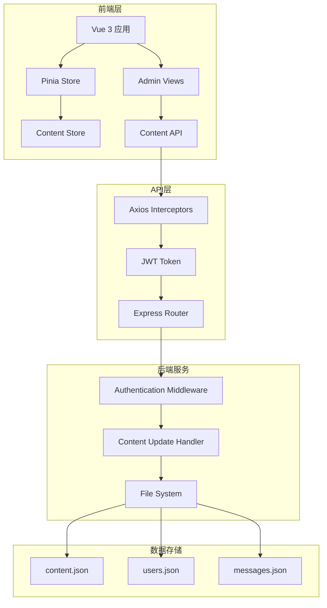
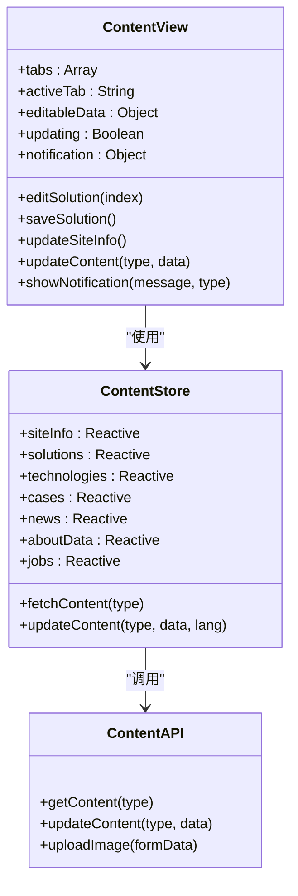
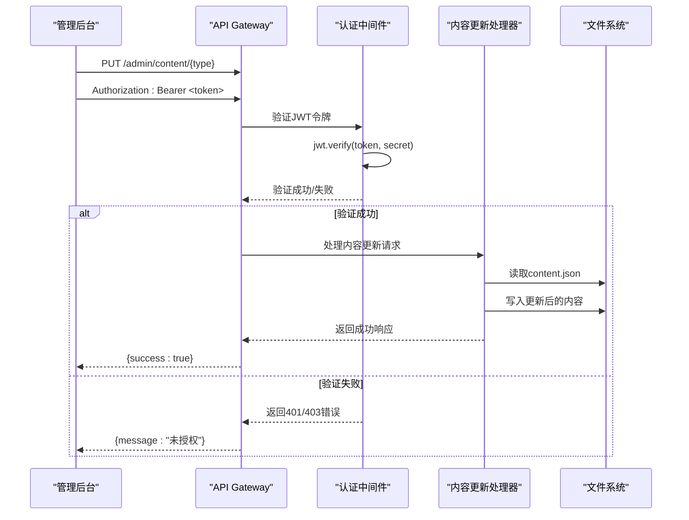
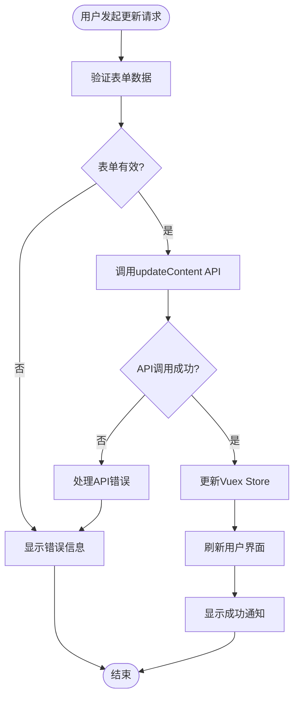

# 内容更新API详细文档

<cite>
**本文档中引用的文件**
- [app.js](file://app.js)
- [src/api/index.js](file://src/api/index.js)
- [src/store/modules/content.js](file://src/store/modules/content.js)
- [src/views/admin/ContentView.vue](file://src/views/admin/ContentView.vue)
- [server.cjs](file://server.cjs)
- [data/content.json](file://data/content.json)
- [package.json](file://package.json)
</cite>

## 目录
1. [简介](#简介)
2. [API架构概览](#api架构概览)
3. [核心组件分析](#核心组件分析)
4. [详细组件分析](#详细组件分析)
5. [数据流分析](#数据流分析)
6. [性能考虑](#性能考虑)
7. [故障排除指南](#故障排除指南)
8. [结论](#结论)

## 简介

本文档详细描述了基于Vue 3和Express的管理后台内容更新API系统。该系统提供了完整的RESTful API接口，允许管理员通过/admin/content/{type}的PUT请求更新特定类型的内容数据。系统采用JWT认证机制确保安全性，支持多种内容类型的动态管理，包括网站基本信息、解决方案、核心技术、典型案例、新闻资讯、关于我们和招聘信息等。

## API架构概览

系统采用前后端分离架构，前端使用Vue 3 + Pinia进行状态管理，后端使用Express框架提供RESTful API服务。



**图表来源**
- [src/api/index.js](file://src/api/index.js#L1-L95)
- [server.cjs](file://server.cjs#L1-L298)

## 核心组件分析

### 前端API客户端

前端通过Axios创建统一的API客户端，配置了请求和响应拦截器来处理认证和错误。

```javascript
// 创建axios实例
const api = axios.create({
  baseURL: '/api',
  timeout: 10000,
  headers: {
    'Content-Type': 'application/json'
  }
})
```

### 管理后台内容管理组件

ContentView.vue组件提供了直观的内容管理界面，支持多种内容类型的编辑和更新。



**图表来源**
- [src/views/admin/ContentView.vue](file://src/views/admin/ContentView.vue#L1-L328)
- [src/store/modules/content.js](file://src/store/modules/content.js#L1-L648)
- [src/api/index.js](file://src/api/index.js#L45-L55)

**章节来源**
- [src/views/admin/ContentView.vue](file://src/views/admin/ContentView.vue#L1-L328)
- [src/store/modules/content.js](file://src/store/modules/content.js#L1-L648)
- [src/api/index.js](file://src/api/index.js#L1-L95)

## 详细组件分析

### 内容更新API实现

#### 后端路由处理

后端通过Express路由处理/admin/content/{type}的PUT请求：

```javascript
// 更新内容（需要认证）
app.put('/api/admin/content/:type', authenticateToken, (req, res) => {
  const contentType = req.params.type;
  const newContent = req.body;
  const contentData = readDataFile(CONTENT_FILE);
  
  if (contentData) {
    contentData[contentType] = newContent;
    writeDataFile(CONTENT_FILE, contentData);
    res.json({ success: true, message: '内容已更新' });
  } else {
    res.status(500).json({ message: '内容数据读取失败' });
  }
});
```

#### 前端API封装

前端通过contentApi对象封装内容更新功能：

```javascript
export const contentApi = {
  // 获取内容
  getContent: (type) => api.get(`/content/${type}`),
  
  // 更新内容（需要管理员权限）
  updateContent: (type, data) => api.put(`/admin/content/${type}`, data),
  
  // 上传图片（需要管理员权限）
  uploadImage: (formData) => api.post('/admin/upload', formData, {
    headers: {
      'Content-Type': 'multipart/form-data'
    }
  })
}
```

#### Vuex Store状态管理

Content Store使用Pinia进行状态管理，提供响应式的数据访问和更新方法：

```javascript
export const useContentStore = defineStore('content', () => {
  // 状态管理
  const loading = ref(false)
  const error = ref(null)
  const isInitialized = ref(false)
  
  // 更新内容的方法
  const updateContent = async (contentType, data, lang) => {
    if (!isInitialized.value) return null
    
    try {
      // 向API发送更新请求
      await axios.put(`/api/admin/content/${contentType}`, {
        data,
        language: lang || languageStore.language
      })
      
      return { success: true }
    } catch (error) {
      console.error(`Error updating ${contentType}:`, error)
      return { success: false, error: error.message }
    }
  }
  
  return {
    loading,
    error,
    isInitialized,
    updateContent
  }
})
```

### JWT认证机制

系统实现了完整的JWT认证流程：



**图表来源**
- [server.cjs](file://server.cjs#L100-L120)
- [src/api/index.js](file://src/api/index.js#L10-L30)

### Axios拦截器配置

前端通过拦截器自动处理认证令牌和错误响应：

```javascript
// 请求拦截器
api.interceptors.request.use(
  config => {
    // 从localStorage获取token
    const token = localStorage.getItem('admin-token')
    if (token) {
      config.headers.Authorization = `Bearer ${token}`
    }
    return config
  },
  error => {
    return Promise.reject(error)
  }
)

// 响应拦截器
api.interceptors.response.use(
  response => {
    return response
  },
  error => {
    if (error.response) {
      // 处理401错误（未授权）
      if (error.response.status === 401) {
        localStorage.removeItem('admin-token')
        localStorage.removeItem('admin-user')
        // 如果是在管理后台，则跳转到登录页面
        if (window.location.pathname.startsWith('/admin')) {
          window.location.href = '/admin/login'
        }
      }
    }
    return Promise.reject(error)
  }
)
```

**章节来源**
- [server.cjs](file://server.cjs#L100-L120)
- [src/api/index.js](file://src/api/index.js#L10-L55)
- [src/store/modules/content.js](file://src/store/modules/content.js#L580-L610)

## 数据流分析

### 内容更新流程

内容更新遵循以下数据流模式：



**图表来源**
- [src/views/admin/ContentView.vue](file://src/views/admin/ContentView.vue#L150-L180)
- [src/store/modules/content.js](file://src/store/modules/content.js#L580-L610)

### 数据持久化机制

系统将更新后的数据持久化到JSON文件中：

```javascript
// 读取数据文件
const readDataFile = (filePath) => {
  if (fs.existsSync(filePath)) {
    const data = fs.readFileSync(filePath, 'utf8');
    return JSON.parse(data);
  }
  return null;
};

// 写入数据文件
const writeDataFile = (filePath, data) => {
  fs.writeFileSync(filePath, JSON.stringify(data, null, 2));
};
```

**章节来源**
- [src/views/admin/ContentView.vue](file://src/views/admin/ContentView.vue#L150-L180)
- [server.cjs](file://server.cjs#L80-L95)

## 性能考虑

### 前端性能优化

1. **状态缓存**: 使用Pinia Store缓存内容数据，避免重复API调用
2. **懒加载**: 按需加载内容类型，减少初始加载时间
3. **响应式更新**: 利用Vue 3的响应式系统，只更新变更的部分

### 后端性能优化

1. **文件缓存**: 内存中缓存JSON文件内容，减少磁盘I/O
2. **并发处理**: 支持多个内容类型的并行更新
3. **错误处理**: 完善的错误处理机制，防止系统崩溃

## 故障排除指南

### 常见问题及解决方案

#### 1. 401未授权错误

**症状**: API返回401状态码
**原因**: JWT令牌缺失或无效
**解决方案**:
- 检查localStorage中是否存在admin-token
- 验证令牌是否过期
- 重新登录获取新的令牌

#### 2. 内容更新失败

**症状**: 更新请求成功但数据未保存
**原因**: 文件写入权限问题或JSON格式错误
**解决方案**:
- 检查data目录的写入权限
- 验证JSON数据格式的正确性
- 查看服务器端错误日志

#### 3. 前端状态不一致

**症状**: UI显示旧数据
**原因**: Vuex Store未正确更新
**解决方案**:
- 强制刷新内容数据
- 检查API响应状态
- 清除浏览器缓存

**章节来源**
- [src/api/index.js](file://src/api/index.js#L25-L35)
- [server.cjs](file://server.cjs#L100-L120)

## 结论

本文档详细介绍了基于Vue 3和Express的内容更新API系统。该系统提供了完整的管理后台功能，支持多种内容类型的动态更新，采用JWT认证确保安全性，通过Axios拦截器简化API调用，使用Pinia进行状态管理，实现了前后端的高效协作。

系统的主要优势包括：
- 完整的认证和授权机制
- 灵活的内容管理界面
- 高效的数据持久化
- 良好的错误处理和用户体验
- 可扩展的架构设计

通过本文档的指导，开发者可以深入理解系统的实现细节，并根据具体需求进行定制和扩展。