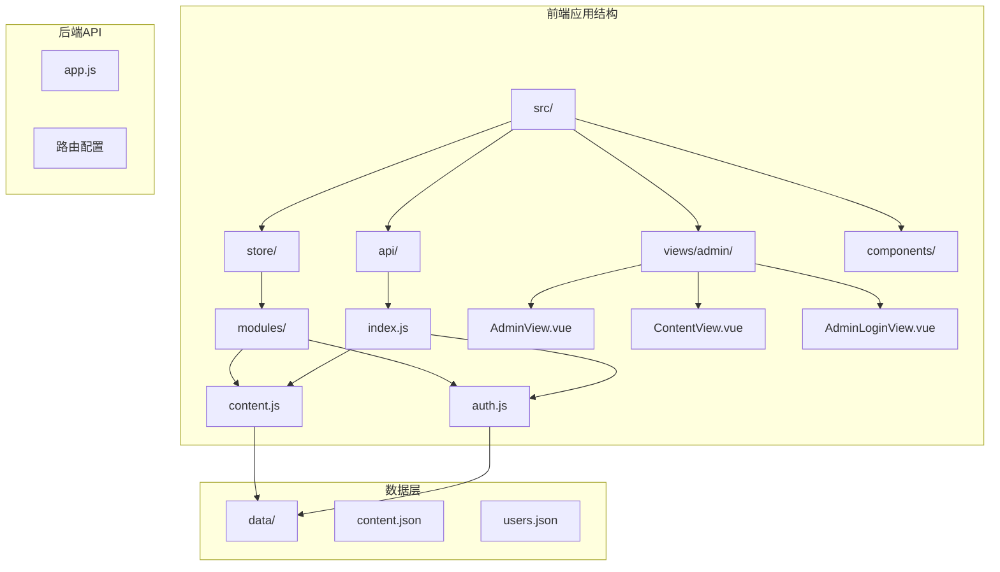
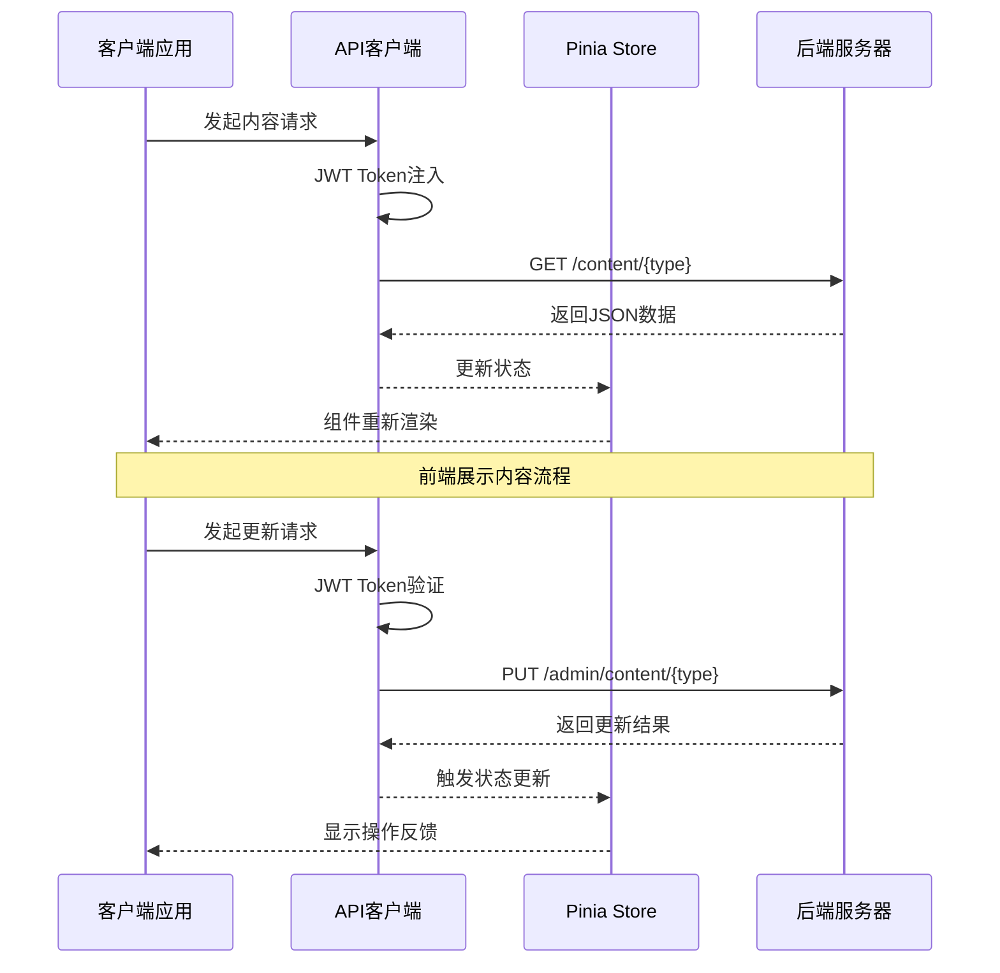
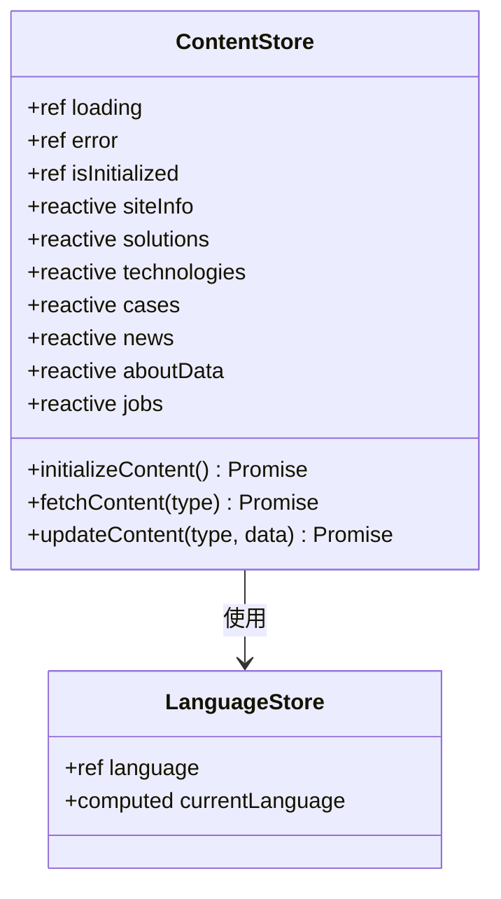
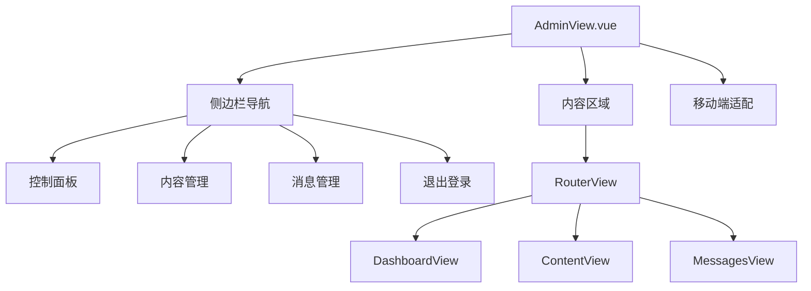
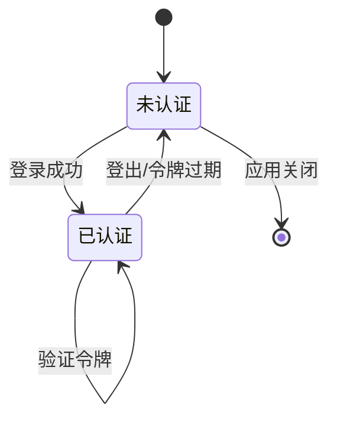
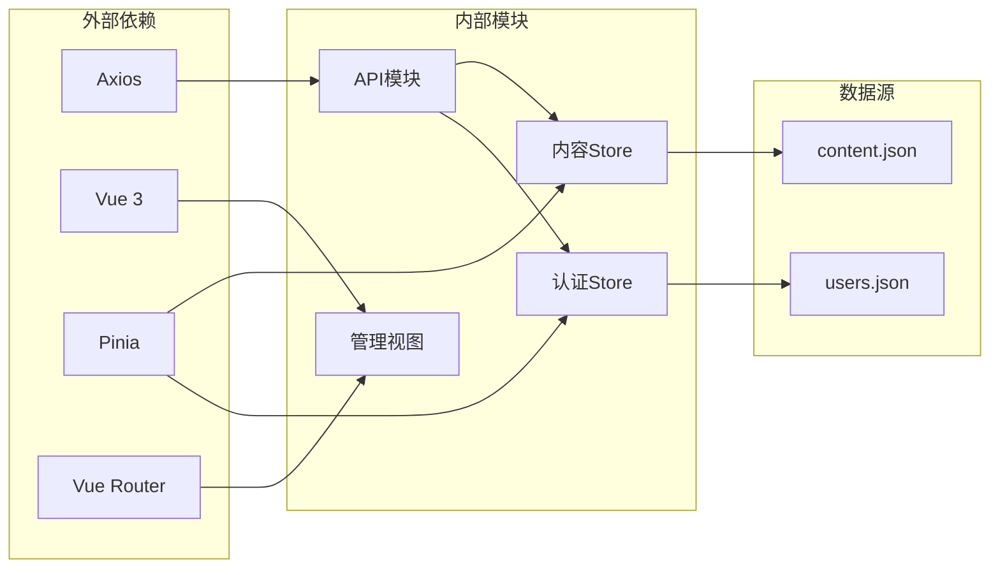

# 内容管理API

<cite>
**本文档中引用的文件**
- [app.js](file://app.js)
- [src/api/index.js](file://src/api/index.js)
- [src/store/modules/content.js](file://src/store/modules/content.js)
- [src/store/modules/auth.js](file://src/store/modules/auth.js)
- [src/views/admin/AdminView.vue](file://src/views/admin/AdminView.vue)
- [src/views/admin/ContentView.vue](file://src/views/admin/ContentView.vue)
- [src/views/admin/AdminLoginView.vue](file://src/views/admin/AdminLoginView.vue)
- [data/content.json](file://data/content.json)
</cite>

## 目录
1. [简介](#简介)
2. [项目结构](#项目结构)
3. [核心组件](#核心组件)
4. [架构概览](#架构概览)
5. [详细组件分析](#详细组件分析)
6. [依赖关系分析](#依赖关系分析)
7. [性能考虑](#性能考虑)
8. [故障排除指南](#故障排除指南)
9. [结论](#结论)

## 简介

本文档详细描述了一个基于Vue.js和Pinia的状态管理系统的前端内容管理API。该系统提供了完整的前后端交互接口，支持管理员对网站内容进行动态管理，包括获取前端展示内容和更新管理内容两大核心功能。

系统采用现代化的前端架构，使用Vue 3 Composition API和Pinia进行状态管理，通过Axios实现HTTP请求的统一管理和拦截处理。整个系统围绕内容管理这一核心业务需求，提供了完整的CRUD操作支持。

## 项目结构



**图表来源**
- [src/api/index.js](file://src/api/index.js#L1-L95)
- [src/store/modules/content.js](file://src/store/modules/content.js#L1-L50)
- [src/store/modules/auth.js](file://src/store/modules/auth.js#L1-L86)

**章节来源**
- [app.js](file://app.js#L1-L425)
- [src/api/index.js](file://src/api/index.js#L1-L95)

## 核心组件

### API客户端配置

系统使用Axios创建统一的API客户端，配置了基础URL、超时时间和默认请求头：

```javascript
const api = axios.create({
  baseURL: '/api',
  timeout: 10000,
  headers: {
    'Content-Type': 'application/json'
  }
})
```

### 请求拦截器

实现了JWT Bearer Token的自动注入功能，确保每次请求都携带有效的认证信息：

```javascript
api.interceptors.request.use(
  config => {
    const token = localStorage.getItem('admin-token')
    if (token) {
      config.headers.Authorization = `Bearer ${token}`
    }
    return config
  }
)
```

### 响应拦截器

处理认证错误和统一的错误响应：

```javascript
api.interceptors.response.use(
  response => response,
  error => {
    if (error.response && error.response.status === 401) {
      localStorage.removeItem('admin-token')
      localStorage.removeItem('admin-user')
      if (window.location.pathname.startsWith('/admin')) {
        window.location.href = '/admin/login'
      }
    }
    return Promise.reject(error)
  }
)
```

**章节来源**
- [src/api/index.js](file://src/api/index.js#L1-L95)

## 架构概览



**图表来源**
- [src/api/index.js](file://src/api/index.js#L15-L45)
- [src/store/modules/content.js](file://src/store/modules/content.js#L550-L600)

## 详细组件分析

### 内容管理API接口

#### GET /content/{type} 接口

用于获取不同类型的前端展示内容，支持以下内容类型：

```javascript
// 支持的内容类型枚举
const contentTypes = [
  'site-info',     // 网站基本信息
  'solutions',     // 解决方案数据
  'technologies',  // 核心技术数据
  'cases',         // 典型案例数据
  'news',          // 新闻资讯数据
  'about',         // 关于我们数据
  'jobs'           // 招聘信息数据
]
```

**响应数据结构示例**：
```json
{
  "site-info": {
    "companyName": "杭州朗德智能科技有限公司",
    "slogan": "智能科技，创造可能",
    "description": "用智能科技赋能产业升级，驱动未来创新",
    "contactInfo": {
      "address": "浙江省杭州市滨江区科技园区创新大厦A座15楼",
      "phone": "0571-8888 9999",
      "email": "info@landeintelligent.com"
    }
  }
}
```

#### PUT /admin/content/{type} 接口

用于管理员更新特定类型的内容数据，需要有效的JWT Bearer Token认证：

```javascript
// 更新内容的API调用
const updateContent = async (contentType, data) => {
  try {
    const result = await contentStore.updateContent(contentType, data)
    if (result.success) {
      showNotification('更新成功！', 'success')
    } else {
      showNotification(`更新失败: ${result.error}`, 'error')
    }
  } catch (error) {
    showNotification(`更新失败: ${error.message}`, 'error')
  }
}
```

#### POST /admin/upload 文件上传接口

支持multipart/form-data格式的文件上传，主要用于图片资源的上传：

```javascript
// 图片上传API
uploadImage: (formData) => api.post('/admin/upload', formData, {
  headers: {
    'Content-Type': 'multipart/form-data'
  }
})
```

**文件类型限制**：仅支持图片文件（jpg, png, gif等）

**返回格式**：
```json
{
  "url": "/uploads/images/2025/06/15/image.jpg",
  "filename": "image.jpg",
  "size": 1024000
}
```

### Pinia状态管理

#### 内容Store模块



**图表来源**
- [src/store/modules/content.js](file://src/store/modules/content.js#L1-L100)
- [src/store/modules/language.js](file://src/store/modules/language.js#L1-L50)

#### 状态管理特性

1. **响应式数据管理**：使用Vue 3的reactive和ref创建响应式状态
2. **语言切换支持**：自动监听语言变化并刷新内容
3. **错误处理**：统一的错误状态管理和显示
4. **加载状态**：跟踪API请求的加载状态

### 管理后台组件

#### AdminView.vue 管理后台布局



**图表来源**
- [src/views/admin/AdminView.vue](file://src/views/admin/AdminView.vue#L1-L50)

#### ContentView.vue 内容管理界面

支持多种内容类型的编辑和管理：

```javascript
// 支持的标签页配置
const tabs = [
  { id: 'site-info', name: '网站信息' },
  { id: 'solutions', name: '解决方案' },
  { id: 'technologies', name: '核心技术' },
  { id: 'cases', name: '典型案例' },
  { id: 'news', name: '新闻资讯' },
  { id: 'about', name: '关于我们' },
  { id: 'jobs', name: '招聘信息' }
]
```

**章节来源**
- [src/views/admin/AdminView.vue](file://src/views/admin/AdminView.vue#L1-L144)
- [src/views/admin/ContentView.vue](file://src/views/admin/ContentView.vue#L1-L328)

### 认证系统

#### AuthStore 管理员认证



**图表来源**
- [src/store/modules/auth.js](file://src/store/modules/auth.js#L1-L86)

#### 登录流程

```javascript
// 登录方法实现
const login = async (credentials) => {
  loading.value = true
  error.value = null
  
  try {
    const response = await axios.post('/api/auth/login', credentials)
    
    if (response.data.token) {
      token.value = response.data.token
      user.value = response.data.user
      isAuthenticated.value = true
      
      // 保存到本地存储
      localStorage.setItem('admin-token', token.value)
      localStorage.setItem('admin-user', JSON.stringify(user.value))
      
      return { success: true }
    } else {
      throw new Error('认证失败')
    }
  } catch (e) {
    error.value = e.message || '登录失败，请检查账号和密码'
    return { success: false, error: error.value }
  } finally {
    loading.value = false
  }
}
```

**章节来源**
- [src/store/modules/auth.js](file://src/store/modules/auth.js#L1-L86)
- [src/views/admin/AdminLoginView.vue](file://src/views/admin/AdminLoginView.vue#L1-L105)

## 依赖关系分析



**图表来源**
- [src/api/index.js](file://src/api/index.js#L1-L10)
- [src/store/modules/content.js](file://src/store/modules/content.js#L1-L10)

**章节来源**
- [src/api/index.js](file://src/api/index.js#L1-L95)
- [src/store/modules/content.js](file://src/store/modules/content.js#L1-L648)

## 性能考虑

### 数据缓存策略

1. **本地存储缓存**：管理员令牌和用户信息存储在localStorage中
2. **状态持久化**：Pinia store状态在页面刷新后保持不变
3. **懒加载**：内容按需加载，避免一次性加载过多数据

### 错误处理机制

1. **网络错误处理**：自动重试和错误提示
2. **认证错误处理**：401错误自动登出并跳转到登录页面
3. **数据验证**：前端表单验证和后端数据校验

### 用户体验优化

1. **加载状态指示**：所有异步操作都有明确的加载状态
2. **即时反馈**：操作成功或失败立即给出反馈
3. **移动端适配**：响应式设计支持各种设备尺寸

## 故障排除指南

### 常见问题及解决方案

#### 1. 认证失败

**症状**：无法访问管理后台或收到401错误
**原因**：JWT令牌无效或已过期
**解决方案**：
- 检查localStorage中的admin-token是否存在
- 尝试重新登录获取新的令牌
- 检查服务器时间是否正确

#### 2. 内容更新失败

**症状**：更新内容后没有生效或收到错误提示
**原因**：API请求失败或数据格式不正确
**解决方案**：
- 检查网络连接状态
- 验证请求数据格式是否符合API规范
- 查看浏览器开发者工具中的网络请求

#### 3. 文件上传失败

**症状**：图片上传后无法显示或返回错误
**原因**：文件类型不支持或文件过大
**解决方案**：
- 确认上传的是图片文件（jpg, png, gif等）
- 检查文件大小是否超过限制
- 确认服务器配置允许文件上传

**章节来源**
- [src/api/index.js](file://src/api/index.js#L25-L45)
- [src/store/modules/auth.js](file://src/store/modules/auth.js#L25-L50)

## 结论

本文档详细介绍了基于Vue.js和Pinia的内容管理API系统。该系统提供了完整的前后端交互解决方案，支持管理员对网站内容进行动态管理。

### 主要特性总结

1. **完整的API接口**：支持内容获取和更新的RESTful API
2. **现代化架构**：使用Vue 3 Composition API和Pinia状态管理
3. **安全认证**：基于JWT的Bearer Token认证机制
4. **响应式设计**：支持桌面和移动端的完整用户体验
5. **国际化支持**：多语言内容管理和切换
6. **错误处理**：完善的错误处理和用户反馈机制

### 技术优势

- **模块化设计**：清晰的模块划分和职责分离
- **状态管理**：集中式的状态管理和响应式更新
- **类型安全**：TypeScript友好的JavaScript代码
- **可维护性**：良好的代码组织和注释
- **扩展性**：易于添加新的内容类型和功能

该系统为企业网站内容管理提供了一个可靠、高效的解决方案，能够满足现代Web应用对内容管理的各种需求。