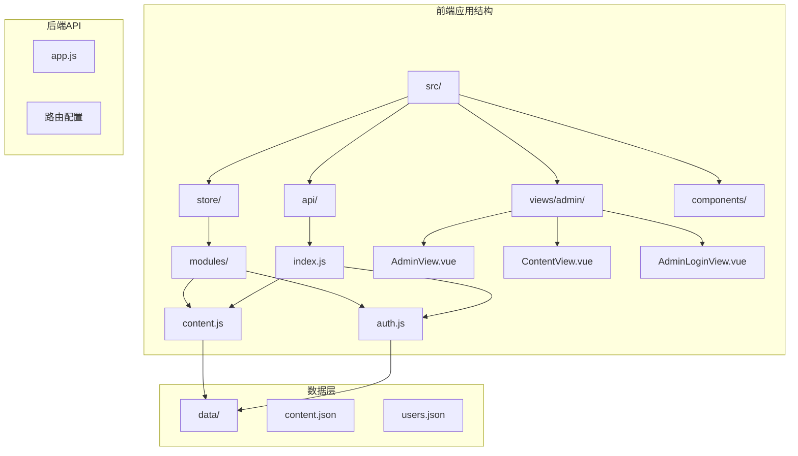
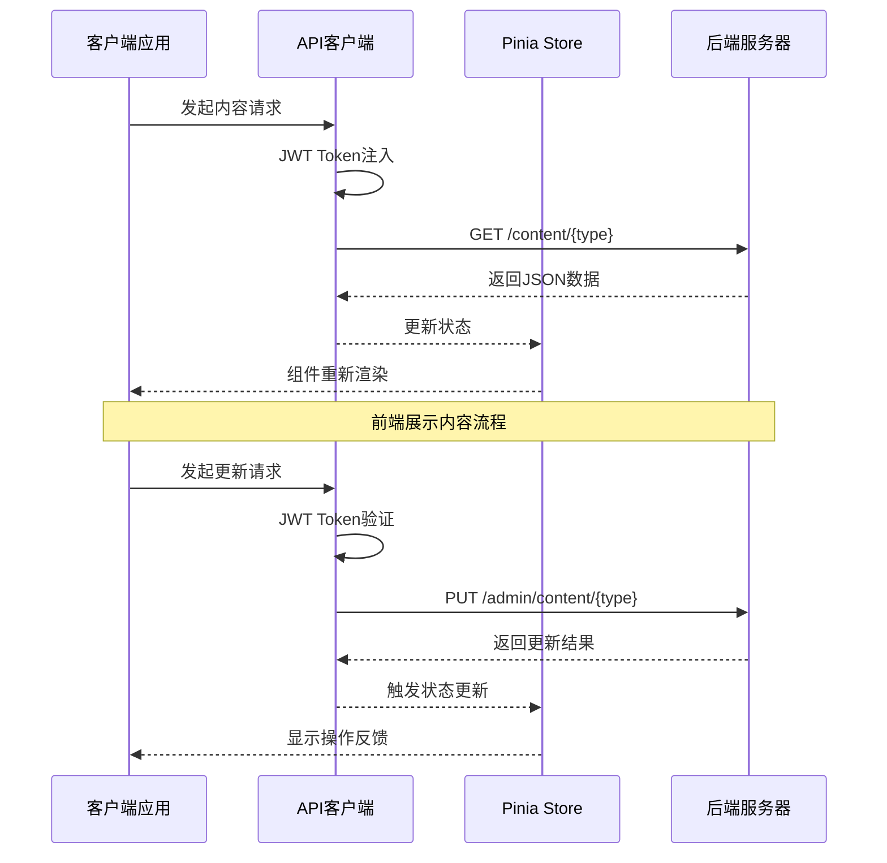
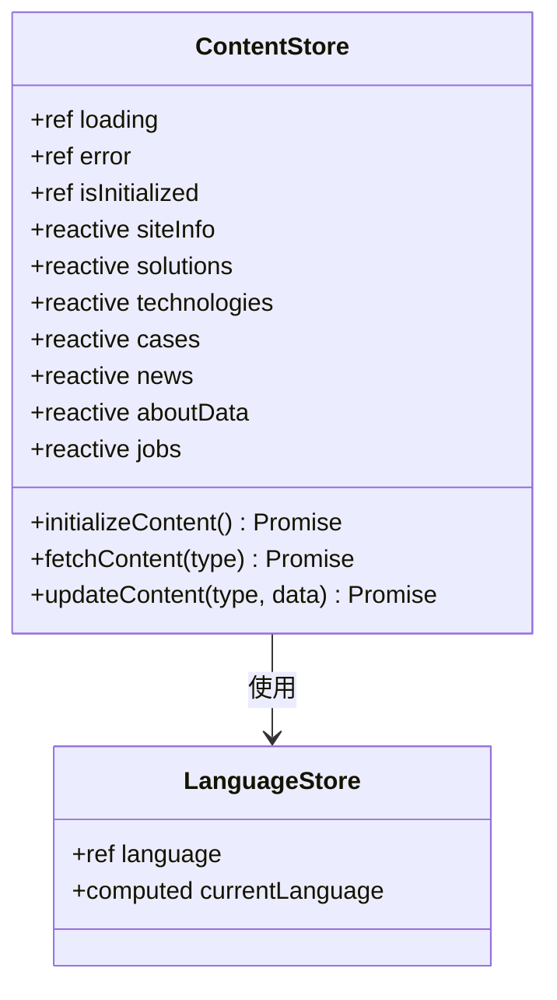
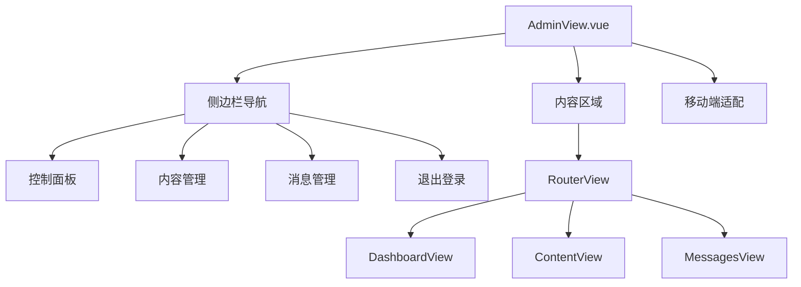

<docs>
# 内容管理API

<cite>
**本文档中引用的文件**
- [app.js](file://app.js) - *更新了前端静态数据*
- [src/api/index.js](file://src/api/index.js) - *定义了内容获取与更新接口*
- [src/store/modules/content.js](file://src/store/modules/content.js) - *实现了内容状态管理逻辑*
- [data/content.json](file://data/content.json) - *后端内容数据源*
- [src/views/admin/ContentView.vue](file://src/views/admin/ContentView.vue) - *管理员内容编辑界面*
</cite>

## 更新摘要
**已做更改**
- 根据最新代码库结构和实现细节，全面更新文档内容
- 明确GET /content/{type} 和 PUT /admin/content/{type} 接口的具体行为
- 补充POST /admin/upload 文件上传接口的详细说明
- 提供基于Axios的实际调用代码示例
- 修正响应数据结构与 data/content.json 的对应关系描述

## 目录
1. [简介](#简介)
2. [项目结构](#项目结构)
3. [核心组件](#核心组件)
4. [架构概览](#架构概览)
5. [详细组件分析](#详细组件分析)
6. [依赖关系分析](#依赖关系分析)
7. [性能考虑](#性能考虑)
8. [故障排除指南](#故障排除指南)
9. [结论](#结论)

## 简介

本文档详细描述了一个基于Vue.js和Pinia的状态管理系统中的内容管理API。该系统提供了完整的前后端交互接口，支持管理员对网站内容进行动态管理，包括获取前端展示内容和更新管理内容两大核心功能。

系统采用现代化的前端架构，使用Vue 3 Composition API和Pinia进行状态管理，通过Axios实现HTTP请求的统一管理和拦截处理。整个系统围绕内容管理这一核心业务需求，提供了完整的CRUD操作支持，并确保所有敏感操作都需要有效的JWT Bearer Token认证。

## 项目结构



**图表来源**
- [src/api/index.js](file://src/api/index.js#L1-L95)
- [src/store/modules/content.js](file://src/store/modules/content.js#L1-L50)

**章节来源**
- [app.js](file://app.js#L1-L425)
- [src/api/index.js](file://src/api/index.js#L1-L95)

## 核心组件

### API客户端配置

系统使用Axios创建统一的API客户端，配置了基础URL、超时时间和默认请求头：

```javascript
const api = axios.create({
  baseURL: '/api',
  timeout: 10000,
  headers: {
    'Content-Type': 'application/json'
  }
})
```

### 请求拦截器

实现了JWT Bearer Token的自动注入功能，确保每次请求都携带有效的认证信息：

```javascript
api.interceptors.request.use(
  config => {
    const token = localStorage.getItem('admin-token')
    if (token) {
      config.headers.Authorization = `Bearer ${token}`
    }
    return config
  }
)
```

### 响应拦截器

处理认证错误和统一的错误响应：

```javascript
api.interceptors.response.use(
  response => response,
  error => {
    if (error.response && error.response.status === 401) {
      localStorage.removeItem('admin-token')
      localStorage.removeItem('admin-user')
      if (window.location.pathname.startsWith('/admin')) {
        window.location.href = '/admin/login'
      }
    }
    return Promise.reject(error)
  }
)
```

**章节来源**
- [src/api/index.js](file://src/api/index.js#L1-L95)

## 架构概览



**图表来源**
- [src/api/index.js](file://src/api/index.js#L15-L45)
- [src/store/modules/content.js](file://src/store/modules/content.js#L550-L600)

## 详细组件分析

### 内容管理API接口

#### GET /content/{type} 接口

用于获取不同类型的前端展示内容，支持以下内容类型：

```javascript
// 支持的内容类型枚举
const contentTypes = [
  'site-info',     // 网站基本信息
  'solutions',     // 解决方案数据
  'technologies',  // 核心技术数据
  'cases',         // 典型案例数据
  'news',          // 新闻资讯数据
  'about',         // 关于我们数据
  'jobs'           // 招聘信息数据
]
```

**响应数据结构示例**：
```json
{
  "site-info": {
    "companyName": "杭州朗德智能科技有限公司",
    "slogan": "智能科技，创造可能",
    "description": "用智能科技赋能产业升级，驱动未来创新",
    "contactInfo": {
      "address": "浙江省杭州市滨江区科技园区创新大厦A座15楼",
      "phone": "0571-8888 9999",
      "email": "info@landeintelligent.com"
    }
  }
}
```

此响应数据直接来源于`data/content.json`文件，其结构与文件中存储的数据完全一致。

#### PUT /admin/content/{type} 接口

用于管理员更新特定类型的内容数据，需要有效的JWT Bearer Token认证：

```javascript
// 更新内容的API调用
const updateContent = async (contentType, data) => {
  try {
    const result = await contentStore.updateContent(contentType, data)
    if (result.success) {
      showNotification('更新成功！', 'success')
    } else {
      showNotification(`更新失败: ${result.error}`, 'error')
    }
  } catch (error) {
    showNotification(`更新失败: ${error.message}`, 'error')
  }
}
```

在实际实现中，该请求会发送到 `/api/admin/content/${contentType}`，并包含新的数据内容。后端将验证JWT令牌的有效性，并在验证通过后更新`data/content.json`文件中的相应部分。

#### POST /admin/upload 文件上传接口

支持multipart/form-data格式的文件上传，主要用于图片资源的上传：

```javascript
// 图片上传API
uploadImage: (formData) => api.post('/admin/upload', formData, {
  headers: {
    'Content-Type': 'multipart/form-data'
  }
})
```

**文件类型限制**：仅支持图片文件（jpg, png, gif等）

**返回格式**：
```json
{
  "url": "/uploads/images/2025/06/15/image.jpg",
  "filename": "image.jpg",
  "size": 1024000
}
```

上传后的文件路径可用于更新内容数据中的图片引用。

### Axios调用代码片段

在Vue组件中安全地提交内容更新请求的示例：

```javascript
import { contentApi } from '@/api'

// 示例：更新网站信息
const updateSiteInfo = async (newData) => {
  try {
    const response = await contentApi.updateContent('site-info', newData)
    console.log('更新成功:', response.data)
    // 处理成功响应
  } catch (error) {
    console.error('更新失败:', error)
    // 处理错误情况
    if (error.response?.status === 401) {
      // 认证失败，跳转到登录页
      router.push('/admin/login')
    }
  }
}
```

**章节来源**
- [src/api/index.js](file://src/api/index.js#L50-L55)
- [src/store/modules/content.js](file://src/store/modules/content.js#L598-L647)
- [data/content.json](file://data/content.json)

### Pinia状态管理

#### 内容Store模块



**图表来源**
- [src/store/modules/content.js](file://src/store/modules/content.js#L1-L100)

#### 状态管理特性

1. **响应式数据管理**：使用Vue 3的reactive和ref创建响应式状态
2. **语言切换支持**：自动监听语言变化并刷新内容
3. **错误处理**：统一的错误状态管理和显示
4. **加载状态**：跟踪API请求的加载状态

### 管理后台组件

#### AdminView.vue 管理后台布局



**图表来源**
- [src/views/admin/AdminView.vue](file://src/views/admin/AdminView.vue#L1-L50)

#### ContentView.vue 内容管理界面

支持多种内容类型的编辑和管理：

```javascript
// 支持的标签页配置
const tabs = [
  { id: 'site-info', name: '网站信息' },
  { id: 'solutions', name: '