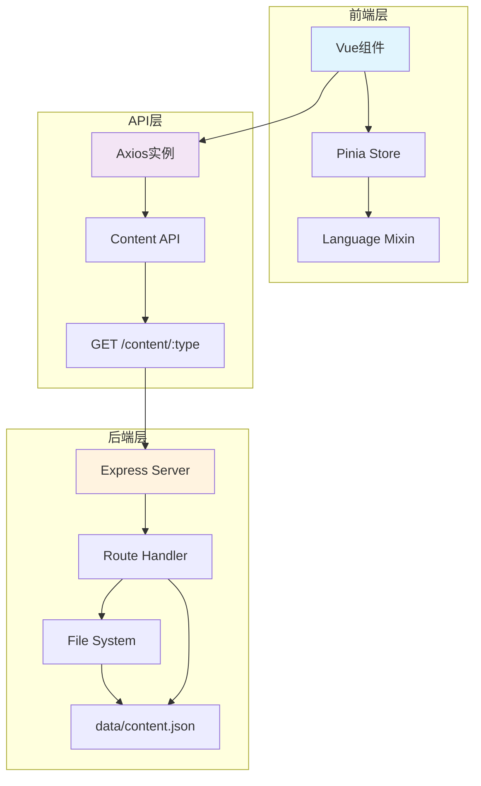
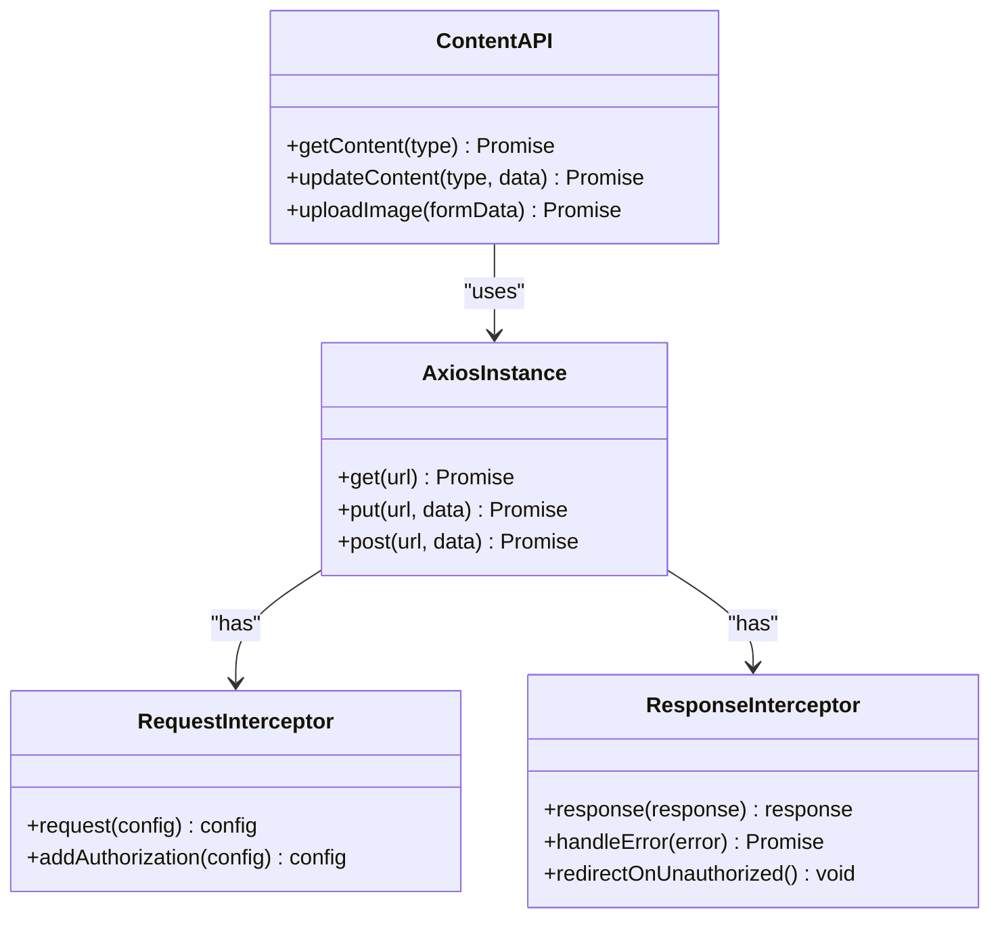
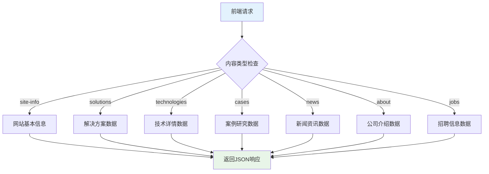
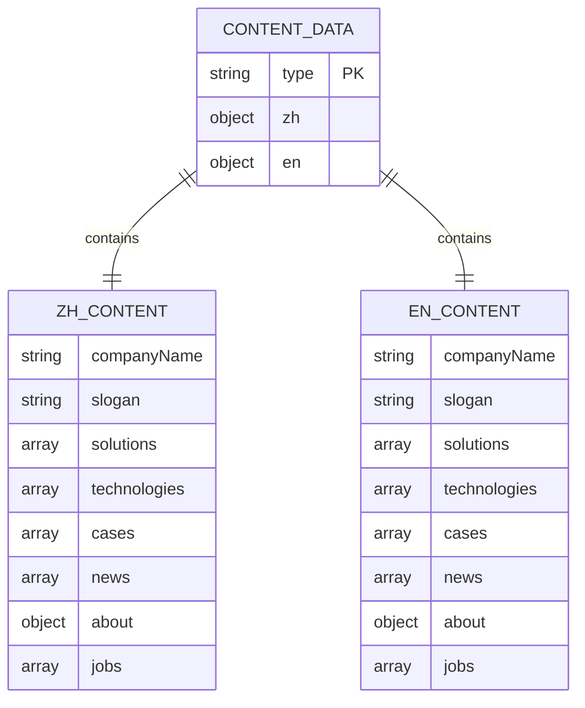
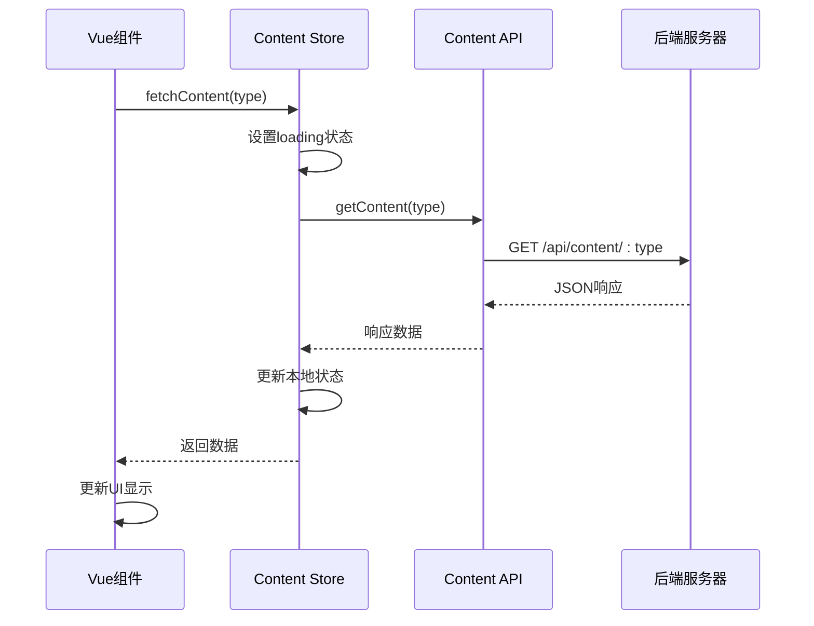
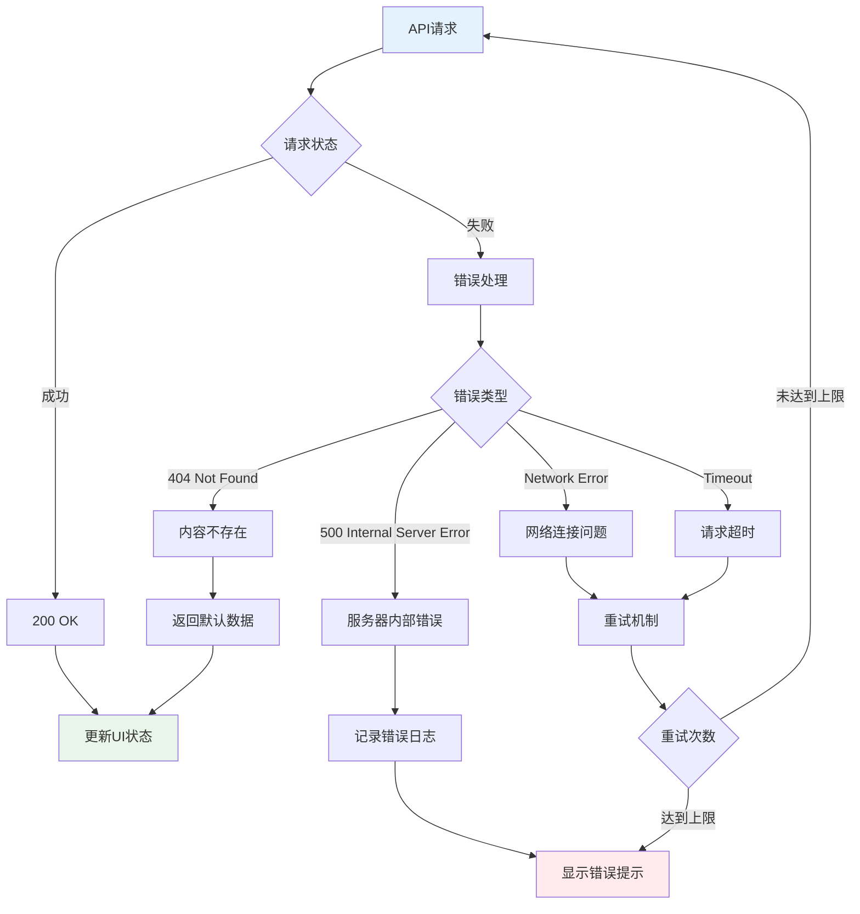
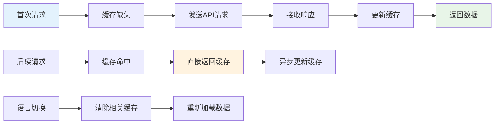

# 内容获取API

<cite>
**本文档中引用的文件**
- [src/api/index.js](file://src/api/index.js)
- [src/store/modules/content.js](file://src/store/modules/content.js)
- [server.cjs](file://server.cjs)
- [data/content.json](file://data/content.json)
- [src/views/HomeView.vue](file://src/views/HomeView.vue)
- [src/views/AboutView.vue](file://src/views/AboutView.vue)
- [src/views/admin/ContentView.vue](file://src/views/admin/ContentView.vue)
- [src/mixins/language.js](file://src/mixins/language.js)
</cite>

## 目录
1. [简介](#简介)
2. [API架构概览](#api架构概览)
3. [核心组件分析](#核心组件分析)
4. [内容类型枚举](#内容类型枚举)
5. [数据结构规范](#数据结构规范)
6. [Axios调用示例](#axios调用示例)
7. [Vue组件集成](#vue组件集成)
8. [错误处理机制](#错误处理机制)
9. [性能考虑](#性能考虑)
10. [故障排除指南](#故障排除指南)
11. [总结](#总结)

## 简介

内容获取API是杭州朗德智能科技有限公司官网项目的核心功能模块，专门负责从后端数据文件中读取和提供各种类型的内容数据。该API采用RESTful设计模式，通过`/content/{type}`的GET请求机制，为前端组件提供解决方案、技术详情、案例研究、新闻资讯等丰富的内容展示。

该API系统具有以下特点：
- **无认证要求**：适用于所有前台页面的数据加载场景
- **多语言支持**：内置中英文内容切换机制
- **响应式设计**：适配各种设备尺寸的展示需求
- **异步加载**：采用Promise模式处理异步数据请求
- **错误恢复**：完善的错误处理和默认数据机制

## API架构概览



**图表来源**
- [src/api/index.js](file://src/api/index.js#L1-L95)
- [src/store/modules/content.js](file://src/store/modules/content.js#L1-L648)
- [server.cjs](file://server.cjs#L70-L85)

**章节来源**
- [src/api/index.js](file://src/api/index.js#L1-L95)
- [server.cjs](file://server.cjs#L70-L85)

## 核心组件分析

### Axios实例配置

API客户端基于Axios库构建，提供了统一的请求配置和拦截器机制：

```javascript
// 创建axios实例
const api = axios.create({
  baseURL: '/api',
  timeout: 10000,
  headers: {
    'Content-Type': 'application/json'
  }
})
```

### Content API模块



**图表来源**
- [src/api/index.js](file://src/api/index.js#L1-L95)

### 后端路由处理

Express服务器实现了简洁高效的路由处理机制：

```javascript
// 获取内容
app.get('/api/content/:type', (req, res) => {
  const contentType = req.params.type;
  const contentData = readDataFile(CONTENT_FILE);
  
  if (contentData && contentData[contentType]) {
    res.json(contentData[contentType]);
  } else {
    res.status(404).json({ message: '内容不存在' });
  }
});
```

**章节来源**
- [src/api/index.js](file://src/api/index.js#L1-L95)
- [server.cjs](file://server.cjs#L70-L85)

## 内容类型枚举

系统支持以下内容类型，每种类型都有其特定的数据结构和用途：

### 支持的内容类型

| 类型 | 描述 | 适用页面 |
|------|------|----------|
| `site-info` | 网站基本信息 | 所有页面 |
| `solutions` | 解决方案内容 | 首页、解决方案页面 |
| `technologies` | 核心技术内容 | 首页、技术页面 |
| `cases` | 典型案例内容 | 首页、案例页面 |
| `news` | 新闻资讯内容 | 首页、新闻页面 |
| `about` | 关于我们内容 | 关于页面 |
| `jobs` | 招聘信息内容 | 加入我们页面 |

### 内容类型映射关系



**图表来源**
- [src/store/modules/content.js](file://src/store/modules/content.js#L540-L574)

**章节来源**
- [src/store/modules/content.js](file://src/store/modules/content.js#L540-L574)
- [server.cjs](file://server.cjs#L70-L85)

## 数据结构规范

### JSON结构规范

每个内容类型都遵循标准化的JSON结构规范，确保数据的一致性和可预测性：

#### 网站基本信息结构

```json
{
  "companyName": "杭州朗德智能科技有限公司",
  "slogan": "智能科技，创造可能",
  "description": "用智能科技赋能产业升级，驱动未来创新",
  "contactInfo": {
    "address": "浙江省杭州市滨江区科技园区创新大厦A座15楼",
    "phone": "0571-8888 9999",
    "email": "info@landeintelligent.com"
  }
}
```

#### 解决方案数据结构

```json
[
  {
    "id": "automation",
    "title": "工业自动化解决方案",
    "description": "为制造业提供智能化、自动化的生产线解决方案，提高生产效率，降低人力成本。",
    "image": "/images/solution-1.jpg",
    "details": "我们的工业自动化解决方案融合了先进的自动化控制技术与人工智能算法，可根据企业生产需求进行量身定制..."
  }
]
```

#### 技术详情数据结构

```json
[
  {
    "id": "detection",
    "title": "无人机探测系统",
    "description": "多传感器融合的无人机探测系统，可实现全天候、全方位监控",
    "icon": "fas fa-shield-alt",
    "details": "采用雷达、光电、无线电信号等多种探测手段相结合...",
    "image": "/images/tech/detection.jpg"
  }
]
```

### 多语言数据结构

系统采用双语言结构设计，支持中文和英文内容的无缝切换：



**图表来源**
- [data/content.json](file://data/content.json#L1-L28)
- [src/store/modules/content.js](file://src/store/modules/content.js#L40-L120)

**章节来源**
- [data/content.json](file://data/content.json#L1-L28)
- [src/store/modules/content.js](file://src/store/modules/content.js#L40-L120)

## Axios调用示例

### 基础调用模式

以下是使用Axios进行内容获取的标准调用模式：

```javascript
// 基础API调用
import { contentApi } from '@/api'

// 获取解决方案数据
contentApi.getContent('solutions')
  .then(response => {
    console.log('解决方案数据:', response.data)
    return response.data
  })
  .catch(error => {
    console.error('获取解决方案失败:', error)
  })

// 获取技术详情数据
contentApi.getContent('technologies')
  .then(response => {
    console.log('技术详情数据:', response.data)
  })
```

### 错误处理示例

```javascript
// 带错误处理的调用
async function fetchContentWithRetry(type, maxRetries = 3) {
  let lastError = null
  
  for (let i = 0; i < maxRetries; i++) {
    try {
      const response = await contentApi.getContent(type)
      return response.data
    } catch (error) {
      lastError = error
      console.warn(`尝试 ${i + 1}/${maxRetries} 失败:`, error.message)
      
      // 等待后重试
      if (i < maxRetries - 1) {
        await new Promise(resolve => setTimeout(resolve, 1000 * (i + 1)))
      }
    }
  }
  
  throw new Error(`获取${type}数据失败，已重试${maxRetries}次: ${lastError.message}`)
}
```

### 并发请求处理

```javascript
// 并发获取多个内容类型
async function loadAllContent() {
  try {
    const [siteInfo, solutions, technologies, cases, news, about, jobs] = await Promise.all([
      contentApi.getContent('site-info'),
      contentApi.getContent('solutions'),
      contentApi.getContent('technologies'),
      contentApi.getContent('cases'),
      contentApi.getContent('news'),
      contentApi.getContent('about'),
      contentApi.getContent('jobs')
    ])
    
    return {
      siteInfo: siteInfo.data,
      solutions: solutions.data,
      technologies: technologies.data,
      cases: cases.data,
      news: news.data,
      about: about.data,
      jobs: jobs.data
    }
  } catch (error) {
    console.error('批量加载内容失败:', error)
    throw error
  }
}
```

**章节来源**
- [src/api/index.js](file://src/api/index.js#L45-L55)

## Vue组件集成

### Pinia Store集成



**图表来源**
- [src/store/modules/content.js](file://src/store/modules/content.js#L540-L574)
- [src/api/index.js](file://src/api/index.js#L45-L55)

### 组件使用示例

#### 首页组件集成

```vue
<script setup>
import { ref, computed, onMounted } from 'vue'
import { useContentStore } from '@/store/modules/content'
import { useLanguage } from '@/mixins/language'

// 使用语言相关功能
const { isZh, isEn, getCurrentTechnologies, getCurrentSolutions } = useLanguage()

const contentStore = useContentStore()
const { technologies, solutions } = storeToRefs(contentStore)

// 获取当前语言的技术数据
const currentTechnologies = computed(() => {
  const techsFromMixin = getCurrentTechnologies()
  if (techsFromMixin && techsFromMixin.length > 0) {
    return techsFromMixin
  }
  
  const techsFromStore = getCurrentTechnologies.value
  if (techsFromStore && techsFromStore.length > 0) {
    return techsFromStore
  }
  
  return []
})

// 组件挂载时加载数据
onMounted(async () => {
  try {
    await Promise.all([
      contentStore.fetchContent('technologies'),
      contentStore.fetchContent('solutions')
    ])
  } catch (error) {
    console.error('加载首页内容失败:', error)
  }
})
</script>
```

#### 关于页面组件集成

```vue
<template>
  <div class="about-section">
    <h2>{{ currentAboutData.title }}</h2>
    
    <div v-for="(paragraph, index) in currentAboutData.paragraphs" :key="index" class="about-paragraph">
      {{ paragraph }}
    </div>
    
    <div class="about-stats">
      <div v-for="stat in currentAboutData.stats" :key="stat.value" class="stat-item">
        <span class="stat-value">{{ stat.value }}</span>
        <span class="stat-description">{{ stat.description }}</span>
      </div>
    </div>
  </div>
</template>

<script setup>
import { computed } from 'vue'
import { useContentStore } from '@/store/modules/content'
import { useLanguage } from '@/mixins/language'

const { getCurrentAboutData } = useLanguage()
const contentStore = useContentStore()

// 获取当前语言的关于我们数据
const currentAboutData = computed(() => {
  const aboutData = getCurrentAboutData.value
  return aboutData || getDefaultAboutData()
})

function getDefaultAboutData() {
  return isZh.value ? {
    title: '杭州朗德智能科技有限公司',
    paragraphs: [],
    stats: []
  } : {
    title: 'Hangzhou Lande Intelligent Technology Co., Ltd.',
    paragraphs: [],
    stats: []
  }
}
</script>
```

### 语言切换集成

```javascript
// 语言切换时自动重新获取内容
watch(() => languageStore.language, async (newLang, oldLang) => {
  console.log('检测到语言变化，从', oldLang, '变为', newLang)
  
  try {
    // 重新获取所有相关内容
    await Promise.all([
      contentStore.fetchContent('site-info'),
      contentStore.fetchContent('solutions'),
      contentStore.fetchContent('technologies'),
      contentStore.fetchContent('cases'),
      contentStore.fetchContent('news'),
      contentStore.fetchContent('about'),
      contentStore.fetchContent('jobs')
    ])
  } catch (error) {
    console.error('语言切换时重新获取内容失败:', error)
  }
})
```

**章节来源**
- [src/views/HomeView.vue](file://src/views/HomeView.vue#L380-L579)
- [src/views/AboutView.vue](file://src/views/AboutView.vue#L105-L145)
- [src/mixins/language.js](file://src/mixins/language.js#L64-L96)

## 错误处理机制

### 错误类型分类



### 错误处理实现

```javascript
// 内容获取错误处理
const fetchContentWithErrorHandling = async (contentType) => {
  if (!isInitialized.value) return null
  
  try {
    loading.value = true
    error.value = null
    
    // 构建API请求URL
    const url = `/content/${contentType}`
    
    // 发送请求
    const response = await axios.get(url)
    
    // 更新相应的数据
    updateContentData(contentType, response.data)
    
    return response.data
  } catch (err) {
    console.error(`获取${contentType}数据失败:`, err)
    
    // 设置错误状态
    error.value = err.message || '数据加载失败'
    
    // 根据错误类型采取不同策略
    if (err.response) {
      switch (err.response.status) {
        case 404:
          // 内容不存在，使用默认数据
          return getDefaultContentData(contentType)
        case 500:
          // 服务器错误，记录日志
          logServerError(err)
          break
        default:
          // 其他错误
          break
      }
    }
    
    // 不抛出错误，而是返回null，让调用者决定如何处理
    return null
  } finally {
    loading.value = false
  }
}

// 默认数据回退机制
const getDefaultContentData = (contentType) => {
  const defaults = {
    'site-info': {
      companyName: '杭州朗德智能科技有限公司',
      slogan: '智能科技，创造可能'
    },
    'solutions': [],
    'technologies': [],
    'cases': [],
    'news': [],
    'about': {},
    'jobs': []
  }
  
  return defaults[contentType] || {}
}
```

### 重试机制实现

```javascript
// 带指数退避的重试机制
const retryWithBackoff = async (fn, maxRetries = 3, baseDelay = 1000) => {
  let lastError = null
  
  for (let i = 0; i < maxRetries; i++) {
    try {
      return await fn()
    } catch (error) {
      lastError = error
      console.warn(`重试 ${i + 1}/${maxRetries} 失败:`, error.message)
      
      // 指数退避延迟
      const delay = baseDelay * Math.pow(2, i)
      await new Promise(resolve => setTimeout(resolve, delay))
    }
  }
  
  throw new Error(`操作失败，已重试${maxRetries}次: ${lastError.message}`)
}

// 使用重试机制获取内容
const getContentWithRetry = async (type) => {
  return retryWithBackoff(async () => {
    const response = await contentApi.getContent(type)
    return response.data
  })
}
```

**章节来源**
- [src/store/modules/content.js](file://src/store/modules/content.js#L540-L574)

## 性能考虑

### 缓存策略



### 性能优化建议

1. **懒加载策略**
```javascript
// 按需加载非关键内容
const lazyLoadNonCriticalContent = async () => {
  // 延迟加载新闻和招聘信息
  setTimeout(async () => {
    await contentStore.fetchContent('news')
    await contentStore.fetchContent('jobs')
  }, 2000)
}
```

2. **预加载机制**
```javascript
// 预加载用户可能访问的内容
const preLoadContent = () => {
  const contentTypes = ['solutions', 'technologies', 'cases']
  
  // 在用户浏览时预加载相关内容
  contentTypes.forEach(type => {
    contentStore.fetchContent(type)
  })
}
```

3. **内存管理**
```javascript
// 定期清理过期缓存
const cleanupExpiredCache = () => {
  const now = Date.now()
  const cacheAgeThreshold = 5 * 60 * 1000 // 5分钟
  
  // 清理过期的缓存数据
  Object.keys(cache).forEach(key => {
    if (now - cache[key].timestamp > cacheAgeThreshold) {
      delete cache[key]
    }
  })
}
```

### 网络优化

```javascript
// 配置网络优化参数
const optimizedAxiosConfig = axios.create({
  baseURL: '/api',
  timeout: 5000, // 减少超时时间
  headers: {
    'Content-Type': 'application/json'
  },
  // 启用压缩
  decompress: true,
  // 配置并发请求限制
  maxRequestsPerSecond: 10
})
```

## 故障排除指南

### 常见问题诊断

#### 1. 内容加载失败

**症状**: 页面显示空白或加载错误
**原因**: API请求失败或数据格式错误
**解决方案**:
```javascript
// 检查API响应
const diagnoseContentLoading = async () => {
  try {
    const response = await contentApi.getContent('solutions')
    console.log('API响应:', response)
    
    // 验证数据结构
    if (!Array.isArray(response.data)) {
      console.error('数据格式错误:', response.data)
    }
  } catch (error) {
    console.error('API请求失败:', error)
  }
}
```

#### 2. 语言切换失效

**症状**: 切换语言后内容不更新
**原因**: 缓存未正确清除或状态同步问题
**解决方案**:
```javascript
// 强制刷新内容
const forceRefreshContent = async () => {
  // 清除所有缓存
  Object.keys(contentCache).forEach(key => {
    delete contentCache[key]
  })
  
  // 重新加载所有内容
  await contentStore.initializeContent()
}
```

#### 3. 性能问题

**症状**: 页面加载缓慢或卡顿
**原因**: 大量并发请求或数据过大
**解决方案**:
```javascript
// 优化并发请求
const optimizedContentLoading = async () => {
  const contentTypes = ['site-info', 'solutions', 'technologies']
  
  // 分批加载内容
  for (let i = 0; i < contentTypes.length; i += 2) {
    const batch = contentTypes.slice(i, i + 2)
    await Promise.all(batch.map(type => contentStore.fetchContent(type)))
  }
}
```

### 调试工具

```javascript
// 开发环境调试工具
const debugContentApi = {
  // 打印所有可用内容类型
  listAvailableContentTypes: () => {
    const contentTypes = ['site-info', 'solutions', 'technologies', 'cases', 'news', 'about', 'jobs']
    console.log('可用内容类型:', contentTypes)
  },
  
  // 检查缓存状态
  checkCacheStatus: () => {
    console.log('缓存状态:', contentCache)
  },
  
  // 测试API连接
  testApiConnection: async () => {
    try {
      const response = await contentApi.getContent('site-info')
      console.log('API连接测试成功:', response)
    } catch (error) {
      console.error('API连接测试失败:', error)
    }
  }
}
```

**章节来源**
- [src/store/modules/content.js](file://src/store/modules/content.js#L540-L574)

## 总结

内容获取API作为杭州朗德智能科技有限公司官网的核心功能模块，提供了完整而灵活的内容管理解决方案。通过RESTful API设计、多语言支持、错误处理机制和性能优化策略，该系统能够满足现代Web应用对内容展示的各种需求。

### 主要优势

1. **架构清晰**: 采用分层架构设计，职责分离明确
2. **易于维护**: 模块化设计便于功能扩展和维护
3. **性能优异**: 多种优化策略确保良好的用户体验
4. **错误处理完善**: 全面的错误处理和恢复机制
5. **开发友好**: 提供丰富的开发工具和调试支持

### 最佳实践建议

1. **合理使用缓存**: 根据内容更新频率设置合适的缓存策略
2. **优化网络请求**: 采用并发控制和请求合并减少网络开销
3. **增强错误处理**: 实现多层次的错误处理和用户友好的错误提示
4. **监控性能指标**: 建立性能监控机制及时发现和解决问题
5. **持续优化**: 根据实际使用情况不断优化API性能和用户体验

该内容获取API系统为整个网站提供了稳定可靠的内容支撑，是构建现代化企业官网的重要基础设施。