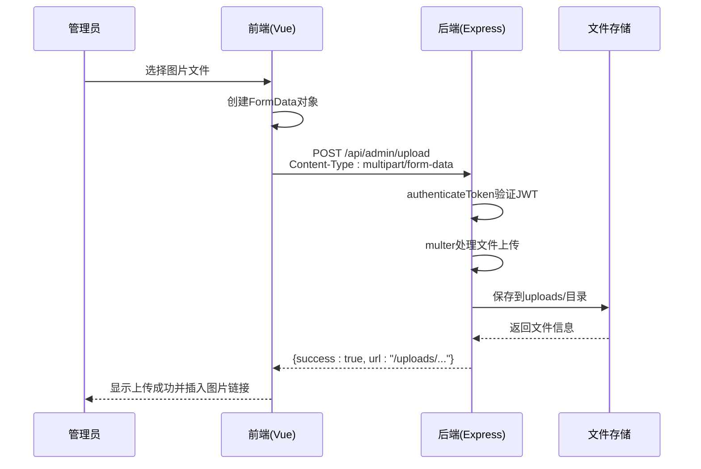
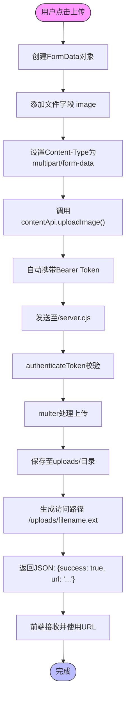
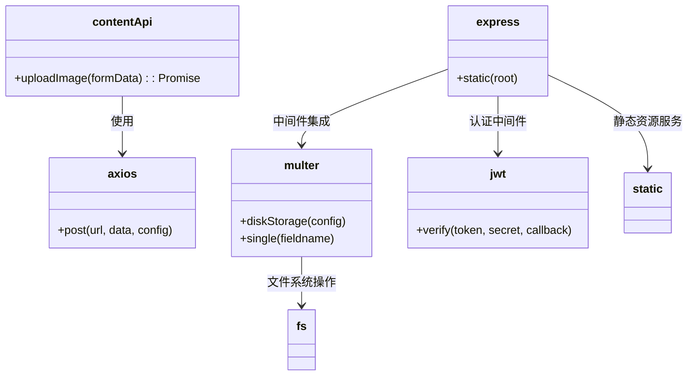

# 文件上传API

<cite>
**本文档引用的文件**   
- [src/api/index.js](file://src/api/index.js)
- [server.cjs](file://server.cjs)
- [src/store/modules/content.js](file://src/store/modules/content.js)
- [src/views/admin/ContentView.vue](file://src/views/admin/ContentView.vue)
</cite>

## 目录
1. [简介](#简介)
2. [项目结构](#项目结构)
3. [核心组件](#核心组件)
4. [架构概述](#架构概述)
5. [详细组件分析](#详细组件分析)
6. [依赖分析](#依赖分析)
7. [性能考虑](#性能考虑)
8. [故障排除指南](#故障排除指南)
9. [结论](#结论)

## 简介
本文档详细描述了管理员图片资源上传接口 `/admin/upload` 的实现机制。该接口允许管理员通过 `multipart/form-data` 格式上传图片文件，支持常见的图片格式（如 JPG、PNG、GIF），并对上传后的文件进行安全存储和路径返回。文档涵盖前端调用方式、后端处理逻辑、错误处理机制以及文件存储策略。

## 项目结构
本项目采用前后端分离架构，前端基于 Vue.js 框架构建管理后台界面，后端使用 Node.js + Express 提供 RESTful API 接口服务。文件上传功能涉及多个模块协同工作，包括前端表单构造、API 请求封装、身份验证中间件、Multer 文件处理及静态资源服务配置。

```mermaid
graph TB
subgraph "前端 (Vue)"
A[AdminView.vue] --> B[ContentView.vue]
B --> C[contentApi.uploadImage()]
C --> D[src/api/index.js]
end
subgraph "后端 (Express)"
E[server.cjs] --> F[/api/admin/upload]
F --> G[authenticateToken]
G --> H[upload.single('image')]
H --> I[uploads/目录]
I --> J[/uploads/静态服务]
end
D --> E
```

**Diagram sources**
- [src/views/admin/ContentView.vue](file://src/views/admin/ContentView.vue)
- [src/api/index.js](file://src/api/index.js)
- [server.cjs](file://server.cjs)

**Section sources**
- [src/views/admin/ContentView.vue](file://src/views/admin/ContentView.vue)
- [server.cjs](file://server.cjs)

## 核心组件
文件上传功能的核心组件包括：
- 前端 `contentApi.uploadImage()` 方法：用于发送带有 FormData 的 POST 请求
- 后端 Multer 中间件：处理 multipart/form-data 类型的文件上传
- 身份认证中间件 `authenticateToken`：确保只有管理员可访问上传接口
- 静态资源服务 `/uploads`：提供已上传图片的访问路径

这些组件共同实现了安全、高效的图片上传与访问机制。

**Section sources**
- [src/api/index.js](file://src/api/index.js#L50-L55)
- [server.cjs](file://server.cjs#L100-L110)

## 架构概述
系统采用典型的客户端-服务器架构，管理员在管理后台选择图片后，由前端 JavaScript 构造 FormData 对象并调用 Axios 发送请求。请求经过 JWT 身份验证后，由 Multer 处理文件写入服务器磁盘，并返回标准化的访问 URL。所有上传的文件均存放在 `uploads/` 目录下，可通过 `/uploads/filename.ext` 直接访问。



**Diagram sources**
- [src/api/index.js](file://src/api/index.js#L50-L55)
- [server.cjs](file://server.cjs#L140-L145)

## 详细组件分析

### 文件上传接口分析
#### API调用流程


**Diagram sources**
- [src/api/index.js](file://src/api/index.js#L50-L55)
- [server.cjs](file://server.cjs#L140-L145)

#### 前端调用示例
以下是使用 Axios 在管理后台调用图片上传的代码片段：

```javascript
// 构造FormData对象
const formData = new FormData();
formData.append('image', fileInput.files[0]); // fileInput为<input type="file">

// 调用上传方法
contentApi.uploadImage(formData)
  .then(response => {
    if (response.data.success) {
      console.log('上传成功:', response.data.url);
      // 可将response.data.url插入到富文本编辑器中
    }
  })
  .catch(error => {
    console.error('上传失败:', error.response?.data?.message || error.message);
  });
```

此方法会自动携带管理员登录时存储的 JWT Token，并正确设置 `Content-Type: multipart/form-data` 头部。

**Section sources**
- [src/api/index.js](file://src/api/index.js#L50-L55)
- [src/views/admin/ContentView.vue](file://src/views/admin/ContentView.vue)

### 后端处理逻辑分析
#### 文件上传配置
后端使用 Multer 库处理文件上传，具体配置如下：

```javascript
const storage = multer.diskStorage({
  destination: (req, file, cb) => {
    cb(null, UPLOADS_DIR); // 存储路径为uploads/目录
  },
  filename: (req, file, cb) => {
    const uniqueSuffix = Date.now() + '-' + Math.round(Math.random() * 1E9);
    cb(null, file.fieldname + '-' + uniqueSuffix + path.extname(file.originalname));
  }
});
```

该配置确保每个上传的文件都具有唯一名称，避免命名冲突。

#### 接口路由定义
```javascript
app.post('/api/admin/upload', authenticateToken, upload.single('image'), (req, res) => {
  if (req.file) {
    res.json({
      success: true,
      url: `/uploads/${req.file.filename}`
    });
  } else {
    res.status(400).json({ message: '上传失败' });
  }
});
```

该路由要求管理员身份认证，并仅接受名为 `image` 的单个文件上传。

**Section sources**
- [server.cjs](file://server.cjs#L100-L110)

## 依赖分析
文件上传功能依赖以下关键模块：



**Diagram sources**
- [src/api/index.js](file://src/api/index.js)
- [server.cjs](file://server.cjs)

**Section sources**
- [server.cjs](file://server.cjs)
- [package-lock.json](file://package-lock.json#L2300-L2310)

## 性能考虑
- 所有上传文件均直接写入磁盘，不占用内存缓冲，适合大文件上传
- 使用唯一文件名避免重复覆盖，无需额外查询数据库
- 静态资源通过 Express 原生中间件提供服务，性能高效
- 建议定期清理过期上传文件以节省磁盘空间

## 故障排除指南
常见问题及解决方案：

| 问题现象 | 可能原因 | 解决方案 |
|--------|--------|---------|
| 401 Unauthorized | 未登录或Token过期 | 重新登录获取新Token |
| 400 Bad Request | 未正确提交文件 | 检查是否使用FormData并正确命名字段为'image' |
| 上传成功但无法访问 | 静态资源配置错误 | 确认server.cjs中`app.use('/uploads', ...)`已启用 |
| 文件名乱码或特殊字符问题 | 缺少编码处理 | 当前系统已通过随机命名规避此