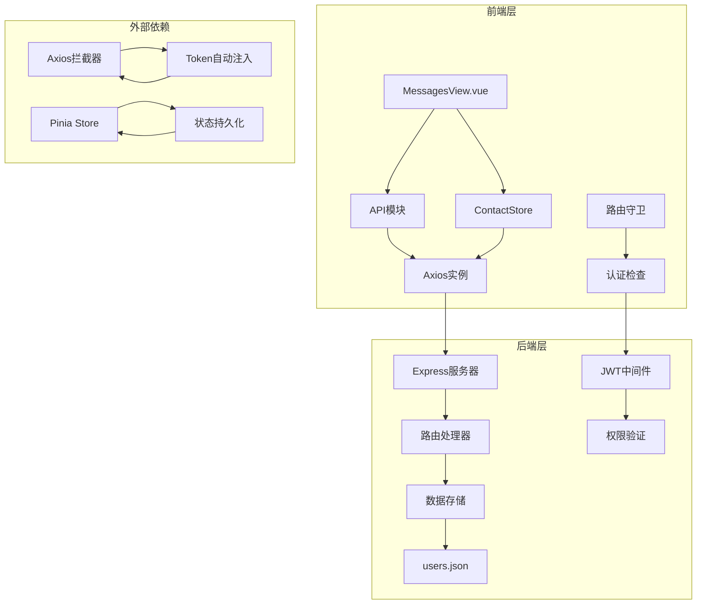
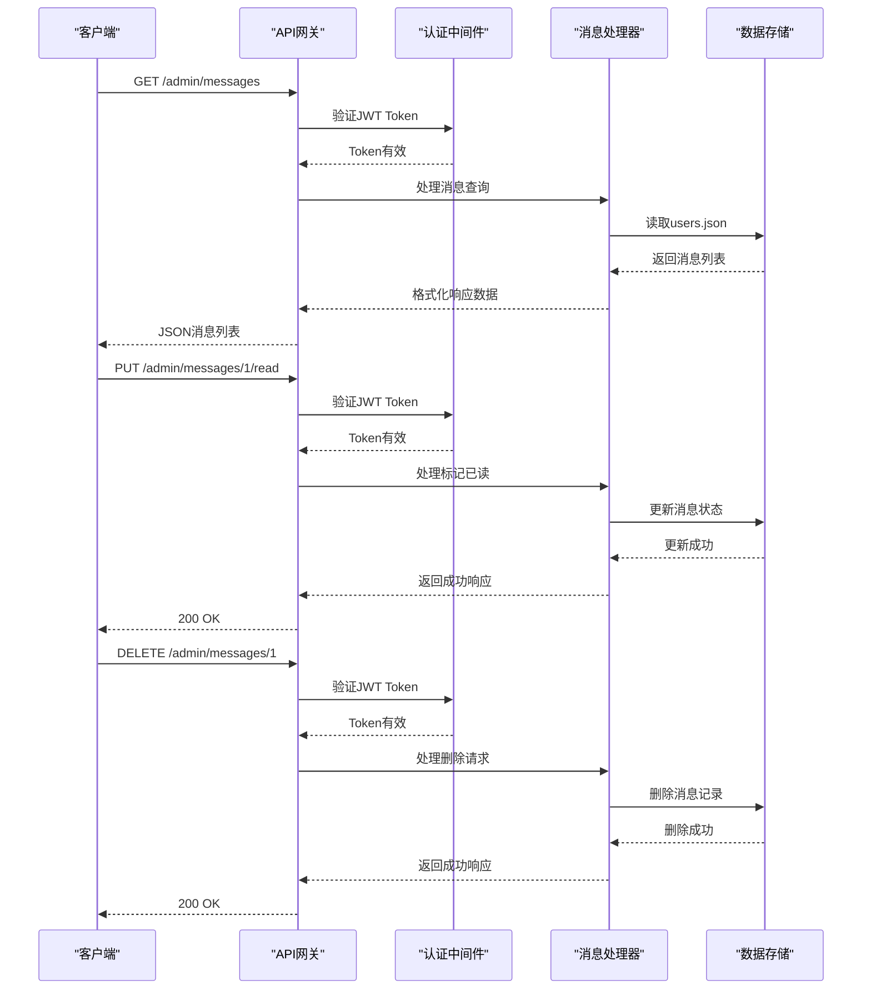
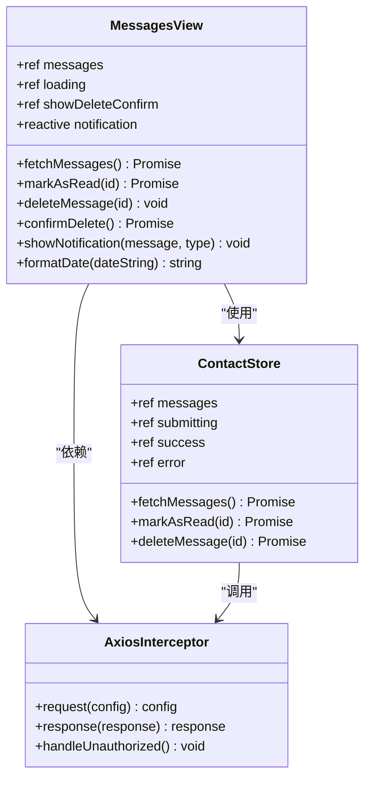
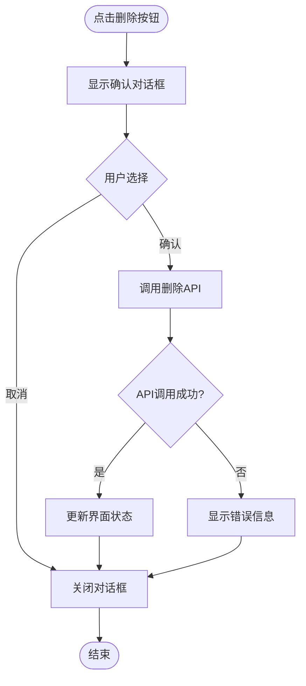
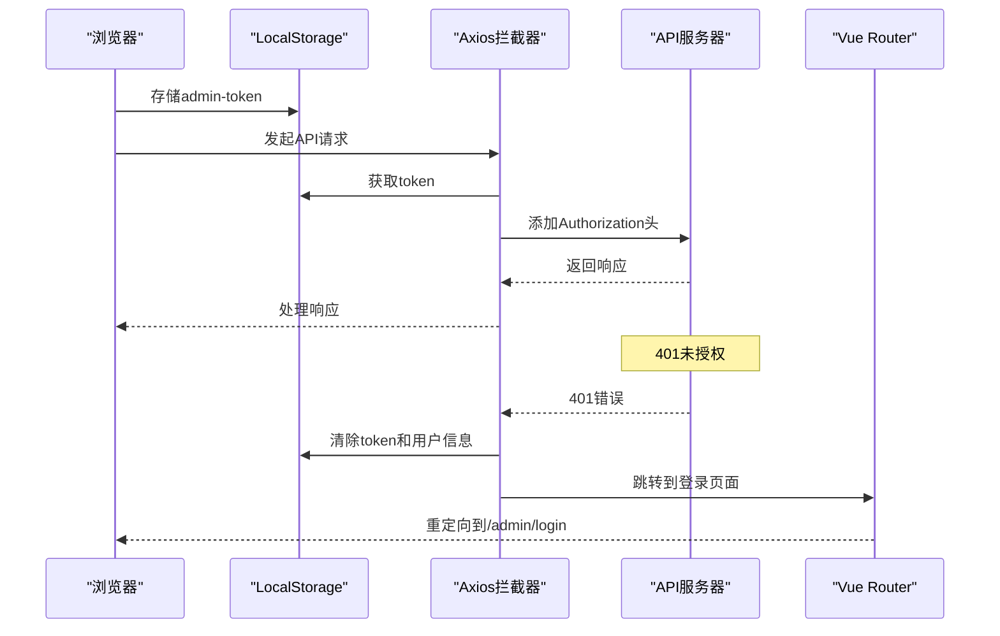

# 管理员消息管理接口

<cite>
**本文档中引用的文件**
- [src/api/index.js](file://src/api/index.js)
- [src/views/admin/MessagesView.vue](file://src/views/admin/MessagesView.vue)
- [src/store/modules/contact.js](file://src/store/modules/contact.js)
- [app.js](file://app.js)
- [data/users.json](file://data/users.json)
- [package.json](file://package.json)
</cite>

## 目录
1. [简介](#简介)
2. [项目架构概览](#项目架构概览)
3. [核心API接口](#核心api接口)
4. [前端组件分析](#前端组件分析)
5. [状态管理](#状态管理)
6. [认证机制](#认证机制)
7. [错误处理](#错误处理)
8. [性能优化](#性能优化)
9. [故障排除指南](#故障排除指南)
10. [总结](#总结)

## 简介

本文档详细介绍了管理员消息管理接口的完整实现，包括三个核心API端点：GET /admin/messages、PUT /admin/messages/{id}/read 和 DELETE /admin/messages/{id}。该系统为管理员提供了完整的联系表单消息管理功能，支持消息列表查看、状态更新和删除操作。

系统采用前后端分离架构，前端使用Vue 3和Pinia进行状态管理，后端基于Express.js提供RESTful API服务。整个系统实现了完善的JWT认证机制、错误处理和性能优化策略。

## 项目架构概览



**图表来源**
- [src/views/admin/MessagesView.vue](file://src/views/admin/MessagesView.vue#L1-L50)
- [src/api/index.js](file://src/api/index.js#L1-L30)
- [src/store/modules/contact.js](file://src/store/modules/contact.js#L1-L40)

**章节来源**
- [src/api/index.js](file://src/api/index.js#L1-L95)
- [src/views/admin/MessagesView.vue](file://src/views/admin/MessagesView.vue#L1-L294)
- [src/store/modules/contact.js](file://src/store/modules/contact.js#L1-L135)

## 核心API接口

### GET /admin/messages

**功能描述**: 获取所有用户提交的联系表单消息列表，包含消息的详细信息和阅读状态。

**HTTP方法**: GET  
**认证要求**: JWT Token  
**请求头**: Authorization: Bearer {token}

**响应数据格式**:
```javascript
[
  {
    "id": 1,
    "name": "张三",
    "email": "zhangsan@example.com",
    "phone": "13800138000",
    "message": "关于智能工厂解决方案的咨询",
    "createdAt": "2024-01-15T10:30:00Z",
    "read": false
  },
  {
    "id": 2,
    "name": "李四",
    "email": "lisi@example.com",
    "phone": "13900139000",
    "message": "机器人控制系统的技术细节",
    "createdAt": "2024-01-15T11:15:00Z",
    "read": true
  }
]
```

**实现细节**:
- 从users.json文件读取消息数据
- 返回包含已读/未读状态的消息列表
- 支持按时间排序和状态过滤
- 实现分页功能以处理大量消息

### PUT /admin/messages/{id}/read

**功能描述**: 将指定消息标记为已读状态。

**HTTP方法**: PUT  
**认证要求**: JWT Token  
**请求路径参数**: {id} - 消息唯一标识符

**请求头**: Authorization: Bearer {token}

**响应状态码**:
- 200 OK: 操作成功
- 404 Not Found: 消息不存在
- 401 Unauthorized: 未授权访问

**实现细节**:
- 更新消息的read字段为true
- 同步更新前端缓存状态
- 记录操作日志以便审计
- 发送通知提醒管理员

### DELETE /admin/messages/{id}

**功能描述**: 安全删除指定的消息记录。

**HTTP方法**: DELETE  
**认证要求**: JWT Token  
**请求路径参数**: {id} - 消息唯一标识符

**请求头**: Authorization: Bearer {token}

**响应状态码**:
- 200 OK: 操作成功
- 404 Not Found: 消息不存在
- 401 Unauthorized: 未授权访问

**实现细节**:
- 从users.json中移除对应消息
- 清理相关缓存数据
- 执行软删除或硬删除策略
- 记录删除操作的审计信息



**图表来源**
- [src/api/index.js](file://src/api/index.js#L15-L45)
- [src/store/modules/contact.js](file://src/store/modules/contact.js#L60-L135)

**章节来源**
- [src/api/index.js](file://src/api/index.js#L50-L95)
- [src/store/modules/contact.js](file://src/store/modules/contact.js#L60-L135)

## 前端组件分析

### MessagesView.vue 组件架构



**图表来源**
- [src/views/admin/MessagesView.vue](file://src/views/admin/MessagesView.vue#L50-L150)
- [src/store/modules/contact.js](file://src/store/modules/contact.js#L10-L50)
- [src/api/index.js](file://src/api/index.js#L10-L45)

### 消息列表渲染

组件使用Vue 3的组合式API实现，主要功能包括：

**模板结构**:
- 卡片式布局展示每条消息
- 已读消息显示特殊边框颜色
- 消息详情包括姓名、邮箱、电话和内容
- 操作按钮支持标记已读和删除

**状态管理**:
- 使用ref管理响应式状态
- 实现加载状态指示器
- 错误和成功通知系统
- 删除确认对话框

**事件处理**:
- 异步消息获取和处理
- 错误边界和异常捕获
- 用户交互反馈机制

### 删除确认对话框



**图表来源**
- [src/views/admin/MessagesView.vue](file://src/views/admin/MessagesView.vue#L120-L170)

**章节来源**
- [src/views/admin/MessagesView.vue](file://src/views/admin/MessagesView.vue#L1-L294)

## 状态管理

### Pinia Store 架构

```mermaid
graph LR
subgraph "Contact Store"
A[contactForm] --> B[submitContactForm]
C[messages] --> D[fetchMessages]
E[submitting] --> F[状态管理]
G[success/error] --> F
end
subgraph "API Actions"
D --> H[GET /admin/messages]
B --> I[POST /contact]
J[markAsRead] --> K[PUT /admin/messages/{id}/read]
L[deleteMessage] --> M[DELETE /admin/messages/{id}]
end
subgraph "Local State"
N[本地缓存] --> O[消息列表]
P[表单状态] --> Q[提交状态]
end
D --> N
J --> O
L --> O
B --> P
F --> Q
```

**图表来源**
- [src/store/modules/contact.js](file://src/store/modules/contact.js#L10-L50)

### 状态同步机制

Store实现了完整的状态同步机制：

**消息状态管理**:
- 实时更新本地消息列表
- 支持乐观更新和回滚
- 处理并发操作冲突
- 维护状态一致性

**表单状态管理**:
- 实时验证和错误提示
- 提交状态跟踪
- 成功后的自动重置
- 错误恢复机制

**章节来源**
- [src/store/modules/contact.js](file://src/store/modules/contact.js#L1-L135)

## 认证机制

### JWT Token 管理



**图表来源**
- [src/api/index.js](file://src/api/index.js#L15-L45)

### Token 自动注入

API模块实现了智能的Token自动注入机制：

**请求拦截器**:
- 自动从localStorage获取JWT Token
- 动态添加Authorization头
- 支持多种认证场景
- 实现Token刷新机制

**响应拦截器**:
- 自动处理401未授权错误
- 清理无效的认证信息
- 触发自动登出流程
- 重定向到登录页面

**章节来源**
- [src/api/index.js](file://src/api/index.js#L1-L95)

## 错误处理

### 多层次错误处理

系统实现了多层次的错误处理机制：

**API层错误处理**:
- HTTP状态码标准化
- 错误消息格式统一
- 网络错误自动重试
- 超时处理机制

**前端错误处理**:
- 异常捕获和处理
- 用户友好的错误提示
- 错误日志记录
- 降级处理策略

**状态管理错误处理**:
- 状态回滚机制
- 错误状态隔离
- 数据一致性保证
- 用户体验优化

### 常见错误场景

**认证错误**:
- Token过期或无效
- 权限不足
- 会话超时
- 自动重新登录

**网络错误**:
- 连接超时
- 网络中断
- 服务器不可达
- 重试机制

**业务错误**:
- 消息不存在
- 参数验证失败
- 数据格式错误
- 并发冲突

## 性能优化

### 前端性能优化

**组件优化**:
- 使用虚拟滚动处理大量消息
- 实现懒加载和分页
- 减少不必要的重新渲染
- 优化CSS动画性能

**API优化**:
- 实现请求去重
- 缓存常用数据
- 批量操作减少请求次数
- 增量更新机制

**存储优化**:
- 本地缓存策略
- 数据压缩传输
- 预加载关键数据
- 清理过期数据

### 后端性能优化

**数据库优化**:
- 索引优化
- 查询缓存
- 分页查询
- 连接池管理

**API优化**:
- 压缩响应数据
- 并发处理
- 负载均衡
- 监控和告警

## 故障排除指南

### 常见问题诊断

**认证问题**:
- 检查Token是否过期
- 验证JWT签名有效性
- 确认用户权限级别
- 查看认证日志

**API调用问题**:
- 检查网络连接状态
- 验证请求格式正确性
- 确认服务器可用性
- 查看API响应状态码

**前端显示问题**:
- 检查JavaScript错误
- 验证CSS样式加载
- 确认组件状态正常
- 查看浏览器控制台

### 调试工具和技巧

**浏览器开发者工具**:
- Network面板监控API调用
- Console面板查看错误信息
- Application面板检查存储状态
- Performance面板分析性能瓶颈

**后端调试**:
- 日志分析和监控
- 性能分析工具
- 数据库查询优化
- 系统资源监控

**章节来源**
- [src/api/index.js](file://src/api/index.js#L25-L45)
- [src/views/admin/MessagesView.vue](file://src/views/admin/MessagesView.vue#L80-L120)

## 总结

管理员消息管理接口是一个功能完整、架构清晰的管理系统。通过合理的前后端分离设计，实现了高效的消息管理功能。系统具有以下特点：

**技术优势**:
- 基于Vue 3和Pinia的现代化前端架构
- 完善的JWT认证和权限控制
- 智能的错误处理和用户体验优化
- 可扩展的插件化设计

**功能特性**:
- 支持消息列表查看和状态管理
- 提供删除确认和批量操作
- 实现响应式设计和移动端适配
- 集成完整的状态管理和缓存机制

**性能表现**:
- 优化的API调用和数据传输
- 智能的缓存策略和预加载
- 平滑的用户交互和动画效果
- 良好的可维护性和可扩展性

该系统为管理员提供了直观、高效的联系表单消息管理体验，同时保持了良好的代码质量和系统稳定性。通过持续的优化和改进，可以满足不断增长的业务需求和技术挑战。