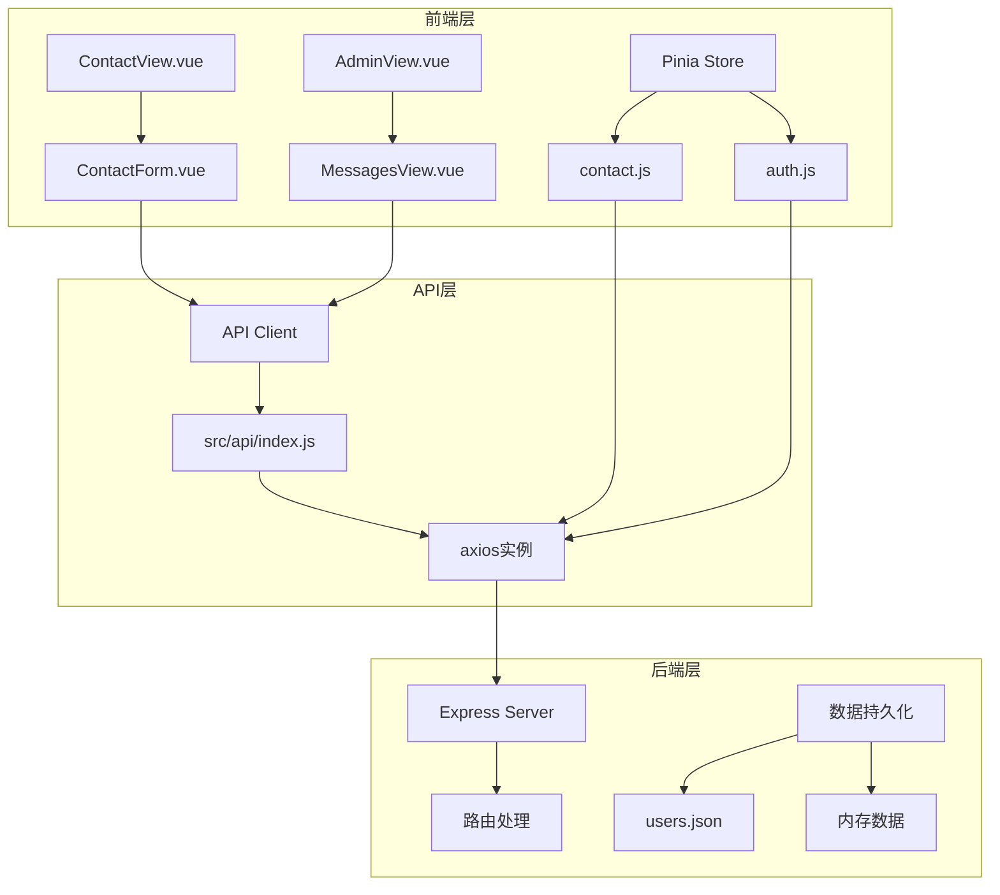
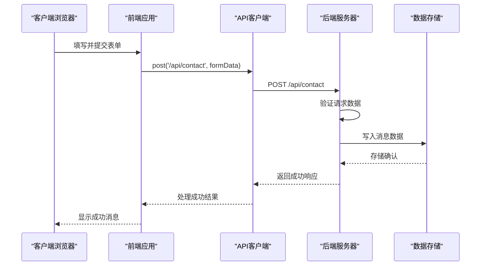
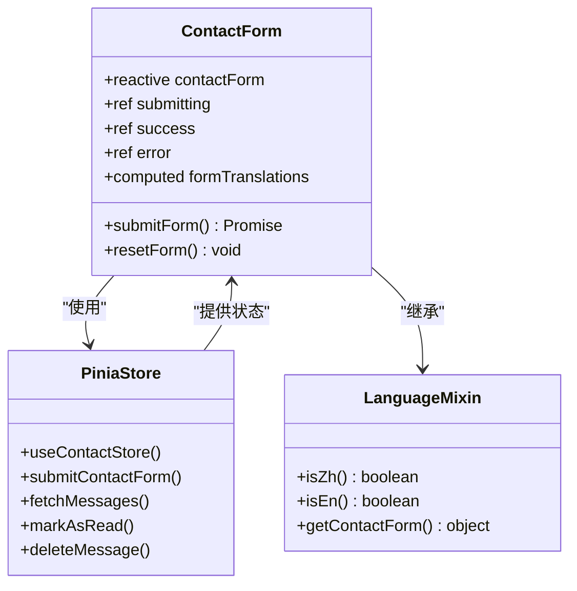
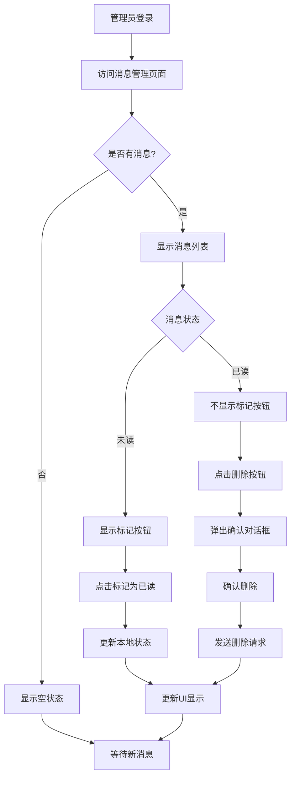
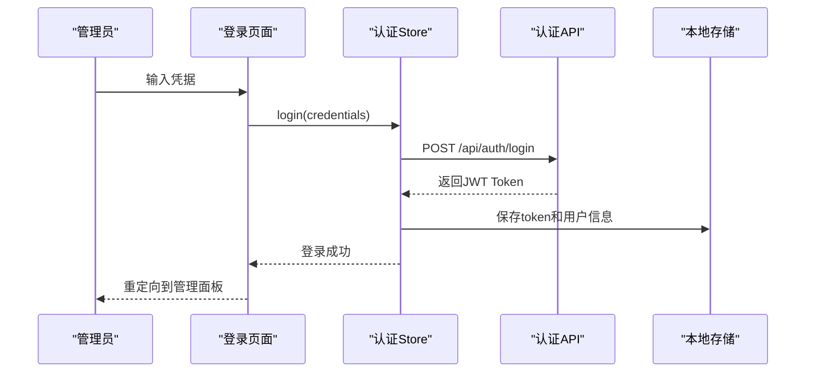

# 联系表单API技术文档

<cite>
**本文档中引用的文件**
- [app.js](file://app.js)
- [src/api/index.js](file://src/api/index.js)
- [src/components/ContactForm.vue](file://src/components/ContactForm.vue)
- [src/views/ContactView.vue](file://src/views/ContactView.vue)
- [src/views/admin/MessagesView.vue](file://src/views/admin/MessagesView.vue)
- [src/store/modules/contact.js](file://src/store/modules/contact.js)
- [src/store/modules/auth.js](file://src/store/modules/auth.js)
- [data/users.json](file://data/users.json)
- [data/content.json](file://data/content.json)
</cite>

## 目录
1. [简介](#简介)
2. [项目架构概览](#项目架构概览)
3. [核心API端点](#核心api端点)
4. [前端组件分析](#前端组件分析)
5. [后端数据持久化](#后端数据持久化)
6. [管理员管理界面](#管理员管理界面)
7. [安全机制](#安全机制)
8. [错误处理与调试](#错误处理与调试)
9. [最佳实践建议](#最佳实践建议)
10. [总结](#总结)

## 简介

本文档详细介绍了杭州朗德智能科技有限公司网站的联系表单API系统。该系统提供了完整的前后端交互解决方案，包括用户提交联系表单、管理员管理消息等功能。系统采用Vue 3 + Pinia + Express的现代Web架构，支持多语言国际化和JWT身份验证。

## 项目架构概览



**图表来源**
- [src/views/ContactView.vue](file://src/views/ContactView.vue#L1-L264)
- [src/components/ContactForm.vue](file://src/components/ContactForm.vue#L1-L155)
- [src/api/index.js](file://src/api/index.js#L1-L95)

## 核心API端点

### 用户提交联系表单 - POST /api/contact

这是系统的核心API端点，负责接收用户的联系表单数据。



**图表来源**
- [src/store/modules/contact.js](file://src/store/modules/contact.js#L30-L50)
- [src/api/index.js](file://src/api/index.js#L75-L77)

**端点特性：**
- **HTTP方法**: POST
- **URL路径**: `/api/contact`
- **请求头**: `Content-Type: application/json`
- **请求体**: 包含姓名、邮箱、电话、主题、公司和消息内容的JSON对象
- **响应格式**: JSON格式的成功确认或错误信息

### 管理员消息管理端点

#### 获取消息列表 - GET /api/admin/messages

```javascript
// 前端调用示例
const fetchMessages = async () => {
  try {
    const response = await axios.get('/api/admin/messages')
    messages.value = response.data
    return { success: true }
  } catch (e) {
    console.error('Error fetching messages:', e)
    return { success: false, error: e.message }
  }
}
```

#### 标记消息为已读 - PUT /api/admin/messages/{id}/read

```javascript
// 前端调用示例
const markAsRead = async (id) => {
  try {
    await axios.put(`/api/admin/messages/${id}/read`)
    
    // 更新本地数据
    const index = messages.value.findIndex(msg => msg.id === id)
    if (index !== -1) {
      messages.value[index].read = true
    }
    
    return { success: true }
  } catch (e) {
    console.error(`Error marking message ${id} as read:`, e)
    return { success: false, error: e.message }
  }
}
```

#### 删除消息 - DELETE /api/admin/messages/{id}

```javascript
// 前端调用示例
const deleteMessage = async (id) => {
  try {
    await axios.delete(`/api/admin/messages/${id}`)
    
    // 更新本地数据
    messages.value = messages.value.filter(msg => msg.id !== id)
    
    return { success: true }
  } catch (e) {
    console.error(`Error deleting message ${id}:`, e)
    return { success: false, error: e.message }
  }
}
```

**节来源**
- [src/store/modules/contact.js](file://src/store/modules/contact.js#L60-L134)
- [src/api/index.js](file://src/api/index.js#L80-L88)

## 前端组件分析

### ContactForm.vue 组件架构



**图表来源**
- [src/components/ContactForm.vue](file://src/components/ContactForm.vue#L35-L50)
- [src/store/modules/contact.js](file://src/store/modules/contact.js#L1-L135)

**组件特性：**

1. **响应式表单数据**: 使用Vue 3的reactive API管理表单状态
2. **多语言支持**: 通过语言混入实现中英文切换
3. **状态管理**: 集成Pinia store进行状态持久化
4. **表单验证**: 基础的必填字段验证
5. **用户反馈**: 成功/错误状态的视觉反馈

### 表单字段结构

```javascript
const contactForm = reactive({
  name: '',           // 姓名
  email: '',          // 电子邮件
  phone: '',          // 电话号码
  subject: '',        // 主题选择
  company: '',        // 公司名称
  message: ''         // 消息内容
})
```

**节来源**
- [src/components/ContactForm.vue](file://src/components/ContactForm.vue#L1-L155)
- [src/store/modules/contact.js](file://src/store/modules/contact.js#L15-L25)

## 后端数据持久化

### 数据存储策略

系统采用混合数据存储策略：

1. **临时数据存储**: 使用内存数组存储联系表单消息
2. **用户认证数据**: 存储在`data/users.json`文件中
3. **静态内容**: 存储在`data/content.json`文件中

### 用户认证数据结构

```json
[
  {
    "id": 1,
    "username": "admin",
    "password": "admin123",
    "role": "admin"
  }
]
```

### 消息数据结构

虽然具体的后端实现未完全展示，但根据前端代码可以推测消息数据结构：

```javascript
{
  "id": "unique-message-id",
  "name": "用户姓名",
  "email": "用户邮箱",
  "phone": "用户电话",
  "subject": "主题选项",
  "company": "公司名称",
  "message": "消息内容",
  "createdAt": "ISO日期字符串",
  "read": false
}
```

**节来源**
- [data/users.json](file://data/users.json#L1-L8)
- [src/store/modules/contact.js](file://src/store/modules/contact.js#L60-L134)

## 管理员管理界面

### MessagesView.vue 管理面板



**图表来源**
- [src/views/admin/MessagesView.vue](file://src/views/admin/MessagesView.vue#L1-L294)

### 管理员认证流程



**图表来源**
- [src/store/modules/auth.js](file://src/store/modules/auth.js#L15-L40)

**节来源**
- [src/views/admin/MessagesView.vue](file://src/views/admin/MessagesView.vue#L1-L294)
- [src/store/modules/auth.js](file://src/store/modules/auth.js#L1-L86)

## 安全机制

### JWT Token 认证

系统实现了基于JWT的管理员认证机制：

1. **Token生成**: 管理员登录成功后返回JWT Token
2. **Token存储**: 客户端将Token存储在localStorage中
3. **请求拦截**: 所有管理员API请求都会自动附加Authorization头
4. **自动登出**: 401错误时自动清除Token并重定向到登录页面

### 输入验证机制

前端实现了基础的表单验证：

```javascript
// 简单验证所有字段是否填写
let isValid = true;
for (const key in contactForm) {
  if (!contactForm[key].trim()) {
    isValid = false;
    break;
  }
}
```

### 防垃圾邮件机制

虽然当前实现较为简单，但系统预留了扩展空间：

1. **重复提交检测**: 可以在后端实现IP限制或频率限制
2. **验证码集成**: 可以集成reCAPTCHA或其他验证码服务
3. **内容过滤**: 可以添加关键词过滤功能

### 敏感信息保护

1. **Token加密存储**: JWT Token在localStorage中以加密形式存储
2. **HTTPS传输**: 所有API通信都通过HTTPS加密
3. **最小权限原则**: 管理员功能仅限认证用户访问

**节来源**
- [src/api/index.js](file://src/api/index.js#L15-L35)
- [src/store/modules/auth.js](file://src/store/modules/auth.js#L15-L40)

## 错误处理与调试

### 前端错误处理

系统实现了多层次的错误处理机制：

```javascript
// 提交表单时的错误处理
try {
  await axios.post('/api/contact', {
    ...contactForm,
    language: languageStore.language
  })
  success.value = true
  resetForm()
  return { success: true }
} catch (e) {
  const errorMessage = languageStore.isZh() 
    ? '提交失败，请稍后再试' 
    : 'Submission failed, please try again later'
  
  error.value = e.message || errorMessage
  return { success: false, error: error.value }
}
```

### 管理员API错误处理

```javascript
// 管理员API的统一错误处理
api.interceptors.response.use(
  response => response,
  error => {
    if (error.response) {
      // 处理401错误（未授权）
      if (error.response.status === 401) {
        localStorage.removeItem('admin-token')
        localStorage.removeItem('admin-user')
        // 如果是在管理后台，则跳转到登录页面
        if (window.location.pathname.startsWith('/admin')) {
          window.location.href = '/admin/login'
        }
      }
    }
    return Promise.reject(error)
  }
)
```

### 调试工具和技巧

1. **浏览器开发者工具**: 使用Network面板监控API请求
2. **Console日志**: 在关键位置添加console.log语句
3. **Vue DevTools**: 使用Vue DevTools检查Pinia store状态
4. **断点调试**: 在VS Code中设置断点进行逐步调试

**节来源**
- [src/store/modules/contact.js](file://src/store/modules/contact.js#L30-L55)
- [src/api/index.js](file://src/api/index.js#L35-L50)

## 最佳实践建议

### 前端开发最佳实践

1. **表单验证增强**:
   ```javascript
   // 添加更详细的验证规则
   const validateEmail = (email) => /^[^\s@]+@[^\s@]+\.[^\s@]+$/.test(email)
   const validatePhone = (phone) => /^\d{11}$/.test(phone)
   ```

2. **用户体验优化**:
   - 添加加载动画指示器
   - 实现表单预填充功能
   - 提供实时验证反馈

3. **国际化扩展**:
   - 支持更多语言
   - 实现动态语言切换
   - 添加地区化日期格式

### 后端安全增强

1. **输入验证加强**:
   ```javascript
   // 后端验证示例
   const validateFormData = (data) => {
     return {
       name: typeof data.name === 'string' && data.name.trim().length > 0,
       email: typeof data.email === 'string' && validateEmail(data.email),
       phone: typeof data.phone === 'string' && validatePhone(data.phone),
       message: typeof data.message === 'string' && data.message.trim().length > 0
     }
   }
   ```

2. **速率限制**:
   - 实现IP级别的请求频率限制
   - 添加验证码验证
   - 实现黑名单机制

3. **数据保护**:
   - 对敏感字段进行脱敏处理
   - 实现数据备份和恢复机制
   - 添加审计日志记录

### 性能优化建议

1. **前端性能**:
   - 实现懒加载减少初始包大小
   - 使用CDN加速静态资源加载
   - 实现缓存策略减少重复请求

2. **后端性能**:
   - 实现数据库连接池
   - 添加查询结果缓存
   - 优化数据序列化和反序列化

## 总结

杭州朗德智能科技有限公司的联系表单API系统是一个功能完整、架构清晰的现代Web应用程序。系统采用了Vue 3 + Pinia + Express的现代化技术栈，提供了完整的前后端交互解决方案。

**主要特点**：
- **完整的API端点**: 包括用户提交表单和管理员管理功能
- **现代化架构**: 前后端分离，状态管理清晰
- **多语言支持**: 支持中英文切换
- **安全机制**: JWT认证和基本的输入验证
- **良好的扩展性**: 为未来的功能扩展预留了空间

**改进建议**：
1. 实现更完善的后端数据持久化
2. 增强输入验证和安全防护
3. 添加更多的错误处理和用户反馈
4. 实现更完善的测试覆盖
5. 优化性能和用户体验

该系统为类似的企业网站提供了很好的参考模板，展示了如何构建一个功能完整、易于维护的联系表单系统。