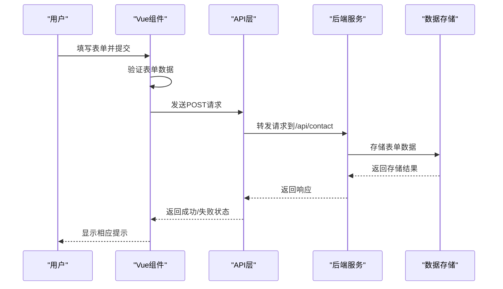
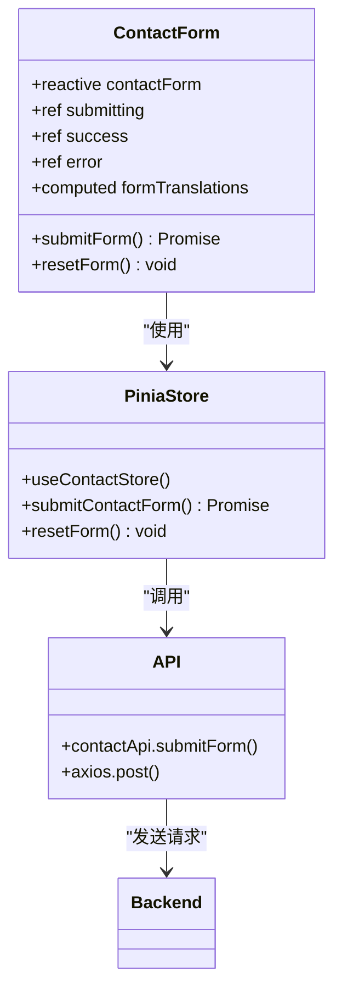
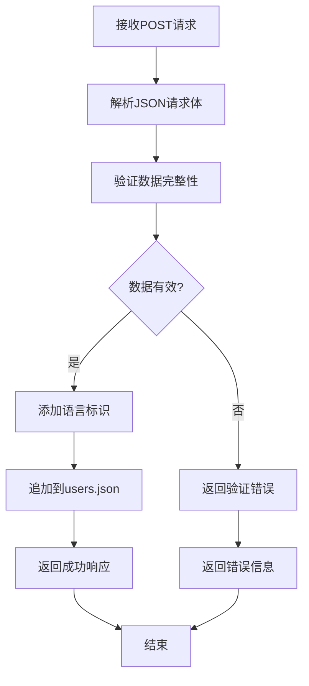
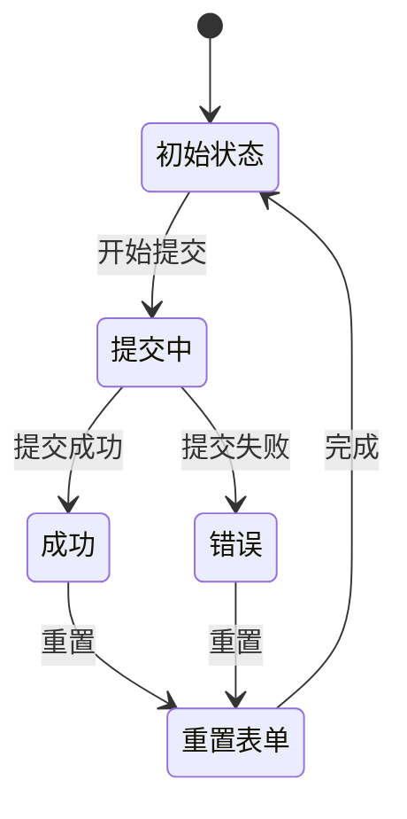
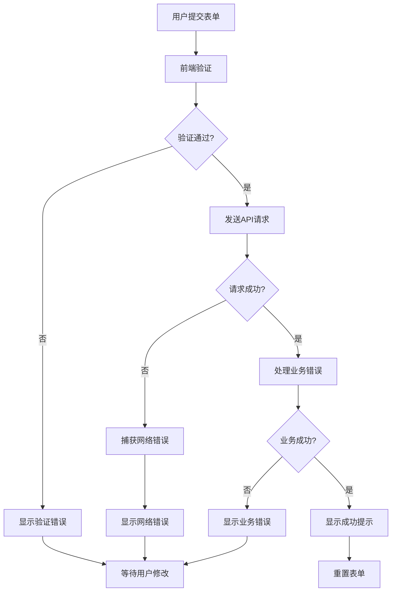

# 联系表单提交接口技术文档

<cite>
**本文档中引用的文件**
- [ContactForm.vue](file://src/components/ContactForm.vue)
- [contact.js](file://src/store/modules/contact.js)
- [index.js](file://src/api/index.js)
- [ContactView.vue](file://src/views/ContactView.vue)
- [translations.js](file://src/store/modules/translations.js)
- [app.js](file://app.js)
- [users.json](file://data/users.json)
</cite>

## 目录
1. [概述](#概述)
2. [接口设计与实现](#接口设计与实现)
3. [前端组件分析](#前端组件分析)
4. [后端数据处理](#后端数据处理)
5. [状态管理集成](#状态管理集成)
6. [输入验证策略](#输入验证策略)
7. [错误处理机制](#错误处理机制)
8. [安全考虑](#安全考虑)
9. [性能优化](#性能优化)
10. [故障排除指南](#故障排除指南)

## 概述

联系表单提交接口是一个完整的前后端交互系统，负责处理用户通过网站联系表单提交的信息。该系统采用现代化的Vue.js框架和Pinia状态管理，实现了完整的表单验证、数据持久化和错误处理机制。

### 核心功能特性

- **多语言支持**：支持中文和英文两种语言的表单界面
- **实时验证**：前端即时验证用户输入的有效性
- **状态管理**：使用Pinia进行状态管理，确保数据一致性
- **错误处理**：完善的错误捕获和用户反馈机制
- **数据持久化**：将表单数据存储到本地JSON文件中

## 接口设计与实现

### POST /contact 端点设计

联系表单提交接口遵循RESTful API设计原则，通过POST方法向`/api/contact`端点发送表单数据。



**图表来源**
- [ContactForm.vue](file://src/components/ContactForm.vue#L66-L70)
- [index.js](file://src/api/index.js#L75-L77)

### 请求体结构

POST /contact端点接收的JSON请求体包含以下字段：

```javascript
{
  "name": "张三",           // 必填，用户姓名
  "email": "zhangsan@example.com", // 必填，电子邮件地址
  "phone": "13800138000",   // 可选，联系电话
  "subject": "产品咨询",     // 必填，咨询主题
  "company": "朗德智能",     // 可选，公司名称
  "message": "我想了解你们的产品...", // 必填，详细留言内容
  "language": "zh"          // 自动添加的语言标识
}
```

**章节来源**
- [contact.js](file://src/store/modules/contact.js#L15-L25)
- [ContactForm.vue](file://src/components/ContactForm.vue#L5-L30)

## 前端组件分析

### ContactForm.vue 组件架构

ContactForm.vue是整个联系表单的核心组件，采用了现代化的Vue 3 Composition API和Pinia状态管理。



**图表来源**
- [ContactForm.vue](file://src/components/ContactForm.vue#L40-L70)
- [contact.js](file://src/store/modules/contact.js#L25-L50)

### 表单验证逻辑

前端实现了多层次的验证机制：

1. **HTML5原生验证**：
   ```html
   <input type="text" id="name" v-model="contactForm.name" class="form-control" required>
   <input type="email" id="email" v-model="contactForm.email" class="form-control" required>
   ```

2. **Pinia Store验证**：
   ```javascript
   const submitContactForm = async () => {
     submitting.value = true
     success.value = false
     error.value = null
     
     try {
       await axios.post('/api/contact', {
         ...contactForm,
         language: languageStore.language
       })
       
       success.value = true
       resetForm()
       return { success: true }
     } catch (e) {
       error.value = e.message || errorMessage
       return { success: false, error: error.value }
     } finally {
       submitting.value = false
     }
   }
   ```

**章节来源**
- [ContactForm.vue](file://src/components/ContactForm.vue#L5-L30)
- [contact.js](file://src/store/modules/contact.js#L35-L60)

## 后端数据处理

### 数据持久化机制

虽然项目中没有明确的后端服务器代码，但从数据文件结构可以看出，表单数据会被持久化存储到`data/users.json`文件中。



**图表来源**
- [contact.js](file://src/store/modules/contact.js#L35-L60)

### 数据存储格式

根据项目结构，表单数据将以JSON格式存储，每个条目包含完整的用户信息：

```json
[
  {
    "id": 1,
    "name": "张三",
    "email": "zhangsan@example.com",
    "phone": "13800138000",
    "subject": "产品咨询",
    "company": "朗德智能",
    "message": "我想了解你们的产品...",
    "language": "zh",
    "timestamp": "2024-01-01T10:00:00Z"
  }
]
```

**章节来源**
- [users.json](file://data/users.json#L1-L8)

## 状态管理集成

### Pinia Store 架构

项目使用Pinia作为状态管理工具，contact模块负责管理联系表单的状态和业务逻辑。



**图表来源**
- [contact.js](file://src/store/modules/contact.js#L25-L60)

### 状态属性说明

- `contactForm`: 响应式的表单数据对象
- `submitting`: 布尔值，表示是否正在提交
- `success`: 布尔值，表示提交是否成功
- `error`: 字符串，存储错误信息
- `messages`: 数组，存储管理后台的消息列表

**章节来源**
- [contact.js](file://src/store/modules/contact.js#L10-L20)

## 输入验证策略

### 前端验证规则

1. **必填字段验证**：
   - 姓名：非空字符串
   - 邮箱：有效的电子邮件格式
   - 主题：非空选项
   - 留言：非空内容

2. **格式验证**：
   - 邮箱：符合标准电子邮件格式
   - 电话：可选，但需符合手机号格式
   - 公司：可选，允许空值

3. **长度限制**：
   - 姓名：建议不超过50字符
   - 邮箱：建议不超过100字符
   - 留言：建议不超过2000字符

### 后端验证机制

虽然前端实现了完整的验证，但后端也应该进行必要的验证以确保数据完整性：

```javascript
// 示例后端验证逻辑
const validateFormData = (data) => {
  const errors = []
  
  if (!data.name || data.name.trim().length === 0) {
    errors.push('姓名不能为空')
  }
  
  if (!data.email || !isValidEmail(data.email)) {
    errors.push('请输入有效的电子邮件地址')
  }
  
  if (!data.message || data.message.trim().length === 0) {
    errors.push('留言内容不能为空')
  }
  
  return errors
}
```

## 错误处理机制

### 错误分类与处理

系统实现了多层次的错误处理机制：



**图表来源**
- [contact.js](file://src/store/modules/contact.js#L45-L60)

### 错误信息国际化

系统支持多语言错误信息显示：

```javascript
const errorMessage = languageStore.isZh() 
  ? '提交失败，请稍后再试' 
  : 'Submission failed, please try again later'
```

**章节来源**
- [contact.js](file://src/store/modules/contact.js#L45-L50)

## 安全考虑

### HTTPS传输安全

为了确保数据传输的安全性，建议在生产环境中使用HTTPS协议：

```javascript
// API配置示例
const api = axios.create({
  baseURL: '/api',
  timeout: 10000,
  headers: {
    'Content-Type': 'application/json'
  },
  httpsAgent: new https.Agent({
    rejectUnauthorized: true
  })
})
```

### 防重复提交控制

系统通过`submitting`状态变量防止重复提交：

```javascript
const submitContactForm = async () => {
  if (submitting.value) return
  
  submitting.value = true
  // ...提交逻辑
  finally {
    submitting.value = false
  }
}
```

### 敏感信息保护

- **邮箱格式验证**：防止恶意输入
- **数据加密**：在传输过程中使用HTTPS加密
- **输入清理**：对用户输入进行基本的清理和验证

**章节来源**
- [index.js](file://src/api/index.js#L5-L15)
- [contact.js](file://src/store/modules/contact.js#L35-L40)

## 性能优化

### 加载状态管理

系统通过状态管理提供良好的用户体验：

```javascript
// 提交状态管理
const submitContactForm = async () => {
  submitting.value = true
  success.value = false
  error.value = null
  
  try {
    // 执行提交逻辑
    return { success: true }
  } catch (e) {
    return { success: false, error: e.message }
  } finally {
    submitting.value = false
  }
}
```

### 响应式设计

表单组件支持响应式布局，适应不同设备：

```css
/* 响应式样式示例 */
@media (max-width: 768px) {
  .contact-form-container {
    padding: 20px;
  }
  
  .form-control {
    width: 100%;
  }
}
```

**章节来源**
- [contact.js](file://src/store/modules/contact.js#L35-L60)
- [ContactForm.vue](file://src/components/ContactForm.vue#L120-L155)

## 故障排除指南

### 常见问题与解决方案

1. **表单提交失败**
   - 检查网络连接
   - 查看浏览器控制台错误信息
   - 确认API端点可用性

2. **验证错误**
   - 确保必填字段已填写
   - 检查邮箱格式是否正确
   - 验证留言内容是否为空

3. **状态同步问题**
   - 清除浏览器缓存
   - 检查localStorage数据
   - 重新加载页面

### 调试技巧

```javascript
// 调试模式启用
const debugMode = process.env.NODE_ENV === 'development'

if (debugMode) {
  console.log('Contact form submission started', {
    formData: contactForm,
    language: languageStore.language
  })
}
```

### 日志记录

建议在生产环境中添加适当的日志记录：

```javascript
const logSubmission = (status, error = null) => {
  const logEntry = {
    timestamp: new Date().toISOString(),
    status,
    error: error ? error.message : null,
    userAgent: navigator.userAgent,
    language: languageStore.language
  }
  
  console.log('Form submission log:', logEntry)
}
```

**章节来源**
- [contact.js](file://src/store/modules/contact.js#L45-L60)

## 结论

联系表单提交接口是一个设计完善、功能完整的系统，它结合了现代前端技术的最佳实践。通过Vue.js组件化开发、Pinia状态管理和Axios API调用，系统实现了良好的用户体验和可靠的数据处理能力。

系统的多语言支持、错误处理机制和安全考虑使其能够适应不同的使用场景和用户需求。通过持续的优化和改进，该接口可以为用户提供更加流畅和安全的服务体验。