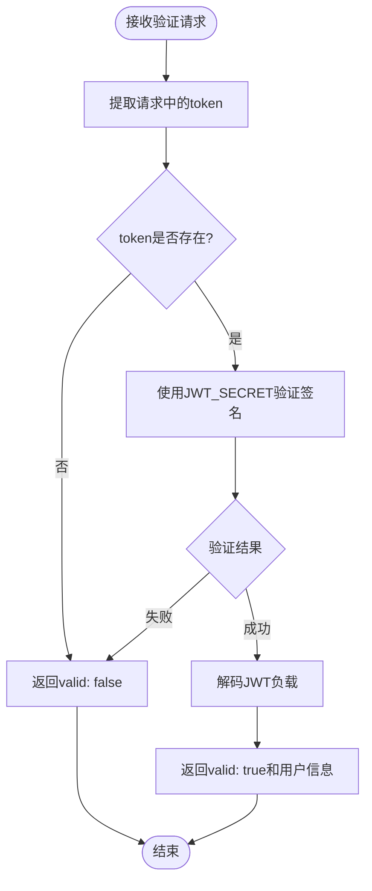
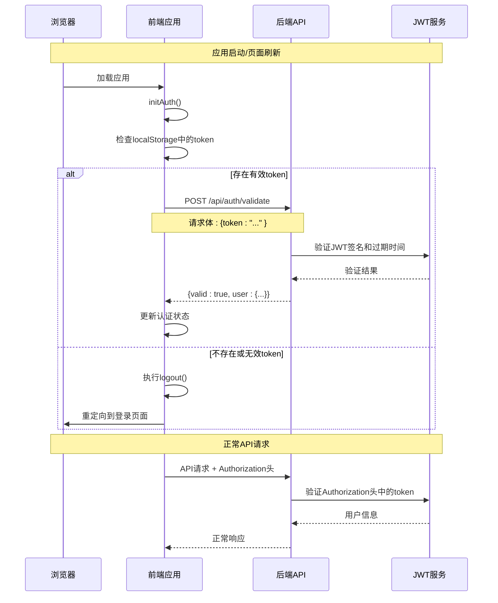
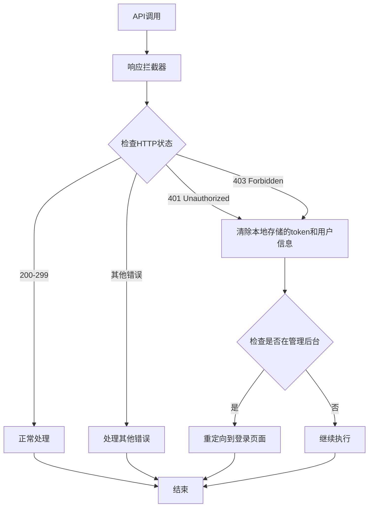

# 令牌验证接口 (/auth/validate)

<cite>
**本文档中引用的文件**
- [src/api/index.js](file://src/api/index.js)
- [src/store/modules/auth.js](file://src/store/modules/auth.js)
- [server.cjs](file://server.cjs)
- [package.json](file://package.json)
</cite>

## 目录
1. [简介](#简介)
2. [接口概述](#接口概述)
3. [前端实现](#前端实现)
4. [后端实现](#后端实现)
5. [认证流程](#认证流程)
6. [错误处理](#错误处理)
7. [实际调用示例](#实际调用示例)
8. [最佳实践](#最佳实践)
9. [故障排除](#故障排除)
10. [总结](#总结)

## 简介

`/auth/validate` 是一个专门用于验证客户端持有的JWT令牌有效性的API端点。该接口在管理后台系统中扮演着关键角色，负责在应用初始化、页面刷新或定期检查时验证用户的认证状态，确保用户会话的安全性和有效性。

## 接口概述

### 基本信息

- **URL**: `/api/auth/validate`
- **HTTP方法**: POST
- **请求头**: 
  - Content-Type: application/json
  - Authorization: Bearer [token] (可选)
- **请求体**: 包含JWT令牌的JSON对象
- **响应格式**: JSON

### 功能特性

1. **无请求体验证**: 接口不需要完整的请求体，只需包含有效的JWT令牌
2. **签名验证**: 服务端使用预设密钥验证JWT签名的有效性
3. **过期时间检查**: 自动检测令牌是否已过期
4. **用户信息提取**: 成功验证时返回解码后的用户身份信息
5. **状态反馈**: 明确的成功或失败状态指示

## 前端实现

### API封装层

前端通过`src/api/index.js`中的`authApi`对象暴露了`validateToken`方法：

```javascript
// 认证相关API
export const authApi = {
  // 验证token
  validateToken: () => api.post('/auth/validate'),
  
  // 获取用户信息
  getUserInfo: () => api.get('/auth/me')
}
```

### Axios拦截器集成

前端的axios实例配置了请求和响应拦截器，实现了与令牌验证接口的无缝集成：

```javascript
// 请求拦截器
api.interceptors.request.use(
  config => {
    // 从localStorage获取token
    const token = localStorage.getItem('admin-token')
    if (token) {
      config.headers.Authorization = `Bearer ${token}`
    }
    return config
  },
  error => {
    return Promise.reject(error)
  }
)

// 响应拦截器
api.interceptors.response.use(
  response => {
    return response
  },
  error => {
    if (error.response) {
      // 处理401错误（未授权）
      if (error.response.status === 401) {
        localStorage.removeItem('admin-token')
        localStorage.removeItem('admin-user')
        // 如果是在管理后台，则跳转到登录页面
        if (window.location.pathname.startsWith('/admin')) {
          window.location.href = '/admin/login'
        }
      }
    }
    return Promise.reject(error)
  }
)
```

### Pinia状态管理

在`src/store/modules/auth.js`中，认证状态管理器提供了完整的令牌验证功能：

```javascript
// 验证令牌
const validateToken = async () => {
  if (!token.value) return false
  
  try {
    const response = await axios.post('/api/auth/validate', { token: token.value })
    return response.data.valid
  } catch (e) {
    logout()
    return false
  }
}

// 初始化用户认证状态
const initAuth = async () => {
  if (token.value) {
    const isValid = await validateToken()
    isAuthenticated.value = isValid
    if (!isValid) logout()
  }
}
```

**章节来源**
- [src/api/index.js](file://src/api/index.js#L69-L71)
- [src/store/modules/auth.js](file://src/store/modules/auth.js#L57-L67)

## 后端实现

### 路由定义

后端在`server.cjs`中定义了`/api/auth/validate`路由：

```javascript
// 验证令牌
app.post('/api/auth/validate', (req, res) => {
  const { token } = req.body;
  
  if (!token) {
    return res.json({ valid: false });
  }
  
  jwt.verify(token, JWT_SECRET, (err, decoded) => {
    if (err) {
      return res.json({ valid: false });
    }
    
    res.json({ valid: true, user: decoded });
  });
});
```

### JWT验证机制

后端使用`jsonwebtoken`库进行JWT令牌验证：



**图表来源**
- [server.cjs](file://server.cjs#L250-L262)

### 中间件集成

虽然`/auth/validate`端点本身不使用认证中间件，但整个系统通过统一的JWT认证中间件保护其他API：

```javascript
// JWT认证中间件
const authenticateToken = (req, res, next) => {
  const authHeader = req.headers['authorization'];
  const token = authHeader && authHeader.split(' ')[1];
  
  if (!token) {
    return res.status(401).json({ message: '未提供认证令牌' });
  }
  
  jwt.verify(token, JWT_SECRET, (err, user) => {
    if (err) {
      return res.status(403).json({ message: '令牌无效或已过期' });
    }
    req.user = user;
    next();
  });
};
```

**章节来源**
- [server.cjs](file://server.cjs#L250-L262)
- [server.cjs](file://server.cjs#L120-L132)

## 认证流程

### 完整认证生命周期



**图表来源**
- [src/store/modules/auth.js](file://src/store/modules/auth.js#L70-L78)
- [src/api/index.js](file://src/api/index.js#L10-L25)

### 应用初始化流程

在Vue应用的初始化过程中，认证状态会被自动检查：

```javascript
// 应用初始化时的认证检查
const initAuth = async () => {
  if (token.value) {
    const isValid = await validateToken()
    isAuthenticated.value = isValid
    if (!isValid) logout()
  }
}
```

这个过程确保：
1. 用户访问应用时自动尝试恢复之前的会话
2. 无效的令牌被自动清除
3. 用户被正确重定向到登录页面

## 错误处理

### 前端错误处理策略

前端通过axios拦截器实现了统一的错误处理：



**图表来源**
- [src/api/index.js](file://src/api/index.js#L26-L42)

### 后端错误处理

后端的错误处理相对简单直接：

```javascript
// 验证失败时的响应
jwt.verify(token, JWT_SECRET, (err, decoded) => {
  if (err) {
    return res.json({ valid: false });
  }
  
  res.json({ valid: true, user: decoded });
});
```

这种设计确保：
- 验证失败时不会泄露具体错误原因
- 返回一致的JSON响应格式
- 客户端可以轻松处理各种验证结果

**章节来源**
- [src/api/index.js](file://src/api/index.js#L26-L42)
- [server.cjs](file://server.cjs#L250-L262)

## 实际调用示例

### 前端调用示例

```javascript
// 使用Pinia store进行令牌验证
import { useAuthStore } from '@/store/modules/auth'

const authStore = useAuthStore()

// 应用初始化时验证
await authStore.initAuth()

// 手动验证令牌
const isValid = await authStore.validateToken()
console.log('令牌有效:', isValid)

// 获取用户信息
if (isValid) {
  const userInfo = await authStore.getUserInfo()
  console.log('用户信息:', userInfo)
}
```

### Axios直接调用示例

```javascript
// 直接使用axios进行令牌验证
import axios from 'axios'

const validateToken = async (token) => {
  try {
    const response = await axios.post('/api/auth/validate', { token })
    return response.data.valid
  } catch (error) {
    console.error('令牌验证失败:', error)
    return false
  }
}

// 使用示例
const token = localStorage.getItem('admin-token')
const isValid = await validateToken(token)
console.log('令牌状态:', isValid ? '有效' : '无效')
```

### 响应数据格式

成功的验证响应：
```json
{
  "valid": true,
  "user": {
    "id": 1,
    "username": "admin",
    "role": "admin",
    "iat": 1640995200,
    "exp": 1641081600
  }
}
```

失败的验证响应：
```json
{
  "valid": false
}
```

## 最佳实践

### 1. 定期令牌验证

建议在以下场景中定期验证令牌：

```javascript
// 在应用启动时验证
onMounted(async () => {
  await authStore.initAuth()
})

// 在定时任务中验证
setInterval(async () => {
  const isValid = await authStore.validateToken()
  if (!isValid) {
    // 触发重新登录流程
    await authStore.logout()
  }
}, 300000) // 每5分钟验证一次
```

### 2. 安全考虑

- **HTTPS传输**: 确保所有API通信都通过HTTPS进行
- **令牌存储**: 使用localStorage或sessionStorage存储令牌
- **过期处理**: 及时处理过期的令牌
- **错误信息**: 不要向客户端泄露具体的验证错误信息

### 3. 性能优化

- **缓存策略**: 在内存中缓存最近验证的令牌结果
- **批量验证**: 对于多个API请求，考虑批量验证策略
- **异步处理**: 将令牌验证作为异步操作，避免阻塞主线程

## 故障排除

### 常见问题及解决方案

#### 1. 令牌验证总是失败

**症状**: 即使持有有效的JWT令牌，验证始终返回false

**可能原因**:
- JWT_SECRET不匹配
- 令牌格式错误
- 时间同步问题

**解决方案**:
```javascript
// 检查令牌格式
const validateTokenFormat = (token) => {
  const parts = token.split('.')
  return parts.length === 3
}

// 调试验证过程
const debugValidation = async (token) => {
  console.log('原始令牌:', token)
  console.log('令牌格式:', validateTokenFormat(token))
  
  try {
    const response = await axios.post('/api/auth/validate', { token })
    console.log('验证响应:', response.data)
  } catch (error) {
    console.error('验证错误:', error.response?.data || error.message)
  }
}
```

#### 2. 前端重定向循环

**症状**: 应用不断重定向到登录页面

**可能原因**:
- 令牌验证逻辑错误
- 后端时间配置问题
- 前端状态管理问题

**解决方案**:
```javascript
// 添加调试日志
const initAuthWithDebug = async () => {
  console.log('开始初始化认证...')
  console.log('本地存储令牌:', !!localStorage.getItem('admin-token'))
  
  try {
    await authStore.initAuth()
    console.log('认证初始化完成，状态:', authStore.isAuthenticated)
  } catch (error) {
    console.error('认证初始化失败:', error)
  }
}
```

#### 3. CORS跨域问题

**症状**: 前端无法访问验证接口

**解决方案**:
```javascript
// 确保后端启用了CORS
app.use(cors({
  origin: ['http://localhost:3000', 'https://yourdomain.com'],
  credentials: true
}))
```

**章节来源**
- [src/store/modules/auth.js](file://src/store/modules/auth.js#L70-L78)
- [server.cjs](file://server.cjs#L10-L12)

## 总结

`/auth/validate`接口是现代Web应用中认证系统的核心组件，它提供了：

1. **安全性**: 通过JWT令牌验证确保用户身份的真实性
2. **可靠性**: 自动处理令牌过期和验证失败的情况
3. **易用性**: 简洁的API设计和统一的错误处理
4. **集成性**: 与前端框架和状态管理工具的良好集成

该接口的设计体现了现代Web应用认证的最佳实践，通过前后端的紧密配合，为用户提供安全、流畅的管理体验。开发者应该充分利用这个接口提供的功能，结合适当的错误处理和用户体验设计，构建健壮的认证系统。