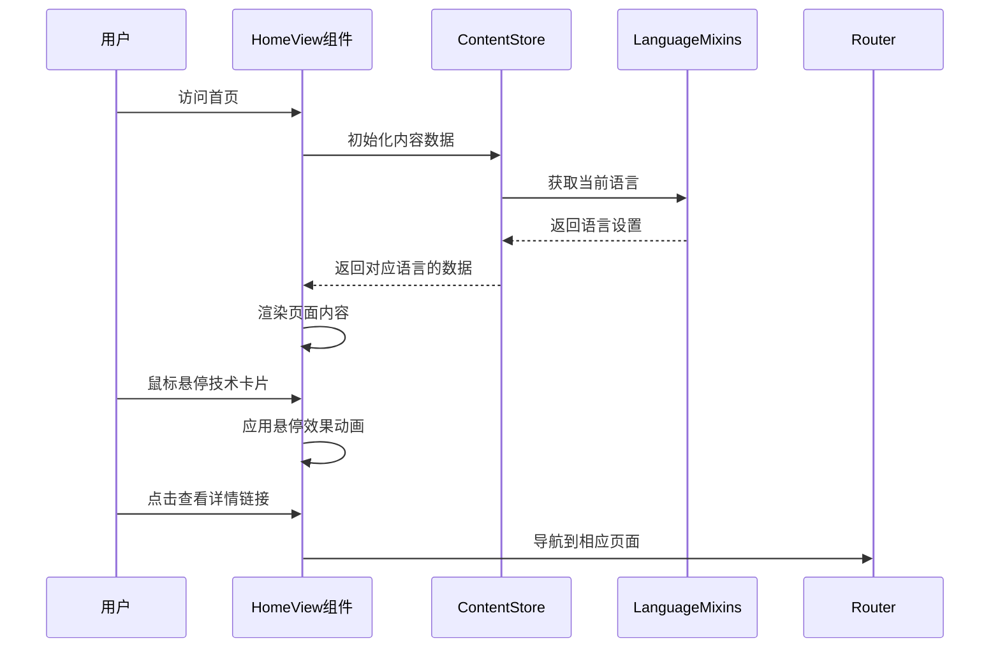
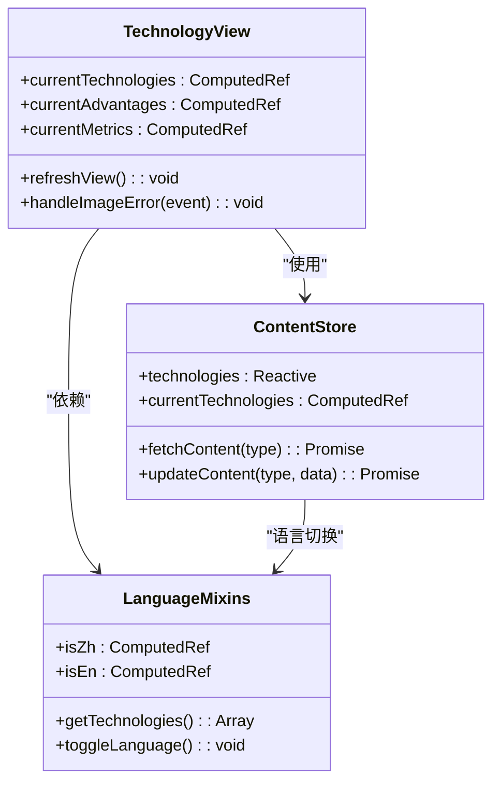
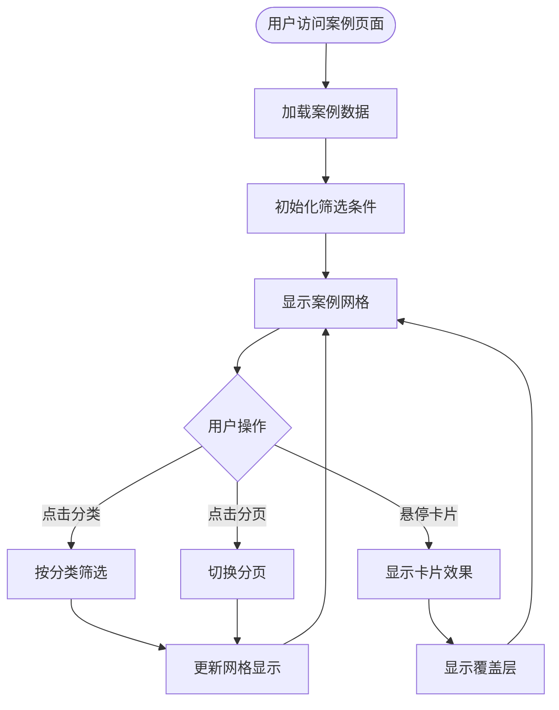
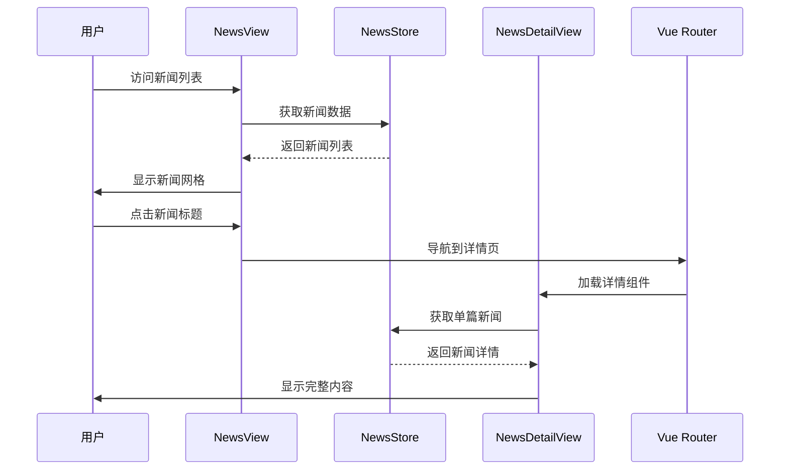
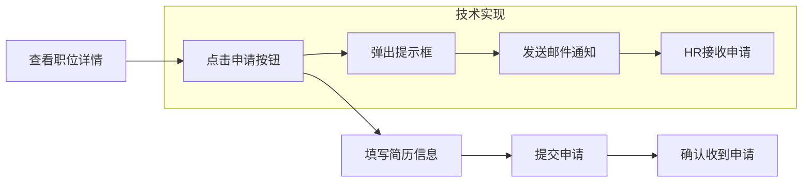
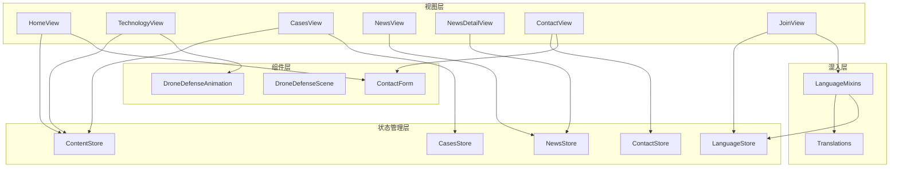
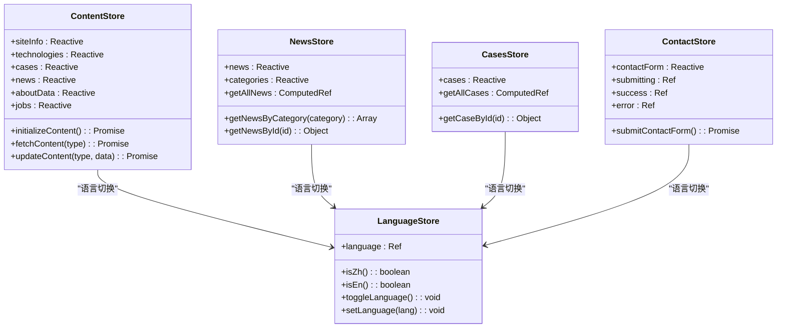

# 主要功能模块

<cite>
**本文档中引用的文件**
- [HomeView.vue](file://src/views/HomeView.vue)
- [TechnologyView.vue](file://src/views/TechnologyView.vue)
- [CasesView.vue](file://src/views/CasesView.vue)
- [NewsView.vue](file://src/views/NewsView.vue)
- [NewsDetailView.vue](file://src/views/NewsDetailView.vue)
- [ContactView.vue](file://src/views/ContactView.vue)
- [JoinView.vue](file://src/views/JoinView.vue)
- [ContactForm.vue](file://src/components/ContactForm.vue)
- [content.js](file://src/store/modules/content.js)
- [language.js](file://src/mixins/language.js)
</cite>

## 目录
1. [概述](#概述)
2. [首页模块 - HomeView](#首页模块---homeview)
3. [技术展示模块 - TechnologyView](#技术展示模块---technologyview)
4. [案例展示模块 - CasesView](#案例展示模块---casesview)
5. [资讯浏览模块 - NewsView与NewsDetailView](#资讯浏览模块---newsview与newsdetailview)
6. [联系我们模块 - ContactView](#联系我们模块---contactview)
7. [招聘模块 - JoinView](#招聘模块---joinview)
8. [组件架构分析](#组件架构分析)
9. [数据流与状态管理](#数据流与状态管理)
10. [总结](#总结)

## 概述

本文档系统性地介绍了杭州朗德智能科技有限公司官网的五大核心功能模块。这些模块基于Vue 3 Composition API构建，采用Pinia状态管理，实现了完整的前后端分离架构。每个模块都具备响应式设计、多语言支持和动态数据加载能力，为产品经理和前端工程师提供了统一的功能参考基准。

## 首页模块 - HomeView

HomeView作为网站的门户页面，整合了多个核心功能模块，通过精心设计的布局和交互效果，为用户提供全面的公司信息展示。

### 核心功能特性

**轮播图与解决方案摘要**
- 集成DroneDefenseScene组件提供3D无人机防御场景展示
- 采用SVG渐变背景和粒子动画增强视觉效果
- 提供科技感十足的主横幅设计，包含动态统计图表

**技术亮点展示**
- 四大核心优势卡片布局：全方位防护、快速响应、智能分析、系统集成
- 每个优势卡片包含图标、标题、描述和详细信息
- 支持鼠标悬停效果，增强用户交互体验

**动态数据加载**
- 从Pinia store获取实时数据，支持多语言切换
- 自动处理数据加载状态和错误情况
- 实现优雅的加载动画和错误提示界面

### 交互行为分析

**图表来源**
- [HomeView.vue](file://src/views/HomeView.vue#L1-L100)
- [content.js](file://src/store/modules/content.js#L1-L50)

### 视觉表现与动画效果

- **Hero区域**：采用渐变背景和粒子动画，营造科技感氛围
- **卡片悬停**：技术卡片和案例卡片具有平滑的缩放和阴影效果
- **导航引导**：滚动指示器提供直观的页面导航体验
- **响应式设计**：适配不同屏幕尺寸，确保移动端友好体验

**章节来源**
- [HomeView.vue](file://src/views/HomeView.vue#L1-L800)

## 技术展示模块 - TechnologyView

TechnologyView专门展示公司的核心技术产品，通过详细的技术规格、应用场景和优势对比，帮助用户深入了解公司的技术实力。

### 技术模块组织

**四大核心技术展示**
1. **无人机探测系统**：多传感器融合探测，全天候监控能力
2. **电子干扰系统**：智能定向干扰，阻断无人机控制链路
3. **无人机拦截系统**：多种拦截手段组合，安全处置入侵无人机
4. **指挥控制平台**：集中式指挥，实时监控和处置

**技术亮点与指标**
- 每个技术模块包含详细的技术描述和功能特性
- 展示核心技术指标，如识别准确率、探测范围、响应时间等
- 提供适用场景列表，帮助用户理解技术应用领域

### 数据来源与状态管理

**图表来源**
- [TechnologyView.vue](file://src/views/TechnologyView.vue#L1-L200)
- [content.js](file://src/store/modules/content.js#L100-L200)

### 交互与视觉设计

- **技术卡片**：采用渐变边框和阴影效果，突出技术模块
- **图片展示**：支持图片错误处理和自动替换机制
- **响应式布局**：技术卡片网格布局适配不同屏幕尺寸
- **导航结构**：清晰的技术分类和层级关系展示

**章节来源**
- [TechnologyView.vue](file://src/views/TechnologyView.vue#L1-L800)

## 案例展示模块 - CasesView

CasesView提供完整的客户案例展示和筛选功能，支持按类别浏览和分页显示，帮助用户了解公司在不同领域的应用成果。

### 案例筛选与分类系统

**多维分类体系**
- 按行业分类：工业应用、农业应用、军事安全、公共安全、应急救援、边境安全
- 按场景分类：机场防护、边境监控、电力巡检、农业植保等
- 支持"全部"选项进行全局筛选

**案例详情展示**
- 每个案例包含标题、摘要、图片和标签
- 支持案例详情页面跳转，提供更详细的信息
- 展示案例结果和成效数据

### 分页与交互设计

**图表来源**
- [CasesView.vue](file://src/views/CasesView.vue#L1-L100)

### 数据处理与优化

- **虚拟化渲染**：大量案例数据的高效渲染处理
- **缓存机制**：避免重复加载相同数据
- **错误处理**：图片加载失败时的自动替换策略
- **性能优化**：分页加载减少初始渲染压力

**章节来源**
- [CasesView.vue](file://src/views/CasesView.vue#L1-L526)

## 资讯浏览模块 - NewsView与NewsDetailView

资讯模块包含两个相关联的视图组件，NewsView提供新闻列表和分类浏览，NewsDetailView展示单篇新闻的完整内容。

### 新闻分类与导航

**分类体系设计**
- 公司新闻：企业动态、产品发布、市场活动
- 行业动态：政策法规、技术趋势、市场分析
- 媒体报道：新闻报道、媒体采访、专题文章
- 技术博客：技术分享、解决方案、应用案例

**新闻详情功能**
- 完整的文章内容展示
- 上下篇导航和相关新闻推荐
- 社交媒体分享功能
- 评论和互动功能预留

### 内容管理与SEO优化

**图表来源**
- [NewsView.vue](file://src/views/NewsView.vue#L1-L100)
- [NewsDetailView.vue](file://src/views/NewsDetailView.vue#L1-L100)

### 交互体验优化

- **平滑滚动**：分页切换时的平滑滚动效果
- **面包屑导航**：清晰的页面层级指示
- **相关推荐**：基于分类的相关新闻推荐
- **分享功能**：社交媒体分享按钮集成

**章节来源**
- [NewsView.vue](file://src/views/NewsView.vue#L1-L606)
- [NewsDetailView.vue](file://src/views/NewsDetailView.vue#L1-L595)

## 联系我们模块 - ContactView

ContactView整合了多种联系方式和在线咨询功能，提供一站式的企业沟通渠道。

### 多渠道联系方式

**传统联系方式**
- **公司地址**：详细的地理位置和导航链接
- **联系电话**：多个电话号码和400热线
- **电子邮箱**：多个业务邮箱和客服邮箱
- **工作时间**：明确的工作时间和节假日安排

**在线咨询功能**
- 集成ContactForm组件提供标准化表单
- 支持表单验证和提交反馈
- 实时的语言切换支持

### 地图与位置展示

- **公司位置**：集成地图组件展示公司地理位置
- **导航链接**：提供外部导航服务链接
- **周边信息**：展示公司周边的重要地标

### 响应式设计与用户体验

- **双栏布局**：联系方式和表单的合理布局
- **卡片式设计**：每个联系方式采用独立卡片展示
- **交互效果**：鼠标悬停时的视觉反馈
- **移动端适配**：在移动设备上的良好展示效果

**章节来源**
- [ContactView.vue](file://src/views/ContactView.vue#L1-L264)

## 招聘模块 - JoinView

JoinView展示公司的招聘信息，包括职位列表、任职要求和应聘方式，为企业的人才引进提供数字化平台。

### 职位信息展示

**职位分类与详情**
- **人工智能算法工程师**：负责AI算法研发和优化
- **前端开发工程师**：负责产品前端开发和维护
- **产品经理**：负责产品规划和设计

**职位要求与职责**
- 每个职位包含详细的任职要求和工作职责
- 支持中英文双语展示
- 清晰的薪资范围和工作地点信息

### 应聘流程设计

**图表来源**
- [JoinView.vue](file://src/views/JoinView.vue#L1-L100)

### 多语言支持与国际化

- **双语职位描述**：中英文职位信息同步展示
- **国际化招聘**：支持全球人才的应聘需求
- **文化介绍**：展示公司文化和价值观

**章节来源**
- [JoinView.vue](file://src/views/JoinView.vue#L1-L308)

## 组件架构分析

### 整体架构设计

**图表来源**
- [HomeView.vue](file://src/views/HomeView.vue#L1-L50)
- [content.js](file://src/store/modules/content.js#L1-L50)

### 组件间通信机制

- **Props传递**：父子组件间的数据传递
- **Event Emit**：子组件向父组件的通知机制
- **Pinia Store**：全局状态管理和数据共享
- **Provide/Inject**：深层嵌套组件间的依赖注入

### 设计模式应用

- **Composition API**：模块化的代码组织方式
- **Mixin模式**：语言切换和通用功能的复用
- **Observer模式**：响应式数据绑定和状态更新
- **Factory模式**：动态组件实例化和配置

## 数据流与状态管理

### Pinia Store架构

**图表来源**
- [content.js](file://src/store/modules/content.js#L1-L100)

### 数据流处理

- **异步数据加载**：支持API数据和本地数据混合使用
- **状态持久化**：语言设置和用户偏好保存
- **错误处理**：统一的错误捕获和用户提示
- **性能优化**：数据缓存和懒加载策略

### 多语言实现机制

- **语言切换**：实时的语言切换和界面更新
- **翻译映射**：键值对式的翻译数据管理
- **动态加载**：按需加载不同语言的翻译资源
- **回退机制**：缺失翻译时的默认值处理

**章节来源**
- [content.js](file://src/store/modules/content.js#L1-L648)
- [language.js](file://src/mixins/language.js#L1-L127)

## 总结

杭州朗德智能科技有限公司官网的五大核心功能模块展现了现代Web应用的最佳实践。通过Vue 3的Composition API、Pinia状态管理、响应式设计和多语言支持，构建了一个功能完整、用户体验优秀的数字化平台。

### 技术亮点

1. **模块化架构**：清晰的组件层次和职责划分
2. **响应式设计**：适配各种设备和屏幕尺寸
3. **多语言支持**：完整的国际化功能实现
4. **性能优化**：数据缓存、懒加载和虚拟化渲染
5. **用户体验**：流畅的交互效果和友好的错误处理

### 开发建议

- **持续优化**：定期审查和优化性能表现
- **内容管理**：完善的内容管理系统支持
- **SEO优化**：提升搜索引擎可见度
- **移动端适配**：进一步优化移动设备体验
- **无障碍支持**：增加无障碍访问功能

这套功能模块为产品经理和前端工程师提供了完整的参考框架，有助于理解和维护这个复杂的Web应用系统。通过深入理解各个模块的设计思路和实现细节，开发者可以更好地扩展和维护这个系统。