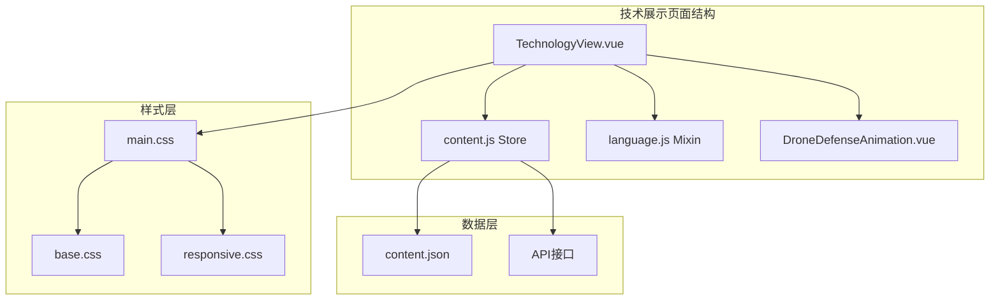
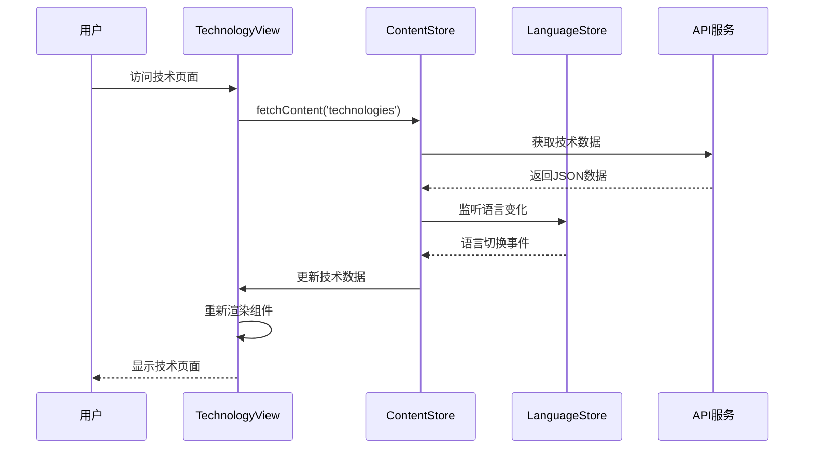
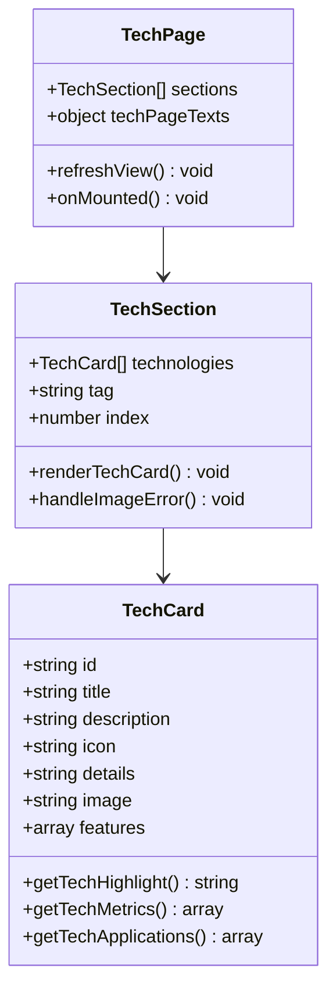
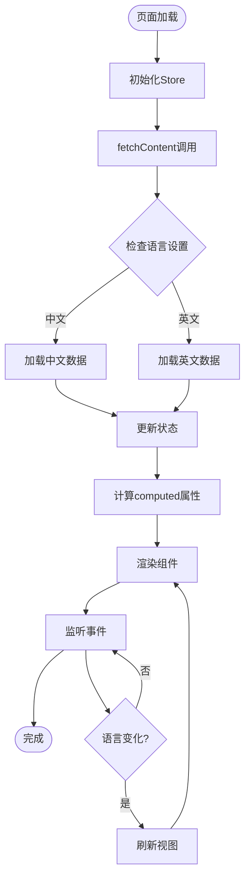

# 技术展示功能

<cite>
**本文档引用的文件**
- [TechnologyView.vue](file://src/views/TechnologyView.vue)
- [content.js](file://src/store/modules/content.js)
- [language.js](file://src/mixins/language.js)
- [language.js](file://src/store/modules/language.js)
- [DroneDefenseAnimation.vue](file://src/components/DroneDefenseAnimation.vue)
- [index.js](file://src/router/index.js)
- [index.js](file://src/api/index.js)
- [content.json](file://data/content.json)
- [main.css](file://src/assets/main.css)
</cite>

## 目录
1. [简介](#简介)
2. [项目结构](#项目结构)
3. [核心组件分析](#核心组件分析)
4. [架构概览](#架构概览)
5. [详细组件分析](#详细组件分析)
6. [数据流分析](#数据流分析)
7. [性能考虑](#性能考虑)
8. [故障排除指南](#故障排除指南)
9. [结论](#结论)

## 简介

TechnologyView是朗德智能无人机系统项目中的核心技术展示页面，专门用于呈现无人机系统的四大核心技术：探测、干扰、拦截和指挥控制。该页面采用现代化的Vue 3 Composition API架构，结合Pinia状态管理，实现了高度动态和响应式的用户体验。

页面不仅展示了技术细节，还通过丰富的视觉效果和交互设计，为用户提供了沉浸式的技术体验。从store中获取技术详情数据的流程、标签页切换机制以及动态组件渲染逻辑都经过精心设计，确保了良好的用户体验和可维护性。

## 项目结构



**图表来源**
- [TechnologyView.vue](file://src/views/TechnologyView.vue#L1-L50)
- [content.js](file://src/store/modules/content.js#L1-L50)

**章节来源**
- [TechnologyView.vue](file://src/views/TechnologyView.vue#L1-L100)
- [content.js](file://src/store/modules/content.js#L1-L100)

## 核心组件分析

### TechnologyView 组件架构

TechnologyView组件采用了模块化的架构设计，将不同的技术模块分离为独立的section，每个section代表一个核心技术领域：

```javascript
// 技术模块的组织结构
const technologies = reactive({
  zh: [
    {
      id: 'detection',
      title: '无人机探测系统',
      description: '多传感器融合的无人机探测系统，可实现全天候、全方位监控',
      icon: 'fas fa-shield-alt',
      details: '采用雷达、光电、无线电信号等多种探测手段相结合...',
      image: '/images/tech/detection.jpg'
    },
    // ... 其他技术模块
  ],
  en: [
    // 英文版本的技术模块
  ]
})
```

### 数据绑定机制

组件使用了Vue 3的computed属性和reactive状态管理，实现了数据的双向绑定和自动更新：

```javascript
// 动态计算当前语言的技术数据
const currentTechnologies = computed(() => {
  forceRender.value; // 添加依赖以便在语言切换时重新计算
  return contentStore.currentTechnologies
})
```

**章节来源**
- [TechnologyView.vue](file://src/views/TechnologyView.vue#L100-L200)
- [content.js](file://src/store/modules/content.js#L150-L250)

## 架构概览



**图表来源**
- [TechnologyView.vue](file://src/views/TechnologyView.vue#L400-L450)
- [content.js](file://src/store/modules/content.js#L500-L550)

## 详细组件分析

### 技术卡片组件

每个技术卡片都包含了完整的展示信息，包括技术亮点、功能特点、应用场景和技术指标：



**图表来源**
- [TechnologyView.vue](file://src/views/TechnologyView.vue#L200-L300)
- [content.js](file://src/store/modules/content.js#L180-L220)

### 标签页切换机制

页面通过computed属性和依赖注入实现了智能的标签页切换机制：

```javascript
// 技术标签生成器
const getTechTag = (index) => {
  const tagsZh = ['智能识别', '精准定位', '实时防护', '数据分析', '系统集成', '智能控制'];
  const tagsEn = ['Intelligent Recognition', 'Precise Positioning', 'Real-time Protection', 'Data Analysis', 'System Integration', 'Smart Control'];
  const tags = isZh.value ? tagsZh : tagsEn;
  return tags[index % tags.length];
}
```

### 动态组件渲染

组件使用v-for指令和条件渲染实现了动态内容的渲染：

```javascript
<div class="tech-section" v-for="(tech, index) in currentTechnologies" :key="tech.id">
  <div class="tech-content">
    <div class="tech-index">0{{ index + 1 }}</div>
    <div class="tech-badge">{{ getTechTag(index) }}</div>
    <h2>{{ tech.title }}</h2>
    <div class="tech-desc" v-html="tech.details"></div>
  </div>
  <div class="tech-image">
    
  </div>
</div>
```

**章节来源**
- [TechnologyView.vue](file://src/views/TechnologyView.vue#L25-L150)
- [content.js](file://src/store/modules/content.js#L180-L280)

### 图片错误处理机制

组件实现了智能的图片错误处理机制，确保即使某些图片加载失败，页面仍然能够正常显示：

```javascript
const handleImageError = (event) => {
  // 从当前元素的父级元素中找到技术ID
  const techElement = event.target.closest('.tech-section');
  if (techElement) {
    const index = Array.from(techElement.parentNode.children).indexOf(techElement);
    const tech = technologies.value[index];
    
    if (tech) {
      event.target.src = `/images/tech/${tech.id || 'detection'}.jpg`;
    } else {
      event.target.src = '/images/tech/detection.jpg';
    }
  } else {
    // 如果是产品图片，使用默认图片
    event.target.src = '/images/tech/detection.jpg';
  }
}
```

**章节来源**
- [TechnologyView.vue](file://src/views/TechnologyView.vue#L700-L750)

## 数据流分析

### 状态管理流程



**图表来源**
- [content.js](file://src/store/modules/content.js#L500-L600)
- [language.js](file://src/store/modules/language.js#L80-L150)

### 缓存策略分析

系统采用了多层次的缓存策略来优化性能：

1. **浏览器本地存储缓存**：语言设置和用户偏好存储在localStorage中
2. **Pinia Store缓存**：技术数据在store中保持缓存状态
3. **组件级缓存**：computed属性避免不必要的重复计算

```javascript
// 语言持久化存储
function persistLanguage(lang) {
  if (lang !== 'zh' && lang !== 'en') {
    return;
  }
  
  // 保存到localStorage
  localStorage.setItem('language', lang);
  
  // 同时保存到cookie，作为备份
  document.cookie = `language=${lang}; path=/; max-age=${60*60*24*30}`;
}
```

**章节来源**
- [language.js](file://src/store/modules/language.js#L20-L80)
- [content.js](file://src/store/modules/content.js#L500-L600)

## 性能考虑

### 渲染优化

1. **虚拟滚动**：对于大量技术卡片，可以考虑实现虚拟滚动
2. **懒加载**：图片资源采用懒加载策略
3. **组件拆分**：将大型组件拆分为更小的子组件

### 内存管理

组件在卸载时会清理所有事件监听器和动画：

```javascript
onBeforeUnmount(() => {
  // 清理动画和事件监听
  if (animationFrameId) {
    cancelAnimationFrame(animationFrameId);
  }
  
  window.removeEventListener('resize', onWindowResize);
  
  // 清理GSAP动画
  gsap.ticker.remove(trackDrone);
  if (radarAnimation) radarAnimation.kill();
  if (droneAnimation) droneAnimation.kill();
})
```

## 故障排除指南

### 常见问题及解决方案

#### 1. 技术数据不显示

**症状**：技术卡片空白或显示错误

**原因**：
- API请求失败
- 数据格式不正确
- 语言设置问题

**解决方案**：
```javascript
// 检查数据加载状态
console.log('当前技术数据:', contentStore.currentTechnologies);
console.log('加载状态:', contentStore.getLoadingState);

// 手动刷新数据
await contentStore.fetchContent('technologies');
```

#### 2. 图片加载错误

**症状**：技术图片显示为占位符

**原因**：
- 图片路径错误
- 服务器配置问题
- 网络连接问题

**解决方案**：
```javascript
// 检查图片路径
console.log('图片路径:', tech.image);

// 手动设置默认图片
event.target.src = '/images/tech/default.jpg';
```

#### 3. 语言切换失效

**症状**：切换语言后页面不更新

**原因**：
- 依赖注入问题
- computed属性未正确更新
- 缓存问题

**解决方案**：
```javascript
// 强制刷新视图
const refreshView = () => {
  forceRender.value += 1;
  window.dispatchEvent(new Event('resize'));
}

// 在语言切换后调用
setTimeout(() => {
  refreshView();
}, 100);
```

**章节来源**
- [TechnologyView.vue](file://src/views/TechnologyView.vue#L700-L750)
- [content.js](file://src/store/modules/content.js#L500-L600)

## 结论

TechnologyView组件展现了现代前端开发的最佳实践，通过Vue 3的Composition API、Pinia状态管理和模块化的架构设计，实现了功能丰富且性能优异的技术展示页面。

该组件的主要优势包括：

1. **模块化设计**：清晰的组件结构便于维护和扩展
2. **国际化支持**：完善的多语言支持机制
3. **响应式设计**：适应不同设备和屏幕尺寸
4. **性能优化**：合理的缓存策略和渲染优化
5. **错误处理**：健壮的错误处理和恢复机制

对于开发者而言，这个组件提供了很好的参考价值，特别是在状态管理、数据绑定和用户体验优化方面的实践经验。未来的改进方向可以考虑引入虚拟滚动、更精细的缓存控制和更强大的错误恢复机制。