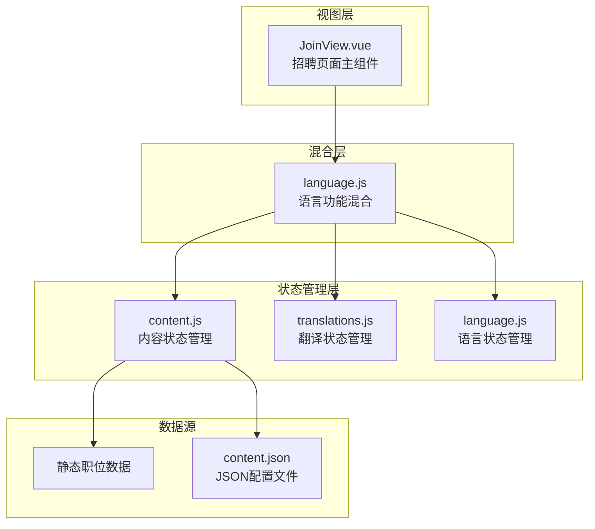
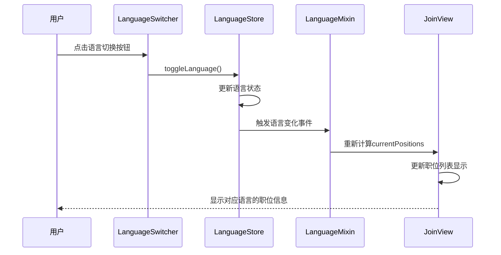
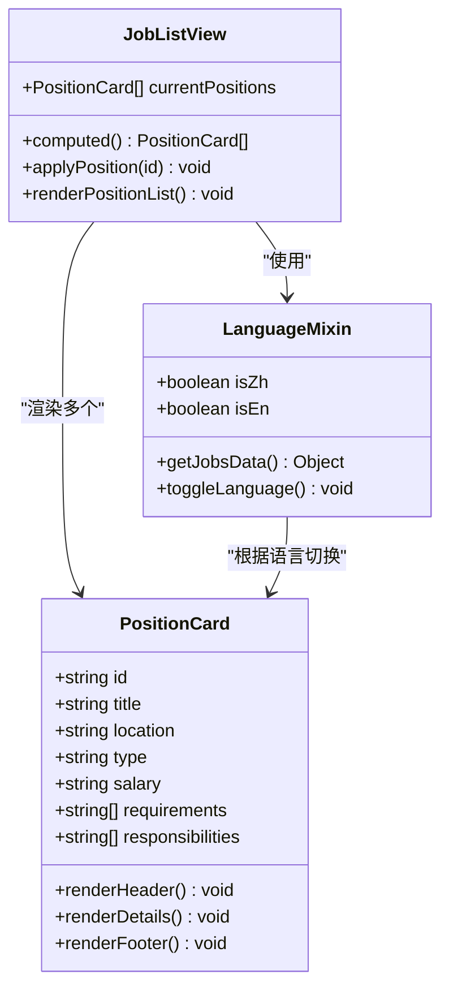
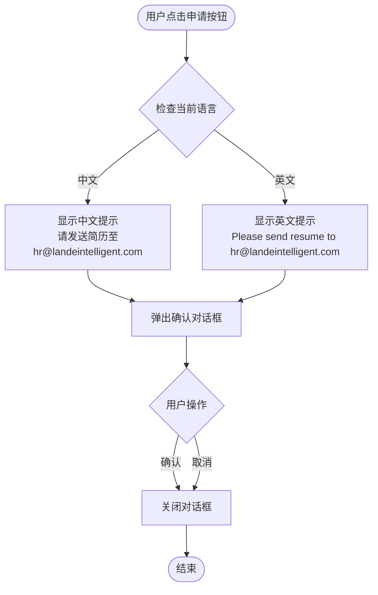

# 招聘信息功能

<cite>
**本文档中引用的文件**
- [JoinView.vue](file://src/views/JoinView.vue)
- [language.js](file://src/mixins/language.js)
- [content.js](file://src/store/modules/content.js)
- [translations.js](file://src/store/modules/translations.js)
- [LanguageSwitcher.vue](file://src/components/LanguageSwitcher.vue)
- [content.json](file://data/content.json)
</cite>

## 目录
1. [项目概述](#项目概述)
2. [招聘信息组件架构](#招聘信息组件架构)
3. [数据源分析](#数据源分析)
4. [多语言支持机制](#多语言支持机制)
5. [职位卡片展示](#职位卡片展示)
6. [交互功能分析](#交互功能分析)
7. [技术实现细节](#技术实现细节)
8. [性能考虑](#性能考虑)
9. [改进建议](#改进建议)
10. [总结](#总结)

## 项目概述

朗德智能科技有限公司的招聘信息功能是一个基于Vue 3和Pinia的状态管理系统的现代化招聘页面。该功能展示了公司当前的招聘职位信息，包括职位详情、工作要求和申请流程，支持中英文双语切换，为求职者提供清晰的职位信息和便捷的申请渠道。

## 招聘信息组件架构



**图表来源**
- [JoinView.vue](file://src/views/JoinView.vue#L1-L308)
- [language.js](file://src/mixins/language.js#L1-L127)

**章节来源**
- [JoinView.vue](file://src/views/JoinView.vue#L1-L308)
- [language.js](file://src/mixins/language.js#L1-L127)

## 数据源分析

### 静态职位数据结构

招聘信息功能采用了双重数据源策略，既支持静态定义的职位数据，也支持从外部数据源获取动态内容。

```javascript
// 中文职位数据示例
const zhPositions = [
  {
    id: 1,
    title: '人工智能算法工程师',
    location: '杭州',
    requirements: [
      '计算机科学、人工智能或相关专业硕士及以上学历',
      '熟悉机器学习、深度学习算法，有相关项目经验',
      '熟练掌握Python，熟悉常用的机器学习框架如TensorFlow、PyTorch等',
      '良好的算法设计和问题解决能力'
    ],
    responsibilities: [
      '负责公司AI产品的算法研发和优化',
      '参与解决方案的技术设计和实现',
      '跟踪和研究前沿AI技术，并应用到产品中'
    ]
  }
]
```

### 数据源对比分析

| 数据源类型 | 优势 | 劣势 | 适用场景 |
|-----------|------|------|----------|
| 静态数据 | 性能优异，加载速度快 | 缺乏灵活性，需要手动更新 | 基础职位信息展示 |
| 动态数据 | 灵活可变，支持实时更新 | 加载延迟，依赖后端服务 | 复杂职位管理系统 |

**章节来源**
- [JoinView.vue](file://src/views/JoinView.vue#L40-L100)
- [content.js](file://src/store/modules/content.js#L480-L520)

## 多语言支持机制

### 语言切换架构



**图表来源**
- [LanguageSwitcher.vue](file://src/components/LanguageSwitcher.vue#L42-L75)
- [language.js](file://src/mixins/language.js#L32-L66)

### 翻译数据结构

系统采用统一的翻译数据结构，确保招聘信息与其他页面内容保持一致的语言同步：

```javascript
// 招聘信息翻译数据
const jobsData = reactive({
  zh: {
    title: '加入我们',
    subtitle: '与行业精英一起，共创无人机技术的未来',
    description: '朗德智能致力于打造一个开放、创新、充满活力的工作环境...',
    positions: '当前职位',
    location: '工作地点',
    type: '工作类型',
    salary: '薪资范围',
    responsibilities: '工作职责',
    requirements: '任职要求',
    apply: '申请职位'
  },
  en: {
    title: 'Join Us',
    subtitle: 'Create the future of drone technology with industry elites',
    description: 'Lande Intelligent is committed to creating an open, innovative...',
    positions: 'Current Positions',
    location: 'Location',
    type: 'Job Type',
    salary: 'Salary Range',
    responsibilities: 'Responsibilities',
    requirements: 'Requirements',
    apply: 'Apply'
  }
})
```

**章节来源**
- [translations.js](file://src/store/modules/translations.js#L520-L560)
- [LanguageSwitcher.vue](file://src/components/LanguageSwitcher.vue#L1-L183)

## 职位卡片展示

### 职位卡片组件结构



**图表来源**
- [JoinView.vue](file://src/views/JoinView.vue#L15-L80)
- [language.js](file://src/mixins/language.js#L32-L66)

### 职位信息展示逻辑

职位卡片采用响应式网格布局，支持不同屏幕尺寸的自适应显示：

```javascript
// 响应式网格布局
.position-list {
  display: grid;
  grid-template-columns: repeat(auto-fill, minmax(350px, 1fr));
  gap: 30px;
}

// 针对移动设备的优化
@media (max-width: 768px) {
  .position-list {
    grid-template-columns: 1fr;
  }
}
```

### 职位卡片信息结构

每个职位卡片包含以下关键信息：

1. **基本信息**：职位名称、工作地点
2. **任职要求**：技能要求、教育背景
3. **工作职责**：主要工作任务
4. **申请按钮**：触发申请流程

**章节来源**
- [JoinView.vue](file://src/views/JoinView.vue#L15-L80)
- [JoinView.vue](file://src/views/JoinView.vue#L200-L250)

## 交互功能分析

### 申请流程实现



**图表来源**
- [JoinView.vue](file://src/views/JoinView.vue#L250-L270)

### 申请功能实现

申请功能通过简单的JavaScript弹窗实现，提供即时反馈：

```javascript
const applyPosition = (id) => {
  if (isZh.value) {
    alert('感谢您的申请，请将简历发送至hr@landeintelligent.com，并注明职位编号：' + id)
  } else {
    alert('Thank you for your application. Please send your resume to hr@landeintelligent.com, and specify position ID: ' + id)
  }
}
```

### 联系方式展示

除了申请按钮外，页面还提供了明确的联系方式：

```html
<div class="join-contact">
  <h2>{{ t('contact', '联系我们') }}</h2>
  <p v-if="isZh">如果您对我们的职位感兴趣，请将简历发送至：<a href="mailto:hr@landeintelligent.com">hr@landeintelligent.com</a></p>
  <p v-else>If you are interested in our positions, please send your resume to: <a href="mailto:hr@landeintelligent.com">hr@landeintelligent.com</a></p>
</div>
```

**章节来源**
- [JoinView.vue](file://src/views/JoinView.vue#L250-L270)
- [JoinView.vue](file://src/views/JoinView.vue#L80-L90)

## 技术实现细节

### Vue 3 Composition API 使用

招聘信息功能充分利用了Vue 3的新特性：

```javascript
// 使用Composition API
import { computed } from 'vue'
import { useLanguage } from '@/mixins/language'

// 获取语言相关功能
const { t, isZh, isEn, getJobsData } = useLanguage()

// 计算属性实现语言切换
const currentPositions = computed(() => {
  return isZh.value ? zhPositions : enPositions
})
```

### Pinia 状态管理

系统采用Pinia作为状态管理工具，实现了组件间的数据共享：

```javascript
// 内容状态管理
const currentJobs = computed(() => {
  if (!isInitialized.value) return null
  return languageStore.language === 'zh' ? jobs.zh : jobs.en
})

// 获取招聘信息数据
const getJobsData = () => translationsStore.getJobsData(currentLanguage.value)
```

### 响应式设计实现

```css
/* 响应式网格布局 */
.position-list {
  display: grid;
  grid-template-columns: repeat(auto-fill, minmax(350px, 1fr));
  gap: 30px;
}

/* 移动端适配 */
@media (max-width: 768px) {
  .position-list {
    grid-template-columns: 1fr;
  }
}
```

**章节来源**
- [JoinView.vue](file://src/views/JoinView.vue#L25-L35)
- [content.js](file://src/store/modules/content.js#L510-L520)

## 性能考虑

### 静态数据缓存策略

由于职位信息相对稳定，系统采用静态数据缓存策略：

- **内存缓存**：职位数据存储在组件内部，避免重复计算
- **计算属性优化**：使用Vue的计算属性实现按需更新
- **条件渲染**：仅在语言切换时重新计算职位列表

### 渲染性能优化

```javascript
// 使用v-for优化列表渲染
<div class="position-item" v-for="position in currentPositions" :key="position.id">
  <!-- 职位内容 -->
</div>

// 避免不必要的DOM操作
.position-item:hover {
  transform: translateY(-5px);
}
```

### 内存管理

- **组件卸载清理**：确保事件监听器在组件销毁时正确清理
- **引用管理**：合理管理组件间的引用关系，避免内存泄漏

## 改进建议

### 1. 在线简历上传功能

**技术路径建议**：
- 集成文件上传组件
- 实现简历格式验证
- 建立简历存储和管理机制
- 提供申请进度跟踪功能

**实现步骤**：
```javascript
// 示例：简历上传功能
const uploadResume = async (file) => {
  const formData = new FormData()
  formData.append('resume', file)
  
  try {
    const response = await axios.post('/api/upload-resume', formData, {
      headers: { 'Content-Type': 'multipart/form-data' }
    })
    return response.data
  } catch (error) {
    throw new Error('简历上传失败')
  }
}
```

### 2. CMS集成方案

**当前限制**：
- 静态数据管理缺乏灵活性
- 职位信息更新需要代码修改
- 缺乏版本控制和审核流程

**改进方向**：
- 集成Headless CMS系统
- 实现职位信息的可视化编辑
- 建立内容审核工作流
- 支持多级权限管理

### 3. 动态职位获取

**技术实现**：
```javascript
// 从API获取动态职位数据
const fetchJobsFromAPI = async () => {
  try {
    const response = await axios.get('/api/jobs')
    return response.data
  } catch (error) {
    console.error('获取职位数据失败:', error)
    return []
  }
}
```

### 4. 搜索和过滤功能

**功能扩展**：
- 职位搜索功能
- 地点过滤
- 工作类型筛选
- 薪资范围查询

### 5. 申请状态跟踪

**用户体验改进**：
- 申请进度可视化
- 自动回复确认邮件
- 申请历史记录
- 面试邀请通知

## 总结

朗德智能科技有限公司的招聘信息功能展现了现代Web应用的最佳实践，通过Vue 3的Composition API、Pinia状态管理和响应式设计，为用户提供了优秀的招聘体验。该功能具有以下特点：

1. **技术先进性**：采用最新的前端技术栈，确保应用的性能和可维护性
2. **用户体验优秀**：简洁直观的界面设计，支持多语言切换，提供清晰的职位信息
3. **扩展性强**：模块化设计便于功能扩展和维护
4. **响应式设计**：适配各种设备和屏幕尺寸

通过持续的功能改进和技术升级，该招聘信息功能将继续为公司的招聘工作提供强有力的支持，帮助吸引和选拔优秀的人才。