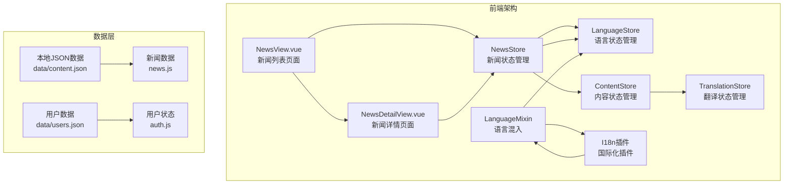
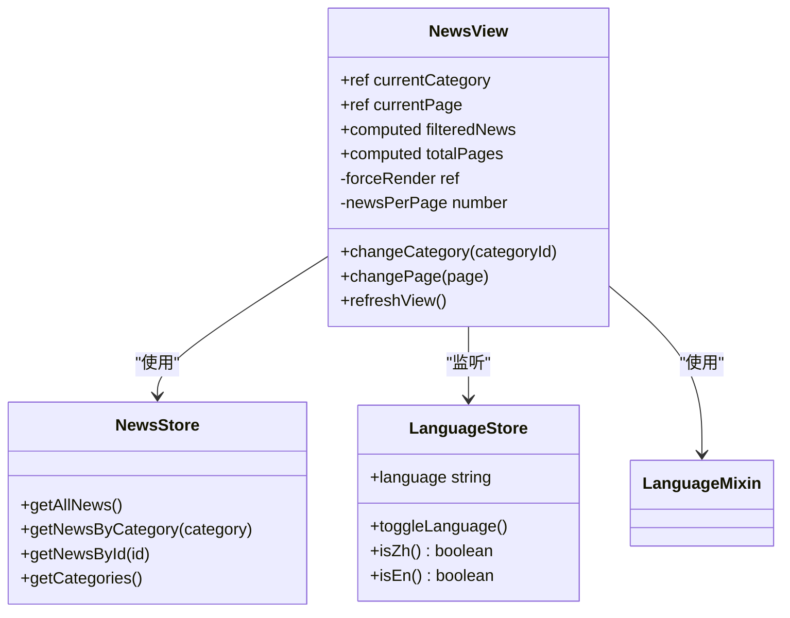
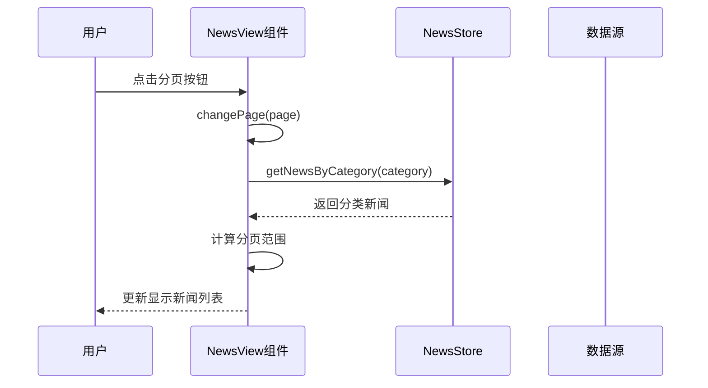
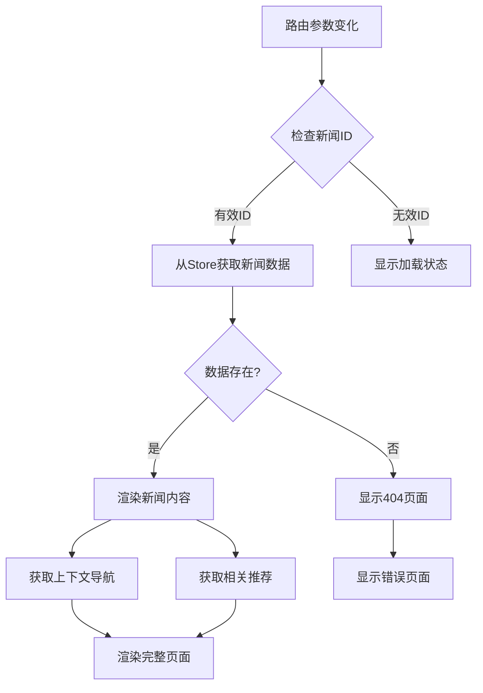
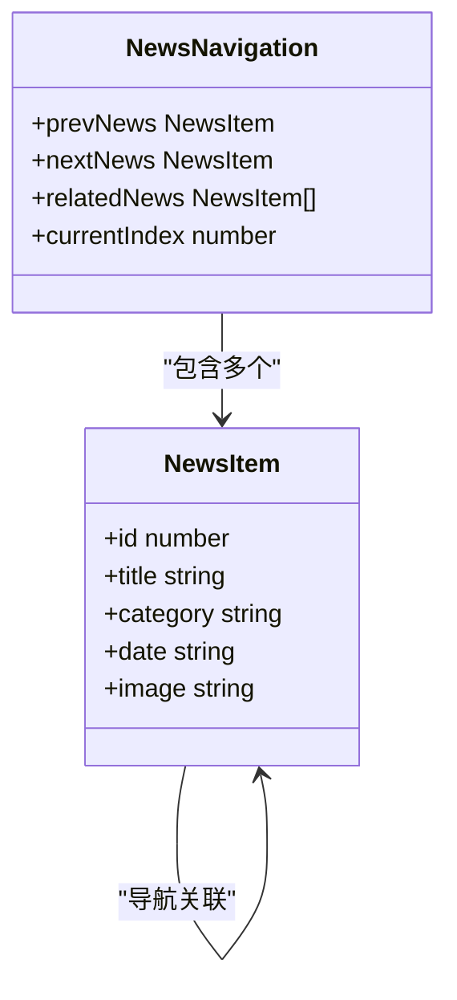
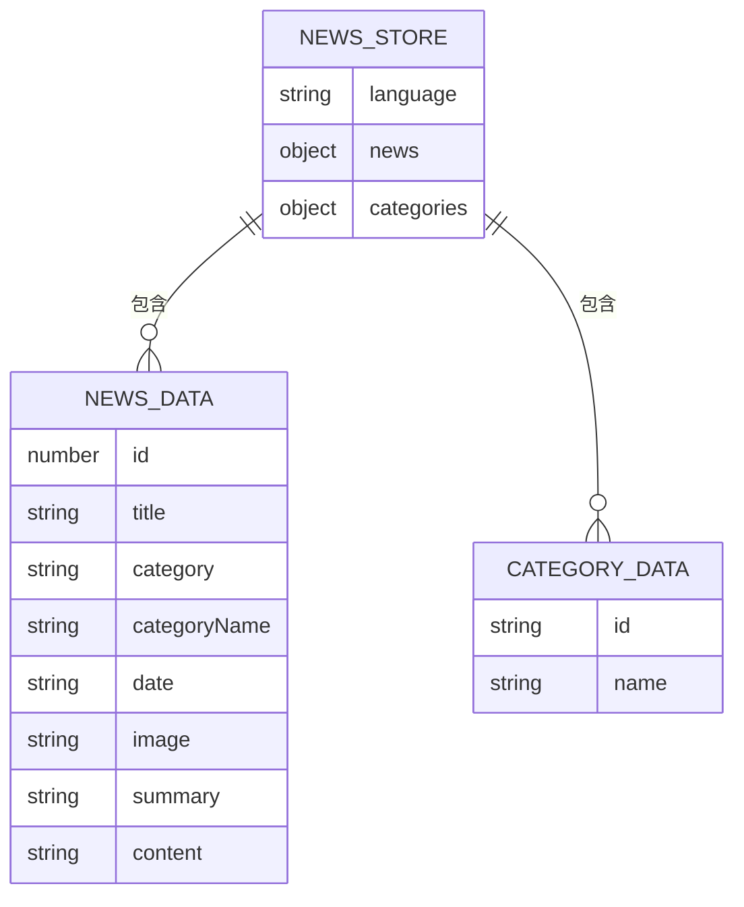
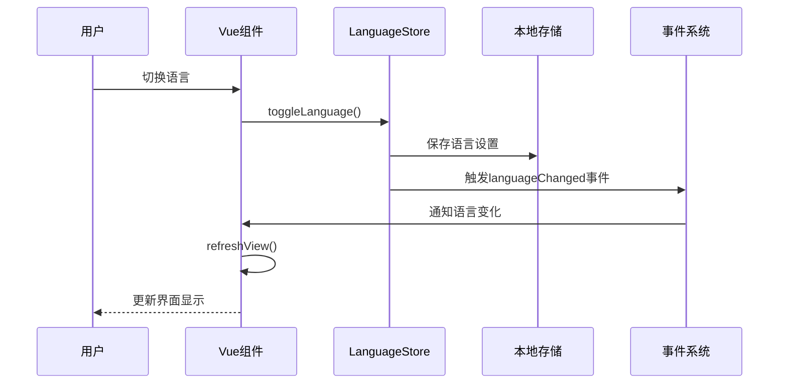
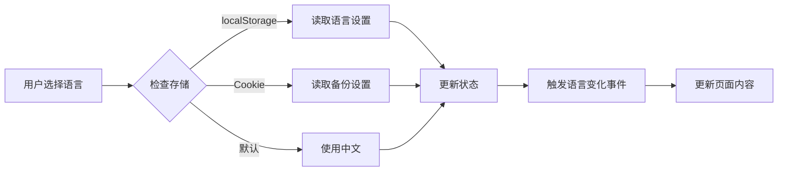

# 新闻资讯功能

<cite>
**本文档中引用的文件**
- [NewsView.vue](file://src/views/NewsView.vue)
- [NewsDetailView.vue](file://src/views/NewsDetailView.vue)
- [news.js](file://src/store/modules/news.js)
- [language.js](file://src/store/modules/language.js)
- [language.js](file://src/mixins/language.js)
- [i18n.js](file://src/plugins/i18n.js)
- [content.js](file://src/store/modules/content.js)
</cite>

## 目录
1. [简介](#简介)
2. [项目架构概览](#项目架构概览)
3. [NewsView组件分析](#newsview组件分析)
4. [NewsDetailView组件分析](#newsdetailview组件分析)
5. [状态管理设计](#状态管理设计)
6. [国际化与多语言支持](#国际化与多语言支持)
7. [数据渲染与安全处理](#数据渲染与安全处理)
8. [SEO优化与性能考虑](#seo优化与性能考虑)
9. [扩展功能建议](#扩展功能建议)
10. [总结](#总结)

## 简介

本文档详细阐述了基于Vue 3和Pinia的新闻资讯功能的前后端协作机制。该系统提供了完整的新闻浏览、详情查看和多语言支持功能，采用现代化的前端架构设计，实现了高效的数据管理和用户交互体验。

系统的核心特性包括：
- 分类化的新闻摘要列表展示
- 动态路由的新闻详情页面
- 中英文双语切换支持
- 响应式设计的移动端适配
- 基于Pinia的状态管理
- 安全的Markdown内容渲染
- SEO友好的页面结构

## 项目架构概览

新闻资讯功能的整体架构采用模块化设计，主要由以下核心组件构成：



**图表来源**
- [NewsView.vue](file://src/views/NewsView.vue#L1-L50)
- [NewsDetailView.vue](file://src/views/NewsDetailView.vue#L1-L50)
- [news.js](file://src/store/modules/news.js#L1-L30)

## NewsView组件分析

NewsView组件负责展示新闻摘要列表，提供了完整的分类浏览和分页功能。

### 组件结构与功能



**图表来源**
- [NewsView.vue](file://src/views/NewsView.vue#L50-L150)
- [news.js](file://src/store/modules/news.js#L80-L120)

### 时间排序与分类展示

NewsView组件实现了智能的时间排序和分类过滤机制：

```javascript
// 基于分类和分页筛选新闻
const filteredNews = computed(() => {
  const newsByCategory = newsStore.getNewsByCategory(currentCategory.value)
  const startIndex = (currentPage.value - 1) * newsPerPage
  const endIndex = startIndex + newsPerPage
  return newsByCategory.slice(startIndex, endIndex)
})
```

### 封面图适配与摘要截取

组件采用响应式设计，确保在不同设备上的最佳显示效果：

- **封面图适配**：支持自定义图片和默认占位图
- **摘要截取**：使用CSS的`-webkit-line-clamp`实现多行文本截断
- **响应式布局**：基于媒体查询的网格布局调整

### 分页机制设计



**图表来源**
- [NewsView.vue](file://src/views/NewsView.vue#L120-L180)

**章节来源**
- [NewsView.vue](file://src/views/NewsView.vue#L1-L200)
- [news.js](file://src/store/modules/news.js#L80-L120)

## NewsDetailView组件分析

NewsDetailView组件专门处理具体的新闻文章内容展示，支持动态路由和相关推荐功能。

### 动态路由与内容加载



**图表来源**
- [NewsDetailView.vue](file://src/views/NewsDetailView.vue#L80-L150)

### 中英文双语切换支持

组件通过监听语言变化事件实现无缝的语言切换：

```javascript
// 监听语言变化
watch(() => languageStore.language, () => {
  console.log('语言已切换，刷新新闻详情内容')
  setTimeout(() => {
    refreshView()
  }, 100)
}, { immediate: true })
```

### 上下文导航与相关推荐



**图表来源**
- [NewsDetailView.vue](file://src/views/NewsDetailView.vue#L140-L180)

**章节来源**
- [NewsDetailView.vue](file://src/views/NewsDetailView.vue#L1-L200)
- [NewsDetailView.vue](file://src/views/NewsDetailView.vue#L200-L300)

## 状态管理设计

系统采用Pinia进行状态管理，实现了高效的新闻数据缓存与更新策略。

### NewsStore状态结构



**图表来源**
- [news.js](file://src/store/modules/news.js#L10-L50)

### 数据缓存与更新策略

NewsStore实现了智能的数据缓存机制：

```javascript
// 缓存策略：基于语言的双重数据结构
state: () => ({
  language: computed(() => languageStore.language),
  news: {
    zh: [], // 中文新闻数据
    en: []  // 英文新闻数据
  },
  categories: {
    zh: [],
    en: []
  }
})
```

### 强制刷新机制

为了确保语言切换时的数据一致性，组件实现了强制刷新机制：

```javascript
// 强制刷新标记
const forceRender = ref(0)

// 依赖强制刷新标记的计算属性
const filteredNews = computed(() => {
  forceRender.value // 添加依赖
  return newsStore.getNewsByCategory(currentCategory.value)
})
```

**章节来源**
- [news.js](file://src/store/modules/news.js#L1-L141)
- [NewsView.vue](file://src/views/NewsView.vue#L200-L250)

## 国际化与多语言支持

系统提供了完整的国际化支持，包括语言切换、翻译管理和SEO优化。

### 语言状态管理



**图表来源**
- [language.js](file://src/store/modules/language.js#L50-L120)

### 翻译数据管理

系统采用多层次的翻译数据管理：

```javascript
// 多层次翻译获取
const getNewsPage = () => translationsStore.getNewsPage(languageStore.language)
const getNavItems = () => translationsStore.getNavItems(languageStore.language)
const getSiteInfo = () => translationsStore.getSiteInfo(languageStore.language)
```

### 本地存储与持久化



**图表来源**
- [language.js](file://src/store/modules/language.js#L10-L50)

**章节来源**
- [language.js](file://src/store/modules/language.js#L1-L100)
- [language.js](file://src/mixins/language.js#L1-L80)
- [i18n.js](file://src/plugins/i18n.js#L1-L50)

## 数据渲染与安全处理

系统对Markdown内容进行了安全处理，确保用户输入不会导致安全漏洞。

### Markdown内容渲染

NewsDetailView组件使用`v-html`指令渲染新闻内容：

```javascript
<div class="article-content" v-html="newsData.content"></div>
```

### 安全处理建议

虽然当前实现使用了`v-html`，但建议采用以下安全措施：

1. **内容清理**：使用DOMPurify等库清理HTML内容
2. **白名单过滤**：只允许特定的HTML标签和属性
3. **XSS防护**：防止跨站脚本攻击

```javascript
// 推荐的安全处理方式
import DOMPurify from 'dompurify'

const safeContent = computed(() => {
  return DOMPurify.sanitize(newsData.value?.content || '')
})
```

### 图片资源管理

系统实现了智能的图片资源处理：

```javascript

```

**章节来源**
- [NewsDetailView.vue](file://src/views/NewsDetailView.vue#L30-L80)

## SEO优化与性能考虑

### 预渲染与SSR支持

对于SEO优化，建议采用以下策略：

1. **预渲染配置**：使用Vite的预渲染功能
2. **SSR迁移**：考虑迁移到Nuxt.js或Next.js
3. **静态生成**：使用Vite的静态导出功能

### 静态生成场景下的数据注入

```javascript
// 静态生成时的数据注入示例
window.__INITIAL_STATE__ = {
  news: {
    zh: [...],
    en: [...]
  },
  language: 'zh'
}
```

### 性能优化建议

1. **懒加载**：对图片和非关键内容实施懒加载
2. **代码分割**：按需加载组件和路由
3. **缓存策略**：合理设置浏览器缓存头
4. **CDN加速**：使用CDN分发静态资源

## 扩展功能建议

### 评论功能扩展点

```javascript
// 评论功能的扩展点
const comments = computed(() => {
  return newsStore.getCommentsByNewsId(newsId.value)
})

const addComment = async (commentData) => {
  const result = await newsStore.addComment({
    newsId: newsId.value,
    ...commentData
  })
  if (result.success) {
    // 刷新评论列表
    refreshView()
  }
}
```

### 社交分享功能

```javascript
// 社交分享功能
const shareToWeChat = () => {
  // 实现微信分享逻辑
}

const shareToWeibo = () => {
  // 实现微博分享逻辑
}
```

### 搜索与过滤功能

```javascript
// 搜索功能扩展
const searchKeyword = ref('')
const filteredNews = computed(() => {
  if (!searchKeyword.value) return currentNewsData.value
  return currentNewsData.value.filter(item => 
    item.title.includes(searchKeyword.value) ||
    item.summary.includes(searchKeyword.value)
  )
})
```

## 总结

本文档详细分析了基于Vue 3和Pinia的新闻资讯功能的完整实现。系统展现了现代前端开发的最佳实践：

### 核心优势

1. **模块化架构**：清晰的组件分离和职责划分
2. **状态管理**：高效的Pinia状态管理模式
3. **国际化支持**：完整的多语言切换机制
4. **响应式设计**：适应多种设备的布局方案
5. **性能优化**：智能的缓存和刷新策略

### 技术亮点

- **动态路由**：支持新闻详情的动态URL生成
- **分类浏览**：灵活的新闻分类和筛选机制
- **分页处理**：高效的分页算法和用户体验
- **安全渲染**：Markdown内容的安全处理方案
- **SEO友好**：为搜索引擎优化的页面结构

### 发展方向

该系统为进一步的功能扩展奠定了坚实基础，可以轻松集成评论系统、搜索功能、社交分享等高级特性，满足不断增长的业务需求。