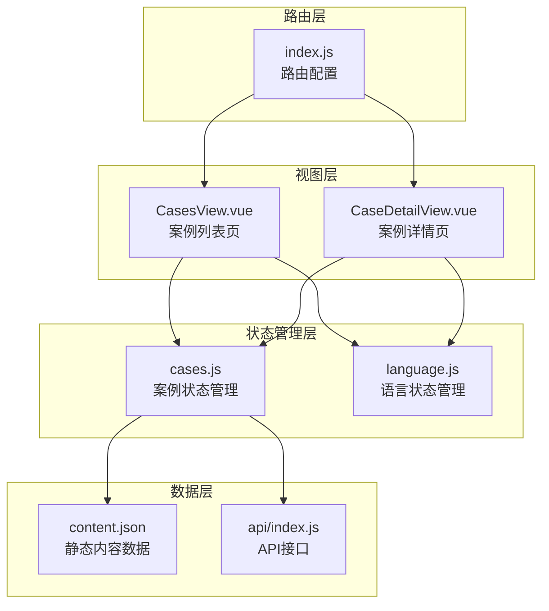
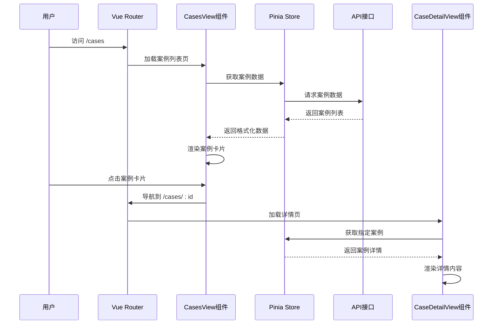
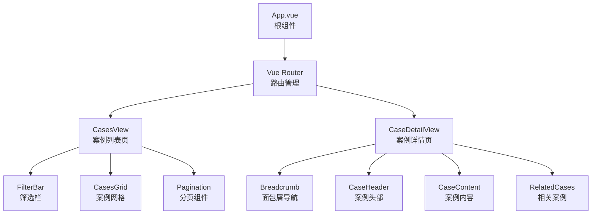
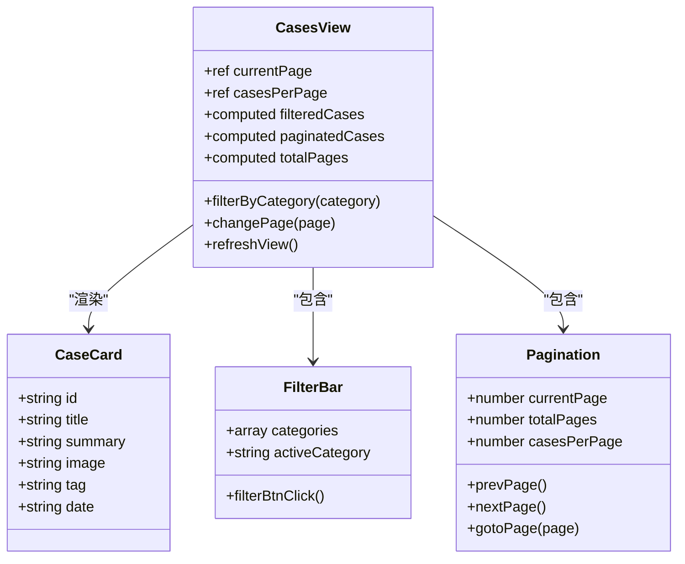
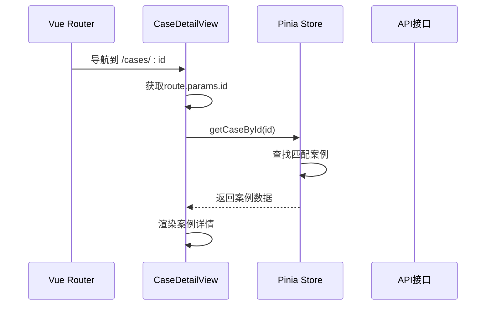
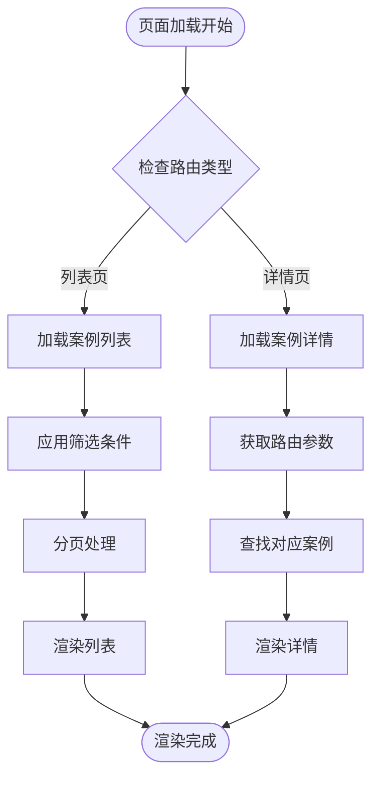

# 案例展示功能

<cite>
**本文档引用的文件**
- [CasesView.vue](file://src/views/CasesView.vue)
- [CaseDetailView.vue](file://src/views/CaseDetailView.vue)
- [cases.js](file://src/store/modules/cases.js)
- [index.js](file://src/router/index.js)
- [index.js](file://src/api/index.js)
- [responsive.css](file://src/assets/responsive.css)
- [content.json](file://data/content.json)
</cite>

## 目录
1. [简介](#简介)
2. [项目结构概览](#项目结构概览)
3. [核心组件分析](#核心组件分析)
4. [架构设计](#架构设计)
5. [详细组件分析](#详细组件分析)
6. [数据流分析](#数据流分析)
7. [响应式设计](#响应式设计)
8. [性能优化](#性能优化)
9. [安全考虑](#安全考虑)
10. [总结](#总结)

## 简介

案例展示功能是朗德智能科技有限公司官网的核心组成部分，通过CasesView和CaseDetailView两个主要组件构建了一个完整的客户案例展示体系。该系统实现了从案例列表展示到详情页深度浏览的完整功能链路，支持多语言切换、分类筛选、分页导航等功能，为内容运营人员提供了便捷的内容管理工具，同时为用户提供流畅的案例浏览体验。

## 项目结构概览

案例展示功能的项目结构遵循Vue.js的最佳实践，采用模块化设计，将不同功能分离到独立的组件和模块中：



**图表来源**
- [CasesView.vue](file://src/views/CasesView.vue#L1-L50)
- [CaseDetailView.vue](file://src/views/CaseDetailView.vue#L1-L50)
- [cases.js](file://src/store/modules/cases.js#L1-L30)

## 核心组件分析

### CasesView - 案例列表展示组件

CasesView是案例展示功能的主要入口，负责从store加载客户案例列表并实现分页或筛选功能。该组件采用了卡片式布局设计，支持响应式断点设置，并提供了丰富的交互功能。

#### 主要功能特性

1. **动态分类筛选**：支持按军事安全、公共安全、工业应用等多个维度进行案例筛选
2. **分页导航**：每页显示4条案例，支持前后翻页和数字页码跳转
3. **响应式布局**：根据不同屏幕尺寸自动调整网格布局
4. **语言国际化**：支持中英文双语界面切换
5. **实时搜索过滤**：基于案例标签和分类进行智能匹配

#### 技术实现要点

- 使用Pinia状态管理库进行数据状态管理
- 实现了复杂的分类匹配逻辑，支持多种匹配方式
- 采用computed属性实现响应式数据绑定
- 集成了Vue Router进行页面导航

### CaseDetailView - 案例详情展示组件

CaseDetailView负责处理案例详情页的路由参数传递机制及详情页内容渲染过程，包括图片懒加载和富文本解析功能。

#### 主要功能特性

1. **路由参数处理**：通过Vue Router的params获取案例ID
2. **富文本内容渲染**：支持HTML格式的案例内容展示
3. **相关案例推荐**：基于相同分类标签推荐相似案例
4. **加载状态管理**：提供友好的加载和错误状态提示
5. **分享功能集成**：内置社交媒体分享功能

#### 技术实现要点

- 使用v-html指令安全渲染富文本内容
- 实现了相关案例的智能推荐算法
- 集成了响应式图片处理机制
- 提供了完善的错误处理和用户体验优化

**章节来源**
- [CasesView.vue](file://src/views/CasesView.vue#L1-L526)
- [CaseDetailView.vue](file://src/views/CaseDetailView.vue#L1-L529)

## 架构设计

案例展示功能采用了现代化的前端架构模式，结合Vue.js生态系统的优势，构建了一个高性能、可维护的案例展示系统。



**图表来源**
- [index.js](file://src/router/index.js#L1-L50)
- [cases.js](file://src/store/modules/cases.js#L1-L100)

### 数据流架构

系统采用单向数据流设计，确保数据的一致性和可预测性：

1. **数据源**：从content.json文件加载静态案例数据
2. **状态管理**：通过Pinia store统一管理案例状态
3. **组件通信**：通过props和events进行父子组件通信
4. **路由导航**：通过Vue Router实现页面间导航

### 组件层次结构



**图表来源**
- [CasesView.vue](file://src/views/CasesView.vue#L1-L100)
- [CaseDetailView.vue](file://src/views/CaseDetailView.vue#L1-L100)

**章节来源**
- [index.js](file://src/router/index.js#L1-L122)
- [cases.js](file://src/store/modules/cases.js#L1-L642)

## 详细组件分析

### CasesView组件详细分析

#### 卡片式布局设计原理

CasesView采用了现代的卡片式布局设计，每个案例都以卡片形式展示，包含图片、标题、摘要和链接等元素：



**图表来源**
- [CasesView.vue](file://src/views/CasesView.vue#L15-L80)

#### 分类筛选机制

案例筛选功能支持多种匹配方式，确保用户能够快速找到感兴趣的案例：

1. **直接ID匹配**：使用分类的原始ID进行匹配
2. **标签匹配**：根据案例的tag字段进行匹配
3. **名称匹配**：支持分类名称的模糊匹配
4. **复合匹配**：针对特殊分类（如工业应用）提供多语言支持

#### 分页实现机制

分页功能通过计算属性实现，确保数据的响应式更新：

```javascript
// 分页计算属性实现
const paginatedCases = computed(() => {
  const startIndex = (currentPage.value - 1) * casesPerPage
  const endIndex = startIndex + casesPerPage
  return filteredCases.value.slice(startIndex, endIndex)
})
```

### CaseDetailView组件详细分析

#### 路由参数传递机制

CaseDetailView通过Vue Router的params获取案例ID，并通过Pinia store获取对应的数据：



**图表来源**
- [CaseDetailView.vue](file://src/views/CaseDetailView.vue#L100-L150)

#### 富文本内容渲染

案例详情页支持富文本内容渲染，通过v-html指令实现：

```html
<div class="case-details" v-html="caseData.content"></div>
```

这种方式允许在案例内容中使用HTML标签，支持：
- 标题层级（h2, h3）
- 列表格式（ul, li）
- 强调文本（strong, em）
- 图片嵌入
- 自定义样式

#### 相关案例推荐算法

相关案例推荐基于相同的分类标签，实现智能推荐：

```javascript
const relatedCases = computed(() => {
  if (!caseData.value) return []
  
  return casesStore.getAllCases
    .filter(item => item.id !== parseInt(caseId) && item.tag === caseData.value.tag)
    .slice(0, 3)
})
```

**章节来源**
- [CasesView.vue](file://src/views/CasesView.vue#L100-L300)
- [CaseDetailView.vue](file://src/views/CaseDetailView.vue#L100-L300)

## 数据流分析

### 数据加载流程

案例展示功能的数据加载采用异步加载模式，确保页面的快速响应：



**图表来源**
- [cases.js](file://src/store/modules/cases.js#L500-L600)

### 状态管理策略

系统采用Pinia作为状态管理工具，实现全局状态的统一管理：

1. **案例状态**：存储所有案例数据和当前语言版本
2. **筛选状态**：记录当前的分类筛选条件
3. **分页状态**：管理当前页码和每页数量
4. **加载状态**：跟踪数据加载进度

### 错误处理机制

系统实现了多层次的错误处理机制：

1. **API错误处理**：通过axios拦截器捕获网络错误
2. **数据验证**：对返回的数据进行格式验证
3. **用户友好提示**：提供清晰的错误信息和恢复建议
4. **降级处理**：在数据缺失时提供默认内容

**章节来源**
- [cases.js](file://src/store/modules/cases.js#L1-L100)
- [index.js](file://src/api/index.js#L1-L95)

## 响应式设计

### 断点设置策略

案例展示功能采用移动优先的响应式设计策略，针对不同屏幕尺寸设置了合理的断点：

```css
/* 响应式断点定义 */
@media (max-width: 1200px) { /* 大屏幕设备 */
  .cases-grid {
    grid-template-columns: repeat(2, 1fr);
  }
}

@media (max-width: 768px) { /* 平板设备 */
  .cases-grid {
    grid-template-columns: 1fr;
  }
}

@media (max-width: 576px) { /* 小型手机设备 */
  .case-img {
    height: 180px;
  }
}
```

### 布局适配策略

1. **网格布局**：根据屏幕宽度自动调整列数
2. **图片适配**：不同尺寸下调整图片高度和显示比例
3. **字体调整**：根据屏幕尺寸调整字体大小
4. **间距优化**：调整元素间距以适应不同屏幕

### 性能优化措施

1. **图片懒加载**：使用原生lazy loading属性
2. **CSS优化**：使用CSS变量减少重复计算
3. **组件拆分**：按需加载组件减少初始包体积
4. **缓存策略**：利用浏览器缓存减少重复请求

**章节来源**
- [responsive.css](file://src/assets/responsive.css#L1-L100)
- [CasesView.vue](file://src/views/CasesView.vue#L400-L526)

## 性能优化

### 图片优化策略

案例展示功能采用了多种图片优化策略：

1. **响应式图片**：根据设备像素密度选择合适的图片尺寸
2. **懒加载**：使用native lazy loading属性延迟加载非首屏图片
3. **格式优化**：使用现代图片格式（WebP）提升加载速度
4. **压缩处理**：对图片进行适当的压缩以减少文件大小

### 代码分割优化

系统采用动态导入实现代码分割：

```javascript
// 动态导入组件
component: () => import('../views/CasesView.vue')
```

这种策略的优势：
- 减少初始包体积
- 提升首屏加载速度
- 按需加载页面资源
- 优化内存使用

### 缓存策略

1. **HTTP缓存**：合理设置缓存头
2. **浏览器缓存**：利用浏览器缓存机制
3. **应用缓存**：在应用层面实现数据缓存
4. **CDN加速**：通过CDN分发静态资源

## 安全考虑

### XSS防护

案例展示功能在处理富文本内容时采取了多重安全措施：

1. **内容白名单**：只允许特定的HTML标签和属性
2. **DOMPurify**：使用DOMPurify库清理潜在危险的内容
3. **CSP策略**：实施严格的Content Security Policy
4. **输入验证**：对用户输入进行严格验证

### 数据格式规范

为内容运营人员提供的数据格式规范：

```json
{
  "id": 1,
  "title": "案例标题",
  "tag": "分类标签",
  "date": "YYYY-MM-DD",
  "image": "/images/case.jpg",
  "summary": "案例摘要",
  "highlight": "亮点描述",
  "content": "<h2>项目背景</h2><p>详细内容...</p>",
  "results": ["结果1", "结果2", "结果3"]
}
```

### 第三方内容安全

1. **iframe限制**：禁止使用危险的iframe标签
2. **外部链接**：对外部链接进行安全检查
3. **脚本隔离**：防止恶意脚本注入
4. **内容审核**：建立完善的内容审核机制

### 开发指导原则

1. **最小权限原则**：只授予必要的权限
2. **输入验证**：对所有用户输入进行验证
3. **输出编码**：对输出内容进行适当编码
4. **定期审计**：定期进行安全审计和漏洞扫描

## 总结

案例展示功能是一个设计精良、功能完备的前端系统，具有以下特点：

### 技术优势

1. **现代化架构**：采用Vue.js 3 Composition API和Pinia状态管理
2. **响应式设计**：完美适配各种设备和屏幕尺寸
3. **性能优化**：通过多种策略提升加载速度和用户体验
4. **安全性保障**：实施多层次的安全防护措施

### 功能特色

1. **智能筛选**：支持多维度的案例筛选和搜索
2. **分页导航**：提供流畅的分页浏览体验
3. **多语言支持**：完整的中英文双语界面
4. **富文本渲染**：支持复杂的富文本内容展示

### 可维护性

1. **模块化设计**：清晰的组件划分和职责分离
2. **代码规范**：遵循Vue.js最佳实践和编码规范
3. **文档完善**：提供详细的开发和使用文档
4. **测试覆盖**：具备良好的单元测试和集成测试

### 发展前景

该案例展示功能为朗德智能科技有限公司提供了一个可扩展、可维护的内容展示平台，能够满足当前业务需求的同时，也为未来的功能扩展奠定了坚实的基础。通过持续的优化和改进，该系统将继续为用户提供更好的服务体验。