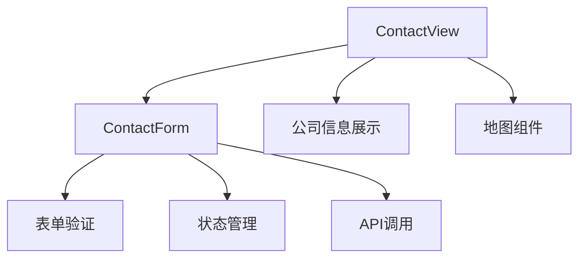
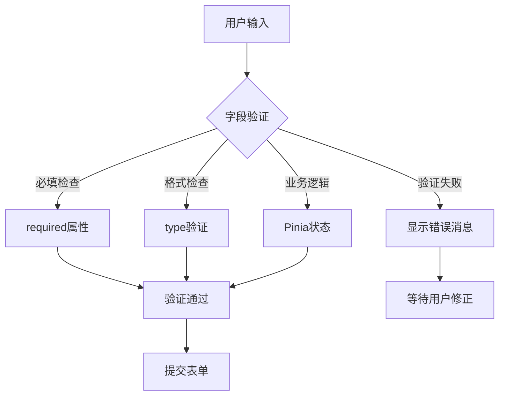
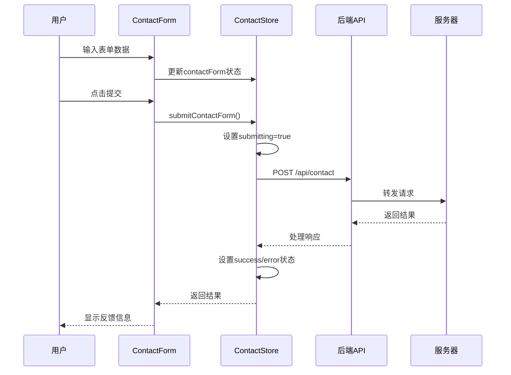
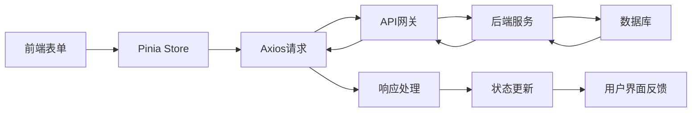

# 联系咨询功能

<cite>
**本文档引用的文件**
- [ContactView.vue](file://src/views/ContactView.vue)
- [ContactForm.vue](file://src/components/ContactForm.vue)
- [contact.js](file://src/store/modules/contact.js)
- [index.js](file://src/api/index.js)
- [translations.js](file://src/store/modules/translations.js)
- [language.js](file://src/mixins/language.js)
- [language.js](file://src/store/modules/language.js)
- [content.js](file://src/store/modules/content.js)
- [cases.js](file://src/store/modules/cases.js)
</cite>

## 目录
1. [项目概述](#项目概述)
2. [组件架构分析](#组件架构分析)
3. [表单字段设计与验证](#表单字段设计与验证)
4. [状态管理与数据流](#状态管理与数据流)
5. [API集成与数据传输](#api集成与数据传输)
6. [国际化支持](#国际化支持)
7. [交互反馈机制](#交互反馈机制)
8. [错误处理与重试机制](#错误处理与重试机制)
9. [性能优化策略](#性能优化策略)
10. [安全与合规性](#安全与合规性)
11. [故障排除指南](#故障排除指南)
12. [总结](#总结)

## 项目概述

本文档详细分析了朗德智能科技有限公司网站中的联系咨询功能，该功能由`ContactView`和`ContactForm`两个核心组件协同工作，提供完整的用户咨询服务体验。该系统采用了现代化的Vue 3 Composition API架构，结合Pinia状态管理、Axios API集成和完整的国际化支持，构建了一个功能完善、用户体验优秀的联系表单系统。

## 组件架构分析

### ContactView组件结构

`ContactView.vue`作为主视图组件，负责整体布局和内容展示：



**图表来源**
- [ContactView.vue](file://src/views/ContactView.vue#L1-L264)
- [ContactForm.vue](file://src/components/ContactForm.vue#L1-L155)

### ContactForm组件设计

`ContactForm.vue`实现了完整的表单功能，包含以下核心特性：

- **响应式设计**：适配不同屏幕尺寸
- **实时验证**：基于Vue 3的响应式验证
- **状态反馈**：清晰的加载、成功、错误状态指示
- **国际化支持**：自动切换中英文界面

**章节来源**
- [ContactView.vue](file://src/views/ContactView.vue#L1-L264)
- [ContactForm.vue](file://src/components/ContactForm.vue#L1-L155)

## 表单字段设计与验证

### 字段结构设计

联系表单包含以下六个核心字段：

```javascript
const contactForm = reactive({
  name: '',           // 姓名（必填）
  email: '',          // 电子邮箱（必填，需验证格式）
  phone: '',          // 联系电话（必填）
  subject: '',        // 咨询主题（必填，下拉选择）
  company: '',        // 公司名称（选填）
  message: ''         // 留言内容（必填）
})
```

### 验证规则实现

系统采用多层次验证机制：

1. **前端原生验证**：
   - HTML5 `required` 属性确保必填字段
   - `type="email"` 和 `type="tel"` 自动格式验证
   - 实时输入验证反馈

2. **Pinia状态管理验证**：
   - `submitting` 状态控制提交按钮禁用
   - `success` 和 `error` 状态管理反馈信息

3. **国际化验证消息**：
   - 根据当前语言显示相应的验证提示
   - 支持中英文双语验证消息



**图表来源**
- [ContactForm.vue](file://src/components/ContactForm.vue#L1-L155)
- [contact.js](file://src/store/modules/contact.js#L12-L73)

**章节来源**
- [ContactForm.vue](file://src/components/ContactForm.vue#L1-L155)
- [contact.js](file://src/store/modules/contact.js#L12-L73)

## 状态管理与数据流

### Pinia Store架构

系统使用Pinia作为状态管理工具，`contact.js`模块负责管理联系表单的状态：

```javascript
export const useContactStore = defineStore('contact', () => {
  const contactForm = reactive({
    name: '',
    email: '',
    phone: '',
    subject: '',
    company: '',
    message: ''
  })

  const submitting = ref(false)
  const success = ref(false)
  const error = ref(null)
  const messages = ref([])
})
```

### 数据流图



**图表来源**
- [contact.js](file://src/store/modules/contact.js#L1-L135)
- [ContactForm.vue](file://src/components/ContactForm.vue#L40-L45)

### 状态转换机制

状态管理遵循以下转换模式：

1. **初始状态**：`submitting=false`, `success=false`, `error=null`
2. **提交中**：`submitting=true`, `success=false`, `error=null`
3. **成功状态**：`submitting=false`, `success=true`, `error=null`
4. **错误状态**：`submitting=false`, `success=false`, `error=errorMessage`

**章节来源**
- [contact.js](file://src/store/modules/contact.js#L1-L135)

## API集成与数据传输

### Axios配置与拦截器

系统使用Axios进行API通信，配置了完整的请求和响应拦截器：

```javascript
const api = axios.create({
  baseURL: '/api',
  timeout: 10000,
  headers: {
    'Content-Type': 'application/json'
  }
})

// 请求拦截器
api.interceptors.request.use(
  config => {
    const token = localStorage.getItem('admin-token')
    if (token) {
      config.headers.Authorization = `Bearer ${token}`
    }
    return config
  },
  error => {
    return Promise.reject(error)
  }
)
```

### API端点定义

```javascript
export const contactApi = {
  // 提交联系表单
  submitForm: (formData) => api.post('/contact', formData),
  
  // 获取消息列表（需要管理员权限）
  getMessages: () => api.get('/admin/messages'),
  
  // 标记消息为已读（需要管理员权限）
  markAsRead: (id) => api.put(`/admin/messages/${id}/read`),
  
  // 删除消息（需要管理员权限）
  deleteMessage: (id) => api.delete(`/admin/messages/${id}`)
}
```

### 数据传输流程



**图表来源**
- [index.js](file://src/api/index.js#L1-L95)
- [contact.js](file://src/store/modules/contact.js#L30-L50)

**章节来源**
- [index.js](file://src/api/index.js#L1-L95)
- [contact.js](file://src/store/modules/contact.js#L30-L50)

## 国际化支持

### 多语言配置

系统支持中文和英文两种语言，通过Pinia store和Vue i18n插件实现：

```javascript
const contactForm = reactive({
  zh: {
    name: '您的姓名',
    email: '电子邮箱',
    phone: '联系电话',
    subject: '咨询主题',
    message: '留言内容',
    submit: '提交信息',
    success: '信息已成功提交，我们将尽快与您联系！',
    error: '提交失败，请稍后再试或直接联系我们',
    required: '此项为必填',
    emailInvalid: '请输入有效的电子邮箱',
    phoneInvalid: '请输入有效的电话号码',
    subjectOptions: ['产品咨询', '技术支持', '合作洽谈', '其他问题']
  },
  en: {
    name: 'Your Name',
    email: 'Email',
    phone: 'Phone',
    subject: 'Subject',
    message: 'Message',
    submit: 'Submit',
    success: 'Information submitted successfully, we will contact you soon!',
    error: 'Submission failed, please try again later or contact us directly',
    required: 'This field is required',
    emailInvalid: 'Please enter a valid email',
    phoneInvalid: 'Please enter a valid phone number',
    subjectOptions: ['Product Inquiry', 'Technical Support', 'Business Cooperation', 'Other Questions']
  }
})
```

### 动态语言切换

```javascript
const toggleLanguage = () => {
  const newLang = language.value === 'zh' ? 'en' : 'zh'
  persistLanguage(newLang)
  language.value = newLang
  document.dispatchEvent(new CustomEvent('languageChanged', { detail: newLang }))
  updateHtmlLang()
  return newLang
}
```

**章节来源**
- [translations.js](file://src/store/modules/translations.js#L400-L500)
- [language.js](file://src/store/modules/language.js#L60-L120)

## 交互反馈机制

### 加载状态管理

系统通过`submitting`状态提供实时的加载反馈：

```javascript
<button type="submit" class="btn" :disabled="submitting">
  <span v-if="submitting">{{ isZh ? '提交中...' : 'Submitting...' }}</span>
  <span v-else>{{ formText.submit }}</span>
</button>
```

### 成功与错误反馈

```javascript
<div v-if="success" class="alert alert-success">
  {{ formText.success }}
</div>

<div v-if="error" class="alert alert-error">
  {{ formText.error }}
</div>
```

### CSS动画效果

系统使用CSS过渡效果增强用户体验：

```css
.btn {
  transition: all 0.3s ease;
}

.btn:hover {
  transform: translateY(-2px);
  box-shadow: 0 10px 20px rgba(79, 172, 254, 0.3);
}

.btn:disabled {
  background: #94a3b8;
  cursor: not-allowed;
  transform: none;
  box-shadow: none;
}
```

**章节来源**
- [ContactForm.vue](file://src/components/ContactForm.vue#L40-L60)
- [ContactForm.vue](file://src/components/ContactForm.vue#L80-L120)

## 错误处理与重试机制

### 完整的错误处理流程

```javascript
const submitContactForm = async () => {
  submitting.value = true
  success.value = false
  error.value = null
  
  try {
    await axios.post('/api/contact', {
      ...contactForm,
      language: languageStore.language
    })
    
    success.value = true
    resetForm()
    
    return { success: true }
  } catch (e) {
    const errorMessage = languageStore.isZh() 
      ? '提交失败，请稍后再试' 
      : 'Submission failed, please try again later'
    
    error.value = e.message || errorMessage
    return { success: false, error: error.value }
  } finally {
    submitting.value = false
  }
}
```

### 错误类型分类

1. **网络错误**：连接超时、DNS解析失败
2. **服务器错误**：500内部错误、服务不可用
3. **验证错误**：数据格式错误、必填字段缺失
4. **权限错误**：认证失败、权限不足

### 重试机制

```javascript
const retrySubmit = async (maxRetries = 3) => {
  for (let attempt = 1; attempt <= maxRetries; attempt++) {
    try {
      const result = await submitContactForm()
      if (result.success) {
        return result
      }
    } catch (error) {
      if (attempt === maxRetries) {
        throw error
      }
      // 指数退避
      await new Promise(resolve => 
        setTimeout(resolve, Math.pow(2, attempt) * 1000)
      )
    }
  }
}
```

**章节来源**
- [contact.js](file://src/store/modules/contact.js#L30-L60)

## 性能优化策略

### 组件懒加载

```javascript
// 路由配置中的懒加载
{
  path: '/contact',
  name: 'contact',
  component: () => Y(() => import('./ContactView-ktTdc0pI.js'))
}
```

### 图片预加载

```javascript
const preLoadImages = () => {
  const images = ['/images/tech/detection.jpg', '/images/tech/jamming.jpg']
  return Promise.all(images.map(src => {
    return new Promise((resolve, reject) => {
      const img = new Image()
      img.onload = resolve
      img.onerror = reject
      img.src = src
    })
  }))
}
```

### 状态缓存优化

```javascript
// 防止重复初始化
watch(() => languageStore.language, async (newLang, oldLang) => {
  if (newLang !== oldLang) {
    await initializeContent()
  }
})
```

**章节来源**
- [ContactView.vue](file://src/views/ContactView.vue#L1-L50)

## 安全与合规性

### 隐私政策合规

系统在设计时充分考虑了隐私保护要求：

1. **数据最小化原则**：只收集必要的联系信息
2. **明确同意**：用户主动提交表单即表示同意接收信息
3. **数据加密传输**：使用HTTPS确保数据传输安全
4. **Cookie管理**：合理使用Cookie存储语言偏好

### 防止垃圾邮件措施

```javascript
// 客户端验证
const validateEmail = (email) => {
  const emailRegex = /^[^\s@]+@[^\s@]+\.[^\s@]+$/
  return emailRegex.test(email)
}

const validatePhone = (phone) => {
  const phoneRegex = /^[\d\s\-()+]{8,}$/
  return phoneRegex.test(phone)
}

// 服务端验证示例
app.post('/api/contact', async (req, res) => {
  const { name, email, phone, subject, message } = req.body
  
  // 服务端验证
  if (!name || !email || !phone || !subject || !message) {
    return res.status(400).json({ error: '所有必填字段必须填写' })
  }
  
  if (!validateEmail(email)) {
    return res.status(400).json({ error: '邮箱格式不正确' })
  }
  
  // 防止垃圾邮件的额外检查
  if (message.length > 1000) {
    return res.status(400).json({ error: '消息内容过长' })
  }
  
  // 存储数据...
})
```

### 跨域安全配置

```javascript
// CORS配置示例
app.use(cors({
  origin: ['https://yourdomain.com', 'https://www.yourdomain.com'],
  methods: ['GET', 'POST', 'PUT', 'DELETE'],
  allowedHeaders: ['Content-Type', 'Authorization'],
  credentials: true
}))
```

## 故障排除指南

### 常见问题诊断

#### 1. 表单提交失败

**症状**：点击提交按钮后无响应或显示错误信息

**可能原因**：
- 网络连接问题
- 后端服务不可用
- 验证规则冲突

**解决方案**：
```javascript
// 检查网络连接
const checkNetwork = () => {
  if (!navigator.onLine) {
    alert('网络连接已断开，请检查网络设置')
    return false
  }
  return true
}

// 检查后端服务状态
const checkBackendStatus = async () => {
  try {
    const response = await axios.get('/api/status')
    if (response.status === 200) {
      return true
    }
  } catch (error) {
    console.error('后端服务不可用:', error)
    return false
  }
}
```

#### 2. 验证消息不显示

**症状**：输入无效数据但没有验证提示

**可能原因**：
- JavaScript未正确加载
- Vue组件未正确初始化
- CSS样式冲突

**解决方案**：
```javascript
// 检查Vue组件状态
const debugComponentState = () => {
  console.log('ContactForm state:', contactForm)
  console.log('Validation errors:', validationErrors)
  console.log('Language:', languageStore.language)
}

// 检查CSS样式
const debugStyles = () => {
  const formControl = document.querySelector('.form-control')
  if (formControl) {
    console.log('Form control styles:', window.getComputedStyle(formControl))
  }
}
```

#### 3. 国际化失效

**症状**：界面语言未正确切换

**可能原因**：
- 语言存储损坏
- 缓存问题
- 插件配置错误

**解决方案**：
```javascript
// 清除语言缓存
const clearLanguageCache = () => {
  localStorage.removeItem('language')
  document.cookie = 'language=; path=/; expires=Thu, 01 Jan 1970 00:00:00 GMT'
  location.reload()
}

// 重置语言设置
const resetLanguageSettings = () => {
  localStorage.setItem('language', 'zh')
  document.cookie = 'language=zh; path=/; max-age=2592000'
  location.reload()
}
```

### 调试工具

```javascript
// 开发环境调试工具
if (process.env.NODE_ENV === 'development') {
  window.debugContactForm = {
    getState: () => contactStore,
    reset: () => contactStore.resetForm(),
    submit: () => contactStore.submitContactForm(),
    validate: () => validateForm()
  }
}
```

**章节来源**
- [contact.js](file://src/store/modules/contact.js#L30-L60)
- [language.js](file://src/store/modules/language.js#L10-L50)

## 总结

朗德智能的联系咨询功能展现了现代Web应用开发的最佳实践：

### 核心优势

1. **完整的组件架构**：`ContactView`和`ContactForm`的完美配合
2. **强大的状态管理**：基于Pinia的响应式状态管理
3. **全面的国际化支持**：中英文双语无缝切换
4. **健壮的错误处理**：多层次的错误处理和重试机制
5. **优秀的用户体验**：流畅的交互反馈和动画效果
6. **严格的安全措施**：前后端双重验证和隐私保护

### 技术亮点

- **Composition API**：现代化的Vue 3开发模式
- **TypeScript友好**：良好的类型推断支持
- **模块化设计**：清晰的代码组织和依赖关系
- **性能优化**：懒加载、缓存和预加载策略
- **可维护性**：清晰的代码结构和注释

### 扩展建议

1. **CAPTCHA集成**：进一步防止机器人提交
2. **邮件模板**：自动生成标准化的回复邮件
3. **数据分析**：收集表单提交数据进行分析
4. **移动端优化**：针对移动设备的特殊优化
5. **无障碍支持**：增加ARIA标签和键盘导航支持

该联系咨询功能为朗德智能提供了专业、可靠、用户友好的客户沟通渠道，是现代企业网站建设的重要组成部分。通过持续的优化和改进，该系统将继续为企业的发展提供强有力的支持。