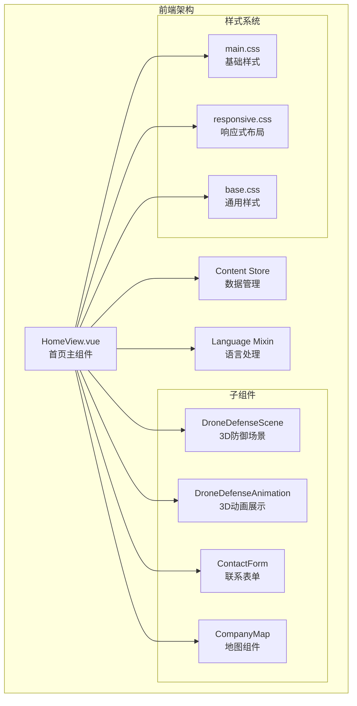
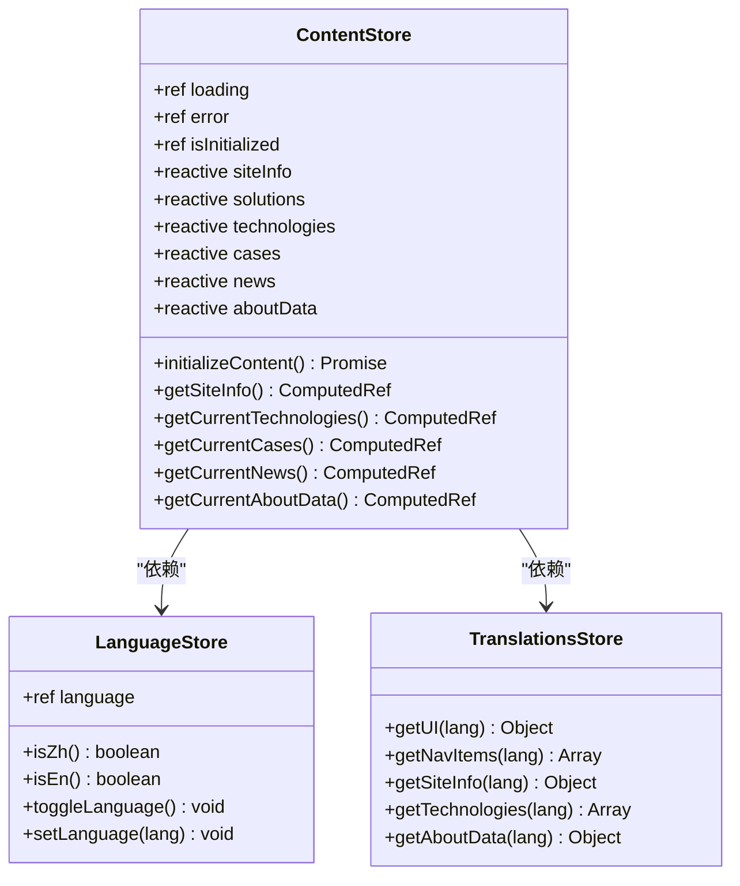
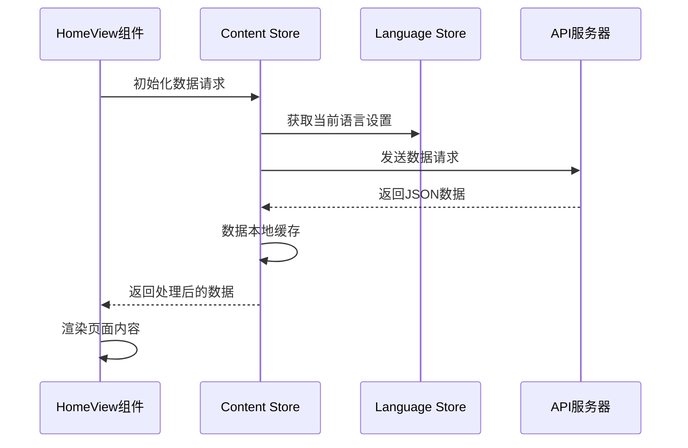
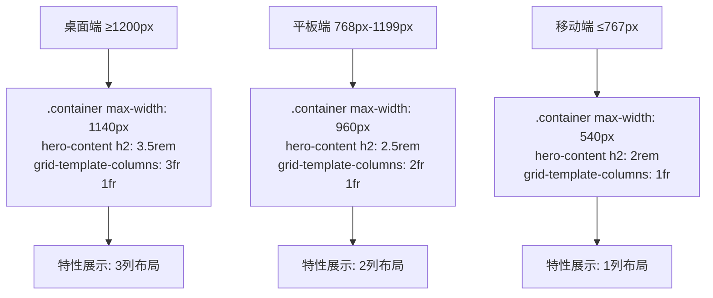
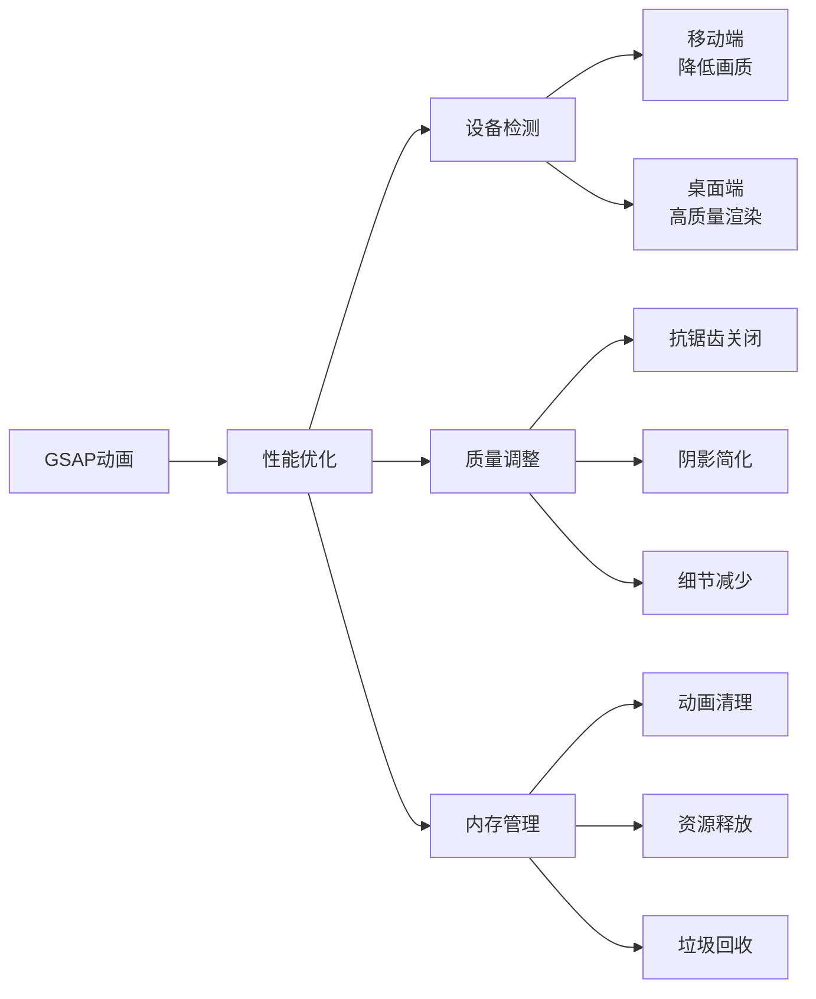

# 首页功能详细文档

<cite>
**本文档引用的文件**
- [HomeView.vue](file://src/views/HomeView.vue)
- [content.js](file://src/store/modules/content.js)
- [DroneDefenseAnimation.vue](file://src/components/DroneDefenseAnimation.vue)
- [DroneDefenseScene.vue](file://src/components/DroneDefenseScene.vue)
- [language.js](file://src/mixins/language.js)
- [responsive.css](file://src/assets/responsive.css)
- [main.css](file://src/assets/main.css)
</cite>

## 目录
1. [简介](#简介)
2. [项目架构概览](#项目架构概览)
3. [HomeView组件核心功能](#homeview组件核心功能)
4. [Pinia Store数据管理](#pinia-store数据管理)
5. [子组件集成分析](#子组件集成分析)
6. [响应式布局策略](#响应式布局策略)
7. [GSAP动画系统](#gsap动画系统)
8. [交互逻辑与用户体验](#交互逻辑与用户体验)
9. [性能优化建议](#性能优化建议)
10. [常见问题与解决方案](#常见问题与解决方案)
11. [总结](#总结)

## 简介

HomeView组件是整个网站的核心入口页面，负责整合展示公司的核心业务内容。该组件通过Pinia store中的content模块获取轮播图、解决方案摘要和技术亮点数据，与DroneDefenseAnimation和CompanyMap等子组件进行深度集成，为用户提供沉浸式的科技体验。

## 项目架构概览



**图表来源**
- [HomeView.vue](file://src/views/HomeView.vue#L1-L50)
- [content.js](file://src/store/modules/content.js#L1-L30)
- [language.js](file://src/mixins/language.js#L1-L20)

## HomeView组件核心功能

### 组件结构与模板分析

HomeView组件采用了模块化的布局设计，将页面划分为多个功能区块：

```javascript
// 主要功能区块划分
const heroSection = "主横幅区域"
const featuresSection = "安全防御特性展示"
const aboutSection = "关于我们"
const contactSection = "联系我们"
const technologySection = "反无人机系统"
const casesSection = "应用案例"
const newsSection = "新闻中心"
```

每个区块都使用了语义化的CSS类名，如`hero`, `defense-features`, `about`, `contact`等，确保代码的可读性和维护性。

### 数据获取与状态管理

组件通过Pinia store实现了统一的数据管理：

```javascript
// Pinia store引用
import { useContentStore } from '@/store/modules/content'
import { storeToRefs } from 'pinia'

// store状态解构
const contentStore = useContentStore()
const { siteInfo, technologies, cases, news, aboutData } = storeToRefs(contentStore)
```

这种设计模式确保了数据的一致性和组件间的松耦合。

**章节来源**
- [HomeView.vue](file://src/views/HomeView.vue#L1-L100)
- [content.js](file://src/store/modules/content.js#L1-L50)

## Pinia Store数据管理

### Store模块结构



**图表来源**
- [content.js](file://src/store/modules/content.js#L1-L100)
- [language.js](file://src/mixins/language.js#L10-L50)

### 数据流分析



**图表来源**
- [HomeView.vue](file://src/views/HomeView.vue#L150-L200)
- [content.js](file://src/store/modules/content.js#L20-L60)

**章节来源**
- [content.js](file://src/store/modules/content.js#L1-L200)
- [HomeView.vue](file://src/views/HomeView.vue#L100-L150)

## 子组件集成分析

### DroneDefenseAnimation组件集成

DroneDefenseAnimation组件是一个复杂的Three.js 3D动画组件，负责展示反无人机系统的动态演示：

```javascript
// 3D场景初始化
const initScene = () => {
  scene = new THREE.Scene();
  camera = new THREE.PerspectiveCamera(60, container.value.clientWidth / container.value.clientHeight, 0.1, 1000);
  renderer = new THREE.WebGLRenderer({ canvas: canvas.value, antialias: true, alpha: true });
  
  // 创建雷达、无人机、防御系统
  createRadarBase();
  createDrone();
  createDefenseSystem();
  
  // 启动动画循环
  startAnimations();
};
```

该组件使用GSAP进行动画控制，实现了复杂的物理模拟和视觉效果。

### DroneDefenseScene组件集成

DroneDefenseScene组件提供了静态的3D场景展示，作为页面的背景装饰：

```javascript
// 场景优化策略
const isMobile = computed(() => {
  return window.innerWidth <= 768;
});

// 性能优化
renderer.setPixelRatio(isMobile.value ? Math.min(window.devicePixelRatio, 2) : window.devicePixelRatio);
renderer.antialias = !isMobile.value;
```

**章节来源**
- [DroneDefenseAnimation.vue](file://src/components/DroneDefenseAnimation.vue#L1-L100)
- [DroneDefenseScene.vue](file://src/components/DroneDefenseScene.vue#L1-L100)

## 响应式布局策略

### 断点设计与适配



**图表来源**
- [responsive.css](file://src/assets/responsive.css#L1-L100)

### CSS类名系统

组件广泛使用了语义化的CSS类名：

- **Hero区域**: `hero`, `hero-content`, `hero-buttons`
- **网格布局**: `features-grid`, `solutions-grid`, `cases-grid`
- **卡片组件**: `feature-card`, `case-card`, `tech-item`
- **按钮样式**: `btn`, `btn-primary`, `btn-outline`

这些类名遵循BEM命名规范，确保样式的可维护性和一致性。

**章节来源**
- [responsive.css](file://src/assets/responsive.css#L1-L200)
- [HomeView.vue](file://src/views/HomeView.vue#L50-L150)

## GSAP动画系统

### 动画实现策略

GSAP在HomeView组件中扮演了重要角色，用于创建流畅的用户交互体验：

```javascript
// 雷达旋转动画
const radarAnimation = gsap.to(radar.rotation, {
  y: Math.PI * 2,
  duration: 5,
  repeat: -1,
  ease: "none"
});

// 无人机飞行路径动画
const droneTimeline = gsap.timeline({ repeat: -1, yoyo: true });
droneTimeline.to(drone.position, {
  x: 7, y: 4, z: -7,
  duration: 5,
  ease: "power1.inOut"
});
```

### 动画性能优化



**图表来源**
- [DroneDefenseAnimation.vue](file://src/components/DroneDefenseAnimation.vue#L200-L300)

**章节来源**
- [DroneDefenseAnimation.vue](file://src/components/DroneDefenseAnimation.vue#L1-L200)

## 交互逻辑与用户体验

### 悬停效果系统

组件实现了丰富的悬停效果，提升用户交互体验：

```javascript
// 技术卡片悬停效果
const handleTechHover = (event) => {
  const card = event.currentTarget;
  card.style.transform = 'translateY(-10px)';
  card.style.boxShadow = '0 20px 40px rgba(0, 0, 0, 0.2)';
};

// 案例卡片悬停效果
const handleCaseHover = (event) => {
  const card = event.currentTarget;
  const overlay = card.querySelector('.case-overlay');
  if (overlay) {
    overlay.style.opacity = '1';
  }
};
```

### 导航与路由集成

```javascript
// 路由跳转处理
const navigateToCase = (tag) => {
  router.push({
    path: '/cases',
    query: { category: tag }
  });
};

// 内部锚点导航
<RouterLink to="/technology" class="btn btn-primary">
  {{ isZh ? '无线技术核心驱动' : 'Anti-Drone Solutions' }}
  <span class="btn-arrow"><i class="fas fa-arrow-right"></i></span>
</RouterLink>
```

### 错误处理与加载状态

```javascript
// 加载状态管理
const isPageLoading = ref(true);
const loadError = ref(false);

// 错误恢复机制
const initPageData = () => {
  isPageLoading.value = true;
  loadError.value = false;
  // 重新初始化数据
};
```

**章节来源**
- [HomeView.vue](file://src/views/HomeView.vue#L200-L300)

## 性能优化建议

### 首屏加载性能提升

1. **代码分割与懒加载**
```javascript
// 使用Vue的异步组件
const ContactForm = defineAsyncComponent(() => import('@/components/ContactForm.vue'));
```

2. **图片资源优化**
```css
/* 使用WebP格式和响应式图片 */
img {
  width: 100%;
  height: auto;
  object-fit: cover;
}
```

3. **字体加载优化**
```css
/* 使用font-display swap */
@font-face {
  font-family: 'CustomFont';
  src: url('font.woff2') format('woff2');
  font-display: swap;
}
```

### 内存管理优化

```javascript
// 组件卸载时的资源清理
onBeforeUnmount(() => {
  // 清理动画
  gsap.ticker.remove(trackDrone);
  
  // 清理Three.js资源
  scene.traverse((object) => {
    if (object.geometry) object.geometry.dispose();
    if (object.material) object.material.dispose();
  });
  
  // 清理事件监听器
  window.removeEventListener('resize', onWindowResize);
});
```

### 缓存策略

```javascript
// 数据缓存机制
const cache = new Map();

const getCachedData = (key) => {
  if (cache.has(key)) {
    return cache.get(key);
  }
  
  const data = fetchDataFromAPI(key);
  cache.set(key, data);
  return data;
};
```

## 常见问题与解决方案

### 数据未加载时的空状态处理

```javascript
// 空状态检查
const displayedAboutData = computed(() => {
  const aboutDataFromStore = getCurrentAboutData.value;
  if (aboutDataFromStore && aboutDataFromStore.title) {
    return aboutDataFromStore;
  }
  return defaultAboutData.value; // 使用默认数据
});
```

### 图片加载错误处理

```javascript
// 图片错误处理
const handleImageError = (event) => {
  event.target.src = 'https://via.placeholder.com/800x450?text=图片加载失败';
};

// 地址图片错误处理
const handleAddressImageError = (event) => {
  event.target.src = '/images/company/company-location-placeholder.jpg.svg';
};
```

### 移动端性能问题

```javascript
// 移动端性能优化
const optimizeForMobile = () => {
  if (isMobile.value) {
    // 减少3D模型细节
    // 关闭抗锯齿
    // 降低动画帧率
  }
};
```

### 语言切换问题

```javascript
// 语言切换监听
watch(currentLanguage, () => {
  // 重新计算显示数据
  console.log('语言已变更:', currentLanguage.value);
});
```

**章节来源**
- [HomeView.vue](file://src/views/HomeView.vue#L300-L400)

## 总结

HomeView组件通过精心设计的架构和优化策略，成功实现了以下目标：

1. **数据整合**: 通过Pinia store实现了统一的数据管理和状态同步
2. **组件集成**: 与多个子组件无缝集成，提供丰富的交互体验
3. **响应式设计**: 实现了完整的响应式布局，适配各种设备
4. **性能优化**: 采用多种优化策略，确保良好的用户体验
5. **可维护性**: 代码结构清晰，便于后续扩展和维护

该组件为用户提供了现代化、科技感十足的首页体验，充分展示了公司的技术实力和专业形象。通过持续的优化和改进，可以进一步提升性能和用户体验。