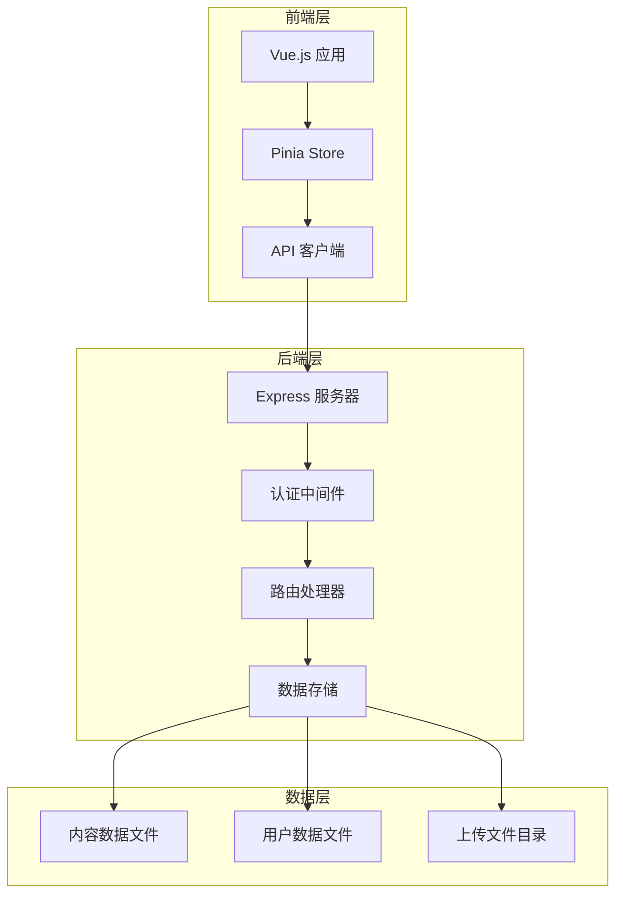
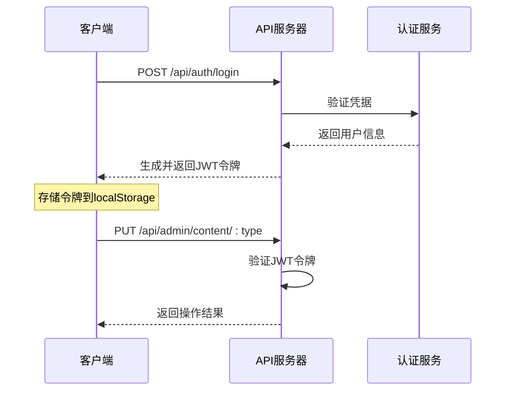
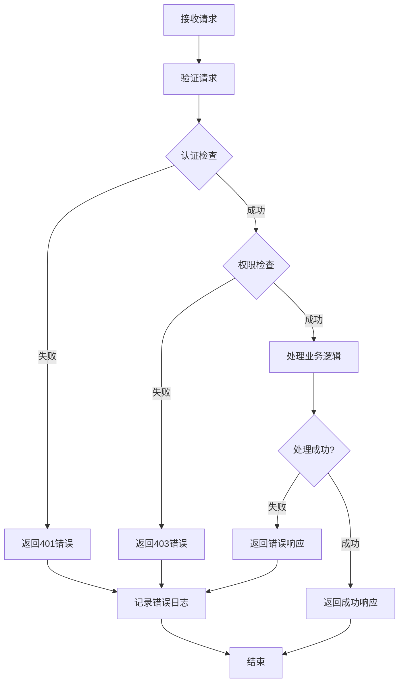
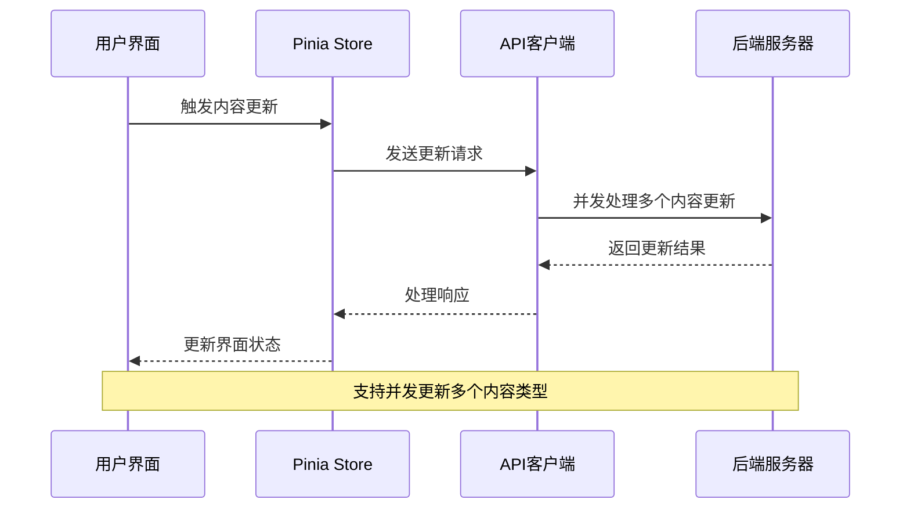

# 内容更新API

<cite>
**本文档引用的文件**
- [src/api/index.js](file://src/api/index.js)
- [src/store/modules/content.js](file://src/store/modules/content.js)
- [src/views/admin/ContentView.vue](file://src/views/admin/ContentView.vue)
- [server.cjs](file://server.cjs)
- [package.json](file://package.json)
</cite>

## 目录
1. [简介](#简介)
2. [项目架构概览](#项目架构概览)
3. [API设计概述](#api设计概述)
4. [RESTful接口规范](#restful接口规范)
5. [认证机制](#认证机制)
6. [使用示例](#使用示例)
7. [错误处理](#错误处理)
8. [性能考量](#性能考量)
9. [最佳实践](#最佳实践)
10. [与其他接口对比](#与其他接口对比)

## 简介

内容更新API是朗德智能科技有限公司网站管理系统的核心组件，专门用于管理网站的各种内容数据。该API采用RESTful设计原则，提供了完整的CRUD操作功能，支持多语言内容管理和媒体文件上传。

该API系统主要服务于管理后台，允许管理员对网站的基本信息、解决方案、核心技术、典型案例、新闻资讯、关于我们和招聘信息等内容进行动态更新。通过统一的接口设计，确保了内容管理的便捷性和安全性。

## 项目架构概览



**图表来源**
- [src/api/index.js](file://src/api/index.js#L1-L95)
- [src/store/modules/content.js](file://src/store/modules/content.js#L1-L648)
- [server.cjs](file://server.cjs#L1-L298)

**章节来源**
- [src/api/index.js](file://src/api/index.js#L1-L95)
- [src/store/modules/content.js](file://src/store/modules/content.js#L1-L648)
- [server.cjs](file://server.cjs#L1-L298)

## API设计概述

### 设计原则

内容更新API遵循以下核心设计原则：

1. **RESTful架构**：采用标准的HTTP方法和URL结构
2. **安全性**：严格的认证和授权机制
3. **一致性**：统一的响应格式和错误处理
4. **可扩展性**：支持多语言内容管理
5. **易用性**：简洁直观的接口设计

### 支持的内容类型

API支持以下内容类型的更新操作：

- **网站基本信息** (`site-info`)
- **解决方案** (`solutions`)
- **核心技术** (`technologies`)
- **典型案例** (`cases`)
- **新闻资讯** (`news`)
- **关于我们** (`about`)
- **招聘信息** (`jobs`)

### 技术栈

- **前端**：Vue.js 3 + Pinia + Axios
- **后端**：Node.js + Express
- **认证**：JWT (JSON Web Token)
- **文件上传**：Multer
- **数据存储**：本地JSON文件

**章节来源**
- [src/api/index.js](file://src/api/index.js#L35-L55)
- [src/store/modules/content.js](file://src/store/modules/content.js#L598-L647)

## RESTful接口规范

### 基础URL

```
/api
```

### 认证路由

| 方法 | URL | 描述 | 权限 |
|------|-----|------|------|
| POST | `/api/auth/login` | 用户登录 | 无 |
| POST | `/api/auth/validate` | 验证令牌 | 无 |
| GET | `/api/auth/me` | 获取当前用户信息 | 管理员 |

### 内容管理路由

| 方法 | URL | 描述 | 权限 |
|------|-----|------|------|
| PUT | `/api/admin/content/:type` | 更新指定类型的内容 | 管理员 |
| POST | `/api/admin/upload` | 上传图片文件 | 管理员 |

### 响应格式

#### 成功响应

```json
{
  "success": true,
  "message": "操作成功",
  "data": {}
}
```

#### 错误响应

```json
{
  "success": false,
  "message": "错误描述",
  "error": "错误详情"
}
```

**章节来源**
- [server.cjs](file://server.cjs#L150-L200)
- [src/api/index.js](file://src/api/index.js#L35-L55)

## 认证机制

### JWT认证流程



**图表来源**
- [server.cjs](file://server.cjs#L120-L140)
- [src/api/index.js](file://src/api/index.js#L10-L30)

### 认证中间件

API使用JWT作为认证机制，所有需要管理员权限的操作都需要有效的认证令牌：

1. **令牌生成**：登录成功后生成24小时有效期的JWT令牌
2. **令牌验证**：每个请求都必须包含Authorization头
3. **权限检查**：验证令牌有效性并检查用户角色
4. **自动登出**：401错误时自动清除本地存储的令牌

### 认证头格式

```http
Authorization: Bearer <JWT_TOKEN>
```

**章节来源**
- [server.cjs](file://server.cjs#L120-L140)
- [src/api/index.js](file://src/api/index.js#L10-L30)

## 使用示例

### 更新网站基本信息

#### 请求示例

```javascript
// JavaScript Axios 示例
const updateSiteInfo = async (siteData) => {
  try {
    const response = await axios.put('/api/admin/content/site-info', siteData, {
      headers: {
        'Authorization': 'Bearer ' + localStorage.getItem('admin-token')
      }
    });
    
    if (response.data.success) {
      console.log('网站信息更新成功');
    }
  } catch (error) {
    console.error('更新失败:', error.response.data.message);
  }
};

// 使用示例
const siteInfo = {
  companyName: '杭州朗德智能科技有限公司',
  slogan: '智能科技，创造可能',
  description: '用智能科技赋能产业升级，驱动未来创新',
  contactInfo: {
    address: '浙江省杭州市滨江区科技园区创新大厦A座15楼',
    phone: '0571-8888 9999',
    email: 'info@landeintelligent.com'
  }
};

updateSiteInfo(siteInfo);
```

#### 请求体格式

```json
{
  "companyName": "杭州朗德智能科技有限公司",
  "slogan": "智能科技，创造可能",
  "description": "用智能科技赋能产业升级，驱动未来创新",
  "contactInfo": {
    "address": "浙江省杭州市滨江区科技园区创新大厦A座15楼",
    "phone": "0571-8888 9999",
    "email": "info@landeintelligent.com"
  }
}
```

### 更新解决方案内容

#### 请求示例

```javascript
// 更新解决方案数组
const updateSolutions = async (solutionsArray) => {
  try {
    const response = await axios.put('/api/admin/content/solutions', solutionsArray, {
      headers: {
        'Authorization': 'Bearer ' + localStorage.getItem('admin-token')
      }
    });
    
    if (response.data.success) {
      console.log('解决方案更新成功');
    }
  } catch (error) {
    console.error('更新失败:', error.response.data.message);
  }
};
```

#### 请求体格式

```json
[
  {
    "id": "reconnaissance",
    "title": "侦察无人机",
    "description": "高续航、高稳定性的侦察无人机...",
    "image": "https://example.com/images/drone-recon.jpg",
    "details": "朗德侦察无人机采用碳纤维复合材料机身..."
  },
  {
    "id": "multipurpose",
    "title": "多用途无人机",
    "description": "模块化设计的多用途无人机...",
    "image": "https://example.com/images/drone-multi.jpg",
    "details": "朗德多用途无人机采用模块化设计理念..."
  }
]
```

### 上传图片文件

#### 请求示例

```javascript
// 图片上传示例
const uploadImage = async (file) => {
  const formData = new FormData();
  formData.append('image', file);
  
  try {
    const response = await axios.post('/api/admin/upload', formData, {
      headers: {
        'Authorization': 'Bearer ' + localStorage.getItem('admin-token'),
        'Content-Type': 'multipart/form-data'
      }
    });
    
    if (response.data.success) {
      console.log('图片上传成功:', response.data.url);
      return response.data.url;
    }
  } catch (error) {
    console.error('上传失败:', error.response.data.message);
  }
};
```

#### 响应格式

```json
{
  "success": true,
  "url": "/uploads/image-1234567890-abcd1234.jpg"
}
```

**章节来源**
- [src/api/index.js](file://src/api/index.js#L50-L55)
- [src/store/modules/content.js](file://src/store/modules/content.js#L598-L647)

## 错误处理

### 常见错误码

| 状态码 | 错误类型 | 描述 | 解决方案 |
|--------|----------|------|----------|
| 400 | Bad Request | 请求参数不正确 | 检查请求体格式和必需字段 |
| 401 | Unauthorized | 未提供有效令牌 | 重新登录获取新令牌 |
| 403 | Forbidden | 令牌无效或已过期 | 使用新的有效令牌 |
| 404 | Not Found | 内容类型不存在 | 确认内容类型是否正确 |
| 500 | Internal Server Error | 服务器内部错误 | 稍后重试或联系管理员 |

### 错误处理策略



**图表来源**
- [server.cjs](file://server.cjs#L120-L140)
- [src/api/index.js](file://src/api/index.js#L30-L50)

### 自动错误处理

前端API客户端实现了自动错误处理机制：

```javascript
// 响应拦截器自动处理401错误
api.interceptors.response.use(
  response => response,
  error => {
    if (error.response) {
      // 处理401错误（未授权）
      if (error.response.status === 401) {
        localStorage.removeItem('admin-token');
        localStorage.removeItem('admin-user');
        // 跳转到登录页面
        if (window.location.pathname.startsWith('/admin')) {
          window.location.href = '/admin/login';
        }
      }
    }
    return Promise.reject(error);
  }
);
```

**章节来源**
- [src/api/index.js](file://src/api/index.js#L30-L50)
- [server.cjs](file://server.cjs#L120-L140)

## 性能考量

### 响应时间优化

1. **缓存策略**：前端Store层实现数据缓存，减少重复API调用
2. **批量操作**：支持一次性更新多个内容类型
3. **异步处理**：文件上传采用异步处理，避免阻塞主线程
4. **连接池**：后端使用连接池管理数据库连接

### 并发处理



**图表来源**
- [src/store/modules/content.js](file://src/store/modules/content.js#L598-L647)
- [src/views/admin/ContentView.vue](file://src/views/admin/ContentView.vue#L165-L213)

### 数据存储优化

- **JSON文件存储**：使用本地JSON文件存储内容数据，适合中小型应用
- **增量更新**：只更新变更的内容部分，减少I/O操作
- **数据压缩**：对大型内容进行适当的压缩存储

**章节来源**
- [src/store/modules/content.js](file://src/store/modules/content.js#L598-L647)
- [server.cjs](file://server.cjs#L40-L80)

## 最佳实践

### 开发建议

1. **错误处理**：
   ```javascript
   // 好的做法：完善的错误处理
   const updateContent = async (contentType, data) => {
     try {
       const result = await contentStore.updateContent(contentType, data);
       if (result.success) {
         showNotification('更新成功！', 'success');
       } else {
         showNotification(`更新失败: ${result.error}`, 'error');
       }
     } catch (error) {
       showNotification(`更新失败: ${error.message}`, 'error');
     }
   };
   ```

2. **数据验证**：
   ```javascript
   // 在发送请求前验证数据完整性
   const validateSiteInfo = (data) => {
     return data &&
            typeof data.companyName === 'string' &&
            typeof data.slogan === 'string' &&
            data.contactInfo &&
            typeof data.contactInfo.phone === 'string';
   };
   ```

3. **用户体验**：
   ```javascript
   // 显示加载状态
   const updating = ref(false);
   
   const updateContent = async (contentType, data) => {
     updating.value = true;
     try {
       // 执行更新操作
     } finally {
       updating.value = false;
     }
   };
   ```

### 生产环境部署

1. **环境变量配置**：
   ```
   PORT=8080
   JWT_SECRET=your-production-secret-key
   ```

2. **安全配置**：
   - 设置合适的CORS策略
   - 启用HTTPS
   - 定期轮换JWT密钥

3. **监控和日志**：
   - 监控API响应时间
   - 记录错误日志
   - 设置告警机制

**章节来源**
- [src/views/admin/ContentView.vue](file://src/views/admin/ContentView.vue#L165-L213)
- [server.cjs](file://server.cjs#L10-L20)

## 与其他接口对比

### 内容管理API对比

| 功能特性 | 内容更新API | 其他内容接口 | 优势 |
|----------|-------------|--------------|------|
| 接口类型 | RESTful | GraphQL/传统REST | 更符合现代API设计 |
| 认证方式 | JWT | Session/Cookie | 更安全、无状态 |
| 响应格式 | 统一JSON | 多种格式 | 更一致 |
| 错误处理 | 标准化 | 分散处理 | 更可靠 |
| 文件上传 | 单文件 | 多文件 | 更灵活 |

### 与传统CMS对比

| 特性 | 传统CMS | 内容更新API | 优势 |
|------|---------|-------------|------|
| 开发难度 | 高 | 低 | 更易于维护 |
| 部署复杂度 | 复杂 | 简单 | 更容易部署 |
| 扩展性 | 有限 | 高 | 更容易扩展 |
| 性能 | 中等 | 优秀 | 更快的响应速度 |
| 安全性 | 一般 | 强 | 更好的安全控制 |

### 与第三方服务对比

| 服务 | 优势 | 劣势 | 适用场景 |
|------|------|------|----------|
| Firebase | 实时同步 | 成本高 | 小型项目 |
| Contentful | 云托管 | 依赖外部 | 快速原型 |
| 自建API | 完全控制 | 维护成本 | 企业项目 |

**章节来源**
- [src/api/index.js](file://src/api/index.js#L1-L95)
- [server.cjs](file://server.cjs#L1-L298)

## 结论

内容更新API是一个设计完善、功能齐全的内容管理系统接口。它采用了现代化的架构设计，提供了安全、高效的API服务。通过合理的错误处理、性能优化和最佳实践指导，该API能够满足企业级内容管理的需求。

主要优势包括：
- **安全性**：完善的JWT认证机制
- **易用性**：RESTful设计和清晰的错误处理
- **性能**：优化的响应时间和并发处理能力
- **可维护性**：模块化设计和良好的代码组织

建议在实际使用中遵循本文档提供的最佳实践，确保系统的稳定性和安全性。