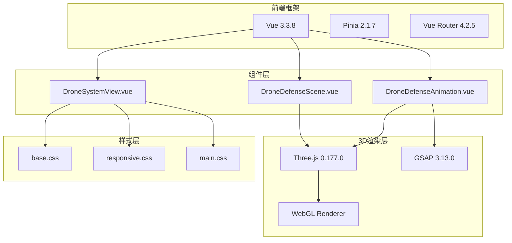
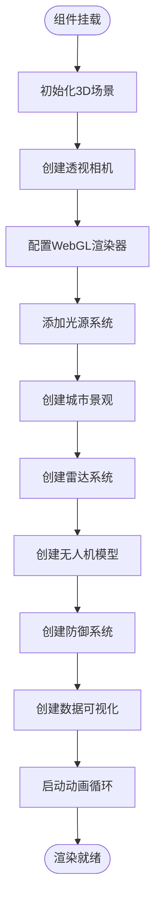
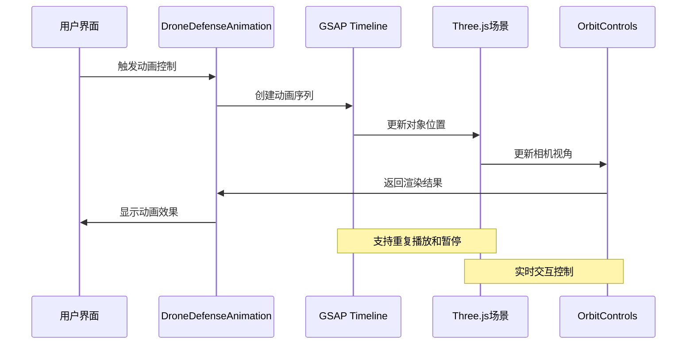
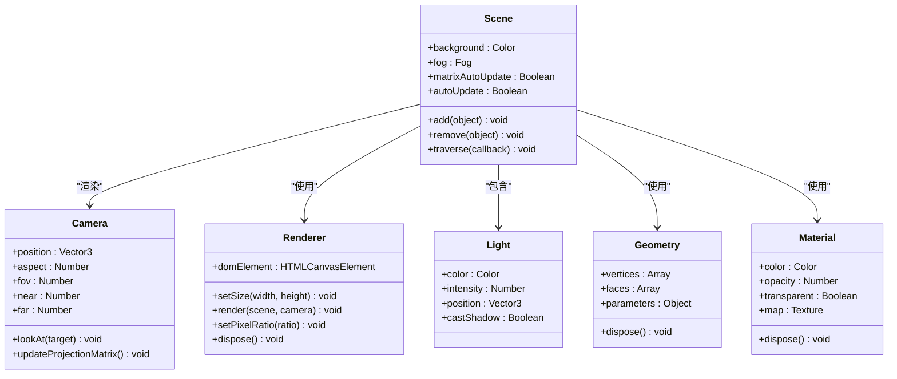
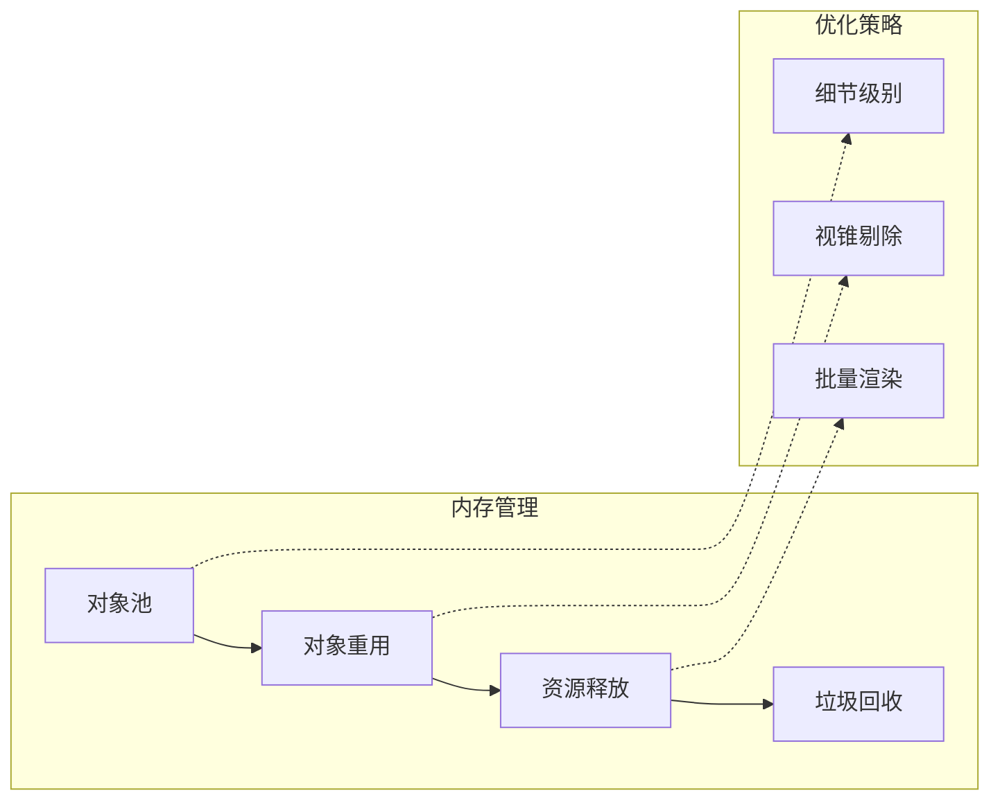
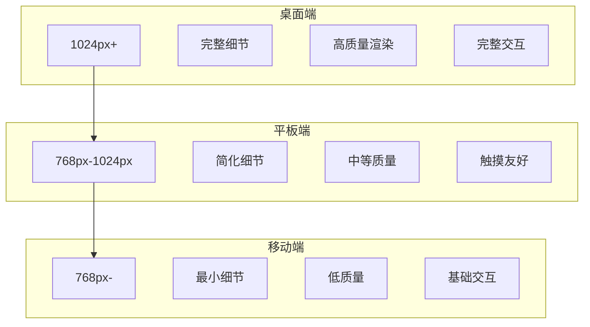
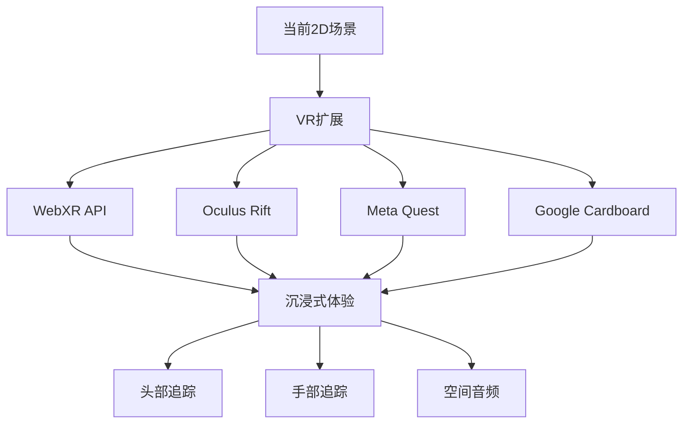

# 3D无人机防御系统可视化实现

<cite>
**本文档引用的文件**
- [DroneDefenseScene.vue](file://src/components/DroneDefenseScene.vue)
- [DroneDefenseAnimation.vue](file://src/components/DroneDefenseAnimation.vue)
- [DroneSystemView.vue](file://src/views/DroneSystemView.vue)
- [base.css](file://src/assets/base.css)
- [package.json](file://package.json)
</cite>

## 目录
1. [项目概述](#项目概述)
2. [技术架构](#技术架构)
3. [核心组件分析](#核心组件分析)
4. [Three.js场景构建](#threejs场景构建)
5. [动画系统实现](#动画系统实现)
6. [性能优化策略](#性能优化策略)
7. [响应式设计](#响应式设计)
8. [扩展与改进](#扩展与改进)
9. [总结](#总结)

## 项目概述

本项目是一个基于Vue 3和Three.js的3D无人机防御系统可视化演示，展示了智能反无人机系统的完整工作流程。系统包含三个主要组件：`DroneDefenseScene.vue`负责创建复杂的3D场景，`DroneDefenseAnimation.vue`实现动态动画效果，以及集成在`DroneSystemView.vue`中的整体展示页面。

该项目采用了现代化的前端技术栈，包括Vue 3 Composition API、Three.js 3D渲染引擎、GSAP动画库和响应式CSS设计，为用户提供沉浸式的3D交互体验。

## 技术架构



**图表来源**
- [package.json](file://package.json#L11-L23)
- [DroneDefenseScene.vue](file://src/components/DroneDefenseScene.vue#L1-L50)
- [DroneDefenseAnimation.vue](file://src/components/DroneDefenseAnimation.vue#L1-L50)

## 核心组件分析

### DroneDefenseScene.vue - 3D场景组件

该组件是整个3D可视化的核心，负责创建完整的无人机防御场景。它实现了以下关键功能：

#### 场景初始化流程



**图表来源**
- [DroneDefenseScene.vue](file://src/components/DroneDefenseScene.vue#L40-L120)

#### 关键特性

1. **多层次光源系统**：
   - 环境光（AmbientLight）提供基础照明
   - 方向光（DirectionalLight）模拟太阳光效果
   - 聚光灯（SpotLight）突出重要区域
   - 点光源（PointLight）增强局部细节

2. **动态城市景观**：
   - 支持移动端和桌面端的不同建筑物密度
   - 实现了窗户网格效果和动态光影
   - 使用网格辅助线增强空间感知

3. **智能性能适配**：
   - 根据设备类型自动调整渲染质量
   - 移动端减少几何体细分和阴影计算
   - 优化纹理分辨率和抗锯齿设置

**章节来源**
- [DroneDefenseScene.vue](file://src/components/DroneDefenseScene.vue#L40-L200)

### DroneDefenseAnimation.vue - 动画组件

该组件专注于动态效果和交互体验，使用GSAP库实现流畅的动画序列。

#### 动画系统架构



**图表来源**
- [DroneDefenseAnimation.vue](file://src/components/DroneDefenseAnimation.vue#L200-L350)

#### 动态效果实现

1. **无人机飞行轨迹**：
   - 使用GSAP timeline实现复杂的飞行路径
   - 支持循环播放和反向播放
   - 实现旋翼旋转动画

2. **雷达系统动画**：
   - 雷达盘体持续旋转
   - 检测半径动态扩展
   - 扫描光束效果

3. **防御系统交互**：
   - 自动追踪无人机目标
   - 发射拦截光束效果
   - 冲击波扩散动画

**章节来源**
- [DroneDefenseAnimation.vue](file://src/components/DroneDefenseAnimation.vue#L150-L400)

## Three.js场景构建

### 场景层次结构



**图表来源**
- [DroneDefenseScene.vue](file://src/components/DroneDefenseScene.vue#L40-L100)
- [DroneDefenseAnimation.vue](file://src/components/DroneDefenseAnimation.vue#L40-L80)

### 几何体与材质优化

#### 移动端性能优化

系统根据不同设备性能自动调整几何体复杂度：

```javascript
// 移动端减少建筑物数量
const buildingCount = isMobile.value ? 20 : 50;

// 移动端减少窗户数量
if (!isMobile.value) {
  // 添加窗户效果
  const windowMaterial = new THREE.MeshBasicMaterial({
    color: 0x38bdf8,
    transparent: true,
    opacity: 0.5 + Math.random() * 0.5
  });
}
```

#### 材质系统设计

1. **Phong材质**：用于金属表面反射效果
2. **Standard材质**：支持物理光照计算
3. **Basic材质**：用于透明效果和HUD元素
4. **Custom Shader**：自定义着色器实现特殊效果

**章节来源**
- [DroneDefenseScene.vue](file://src/components/DroneDefenseScene.vue#L100-L200)

## 动画系统实现

### GSAP动画序列

```mermaid
gantt
title 无人机防御系统动画时间线
dateFormat X
axisFormat %s
section 阶段一
无人机接近 :0, 5
旋翼旋转 :0, 5
section 阶段二
雷达检测 :5, 8
雷达波扩散 :5, 8
天线旋转 :5, 8
section 阶段三
防御激活 :8, 14
瞄准目标 :8, 14
激光发射 :9, 10
无人机坠落 :12, 14
```



**图表来源**
- [DroneDefenseScene.vue](file://src/components/DroneDefenseScene.vue#L400-L500)

### 动画状态管理

系统采用状态机模式管理动画阶段：

```javascript
const PHASE = {
  DRONE_APPROACH: 0,    // 无人机接近阶段
  RADAR_DETECT: 1,      // 雷达探测阶段
  DEFENSE_ACTIVATE: 2   // 防御激活阶段
};
```

每个阶段都有特定的动画序列和交互逻辑，通过时间计数器实现精确的状态转换。

**章节来源**
- [DroneDefenseScene.vue](file://src/components/DroneDefenseScene.vue#L35-L45)

## 性能优化策略

### 对象池管理



**图表来源**
- [DroneDefenseScene.vue](file://src/components/DroneDefenseScene.vue#L700-L782)

### 性能监控与优化

1. **帧率监控**：
   ```javascript
   const animate = () => {
     const delta = clock.getDelta();
     // 性能监控逻辑
     if (delta > 0.1) {
       console.warn('帧率过低:', 1/delta);
     }
     renderer.render(scene, camera);
     requestAnimationFrame(animate);
   };
   ```

2. **对象池实现**：
   - 无人机激光束对象池
   - 冲击波粒子对象池
   - 雷达波纹效果对象池

3. **LOD细节分级**：
   - 远程物体使用简化几何体
   - 近距离物体使用高精度模型
   - 根据距离动态切换细节级别

**章节来源**
- [DroneDefenseScene.vue](file://src/components/DroneDefenseScene.vue#L600-L700)

## 响应式设计

### 布局适配策略



**图表来源**
- [DroneDefenseScene.vue](file://src/components/DroneDefenseScene.vue#L50-L60)

### CSS样式适配

系统使用CSS Grid和Flexbox实现响应式布局：

```css
/* 移动端适配 */
@media (max-width: 768px) {
  .main-title h1 {
    font-size: 2.5rem;
  }
  
  .main-title p {
    font-size: 1.2rem;
  }
  
  .defense-animation-container {
    height: 300px;
  }
}
```

**章节来源**
- [DroneDefenseScene.vue](file://src/components/DroneDefenseScene.vue#L750-L782)

## 扩展与改进

### VR支持扩展



### 功能扩展建议

1. **VR/AR支持**：
   - 集成WebXR API
   - 实现头部追踪和手部交互
   - 添加空间音频效果

2. **多人协作**：
   - WebSocket实时同步
   - 多用户视角共享
   - 协同编辑功能

3. **高级AI功能**：
   - 机器学习目标识别
   - 自适应防御策略
   - 智能路径规划

4. **数据可视化**：
   - 实时数据仪表板
   - 历史数据分析
   - 性能指标统计

**章节来源**
- [DroneDefenseScene.vue](file://src/components/DroneDefenseScene.vue#L1-L50)

## 总结

本3D无人机防御系统可视化项目展示了现代Web 3D技术的强大能力。通过Vue 3的响应式架构、Three.js的高性能渲染引擎和GSAP的流畅动画系统，成功构建了一个既美观又实用的3D演示系统。

### 技术亮点

1. **模块化设计**：清晰的组件分离，便于维护和扩展
2. **性能优化**：针对不同设备的智能适配策略
3. **用户体验**：流畅的动画效果和直观的交互设计
4. **响应式布局**：跨设备的完美适配

### 应用价值

该系统不仅展示了无人机防御技术的视觉化表达，更为相关领域的技术演示、教育培训和产品展示提供了优秀的参考模板。其开源特性和完善的文档使其成为学习Web 3D开发的绝佳案例。

通过持续的技术迭代和功能扩展，这个项目有望发展成为一个更加完善和实用的3D可视化平台，为更多行业应用场景提供技术支持。