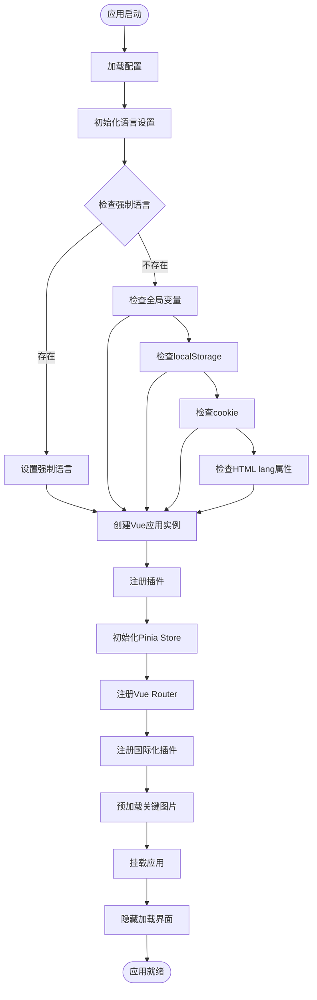
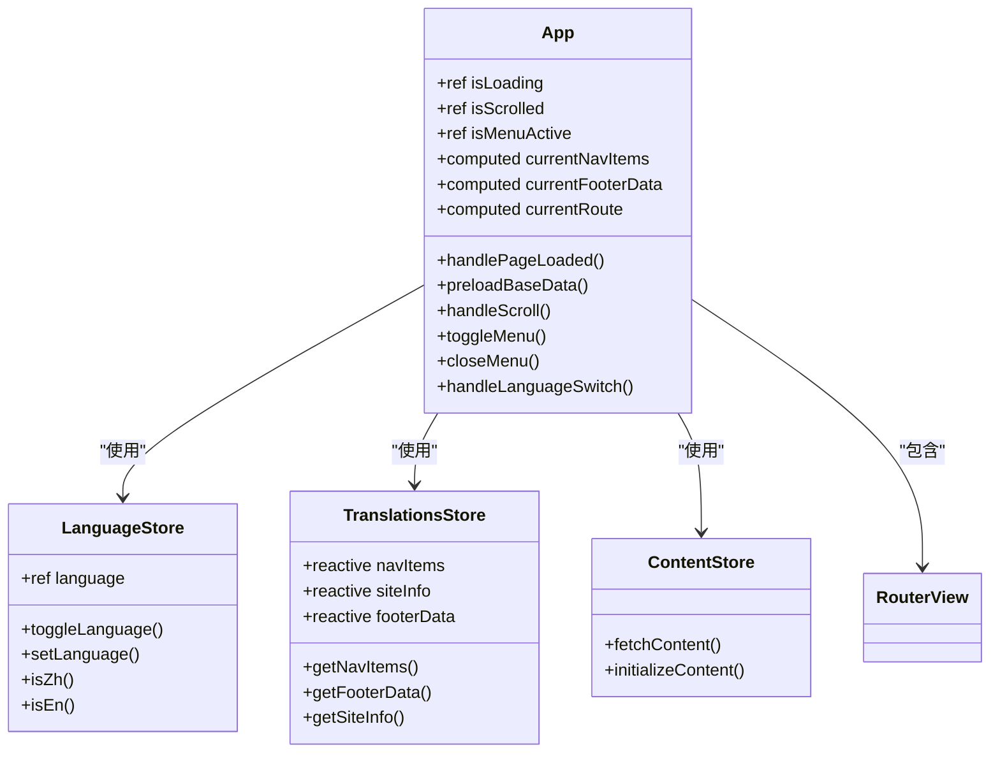
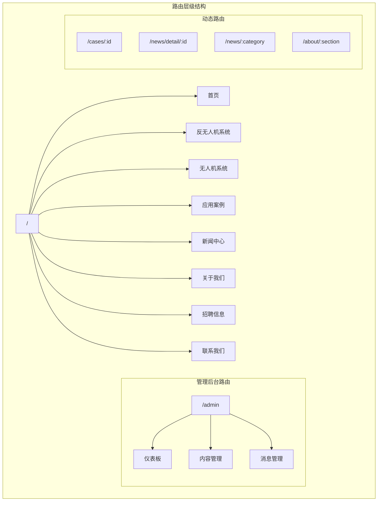
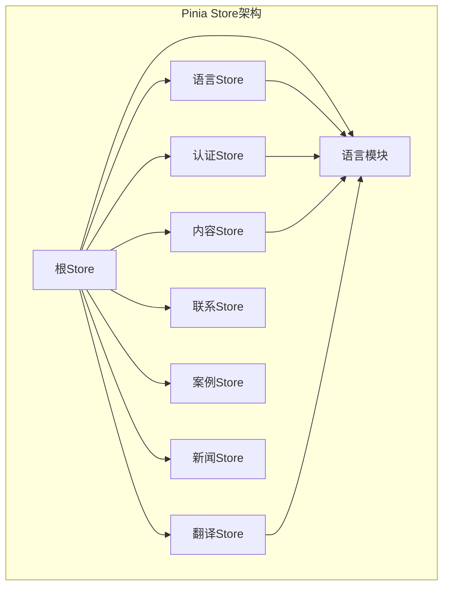
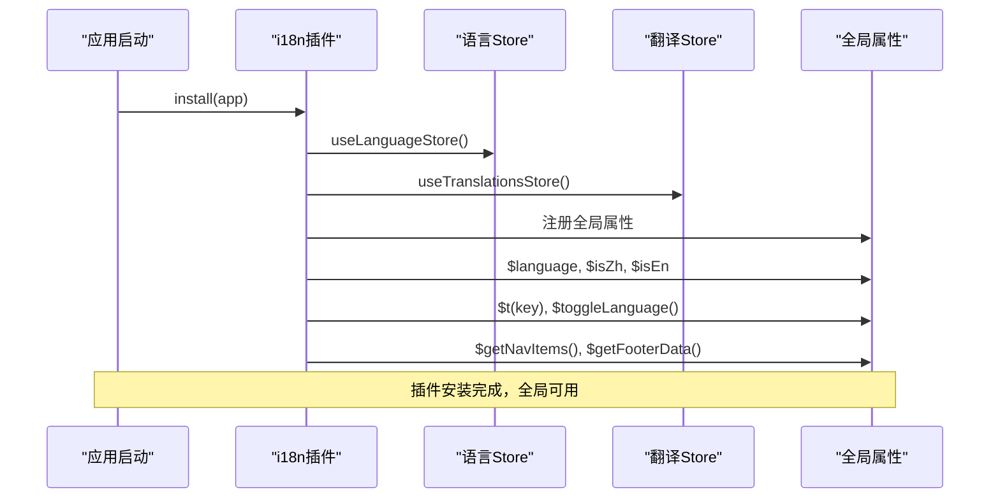
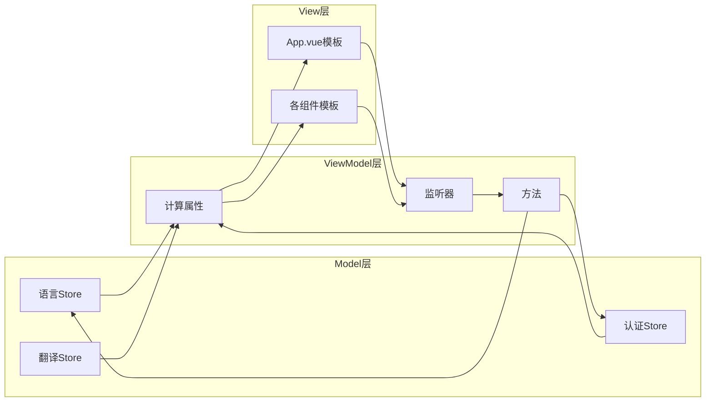

# 前端架构文档

<cite>
**本文档中引用的文件**
- [main.js](file://src/main.js)
- [App.vue](file://src/App.vue)
- [router/index.js](file://src/router/index.js)
- [store/index.js](file://src/store/index.js)
- [store/modules/language.js](file://src/store/modules/language.js)
- [store/modules/auth.js](file://src/store/modules/auth.js)
- [store/modules/translations.js](file://src/store/modules/translations.js)
- [plugins/i18n.js](file://src/plugins/i18n.js)
</cite>

## 目录
1. [项目概述](#项目概述)
2. [应用初始化流程](#应用初始化流程)
3. [核心架构组件](#核心架构组件)
4. [Vue Router配置与SPA导航](#vue-router配置与spa导航)
5. [Pinia状态管理架构](#pinia状态管理架构)
6. [国际化系统设计](#国际化系统设计)
7. [MVVM模式实现](#mvvm模式实现)
8. [性能优化策略](#性能优化策略)
9. [架构总结](#架构总结)

## 项目概述

该项目是一个现代化的单页应用(SPA)，专注于无人机和反无人机系统的展示与管理。应用采用Vue 3 Composition API、Vue Router进行路由管理、Pinia作为状态管理工具，并集成了完整的国际化(i18n)系统。

### 技术栈特点
- **Vue 3 Composition API**: 提供更灵活的状态管理和组件逻辑组织
- **TypeScript友好**: 支持类型安全的开发体验
- **模块化架构**: 清晰的代码组织结构，便于维护和扩展
- **响应式设计**: 完整的移动端适配支持
- **国际化支持**: 多语言切换能力，支持中英文双语

## 应用初始化流程

应用的启动过程遵循严格的初始化顺序，确保各个插件和服务按正确顺序加载和配置。



**图表来源**
- [main.js](file://src/main.js#L1-L230)

### 初始化阶段详解

应用初始化分为多个关键步骤：

1. **语言设置优先级处理**
   - 强制语言变量(`__forceLanguage`)
   - 全局语言变量(`__reloadLanguage`)
   - localStorage存储
   - Cookie存储
   - HTML lang属性
   - 默认中文

2. **应用实例创建**
   ```javascript
   const app = createApp(App)
   const pinia = createPinia()
   app.use(pinia)
   ```

3. **插件注册顺序**
   - Pinia状态管理
   - Vue Router路由管理
   - 国际化插件

**章节来源**
- [main.js](file://src/main.js#L1-L230)

## 核心架构组件

### App.vue - 主布局容器

App.vue作为整个应用的根组件，承担着全局布局、状态管理和组件协调的重要职责。



**图表来源**
- [App.vue](file://src/App.vue#L1-L612)
- [store/modules/language.js](file://src/store/modules/language.js#L1-L215)

### 组件层次结构

App.vue采用分层架构设计：

1. **全局加载层**: 显示应用启动时的加载动画
2. **头部导航**: 包含响应式菜单和语言切换
3. **路由视图**: 动态渲染对应路由的组件
4. **浮动语言切换**: 移动端专用的语言切换按钮
5. **页脚区域**: 站点信息和链接导航

**章节来源**
- [App.vue](file://src/App.vue#L1-L612)

## Vue Router配置与SPA导航

### 路由配置架构

Vue Router采用history模式实现SPA导航，支持深层嵌套路由和路由守卫。



**图表来源**
- [router/index.js](file://src/router/index.js#L1-L122)

### 路由守卫机制

应用实现了基于角色的访问控制(RBAC)：

```javascript
router.beforeEach((to, from, next) => {
  if (to.matched.some(record => record.meta.requiresAuth)) {
    const isLoggedIn = localStorage.getItem('admin-token')
    if (!isLoggedIn) {
      next({ name: 'admin-login' })
    } else {
      next()
    }
  } else {
    next()
  }
})
```

这种设计确保：
- 管理员路由需要认证才能访问
- 未认证用户会被重定向到登录页面
- 认证状态通过localStorage持久化

**章节来源**
- [router/index.js](file://src/router/index.js#L1-L122)

## Pinia状态管理架构

### Store模块化设计

Pinia提供了类型安全的状态管理，采用模块化组织方式：



**图表来源**
- [store/index.js](file://src/store/index.js#L1-L6)
- [store/modules/language.js](file://src/store/modules/language.js#L1-L215)

### 语言状态管理

语言Store实现了完整的多语言状态管理：

```javascript
export const useLanguageStore = defineStore('language', () => {
  const language = ref(getPersistedLanguage())
  
  const toggleLanguage = () => {
    const newLang = language.value === 'zh' ? 'en' : 'zh'
    persistLanguage(newLang)
    language.value = newLang
    document.dispatchEvent(new CustomEvent('languageChanged', { detail: newLang }))
    return newLang
  }
  
  return { language, toggleLanguage, isZh, isEn }
})
```

### 认证状态管理

认证Store负责管理管理员用户的登录状态：

```javascript
export const useAuthStore = defineStore('auth', () => {
  const token = ref(localStorage.getItem('admin-token') || '')
  const user = ref(JSON.parse(localStorage.getItem('admin-user') || '{}'))
  const isAuthenticated = ref(!!token.value)
  
  const login = async (credentials) => {
    const response = await axios.post('/api/auth/login', credentials)
    if (response.data.token) {
      token.value = response.data.token
      user.value = response.data.user
      isAuthenticated.value = true
      localStorage.setItem('admin-token', token.value)
      localStorage.setItem('admin-user', JSON.stringify(user.value))
    }
  }
  
  return { token, user, isAuthenticated, login, logout }
})
```

**章节来源**
- [store/modules/language.js](file://src/store/modules/language.js#L1-L215)
- [store/modules/auth.js](file://src/store/modules/auth.js#L1-L86)

## 国际化系统设计

### i18n插件架构

国际化系统通过自定义插件实现，提供全局语言切换和翻译功能：



**图表来源**
- [plugins/i18n.js](file://src/plugins/i18n.js#L1-L72)

### 翻译数据结构

翻译Store维护了完整的多语言数据结构：

```javascript
const navItems = reactive({
  zh: [
    { text: '首页', link: '/', id: 'home' },
    { text: '反无人机系统', link: '/technology', id: 'technology' },
    // ... 更多导航项
  ],
  en: [
    { text: 'Home', link: '/', id: 'home' },
    { text: 'Anti-UAV System', link: '/technology', id: 'technology' },
    // ... 英文版本
  ]
})
```

### 全局指令支持

插件提供了`v-i18n`指令，支持模板中的动态翻译：

```javascript
app.directive('i18n', {
  mounted(el, binding) {
    const ui = translationsStore.getUI(languageStore.language)
    el.textContent = ui[binding.value] || binding.value
    
    el._i18nHandler = () => {
      const currentUi = translationsStore.getUI(languageStore.language)
      el.textContent = currentUi[binding.value] || binding.value
    }
    document.addEventListener('languageChanged', el._i18nHandler)
  }
})
```

**章节来源**
- [plugins/i18n.js](file://src/plugins/i18n.js#L1-L72)
- [store/modules/translations.js](file://src/store/modules/translations.js#L1-L633)

## MVVM模式实现

### 数据绑定与响应式更新

应用严格遵循MVVM(Model-View-ViewModel)模式：



### 响应式更新机制

应用利用Vue 3的响应式系统实现数据驱动的视图更新：

1. **计算属性**: 自动追踪依赖并更新
2. **监听器**: 监听状态变化并执行副作用
3. **副作用函数**: 处理异步操作和DOM更新

```javascript
// 计算属性示例
const currentNavItems = computed(() => {
  return translationsStore.getNavItems(languageStore.language)
})

// 监听器示例
watch(() => languageStore.language, async (newLang) => {
  isLoading.value = true
  await nextTick()
  window.dispatchEvent(new Event('resize'))
  // ... 重绘逻辑
})
```

**章节来源**
- [App.vue](file://src/App.vue#L1-L612)

## 性能优化策略

### 图片预加载机制

应用实现了智能的图片预加载策略：

```javascript
const preloadImages = () => {
  const imagesToPreload = [
    '/images/tech/detection.jpg',
    '/images/tech/jamming.jpg'
  ]
  
  return Promise.all(imagesToPreload.map(src => {
    return new Promise((resolve) => {
      const img = new Image()
      img.onload = img.onerror = resolve
      img.src = src
    })
  }))
}
```

### 渐进式加载策略

应用采用了渐进式加载策略：

1. **关键资源优先加载**: 优先加载核心图片和字体
2. **非关键资源异步加载**: 其他资源在后台加载
3. **加载状态管理**: 显示加载进度和错误状态
4. **缓存策略**: 合理利用浏览器缓存

### DOM优化技巧

1. **虚拟DOM**: 利用Vue的虚拟DOM优化渲染性能
2. **条件渲染**: 使用`v-show`和`v-if`控制组件显示
3. **事件委托**: 减少事件监听器的数量
4. **内存管理**: 及时清理事件监听器和定时器

## 架构总结

### 整体架构优势

1. **模块化设计**: 清晰的代码组织，便于维护和扩展
2. **类型安全**: Vue 3 Composition API提供更好的类型推断
3. **响应式架构**: 基于响应式的MVVM模式，数据驱动视图
4. **国际化支持**: 完整的多语言切换能力
5. **性能优化**: 智能的资源加载和缓存策略

### 技术选型合理性

- **Vue 3**: 最新的Vue版本，提供更好的性能和开发体验
- **Composition API**: 更灵活的状态管理和逻辑复用
- **Pinia**: 类型安全的状态管理，替代Vuex
- **Vue Router**: 官方路由解决方案，功能完整
- **CSS Modules**: 避免样式冲突，提高可维护性

### 扩展性考虑

1. **插件系统**: 易于添加新的功能插件
2. **模块化Store**: 方便添加新的状态管理模块
3. **组件化设计**: 支持组件库的扩展
4. **API接口**: 清晰的API设计，便于后端对接

该架构为现代Web应用提供了坚实的基础，既满足了当前的功能需求，也为未来的扩展预留了充足的空间。通过合理的架构设计和性能优化，应用能够提供流畅的用户体验和良好的可维护性。