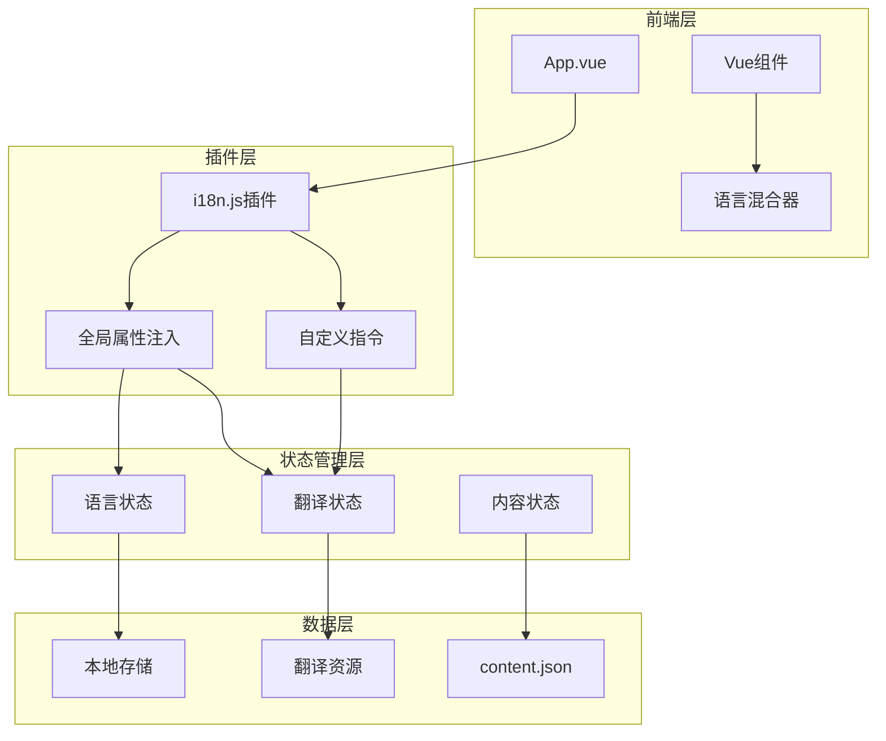
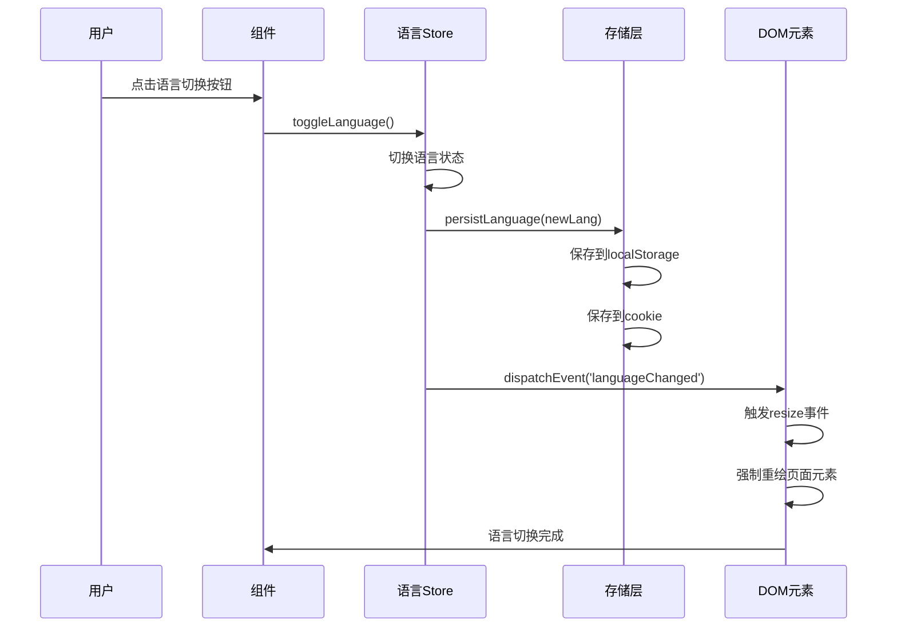
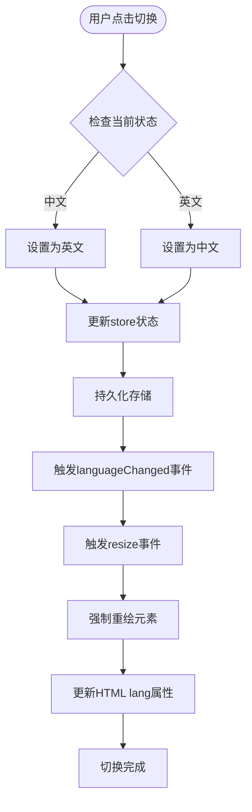

# 国际化实现机制技术文档

<cite>
**本文档引用的文件**
- [src/plugins/i18n.js](file://src/plugins/i18n.js)
- [src/mixins/language.js](file://src/mixins/language.js)
- [src/store/modules/language.js](file://src/store/modules/language.js)
- [src/store/modules/translations.js](file://src/store/modules/translations.js)
- [src/main.js](file://src/main.js)
- [src/components/LanguageSwitcher.vue](file://src/components/LanguageSwitcher.vue)
- [data/content.json](file://data/content.json)
</cite>

## 目录
1. [项目概述](#项目概述)
2. [国际化架构概览](#国际化架构概览)
3. [i18n.js插件详解](#i18njs插件详解)
4. [Composition API语言混合器](#composition-api语言混合器)
5. [语言状态管理](#语言状态管理)
6. [翻译资源管理](#翻译资源管理)
7. [动态语言切换机制](#动态语言切换机制)
8. [新增语言支持指南](#新增语言支持指南)
9. [调试与故障排除](#调试与故障排除)
10. [性能优化建议](#性能优化建议)

## 项目概述

该项目是一个现代化的Vue 3应用程序，采用Pinia状态管理库实现完整的国际化（i18n）功能。系统支持中英文双语切换，具备以下核心特性：

- **多层语言支持**：同时支持Vue 3 Composition API和传统的Options API
- **持久化存储**：语言设置自动保存到localStorage和cookie
- **动态内容更新**：支持文本、日期格式和布局方向的实时切换
- **全面的翻译覆盖**：涵盖导航、页脚、技术内容、案例研究等所有页面元素
- **灵活的扩展性**：易于添加新的语言和翻译内容

## 国际化架构概览



**图表来源**
- [src/plugins/i18n.js](file://src/plugins/i18n.js#L1-L72)
- [src/mixins/language.js](file://src/mixins/language.js#L1-L127)
- [src/store/modules/language.js](file://src/store/modules/language.js#L1-L215)

## i18n.js插件详解

i18n.js插件是整个国际化系统的核心，负责将翻译功能注入到Vue应用的全局上下文中。

### 插件安装与初始化

```javascript
export default {
  install: (app) => {
    // 获取store实例
    const languageStore = useLanguageStore()
    const translationsStore = useTranslationsStore()
    
    // 定义全局属性
    app.config.globalProperties.$language = languageStore.language
    app.config.globalProperties.$isZh = () => languageStore.isZh()
    app.config.globalProperties.$isEn = () => languageStore.isEn()
    
    // 简易翻译函数
    app.config.globalProperties.$t = (key, defaultValue = '') => {
      const ui = translationsStore.getUI(languageStore.language)
      return ui[key] || defaultValue
    }
  }
}
```

### 全局翻译函数

插件提供了多个全局翻译函数，满足不同场景的需求：

1. **$t()简易翻译函数**：用于简单的文本翻译
2. **$toggleLanguage()**：切换语言的方法
3. **$setLanguage()**：设置特定语言的方法
4. **专用翻译函数**：如`$getNavItems()`、`$getFooterData()`等

### 自定义指令'i18n'

插件还注册了一个自定义指令，用于动态更新DOM元素的文本内容：

```javascript
app.directive('i18n', {
  mounted(el, binding) {
    const ui = translationsStore.getUI(languageStore.language)
    el.textContent = ui[binding.value] || binding.value
    
    // 添加语言变化监听器
    const updateText = () => {
      const currentUi = translationsStore.getUI(languageStore.language)
      el.textContent = currentUi[binding.value] || binding.value
    }
    
    el._i18nHandler = () => updateText()
    document.addEventListener('languageChanged', el._i18nHandler)
  },
  unmounted(el) {
    document.removeEventListener('languageChanged', el._i18nHandler)
    delete el._i18nHandler
  }
})
```

**章节来源**
- [src/plugins/i18n.js](file://src/plugins/i18n.js#L1-L72)

## Composition API语言混合器

language.js文件提供了useLanguage()函数，为Vue 3 Composition API组件提供语言相关功能。

### 核心功能接口

```javascript
export function useLanguage() {
  const languageStore = useLanguageStore()
  const translationsStore = useTranslationsStore()
  
  return {
    currentLanguage,    // 当前语言
    isZh,               // 是否为中文
    isEn,               // 是否为英文
    toggleLanguage,     // 切换语言
    setLanguage,        // 设置语言
    t,                  // 简易翻译函数
    getUI,              // 获取UI文本
    getNavItems,        // 获取导航项
    getFooterData,      // 获取页脚数据
    // ...更多翻译函数
  }
}
```

### 功能特性

1. **响应式语言状态**：使用computed()创建响应式语言状态
2. **注入机制支持**：支持provide/inject机制，便于组件间共享
3. **内容数据集成**：集成了content.json中的静态内容
4. **表单翻译支持**：提供联系表单的翻译数据
5. **案例数据访问**：支持获取案例详情和相关数据

### 使用示例

```javascript
<script setup>
import { useLanguage } from '@/mixins/language'

const { t, isZh, toggleLanguage } = useLanguage()

// 使用翻译函数
const title = t('welcome_message', '欢迎来到朗德智能')

// 切换语言
const switchLanguage = () => {
  if (isZh.value) {
    toggleLanguage()
  }
}
</script>
```

**章节来源**
- [src/mixins/language.js](file://src/mixins/language.js#L1-L127)

## 语言状态管理

language.js模块实现了完整的语言状态管理，包括持久化存储、状态同步和事件通知。

### 状态结构

```javascript
export const useLanguageStore = defineStore('language', () => {
  const language = ref('zh') // 当前语言
  
  // 语言切换方法
  const toggleLanguage = () => {
    const newLang = language.value === 'zh' ? 'en' : 'zh'
    persistLanguage(newLang)
    language.value = newLang
    document.dispatchEvent(new CustomEvent('languageChanged', { detail: newLang }))
    return newLang
  }
  
  // 语言判断方法
  const isZh = () => language.value === 'zh'
  const isEn = () => language.value === 'en'
})
```

### 持久化机制

系统采用了多层次的持久化策略：

```javascript
function getPersistedLanguage() {
  // 1. 优先从localStorage读取
  let lang = localStorage.getItem('language')
  
  // 2. 如果无效，从cookie读取
  if (!lang || (lang !== 'zh' && lang !== 'en')) {
    const cookies = document.cookie.split(';')
    for (let cookie of cookies) {
      const [name, value] = cookie.trim().split('=')
      if (name === 'language') {
        lang = value
        break
      }
    }
  }
  
  // 3. 默认使用中文
  return lang || 'zh'
}
```

### 语言切换流程



**图表来源**
- [src/store/modules/language.js](file://src/store/modules/language.js#L60-L146)

**章节来源**
- [src/store/modules/language.js](file://src/store/modules/language.js#L1-L215)

## 翻译资源管理

translations.js模块负责管理所有的翻译资源，采用reactive对象结构存储多语言数据。

### 翻译资源结构

系统维护了多个翻译资源类别：

```javascript
const navItems = reactive({
  zh: [
    { text: '首页', link: '/', id: 'home' },
    { text: '反无人机系统', link: '/technology', id: 'technology' },
    // ...更多导航项
  ],
  en: [
    { text: 'Home', link: '/', id: 'home' },
    { text: 'Anti-UAV System', link: '/technology', id: 'technology' },
    // ...更多导航项
  ]
})
```

### 支持的翻译类别

1. **导航项**：网站主导航的文本
2. **网站基本信息**：公司名称、标语、联系方式
3. **页脚数据**：版权信息、链接分组
4. **技术内容**：无人机系统的详细描述
5. **案例分类**：应用案例的分类标签
6. **关于我们**：公司介绍、发展历程
7. **招聘信息**：职位描述、福利待遇
8. **联系表单**：表单字段、验证提示
9. **页面文本**：新闻中心、案例页面的专用文本
10. **UI元素**：通用界面元素的文本

### 翻译函数映射

```javascript
const getNavItems = (lang) => navItems[lang] || navItems.zh
const getFooterData = (lang) => footerData[lang] || footerData.zh
const getSiteInfo = (lang) => siteInfo[lang] || siteInfo.zh
const getTechnologies = (lang) => technologies[lang] || technologies.zh
// ...更多映射函数
```

**章节来源**
- [src/store/modules/translations.js](file://src/store/modules/translations.js#L1-L633)

## 动态语言切换机制

语言切换机制是系统的核心功能，支持实时更新页面内容而不需刷新。

### 切换流程



**图表来源**
- [src/store/modules/language.js](file://src/store/modules/language.js#L60-L146)

### HTML属性更新

系统会自动更新HTML根元素的lang属性，以支持屏幕阅读器和其他辅助技术：

```javascript
const updateHtmlLang = () => {
  const htmlRoot = document.getElementById('htmlRoot') || document.documentElement
  if (htmlRoot) {
    htmlRoot.setAttribute('lang', language.value === 'zh' ? 'zh-CN' : 'en')
  }
  
  // 更新页面标题和描述
  if (language.value === 'zh') {
    document.title = '朗德智能 - 智能无人机与反无人机解决方案提供商'
    document.querySelector('meta[name="description"]')?.setAttribute('content', 
      '朗德智能科技是领先的无人机系统及反无人机解决方案提供商，致力于空域安全防护')
  } else {
    document.title = 'Lande Intelligent - Smart Drone and Anti-Drone Solution Provider'
    document.querySelector('meta[name="description"]')?.setAttribute('content', 
      'Lande Intelligent Technology is a leading provider of drone systems and anti-drone solutions, committed to airspace security protection')
  }
}
```

### 页面重绘策略

为了确保所有内容都正确更新，系统采用多种重绘策略：

1. **触发resize事件**：使CSS媒体查询和flexbox等布局重新计算
2. **修改透明度**：通过微小的样式变化触发浏览器重绘
3. **添加临时类名**：为特定元素添加和移除类名以触发重绘
4. **强制重新渲染**：针对关键内容区域进行强制重新渲染

**章节来源**
- [src/store/modules/language.js](file://src/store/modules/language.js#L147-L180)

## 新增语言支持指南

添加新语言支持需要遵循以下步骤，确保系统的完整性和一致性。

### 步骤1：扩展翻译资源

在`src/store/modules/translations.js`中添加新的语言版本：

```javascript
// 在navItems对象中添加新语言
const navItems = reactive({
  zh: [...],
  en: [...],
  es: [ // 新增西班牙语
    { text: 'Inicio', link: '/', id: 'home' },
    { text: 'Sistema Anti-DRONE', link: '/technology', id: 'technology' },
    // ...更多导航项
  ]
})

// 在footerData对象中添加新语言
const footerData = reactive({
  zh: {...},
  en: {...},
  es: {...} // 新增西班牙语
})
```

### 步骤2：扩展语言状态

在`src/store/modules/language.js`中添加语言映射：

```javascript
// 语言文字映射
const languageText = {
  zh: '中文',
  en: 'English',
  es: 'Español' // 新增西班牙语
}

// 更新HTML lang属性
const updateHtmlLang = () => {
  const htmlRoot = document.getElementById('htmlRoot') || document.documentElement
  if (htmlRoot) {
    const lang = language.value === 'zh' ? 'zh-CN' : 
                language.value === 'en' ? 'en' : 
                language.value === 'es' ? 'es' : 'zh-CN'
    htmlRoot.setAttribute('lang', lang)
  }
}
```

### 步骤3：扩展持久化逻辑

更新持久化函数以支持新语言：

```javascript
function persistLanguage(lang) {
  if (lang !== 'zh' && lang !== 'en' && lang !== 'es') {
    console.warn('无效的语言值，不保存:', lang)
    return
  }
  
  // 保存到localStorage
  localStorage.setItem('language', lang)
  
  // 保存到cookie
  document.cookie = `language=${lang}; path=/; max-age=${60*60*24*30}`
}
```

### 步骤4：扩展内容JSON

如果需要在content.json中添加新语言支持：

```json
{
  "site-info": {
    "companyName": {
      "zh": "杭州朗德智能科技有限公司",
      "en": "Hangzhou Lande Intelligent Technology Co., Ltd.",
      "es": "Hangzhou Lande Tecnología Inteligente Co., Ltd."
    },
    "slogan": {
      "zh": "智能科技，创造可能",
      "en": "Intelligent Technology, Creating Possibilities",
      "es": "Tecnología inteligente, creando posibilidades"
    }
  }
}
```

### 步骤5：清理缓存

添加新语言后，需要清理浏览器缓存以确保正确加载新语言资源：

```javascript
// 清理localStorage中的语言设置
localStorage.removeItem('language')

// 清理cookie中的语言设置
document.cookie = 'language=; path=/; expires=Thu, 01 Jan 1970 00:00:00 UTC'

// 强制刷新页面
window.location.reload()
```

## 调试与故障排除

### 常见问题诊断

#### 1. 翻译缺失问题

**症状**：某些文本显示为原始键名而非翻译内容

**排查步骤**：
```javascript
// 检查翻译键是否存在
const translationsStore = useTranslationsStore()
const ui = translationsStore.getUI('zh')
console.log('UI翻译内容:', ui)
console.log('键"welcome_message"是否存在:', 'welcome_message' in ui)

// 检查语言状态
const languageStore = useLanguageStore()
console.log('当前语言:', languageStore.language)
console.log('是否为中文:', languageStore.isZh())
console.log('是否为英文:', languageStore.isEn())
```

#### 2. 语言切换失效

**症状**：点击语言切换按钮后页面不更新

**排查步骤**：
```javascript
// 检查事件监听器
document.addEventListener('languageChanged', (e) => {
  console.log('语言变更事件:', e.detail)
})

// 检查DOM元素的_i18nHandler
const elements = document.querySelectorAll('[v-i18n]')
elements.forEach(el => {
  console.log('元素的_i18nHandler:', el._i18nHandler)
})
```

#### 3. 持久化问题

**症状**：页面刷新后语言设置丢失

**排查步骤**：
```javascript
// 检查localStorage
console.log('localStorage中的language:', localStorage.getItem('language'))

// 检查cookie
console.log('document.cookie:', document.cookie)

// 检查应用启动时的语言设置
console.log('应用启动时的语言:', window.__reloadLanguage)
```

### 调试工具

#### 1. 开发者工具面板

在浏览器开发者工具中添加以下命令：

```javascript
// 查看当前语言状态
window.languageStore = useLanguageStore()
console.log('当前语言:', window.languageStore.language)
console.log('是否为中文:', window.languageStore.isZh())
console.log('是否为英文:', window.languageStore.isEn())

// 查看翻译内容
window.translationsStore = useTranslationsStore()
console.log('UI翻译:', window.translationsStore.getUI(window.languageStore.language))
```

#### 2. 控制台命令

```javascript
// 手动切换语言
window.languageStore.toggleLanguage()

// 手动设置语言
window.languageStore.setLanguage('en')

// 清理所有语言设置
localStorage.removeItem('language')
document.cookie = 'language=; path=/; expires=Thu, 01 Jan 1970 00:00:00 UTC'
```

**章节来源**
- [src/main.js](file://src/main.js#L1-L230)
- [src/store/modules/language.js](file://src/store/modules/language.js#L1-L215)

## 性能优化建议

### 1. 翻译资源懒加载

对于大型翻译资源，可以考虑按需加载：

```javascript
// 按需加载翻译模块
async function loadTranslations(lang) {
  if (lang === 'zh') {
    return await import('@/translations/zh')
  } else if (lang === 'en') {
    return await import('@/translations/en')
  }
}
```

### 2. 缓存策略优化

```javascript
// 实现翻译内容缓存
const translationCache = new Map()

function getCachedTranslation(key, lang) {
  const cacheKey = `${key}_${lang}`
  if (!translationCache.has(cacheKey)) {
    const translationsStore = useTranslationsStore()
    translationCache.set(cacheKey, translationsStore.getUI(lang)[key])
  }
  return translationCache.get(cacheKey)
}
```

### 3. DOM更新优化

```javascript
// 批量更新DOM元素
function batchUpdateElements(elements, updater) {
  const fragment = document.createDocumentFragment()
  elements.forEach(el => {
    updater(el)
    fragment.appendChild(el)
  })
  document.body.appendChild(fragment)
}
```

### 4. 事件处理优化

```javascript
// 使用事件委托减少监听器数量
document.addEventListener('languageChanged', (e) => {
  // 只更新需要的语言元素
  document.querySelectorAll('[data-lang-key]').forEach(el => {
    if (el.dataset.langKey) {
      el.textContent = translationsStore.getUI(e.detail)[el.dataset.langKey]
    }
  })
})
```

## 结论

该国际化系统通过精心设计的架构，实现了完整的多语言支持功能。系统的主要优势包括：

1. **统一的API接口**：无论是Composition API还是Options API，都能获得一致的使用体验
2. **强大的持久化机制**：多层存储策略确保语言设置的可靠性
3. **实时更新能力**：无需页面刷新即可完成语言切换
4. **全面的翻译覆盖**：涵盖了网站的所有内容和交互元素
5. **良好的扩展性**：易于添加新的语言和翻译内容

通过遵循本文档提供的指导原则和最佳实践，开发者可以轻松地维护和扩展国际化功能，为用户提供优质的多语言体验。