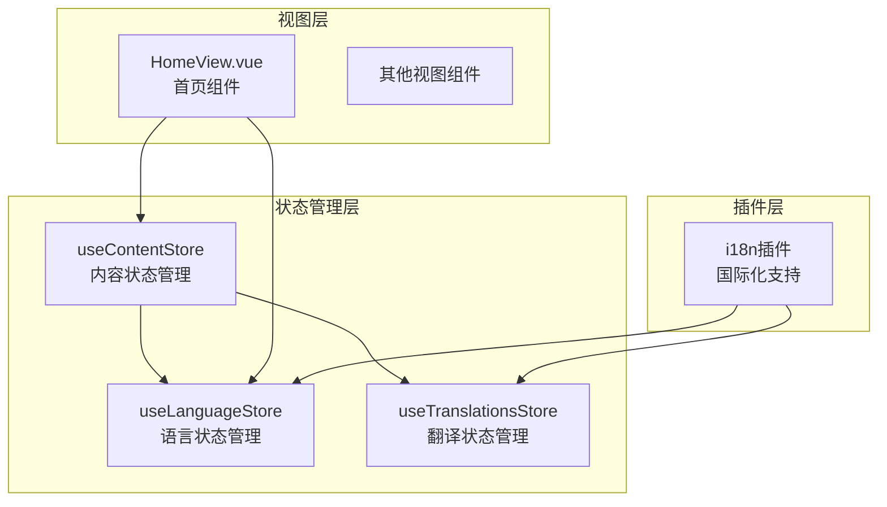
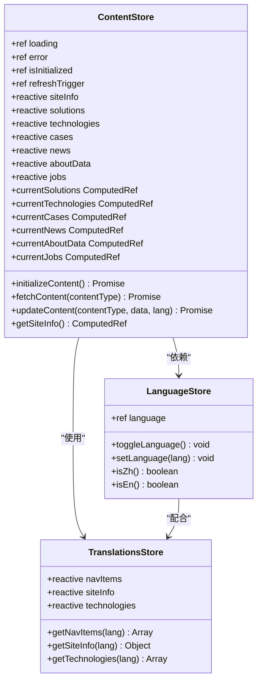
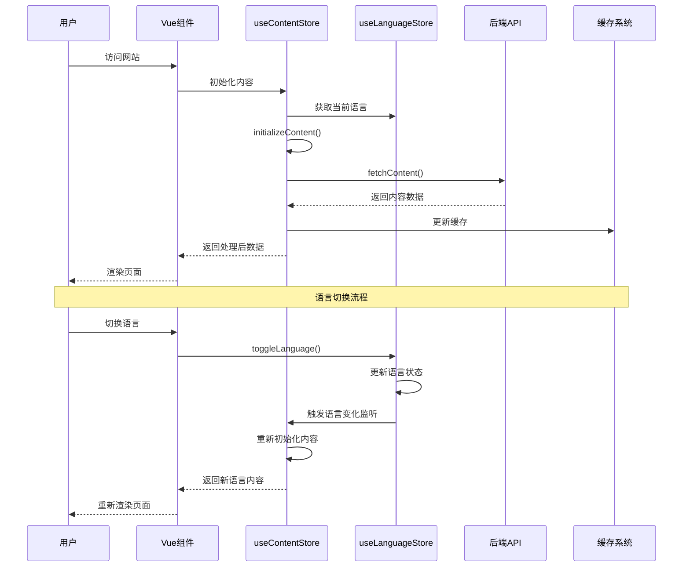
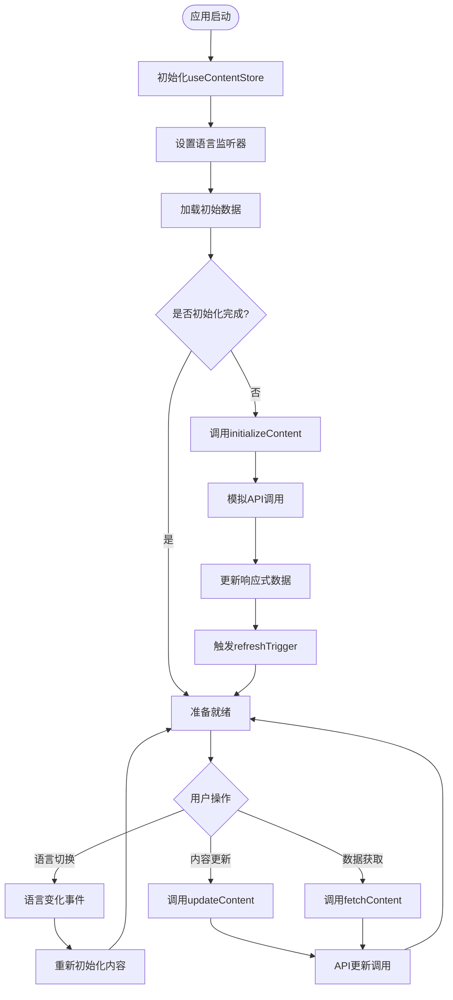
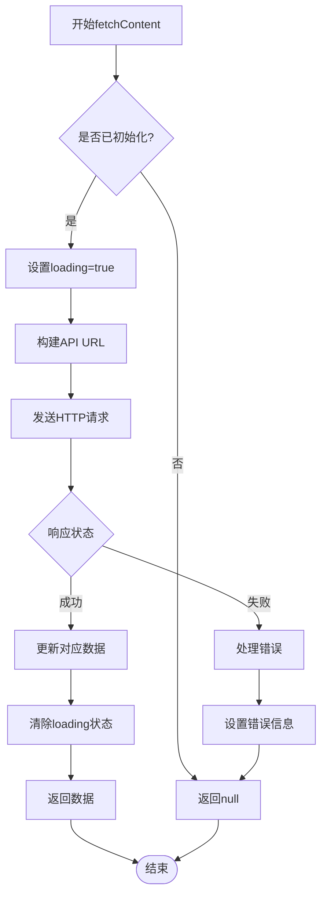
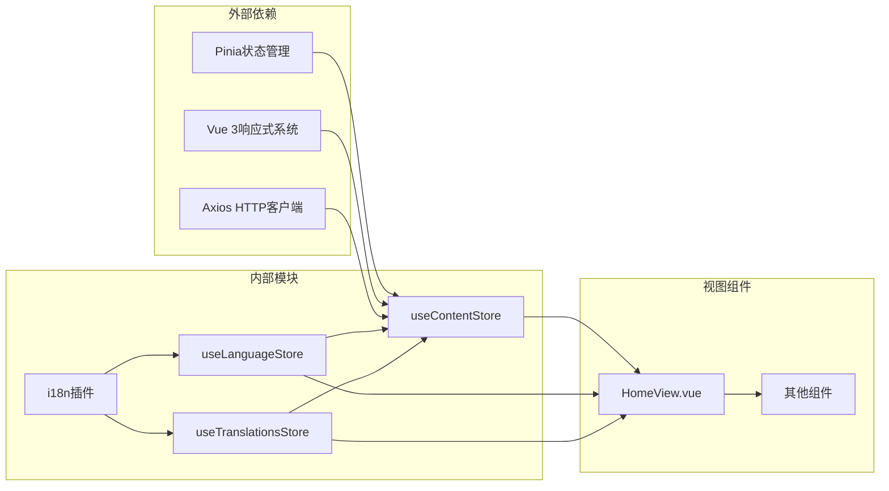

# 内容状态管理

<cite>
**本文档中引用的文件**
- [content.js](file://src/store/modules/content.js)
- [language.js](file://src/store/modules/language.js)
- [translations.js](file://src/store/modules/translations.js)
- [i18n.js](file://src/plugins/i18n.js)
- [HomeView.vue](file://src/views/HomeView.vue)
- [language.js](file://src/mixins/language.js)
</cite>

## 目录
1. [简介](#简介)
2. [项目结构概览](#项目结构概览)
3. [核心组件分析](#核心组件分析)
4. [架构概览](#架构概览)
5. [详细组件分析](#详细组件分析)
6. [依赖关系分析](#依赖关系分析)
7. [性能考虑](#性能考虑)
8. [故障排除指南](#故障排除指南)
9. [结论](#结论)

## 简介

useContentStore是朗德智能科技有限公司网站的核心状态管理模块，专门负责管理网站的多语言内容数据。该模块基于Pinia状态管理库构建，利用Vue 3的响应式系统实现了网站基本信息、解决方案、核心技术、案例、新闻、关于我们和招聘信息等多语言内容的统一管理。

该模块的主要特点包括：
- 基于reactive和computed的响应式数据管理
- 自动的语言切换监听和内容刷新机制
- 强大的初始化和数据获取流程
- 灵活的内容更新和管理功能
- 与useLanguageStore的紧密集成

## 项目结构概览



**图表来源**
- [content.js](file://src/store/modules/content.js#L1-L10)
- [language.js](file://src/store/modules/language.js#L1-L10)
- [i18n.js](file://src/plugins/i18n.js#L1-L10)

**章节来源**
- [content.js](file://src/store/modules/content.js#L1-L648)
- [store/index.js](file://src/store/index.js#L1-L6)

## 核心组件分析

### useContentStore核心功能

useContentStore是一个基于Pinia的响应式状态管理模块，主要负责以下核心功能：

1. **多语言内容管理**：统一管理网站的所有多语言内容数据
2. **响应式状态管理**：利用Vue 3的响应式系统实现数据的自动更新
3. **初始化流程控制**：管理内容的初始化和加载状态
4. **语言切换监听**：监听语言变化并自动刷新内容
5. **数据获取和更新**：提供异步数据获取和内容更新功能

### 状态结构设计



**图表来源**
- [content.js](file://src/store/modules/content.js#L1-L648)
- [language.js](file://src/store/modules/language.js#L1-L104)
- [translations.js](file://src/store/modules/translations.js#L1-L633)

**章节来源**
- [content.js](file://src/store/modules/content.js#L1-L648)

## 架构概览

### 整体架构设计



**图表来源**
- [content.js](file://src/store/modules/content.js#L15-L25)
- [language.js](file://src/store/modules/language.js#L71-L104)

### 数据流架构



**图表来源**
- [content.js](file://src/store/modules/content.js#L25-L45)
- [content.js](file://src/store/modules/content.js#L598-L647)

**章节来源**
- [content.js](file://src/store/modules/content.js#L1-L648)

## 详细组件分析

### initializeContent初始化流程

initializeContent方法是内容管理的核心初始化流程，负责整个内容系统的启动和数据加载：

```javascript
const initializeContent = async () => {
  if (loading.value) return
  
  try {
    loading.value = true
    error.value = null
    
    // 模拟API调用
    await new Promise(resolve => setTimeout(resolve, 100))
    
    refreshTrigger.value++
    isInitialized.value = true
  } catch (err) {
    console.error('Failed to initialize content:', err)
    error.value = err
  } finally {
    loading.value = false
  }
}
```

**初始化流程特点**：
- **防重复执行**：检查loading状态避免并发初始化
- **错误处理**：完整的try-catch-finally结构
- **状态管理**：正确管理loading、error和isInitialized状态
- **刷新机制**：通过refreshTrigger实现强制刷新

### 语言切换监听机制

```javascript
watch(() => languageStore.language, async (newLang, oldLang) => {
  console.log('ContentStore检测到语言变化，从', oldLang, '变为', newLang);
  await initializeContent()
})
```

**监听机制设计**：
- **响应式监听**：监听languageStore.language的变化
- **自动刷新**：语言变化时自动重新初始化内容
- **调试信息**：输出详细的语言变化日志
- **异步处理**：确保初始化过程的异步安全性

### fetchContent异步数据获取

fetchContent方法提供了灵活的内容数据获取功能：



**图表来源**
- [content.js](file://src/store/modules/content.js#L550-L597)

### 计算属性系统

useContentStore实现了多个计算属性来提供响应式的数据访问：

#### getSiteInfo计算属性

```javascript
const getSiteInfo = computed(() => {
  if (!isInitialized.value) return null
  return languageStore.language === 'zh' ? siteInfo.zh : siteInfo.en
})
```

#### currentSolutions计算属性

```javascript
const currentSolutions = computed(() => {
  if (!isInitialized.value) return null
  return languageStore.language === 'zh' ? solutions.zh : solutions.en
})
```

**计算属性设计原则**：
- **条件检查**：确保初始化完成后再返回数据
- **语言映射**：根据当前语言返回对应的数据
- **响应式更新**：自动响应语言变化和数据更新

### 数据模型结构

#### 网站基本信息结构

```javascript
const siteInfo = reactive({
  zh: {
    companyName: '杭州朗德智能科技有限公司',
    slogan: '智能反无人机，守护空域安全',
    description: '领先的反无人机系统及反无人机解决方案提供商',
    contactInfo: {
      address: '浙江省杭州市滨江区科技园区创新大厦A座15楼',
      phone: '0571-8888 9999',
      email: 'info@landedrone.com'
    }
  },
  en: {
    companyName: 'Hangzhou Lande Intelligent Technology Co., Ltd.',
    slogan: 'Smart Anti-Drone Systems, Securing Airspace',
    description: 'Leading provider of anti-drone systems and solutions',
    contactInfo: {
      address: '15F, Building A, Innovation Tower, Science & Technology Park, Binjiang District, Hangzhou, Zhejiang',
      phone: '0571-8888 9999',
      email: 'info@landedrone.com'
    }
  }
})
```

#### 解决方案数据结构

```javascript
const solutions = reactive({
  zh: [
    {
      id: 'reconnaissance',
      title: '侦察无人机',
      description: '高续航、高稳定性的侦察无人机，搭载高清光电吊舱，可执行边境巡逻、目标侦察等任务。',
      image: 'https://via.placeholder.com/600x400?text=侦察无人机',
      details: '朗德侦察无人机采用碳纤维复合材料机身，具备超长续航能力，搭载多光谱传感器和实时图像处理系统...'
    },
    // ... 更多解决方案
  ],
  en: [
    {
      id: 'reconnaissance',
      title: 'Reconnaissance Drones',
      description: 'High endurance, high stability reconnaissance drone equipped with HD electro-optical payload...',
      image: 'https://via.placeholder.com/600x400?text=Reconnaissance Drone',
      details: 'Lande reconnaissance drones feature carbon fiber composite airframes, ultra-long endurance capabilities...'
    },
    // ... 更多解决方案
  ]
})
```

**章节来源**
- [content.js](file://src/store/modules/content.js#L45-L550)

### updateContent更新方法

updateContent方法提供了内容管理系统后台的功能：

```javascript
const updateContent = async (contentType, data, lang) => {
  if (!isInitialized.value) return null
  
  try {
    await axios.put(`/api/admin/content/${contentType}`, {
      data,
      language: lang || languageStore.language
    })
    
    return { success: true }
  } catch (error) {
    console.error(`Error updating ${contentType}:`, error)
    return { success: false, error: error.message }
  }
}
```

**更新方法特点**：
- **参数化更新**：支持不同类型内容的更新
- **语言参数**：可指定更新的语言版本
- **错误反馈**：提供详细的错误信息
- **API集成**：与后端API无缝集成

**章节来源**
- [content.js](file://src/store/modules/content.js#L598-L647)

## 依赖关系分析

### 模块间依赖关系



**图表来源**
- [content.js](file://src/store/modules/content.js#L1-L5)
- [i18n.js](file://src/plugins/i18n.js#L1-L10)

### 与useLanguageStore的依赖关系

useContentStore与useLanguageStore形成了紧密的协作关系：

1. **语言状态共享**：通过useLanguageStore获取当前语言状态
2. **监听语言变化**：监听语言变化事件并自动刷新内容
3. **数据映射**：根据语言状态映射到对应的语言数据
4. **状态同步**：确保语言状态变化时内容数据的一致性

### 与useTranslationsStore的协作

虽然useContentStore不直接依赖useTranslationsStore，但两者在国际化系统中协同工作：

1. **数据分离**：content.js管理业务内容，translations.js管理UI文本
2. **语言一致性**：两个store都遵循相同的语言切换逻辑
3. **功能互补**：content.js处理业务数据，translations.js处理界面文本

**章节来源**
- [content.js](file://src/store/modules/content.js#L1-L10)
- [language.js](file://src/store/modules/language.js#L1-L104)

## 性能考虑

### 响应式数据优化

1. **reactive vs ref**：合理使用reactive和ref来优化性能
   - reactive用于复杂对象结构
   - ref用于简单标量值

2. **计算属性缓存**：利用Vue的计算属性缓存机制
   - 避免重复计算
   - 提高组件渲染性能

3. **懒加载策略**：按需加载内容数据
   - 组件首次渲染时不加载所有数据
   - 根据需要动态获取数据

### 内存管理

1. **监听器清理**：确保组件销毁时清理监听器
2. **数据引用**：避免不必要的深层拷贝
3. **缓存策略**：合理使用refreshTrigger避免重复计算

### 并发控制

1. **初始化防重复**：通过loading状态防止并发初始化
2. **API调用限制**：避免频繁的API请求
3. **批量更新**：合并多个更新操作减少重渲染

## 故障排除指南

### 常见问题及解决方案

#### 初始化失败

**问题症状**：页面显示加载失败或空白内容

**可能原因**：
- API调用失败
- 网络连接问题
- 数据格式错误

**解决方案**：
```javascript
// 检查初始化状态
console.log('ContentStore状态:', {
  loading: contentStore.loading.value,
  error: contentStore.error.value,
  isInitialized: contentStore.isInitialized.value
})

// 手动重新初始化
await contentStore.initializeContent()
```

#### 语言切换失效

**问题症状**：切换语言后内容没有更新

**可能原因**：
- 语言监听器未正确设置
- refreshTrigger未更新
- 计算属性未响应

**解决方案**：
```javascript
// 检查语言监听器
console.log('当前语言:', languageStore.language.value)

// 手动触发刷新
contentStore.refreshTrigger.value++
```

#### 数据获取错误

**问题症状**：fetchContent方法返回null或错误

**可能原因**：
- API路径错误
- 请求参数错误
- 服务器响应异常

**解决方案**：
```javascript
// 检查API调用
try {
  const result = await contentStore.fetchContent('site-info')
  console.log('获取结果:', result)
} catch (error) {
  console.error('API调用失败:', error)
}
```

**章节来源**
- [content.js](file://src/store/modules/content.js#L25-L45)
- [content.js](file://src/store/modules/content.js#L550-L597)

## 结论

useContentStore作为朗德智能科技有限公司网站的核心状态管理模块，展现了现代前端应用的最佳实践。通过精心设计的响应式架构、完善的错误处理机制和高效的性能优化策略，该模块成功实现了多语言内容的统一管理和动态更新。

### 主要优势

1. **响应式设计**：充分利用Vue 3的响应式系统，实现数据的自动更新和组件的智能渲染
2. **模块化架构**：清晰的模块划分和依赖关系，便于维护和扩展
3. **错误处理**：完善的错误处理和状态管理，提高应用的稳定性
4. **性能优化**：合理的缓存策略和并发控制，确保良好的用户体验

### 最佳实践建议

1. **状态管理**：合理使用reactive和ref，避免过度嵌套
2. **错误处理**：始终包含错误处理逻辑，提供友好的用户反馈
3. **性能监控**：定期监控应用性能，及时优化瓶颈点
4. **测试覆盖**：编写全面的单元测试和集成测试
5. **文档维护**：保持代码注释和文档的及时更新

通过持续的优化和改进，useContentStore将继续为朗德智能科技有限公司的网站提供稳定、高效的内容管理服务，支撑企业的数字化转型和全球化发展。