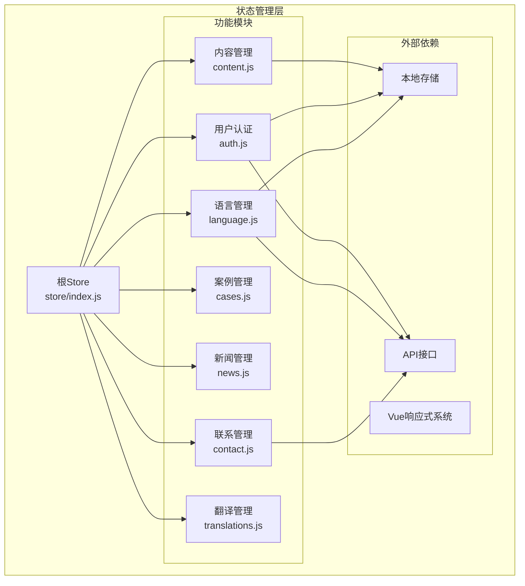
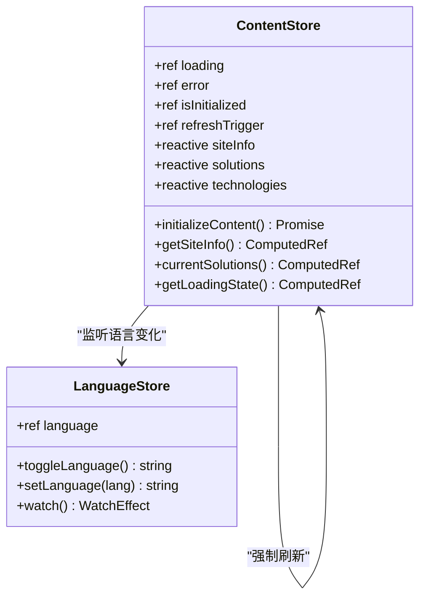
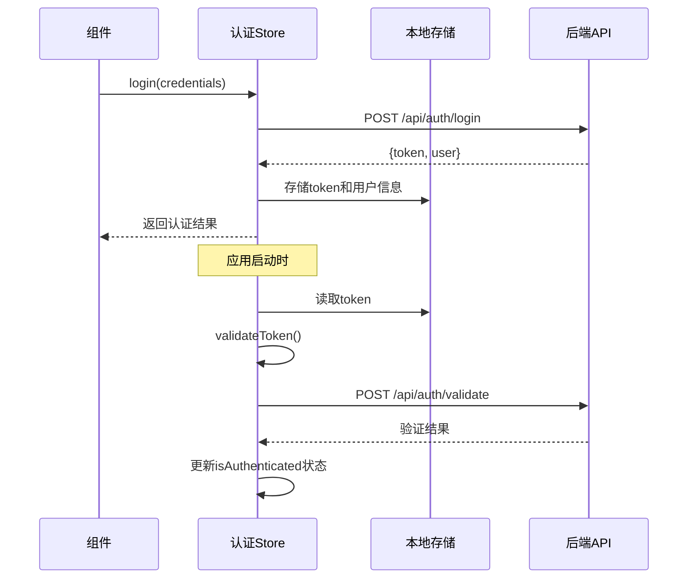
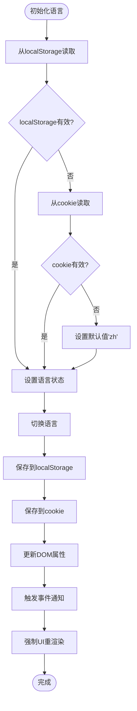
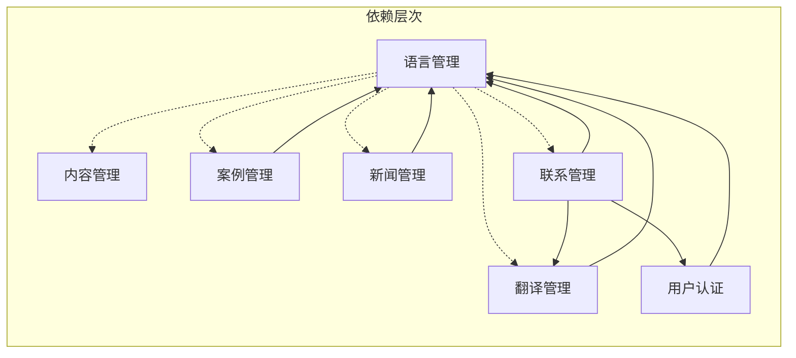
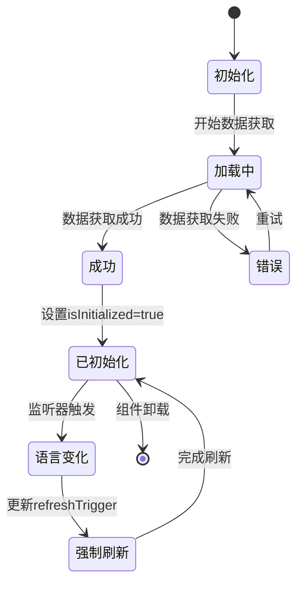

# Pinia状态管理技术文档

<cite>
**本文档引用的文件**
- [src/store/index.js](file://src/store/index.js)
- [src/store/modules/content.js](file://src/store/modules/content.js)
- [src/store/modules/auth.js](file://src/store/modules/auth.js)
- [src/store/modules/language.js](file://src/store/modules/language.js)
- [src/store/modules/cases.js](file://src/store/modules/cases.js)
- [src/store/modules/news.js](file://src/store/modules/news.js)
- [src/store/modules/contact.js](file://src/store/modules/contact.js)
- [src/store/modules/translations.js](file://src/store/modules/translations.js)
</cite>

## 目录
1. [简介](#简介)
2. [项目结构概览](#项目结构概览)
3. [根Store初始化](#根store初始化)
4. [核心模块分析](#核心模块分析)
5. [模块间依赖关系](#模块间依赖关系)
6. [状态管理模式](#状态管理模式)
7. [最佳实践与性能考虑](#最佳实践与性能考虑)
8. [故障排除指南](#故障排除指南)
9. [总结](#总结)

## 简介

本文档深入分析了基于Vue 3和Pinia的状态管理系统架构。该系统采用模块化设计，通过精心组织的store模块实现了全局状态的统一管理和响应式更新。系统包含内容管理、用户认证、多语言支持等多个核心功能模块，为整个应用程序提供了可靠的状态管理基础设施。

## 项目结构概览



**图表来源**
- [src/store/index.js](file://src/store/index.js#L1-L6)
- [src/store/modules/content.js](file://src/store/modules/content.js#L1-L10)
- [src/store/modules/auth.js](file://src/store/modules/auth.js#L1-L10)

## 根Store初始化

根Store通过简洁的导出机制统一管理所有模块：

```javascript
// 在这里导入和导出所有的存储
export * from './modules/content'
export * from './modules/auth'
export * from './modules/contact'
export * from './modules/cases'
export * from './modules/news'
```

这种设计模式的优势：
- **模块化组织**：每个功能模块独立开发和维护
- **命名空间隔离**：避免状态冲突和命名污染
- **按需加载**：支持Tree Shaking优化
- **清晰的职责分离**：每个模块专注特定业务领域

**章节来源**
- [src/store/index.js](file://src/store/index.js#L1-L6)

## 核心模块分析

### 内容管理模块 (content.js)

内容管理模块是系统的核心数据层，负责管理网站的所有静态内容：



**图表来源**
- [src/store/modules/content.js](file://src/store/modules/content.js#L7-L50)
- [src/store/modules/language.js](file://src/store/modules/language.js#L70-L120)

#### 关键特性

1. **响应式状态管理**：使用`ref`和`reactive`实现响应式数据绑定
2. **语言感知内容**：支持中英文双语内容自动切换
3. **强制刷新机制**：通过`refreshTrigger`确保内容同步更新
4. **模拟API集成**：预设API调用模式，便于后续集成真实服务

### 用户认证模块 (auth.js)

认证模块实现了完整的用户身份验证和会话管理：



**图表来源**
- [src/store/modules/auth.js](file://src/store/modules/auth.js#L15-L45)
- [src/store/modules/auth.js](file://src/store/modules/auth.js#L60-L85)

#### 安全特性

1. **本地存储持久化**：自动保存和恢复认证状态
2. **令牌验证机制**：定期验证服务器端令牌有效性
3. **自动登出处理**：令牌失效时自动清理本地数据
4. **错误处理**：完善的异常捕获和用户友好的错误提示

### 多语言管理模块 (language.js)

语言管理模块实现了复杂的国际化状态同步：



**图表来源**
- [src/store/modules/language.js](file://src/store/modules/language.js#L10-L50)
- [src/store/modules/language.js](file://src/store/modules/language.js#L70-L150)

#### 持久化策略

1. **双重存储机制**：localStorage为主，cookie为备选
2. **渐进式降级**：优先使用localStorage，回退到cookie
3. **事件驱动更新**：语言变化时触发DOM和组件更新
4. **用户体验优化**：强制重渲染确保界面立即反映语言变化

**章节来源**
- [src/store/modules/content.js](file://src/store/modules/content.js#L1-L200)
- [src/store/modules/auth.js](file://src/store/modules/auth.js#L1-L86)
- [src/store/modules/language.js](file://src/store/modules/language.js#L1-L200)

## 模块间依赖关系



**图表来源**
- [src/store/modules/content.js](file://src/store/modules/content.js#L5-L6)
- [src/store/modules/auth.js](file://src/store/modules/auth.js#L1-L10)
- [src/store/modules/cases.js](file://src/store/modules/cases.js#L1-L10)

### 依赖注入模式

1. **被动依赖**：模块通过`useLanguageStore()`主动获取其他模块实例
2. **松耦合设计**：避免循环依赖，保持模块独立性
3. **类型安全**：利用TypeScript提供编译时类型检查
4. **可测试性**：易于单元测试和集成测试

**章节来源**
- [src/store/modules/content.js](file://src/store/modules/content.js#L5-L6)
- [src/store/modules/cases.js](file://src/store/modules/cases.js#L1-L10)
- [src/store/modules/news.js](file://src/store/modules/news.js#L1-L10)

## 状态管理模式

### 响应式更新机制

系统采用Vue 3的组合式API和Pinia的响应式系统：



**图表来源**
- [src/store/modules/content.js](file://src/store/modules/content.js#L20-L40)
- [src/store/modules/language.js](file://src/store/modules/language.js#L180-L200)

### 异步操作封装

所有异步操作都遵循统一的错误处理和状态管理模式：

```javascript
const fetchData = async () => {
  loading.value = true
  error.value = null
  
  try {
    const data = await apiCall()
    processData(data)
  } catch (err) {
    error.value = err.message
    console.error('数据获取失败:', err)
  } finally {
    loading.value = false
  }
}
```

**章节来源**
- [src/store/modules/content.js](file://src/store/modules/content.js#L20-L40)
- [src/store/modules/auth.js](file://src/store/modules/auth.js#L15-L45)
- [src/store/modules/contact.js](file://src/store/modules/contact.js#L30-L60)

## 最佳实践与性能考虑

### 性能优化策略

1. **计算属性缓存**：使用`computed`避免重复计算
2. **懒加载机制**：按需初始化非关键模块
3. **批量更新**：合并多个状态变更操作
4. **内存管理**：及时清理不需要的监听器和定时器

### 代码组织原则

1. **单一职责**：每个模块专注特定业务领域
2. **接口一致性**：统一的API设计模式
3. **错误边界**：完善的异常处理和恢复机制
4. **可扩展性**：预留扩展点和配置选项

### 实际使用示例

```javascript
// 在组件中使用store
<script setup>
import { useContentStore, useLanguageStore } from '@/store'

const contentStore = useContentStore()
const languageStore = useLanguageStore()

// 访问响应式状态
const siteInfo = computed(() => contentStore.getSiteInfo)
const currentLanguage = computed(() => languageStore.language)

// 调用actions
const handleLanguageToggle = () => {
  languageStore.toggleLanguage()
}

// 监听状态变化
watch(
  () => languageStore.language,
  (newLang) => {
    console.log('语言已切换为:', newLang)
  }
)
</script>
```

## 故障排除指南

### 常见问题诊断

1. **状态不更新**：检查响应式依赖是否正确声明
2. **异步操作失败**：验证API端点和网络连接
3. **语言切换失效**：确认事件监听器是否正确绑定
4. **内存泄漏**：检查组件卸载时的清理逻辑

### 调试技巧

1. **Vue DevTools**：使用Pinia插件监控状态变化
2. **控制台日志**：添加详细的调试信息
3. **网络面板**：监控API请求和响应
4. **性能分析**：使用浏览器性能工具检测瓶颈

**章节来源**
- [src/store/modules/language.js](file://src/store/modules/language.js#L70-L120)
- [src/store/modules/auth.js](file://src/store/modules/auth.js#L60-L85)

## 总结

本Pinia状态管理系统展现了现代前端应用的最佳实践：

### 核心优势

1. **模块化架构**：清晰的功能划分和职责分离
2. **响应式设计**：充分利用Vue 3的响应式系统
3. **国际化支持**：完整的多语言状态管理
4. **安全性保障**：完善的认证和权限控制
5. **可维护性**：良好的代码组织和文档

### 技术亮点

- **组合式API**：充分利用Vue 3的新特性
- **TypeScript集成**：提供完整的类型安全
- **异步操作封装**：统一的错误处理和状态管理
- **持久化策略**：双重存储机制确保数据可靠性
- **性能优化**：计算属性缓存和懒加载机制

该状态管理系统为整个应用程序提供了稳定、高效、可扩展的状态管理基础设施，是现代Vue 3应用开发的优秀范例。