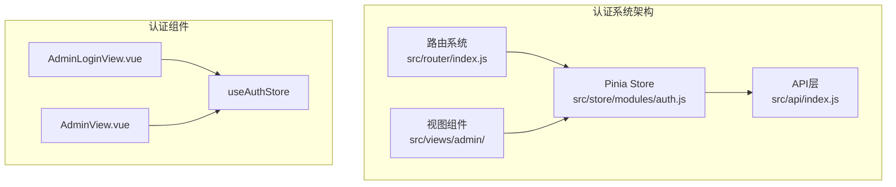
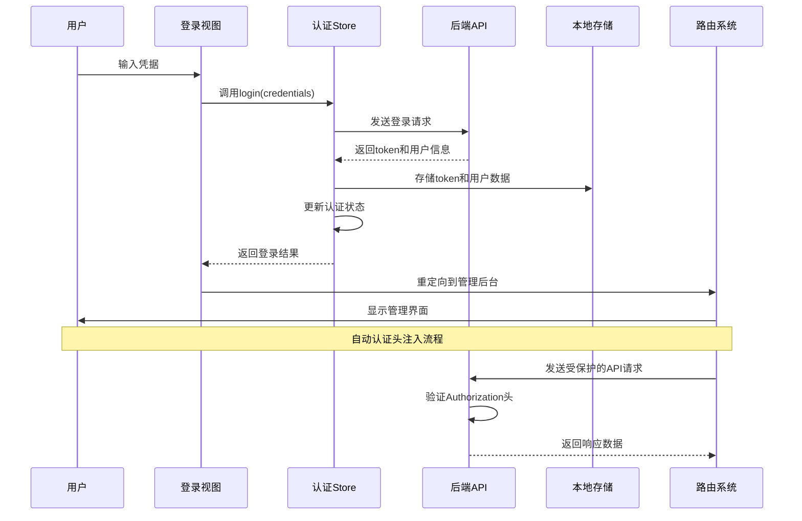
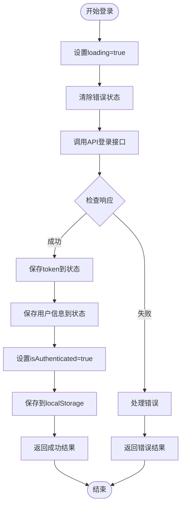
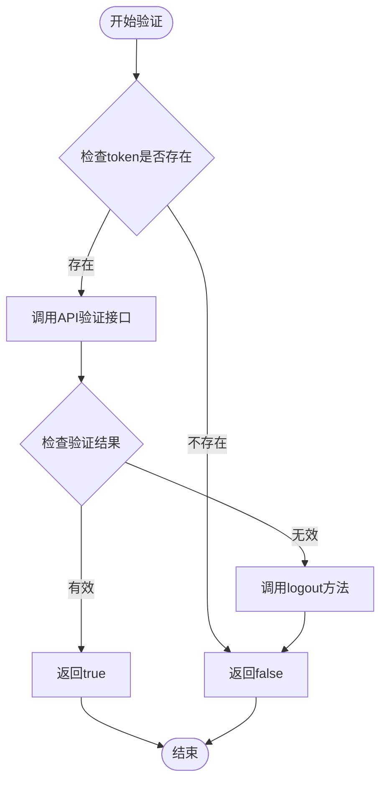
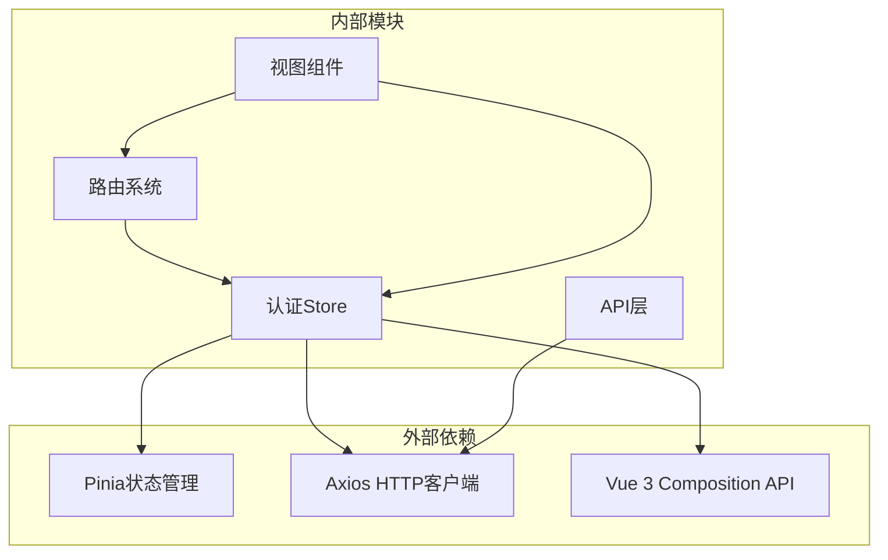

# 认证状态管理

<cite>
**本文档引用的文件**
- [auth.js](file://src/store/modules/auth.js)
- [index.js](file://src/api/index.js)
- [AdminLoginView.vue](file://src/views/admin/AdminLoginView.vue)
- [AdminView.vue](file://src/views/admin/AdminView.vue)
- [index.js](file://src/router/index.js)
- [index.js](file://src/store/index.js)
</cite>

## 目录
1. [简介](#简介)
2. [项目结构概览](#项目结构概览)
3. [核心认证组件](#核心认证组件)
4. [架构概览](#架构概览)
5. [详细组件分析](#详细组件分析)
6. [依赖关系分析](#依赖关系分析)
7. [性能考虑](#性能考虑)
8. [故障排除指南](#故障排除指南)
9. [结论](#结论)

## 简介

本文档深入分析了基于Pinia的状态管理库实现的认证系统，重点关注`useAuthStore`在`auth.js`中的实现细节。该系统提供了完整的用户认证生命周期管理，包括token管理、用户状态持久化、安全登出机制以及自动认证头注入等功能。

认证系统采用现代前端架构模式，结合Vue 3的Composition API和Pinia状态管理，实现了响应式的认证状态管理和自动化的API请求拦截。系统支持JWT令牌的本地存储持久化，提供安全的认证状态验证机制，并通过axios拦截器实现自动的认证头注入。

## 项目结构概览

认证系统的文件组织遵循模块化设计原则，主要文件分布在以下目录结构中：



**图表来源**
- [auth.js](file://src/store/modules/auth.js#L1-L86)
- [index.js](file://src/api/index.js#L1-L95)
- [index.js](file://src/router/index.js#L1-L122)

**章节来源**
- [auth.js](file://src/store/modules/auth.js#L1-L86)
- [index.js](file://src/api/index.js#L1-L95)
- [index.js](file://src/router/index.js#L1-L122)

## 核心认证组件

### useAuthStore状态管理器

`useAuthStore`是整个认证系统的核心，基于Pinia实现，提供了完整的认证状态管理功能：

```javascript
// 状态定义
const token = ref(localStorage.getItem('admin-token') || '')
const user = ref(JSON.parse(localStorage.getItem('admin-user') || '{}'))
const isAuthenticated = ref(!!token.value)
const loading = ref(false)
const error = ref(null)
```

该状态管理器包含以下关键特性：
- **持久化状态**：自动从localStorage恢复认证状态
- **响应式更新**：使用Vue 3的ref实现响应式状态管理
- **错误处理**：内置错误状态跟踪和处理机制
- **加载状态**：提供异步操作的加载指示

### API拦截器集成

系统通过axios拦截器实现了自动的认证头注入：

```javascript
// 请求拦截器
api.interceptors.request.use(
  config => {
    const token = localStorage.getItem('admin-token')
    if (token) {
      config.headers.Authorization = `Bearer ${token}`
    }
    return config
  }
)
```

**章节来源**
- [auth.js](file://src/store/modules/auth.js#L1-L86)
- [index.js](file://src/api/index.js#L10-L25)

## 架构概览

认证系统采用分层架构设计，确保各组件职责清晰且相互解耦：



**图表来源**
- [AdminLoginView.vue](file://src/views/admin/AdminLoginView.vue#L45-L55)
- [auth.js](file://src/store/modules/auth.js#L15-L35)
- [index.js](file://src/api/index.js#L10-L25)

## 详细组件分析

### 登录方法实现

登录方法`login`是认证流程的入口点，实现了完整的用户认证逻辑：



**图表来源**
- [auth.js](file://src/store/modules/auth.js#L15-L35)

登录方法的关键实现细节：

1. **状态管理**：设置加载状态和清除之前的错误
2. **API调用**：通过axios发送登录请求
3. **状态更新**：成功后更新token、用户信息和认证状态
4. **持久化**：将认证信息保存到localStorage
5. **错误处理**：捕获异常并设置错误状态

### 安全登出机制

登出方法`logout`实现了安全的认证状态清理：

```javascript
const logout = () => {
  token.value = ''
  user.value = {}
  isAuthenticated.value = false
  
  // 清除本地存储
  localStorage.removeItem('admin-token')
  localStorage.removeItem('admin-user')
}
```

该方法确保：
- **状态重置**：清空所有认证相关状态
- **本地存储清理**：移除localStorage中的敏感信息
- **原子性操作**：一次性完成所有清理工作

### 令牌验证流程

`validateToken`方法负责验证JWT令牌的有效性：



**图表来源**
- [auth.js](file://src/store/modules/auth.js#L45-L55)

验证流程特点：
- **预防性检查**：首先验证token是否存在
- **API验证**：通过后端API确认令牌有效性
- **自动清理**：验证失败时自动执行登出操作
- **异常处理**：捕获验证过程中的异常

### 初始化认证状态

`initAuth`方法在应用启动时初始化认证状态：

```javascript
const initAuth = async () => {
  if (token.value) {
    const isValid = await validateToken()
    isAuthenticated.value = isValid
    if (!isValid) logout()
  }
}
```

该方法的作用：
- **状态恢复**：从localStorage恢复认证状态
- **有效性检查**：验证现有token的有效性
- **状态同步**：根据验证结果同步isAuthenticated状态
- **安全清理**：无效token时自动清理

**章节来源**
- [auth.js](file://src/store/modules/auth.js#L15-L86)

### Vue组件集成示例

以下是管理后台组件中使用认证状态的完整示例：

```javascript
// AdminView.vue中的认证状态使用
import { useAuthStore } from '@/store/modules/auth'
import { storeToRefs } from 'pinia'

const authStore = useAuthStore()
const { user, isAuthenticated } = storeToRefs(authStore)

// 在模板中使用认证状态
<template>
  <div class="user-info">
    <span>{{ user.username }}</span>
  </div>
</template>
```

**章节来源**
- [AdminView.vue](file://src/views/admin/AdminView.vue#L1-L144)
- [AdminLoginView.vue](file://src/views/admin/AdminLoginView.vue#L1-L105)

## 依赖关系分析

认证系统的依赖关系展现了清晰的分层架构：



**图表来源**
- [auth.js](file://src/store/modules/auth.js#L1-L5)
- [index.js](file://src/api/index.js#L1-L5)
- [index.js](file://src/store/index.js#L1-L6)

**章节来源**
- [auth.js](file://src/store/modules/auth.js#L1-L86)
- [index.js](file://src/api/index.js#L1-L95)
- [index.js](file://src/router/index.js#L1-L122)

## 性能考虑

### 状态更新优化

认证系统采用了多种性能优化策略：

1. **响应式状态**：使用Vue 3的ref实现高效的响应式更新
2. **懒加载**：localStorage访问仅在必要时进行
3. **批量更新**：状态变更采用批量处理方式
4. **内存管理**：及时清理不需要的认证数据

### 错误处理最佳实践

系统实现了完善的错误处理机制：

- **统一错误格式**：所有错误都返回标准化的消息格式
- **分类错误处理**：区分网络错误、认证错误和业务错误
- **用户友好的提示**：向用户提供清晰的错误信息
- **日志记录**：在开发环境中记录详细的错误堆栈

## 故障排除指南

### 常见问题及解决方案

1. **登录失败**
   - 检查网络连接
   - 验证API端点可用性
   - 确认凭据正确性

2. **令牌过期**
   - 实现自动刷新机制
   - 提供重新登录提示
   - 清理本地存储数据

3. **状态不一致**
   - 强制重新初始化认证状态
   - 检查localStorage完整性
   - 验证API响应格式

### 调试技巧

- 使用浏览器开发者工具监控localStorage变化
- 启用axios调试模式查看请求响应
- 在Vue DevTools中观察状态变化
- 添加详细的console.log语句

**章节来源**
- [auth.js](file://src/store/modules/auth.js#L35-L45)
- [index.js](file://src/api/index.js#L25-L45)

## 结论

本认证状态管理系统展现了现代前端开发的最佳实践，通过Pinia状态管理、axios拦截器和Vue 3 Composition API的完美结合，实现了安全、高效且易于维护的认证解决方案。

系统的主要优势包括：
- **安全性**：完整的令牌管理和自动清理机制
- **可维护性**：清晰的模块化设计和职责分离
- **用户体验**：流畅的认证流程和错误处理
- **扩展性**：灵活的架构支持未来功能扩展

该系统为管理后台提供了坚实的基础，确保了用户认证的安全性和可靠性，同时保持了良好的开发体验和用户体验。