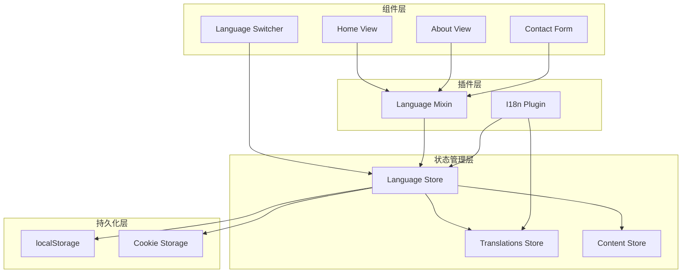
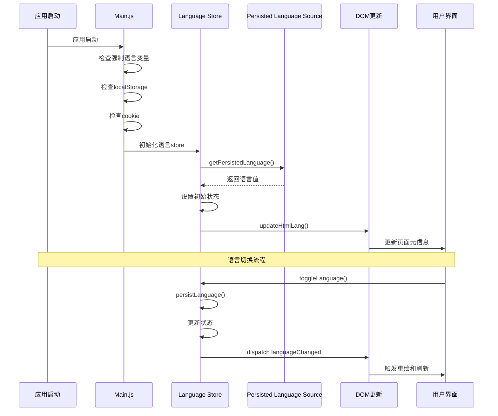
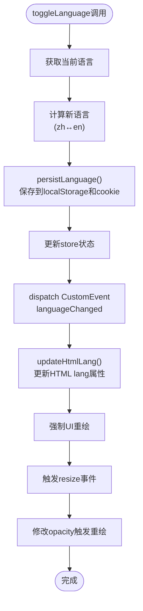
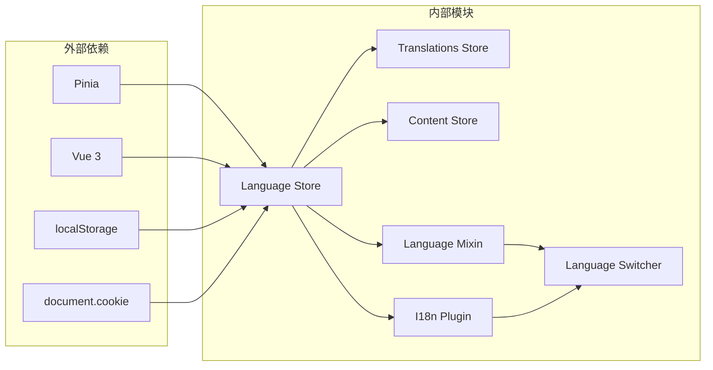

# 语言状态管理

<cite>
**本文档中引用的文件**
- [src/store/modules/language.js](file://src/store/modules/language.js)
- [src/components/LanguageSwitcher.vue](file://src/components/LanguageSwitcher.vue)
- [src/mixins/language.js](file://src/mixins/language.js)
- [src/main.js](file://src/main.js)
- [src/plugins/i18n.js](file://src/plugins/i18n.js)
- [src/store/modules/translations.js](file://src/store/modules/translations.js)
- [src/views/HomeView.vue](file://src/views/HomeView.vue)
- [src/views/AboutView.vue](file://src/views/AboutView.vue)
- [src/store/modules/content.js](file://src/store/modules/content.js)
- [src/api/index.js](file://src/api/index.js)
</cite>

## 目录
1. [简介](#简介)
2. [项目结构](#项目结构)
3. [核心组件](#核心组件)
4. [架构概览](#架构概览)
5. [详细组件分析](#详细组件分析)
6. [依赖关系分析](#依赖关系分析)
7. [性能考虑](#性能考虑)
8. [故障排除指南](#故障排除指南)
9. [结论](#结论)

## 简介

本文档全面记录了useLanguageStore的语言状态管理机制，这是一个基于Pinia的状态管理系统，专门用于管理网站的多语言切换功能。该系统采用了先进的容错设计，优先从localStorage读取语言设置，并在失败时自动降级到cookie存储，确保语言偏好不会丢失。

系统的核心功能包括：
- **智能初始化**：从localStorage和cookie中优雅地读取语言设置
- **双重持久化**：同时将语言偏好保存到localStorage和cookie
- **实时更新**：通过CustomEvent和DOM操作确保界面立即响应语言变化
- **状态一致性**：通过watch监听器维护store状态与持久化存储的一致性
- **完整国际化**：集成翻译存储和内容管理，支持动态语言切换

## 项目结构

语言状态管理系统在整个项目架构中占据核心地位，与其他模块紧密集成：



**图表来源**
- [src/store/modules/language.js](file://src/store/modules/language.js#L1-L215)
- [src/mixins/language.js](file://src/mixins/language.js#L1-L127)
- [src/plugins/i18n.js](file://src/plugins/i18n.js#L1-L72)

## 核心组件

### Language Store (语言存储)

Language Store是整个语言管理系统的核心，使用Pinia进行状态管理：

```javascript
export const useLanguageStore = defineStore('language', () => {
  const persistedLang = getPersistedLanguage();
  const language = ref(persistedLang);
  
  // 切换语言方法
  const toggleLanguage = () => {
    const newLang = language.value === 'zh' ? 'en' : 'zh';
    persistLanguage(newLang);
    language.value = newLang;
    document.dispatchEvent(new CustomEvent('languageChanged', { detail: newLang }));
    updateHtmlLang();
    // ... 强制UI重绘逻辑
    return newLang;
  }
  
  // 设置语言方法
  const setLanguage = (lang) => {
    if (lang === 'zh' || lang === 'en') {
      persistLanguage(lang);
      language.value = lang;
      document.dispatchEvent(new CustomEvent('languageChanged', { detail: lang }));
      updateHtmlLang();
      return lang;
    }
    return language.value;
  }
  
  return {
    language,
    toggleLanguage,
    setLanguage,
    languageText,
    currentLanguageText,
    isZh,
    isEn
  }
})
```

**章节来源**
- [src/store/modules/language.js](file://src/store/modules/language.js#L47-L215)

### Language Mixin (语言混入)

Language Mixin提供了统一的语言功能接口，简化了组件中的语言处理：

```javascript
export function useLanguage() {
  const languageStore = useLanguageStore()
  const translationsStore = useTranslationsStore()
  const contentStore = useContentStore()
  
  const currentLanguage = computed(() => languageStore.language)
  const isZh = computed(() => languageStore.isZh())
  const isEn = computed(() => languageStore.isEn())
  
  const toggleLanguage = () => languageStore.toggleLanguage()
  const setLanguage = (lang) => languageStore.setLanguage(lang)
  
  // 返回丰富的语言功能集合
  return {
    currentLanguage,
    isZh,
    isEn,
    toggleLanguage,
    setLanguage,
    // ... 更多翻译和内容获取方法
  }
}
```

**章节来源**
- [src/mixins/language.js](file://src/mixins/language.js#L10-L127)

## 架构概览

语言状态管理系统采用分层架构设计，确保了良好的可维护性和扩展性：



**图表来源**
- [src/main.js](file://src/main.js#L40-L120)
- [src/store/modules/language.js](file://src/store/modules/language.js#L47-L120)

## 详细组件分析

### 智能语言持久化机制

#### getPersistedLanguage函数

这是语言系统的核心初始化函数，实现了优雅的降级策略：

```javascript
function getPersistedLanguage() {
  let lang = null;
  
  // 首先从localStorage读取
  try {
    lang = localStorage.getItem('language');
    console.log('从localStorage读取语言:', lang);
  } catch (e) {
    console.error('从localStorage读取语言失败:', e);
  }
  
  // 如果localStorage没有，尝试从cookie读取
  if (!lang || (lang !== 'zh' && lang !== 'en')) {
    try {
      const cookies = document.cookie.split(';');
      for (let cookie of cookies) {
        const [name, value] = cookie.trim().split('=');
        if (name === 'language') {
          lang = value;
          console.log('从cookie读取语言:', lang);
          break;
        }
      }
    } catch (e) {
      console.error('从cookie读取语言失败:', e);
    }
  }
  
  // 如果都没有或无效，使用默认值'zh'
  if (!lang || (lang !== 'zh' && lang !== 'en')) {
    lang = 'zh';
    console.log('使用默认语言:', lang);
  }
  
  return lang;
}
```

这种设计的优势：
- **容错性强**：即使localStorage不可用，也能从cookie恢复
- **兼容性好**：支持多种浏览器环境
- **用户体验佳**：用户无需重新选择语言

**章节来源**
- [src/store/modules/language.js](file://src/store/modules/language.js#L8-L35)

#### persistLanguage函数

该函数负责将语言设置同时保存到两个位置：

```javascript
function persistLanguage(lang) {
  if (lang !== 'zh' && lang !== 'en') {
    console.warn('无效的语言值，不保存:', lang);
    return;
  }
  
  // 保存到localStorage
  try {
    localStorage.setItem('language', lang);
    console.log('已保存到localStorage:', localStorage.getItem('language'));
  } catch (e) {
    console.error('保存到localStorage失败:', e);
  }
  
  // 同时保存到cookie，作为备份
  try {
    document.cookie = `language=${lang}; path=/; max-age=${60*60*24*30}`; // 30天过期
    console.log('已保存到cookie');
  } catch (e) {
    console.error('保存到cookie失败:', e);
  }
}
```

**章节来源**
- [src/store/modules/language.js](file://src/store/modules/language.js#L37-L55)

### 语言切换机制

#### toggleLanguage方法

toggleLanguage方法实现了完整的语言切换流程：



**图表来源**
- [src/store/modules/language.js](file://src/store/modules/language.js#L60-L120)

#### setLanguage方法

setLanguage方法提供了更直接的语言设置方式：

```javascript
const setLanguage = (lang) => {
  if (lang === 'zh' || lang === 'en') {
    persistLanguage(lang);
    language.value = lang;
    document.dispatchEvent(new CustomEvent('languageChanged', { detail: lang }));
    updateHtmlLang();
    return lang;
  }
  return language.value;
}
```

**章节来源**
- [src/store/modules/language.js](file://src/store/modules/language.js#L122-L135)

### HTML语言属性更新

updateHtmlLang函数负责更新页面的HTML根元素属性：

```javascript
const updateHtmlLang = () => {
  const htmlRoot = document.getElementById('htmlRoot') || document.documentElement;
  if (htmlRoot) {
    htmlRoot.setAttribute('lang', language.value === 'zh' ? 'zh-CN' : 'en');
    console.log('已更新HTML lang属性:', htmlRoot.getAttribute('lang'));
  }
  
  // 更新页面标题和描述
  if (language.value === 'zh') {
    document.title = '朗德智能 - 智能无人机与反无人机解决方案提供商';
    document.querySelector('meta[name="description"]')?.setAttribute('content', 
      '朗德智能科技是领先的无人机系统及反无人机解决方案提供商，致力于空域安全防护');
  } else {
    document.title = 'Lande Intelligent - Smart Drone and Anti-Drone Solution Provider';
    document.querySelector('meta[name="description"]')?.setAttribute('content', 
      'Lande Intelligent Technology is a leading provider of drone systems and anti-drone solutions, committed to airspace security protection');
  }
}
```

**章节来源**
- [src/store/modules/language.js](file://src/store/modules/language.js#L137-L155)

### 高级UI重绘技术

语言切换完成后，系统执行一系列高级重绘技术确保界面完全更新：

```javascript
// 强制触发页面重新渲染
setTimeout(() => {
  // 触发窗口resize事件，使页面重新计算布局
  window.dispatchEvent(new Event('resize'));
  
  // 强制重新渲染页面元素
  document.querySelectorAll('.page-content').forEach(el => {
    // 微小改变opacity以触发重绘
    el.style.opacity = '0.99';
    setTimeout(() => {
      el.style.opacity = '1';
    }, 10);
  });
  
  // 尝试重新加载页面内容区域
  const contentElements = document.querySelectorAll('.news-list, .tech-sections, .case-grid');
  contentElements.forEach(el => {
    // 临时添加class触发重绘
    el.classList.add('language-changed');
    setTimeout(() => {
      el.classList.remove('language-changed');
    }, 50);
  });
}, 50);
```

这种技术的优势：
- **彻底重绘**：确保所有组件都重新渲染
- **平滑过渡**：通过opacity变化避免闪烁
- **性能优化**：仅对必要元素执行重绘

**章节来源**
- [src/store/modules/language.js](file://src/store/modules/language.js#L100-L120)

### 状态一致性保证

watch监听器确保store状态与持久化存储保持一致：

```javascript
watch(language, (newLang) => {
  console.log('Language changed to:', newLang);
  
  // 确保localStorage和当前语言值一致
  if (localStorage.getItem('language') !== newLang) {
    console.log('修正localStorage中的语言:', localStorage.getItem('language'), '->', newLang);
    persistLanguage(newLang);
  }
})
```

**章节来源**
- [src/store/modules/language.js](file://src/store/modules/language.js#L195-L205)

### 语言判断和显示逻辑

系统提供了多个辅助函数用于语言判断和显示：

```javascript
// 语言文字映射
const languageText = {
  zh: '中文',
  en: 'English'
}

// 当前语言文字显示
const currentLanguageText = () => {
  return language.value === 'zh' ? 'EN' : '中'
}

// 判断是否为中文
const isZh = () => language.value === 'zh'

// 判断是否为英文
const isEn = () => language.value === 'en'
```

这些函数在组件中广泛使用，例如LanguageSwitcher组件：

```javascript
const currentLanguageText = computed(() => {
  return languageStore.language === 'zh' ? 'EN' : '中'
})
```

**章节来源**
- [src/store/modules/language.js](file://src/store/modules/language.js#L157-L175)

## 依赖关系分析

语言状态管理系统的依赖关系如下：



**图表来源**
- [src/store/modules/language.js](file://src/store/modules/language.js#L1-L5)
- [src/mixins/language.js](file://src/mixins/language.js#L1-L8)

**章节来源**
- [src/store/modules/language.js](file://src/store/modules/language.js#L1-L215)
- [src/mixins/language.js](file://src/mixins/language.js#L1-L127)

## 性能考虑

### 初始化性能优化

应用启动时的性能优化策略：

1. **异步检查**：使用setTimeout延迟执行重绘操作
2. **条件重绘**：仅对必要的DOM元素执行重绘
3. **缓存机制**：避免重复的DOM查询

### 运行时性能优化

1. **事件委托**：使用CustomEvent减少内存占用
2. **批量更新**：将多个DOM操作合并为一次重绘
3. **懒加载**：按需加载翻译内容

### 存储性能优化

1. **双重存储**：localStorage提供快速访问，cookie作为备份
2. **错误处理**：优雅处理存储失败的情况
3. **类型验证**：确保存储的数据类型正确

## 故障排除指南

### 常见问题及解决方案

#### 问题1：语言设置无法保存

**症状**：切换语言后刷新页面，语言设置恢复为默认值

**原因**：localStorage写入失败

**解决方案**：
```javascript
// 检查localStorage可用性
try {
  localStorage.setItem('test', 'test');
  localStorage.removeItem('test');
} catch (e) {
  console.error('localStorage不可用:', e);
}
```

#### 问题2：语言切换后界面不更新

**症状**：语言切换事件触发，但页面内容未更新

**原因**：DOM重绘失败或组件未正确监听语言变化

**解决方案**：
```javascript
// 手动触发组件更新
watch(currentLanguage, () => {
  // 执行必要的更新操作
});
```

#### 问题3：多标签页语言不同步

**症状**：在多个浏览器标签页中切换语言，状态不一致

**解决方案**：
```javascript
// 监听storage事件
window.addEventListener('storage', (e) => {
  if (e.key === 'language') {
    // 同步语言状态
  }
});
```

**章节来源**
- [src/store/modules/language.js](file://src/store/modules/language.js#L8-L35)
- [src/main.js](file://src/main.js#L40-L120)

## 结论

useLanguageStore语言状态管理系统是一个设计精良、功能完备的多语言解决方案。它不仅实现了基本的语言切换功能，还通过以下特性提升了用户体验：

### 主要优势

1. **容错设计**：双重存储机制确保语言偏好不会丢失
2. **实时响应**：通过CustomEvent和DOM操作实现即时界面更新
3. **状态一致**：watch监听器维护store与持久化存储的一致性
4. **性能优化**：智能重绘技术和条件更新策略
5. **易于扩展**：清晰的架构设计便于添加新的语言支持

### 技术亮点

- **优雅降级**：从localStorage到cookie的渐进式降级
- **高级重绘**：通过opacity变化和resize事件确保彻底重绘
- **事件驱动**：使用CustomEvent实现松耦合的组件通信
- **混合模式**：结合Composition API和Options API的最佳实践

### 应用价值

该语言管理系统不仅适用于当前的无人机安全网站，还可以作为其他多语言项目的参考模板。其设计理念和实现方式体现了现代前端开发的最佳实践，为构建高质量的国际化应用提供了宝贵的指导。

通过深入理解这个系统的设计思路和实现细节，开发者可以更好地掌握Vue 3、Pinia和现代Web标准的应用，从而构建更加健壮和用户友好的多语言应用程序。