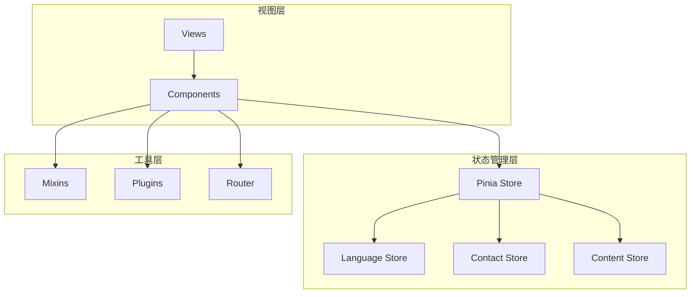
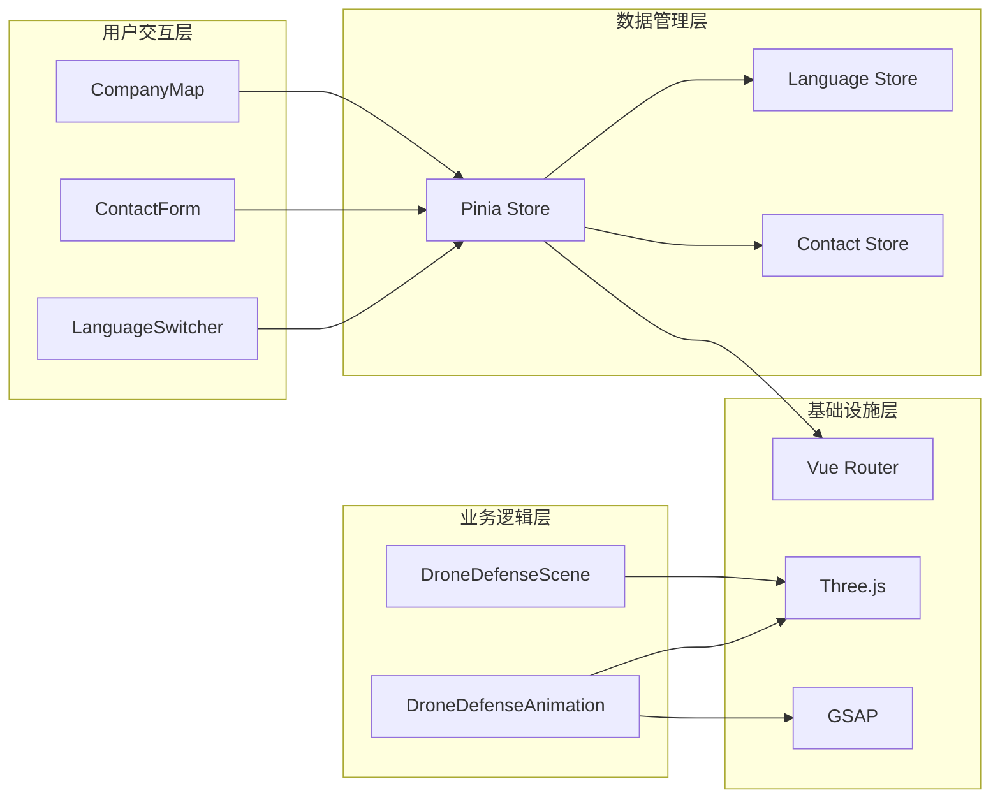
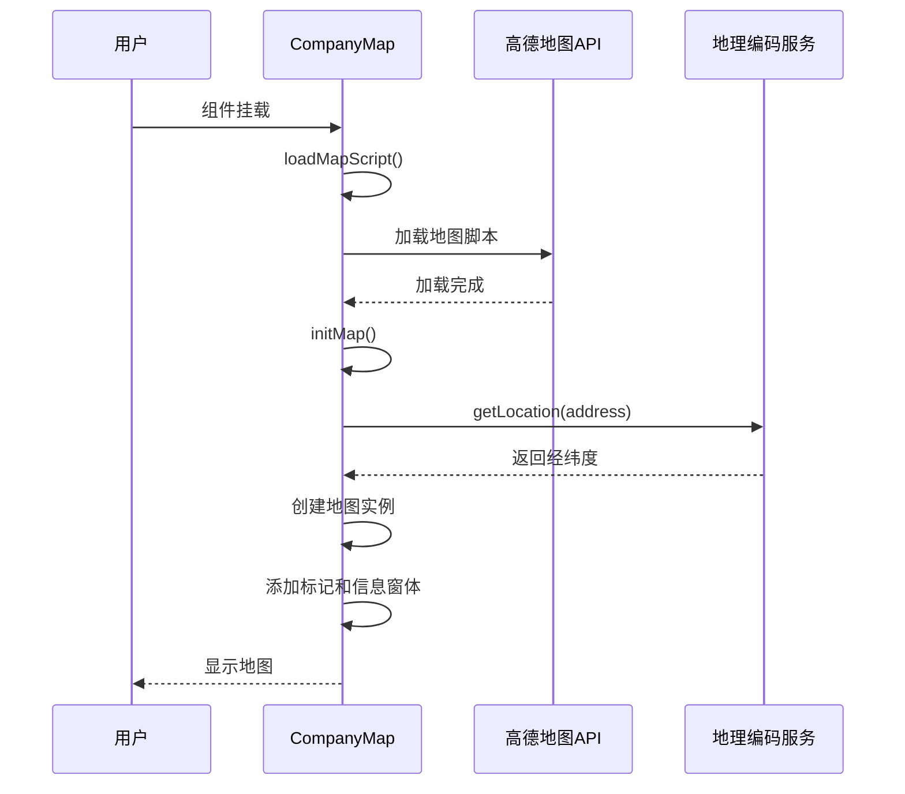
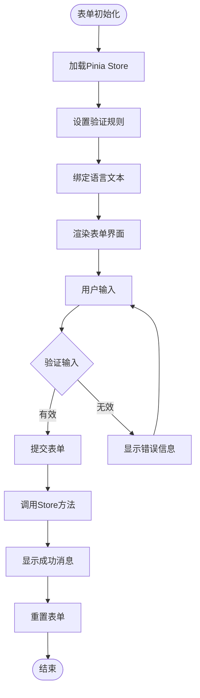
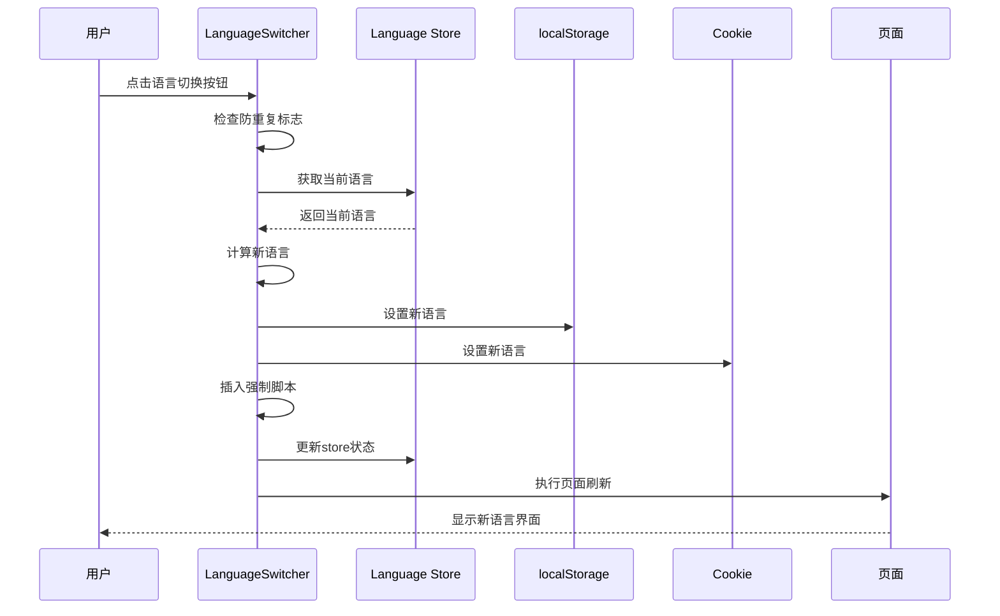
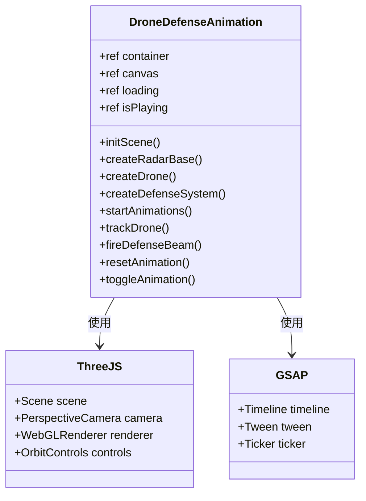
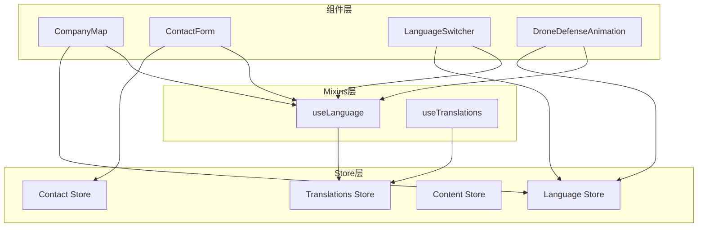
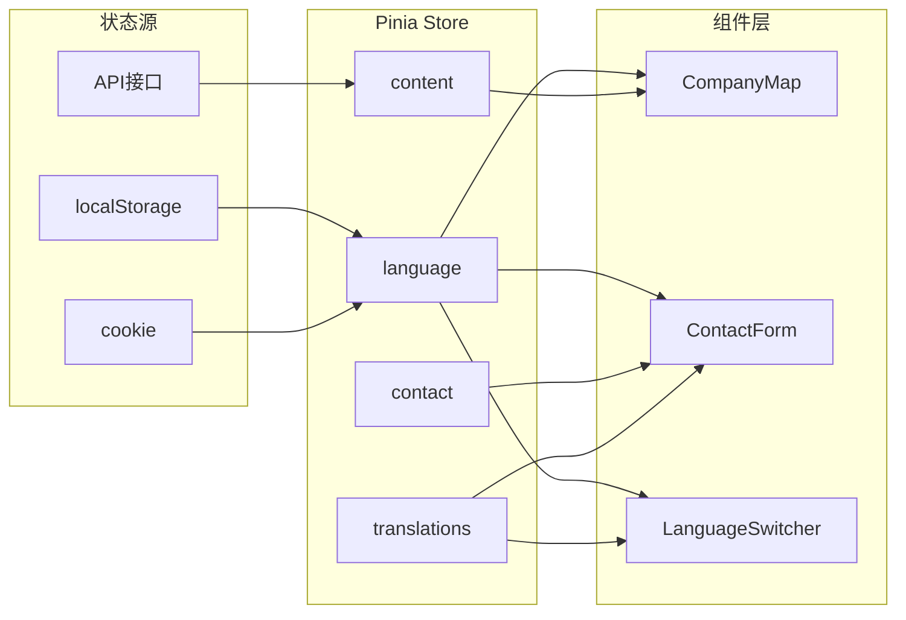

# 组件架构文档

<cite>
**本文档引用的文件**
- [CompanyMap.vue](file://src/components/CompanyMap.vue)
- [ContactForm.vue](file://src/components/ContactForm.vue)
- [LanguageSwitcher.vue](file://src/components/LanguageSwitcher.vue)
- [DroneDefenseAnimation.vue](file://src/components/DroneDefenseAnimation.vue)
- [DroneDefenseScene.vue](file://src/components/DroneDefenseScene.vue)
- [language.js](file://src/mixins/language.js)
- [language.js](file://src/store/modules/language.js)
- [DroneSystemView.vue](file://src/views/DroneSystemView.vue)
</cite>

## 目录
1. [简介](#简介)
2. [项目结构概览](#项目结构概览)
3. [核心组件分析](#核心组件分析)
4. [组件架构总览](#组件架构总览)
5. [详细组件分析](#详细组件分析)
6. [组件间通信机制](#组件间通信机制)
7. [数据流与状态管理](#数据流与状态管理)
8. [性能考虑](#性能考虑)
9. [故障排除指南](#故障排除指南)
10. [总结](#总结)

## 简介

本文档详细分析了基于Vue 3和Pinia的状态管理系统中的核心UI组件架构。这些组件包括地图展示、表单验证、语言切换、3D动画等关键功能模块，展示了现代前端开发中的最佳实践和设计模式。

## 项目结构概览

项目采用模块化的组件架构，主要分为以下几个层次：



**图表来源**
- [DroneSystemView.vue](file://src/views/DroneSystemView.vue#L1-L50)
- [language.js](file://src/mixins/language.js#L1-L30)

## 核心组件分析

### 地图组件 - CompanyMap.vue

CompanyMap.vue是一个高度集成的地图展示组件，负责在网页中嵌入高德地图API并展示公司位置信息。

**主要功能特性：**
- 支持动态加载高德地图API
- 地址到经纬度的地理编码转换
- 3D地图视图和缩放控制
- 信息窗体和导航链接集成
- 响应式设计和加载状态管理

**技术实现要点：**
- 使用AMap命名空间进行API调用
- 实现了异步加载机制避免阻塞
- 提供了完整的错误处理和降级方案
- 支持多种地图控件和样式配置

### 表单组件 - ContactForm.vue

ContactForm.vue是一个完整的表单验证和提交组件，集成了Pinia状态管理和语言切换功能。

**核心特性：**
- 全面的表单验证规则
- 实时的语言文本切换
- 提交状态管理和错误处理
- 用户友好的反馈界面
- 与Pinia store的深度集成

**设计模式：**
- 使用computed属性实现响应式文本
- 通过store-to-refs解构获取响应式状态
- 实现了表单重置和状态恢复机制

### 语言切换组件 - LanguageSwitcher.vue

LanguageSwitcher.vue提供了优雅的语言切换功能，支持浮动按钮和页面内切换。

**创新功能：**
- 浮动按钮模式和内联模式
- 强制页面刷新确保语言一致性
- localStorage和cookie双重持久化
- 防重复点击保护机制
- 完整的错误处理和日志记录

**技术亮点：**
- 使用CustomEvent发布语言变化事件
- 实现了跨浏览器兼容的语言设置
- 提供了完整的生命周期管理

### 3D动画组件 - DroneDefenseAnimation.vue

这是一个复杂的3D动画组件，使用Three.js和GSAP实现无人机防御系统的动态演示。

**技术架构：**
- Three.js场景管理
- GSAP动画控制系统
- 复杂的3D模型加载和渲染
- 实时交互和用户控制
- 性能优化和资源清理

**组件分工：**
- **DroneDefenseAnimation.vue**: 负责动画控制逻辑、用户交互和状态管理
- **DroneDefenseScene.vue**: 基于Three.js构建3D场景，负责具体的3D渲染和模型管理

**图表来源**
- [DroneDefenseAnimation.vue](file://src/components/DroneDefenseAnimation.vue#L1-L50)
- [DroneDefenseScene.vue](file://src/components/DroneDefenseScene.vue#L1-L50)

## 组件架构总览



**图表来源**
- [LanguageSwitcher.vue](file://src/components/LanguageSwitcher.vue#L1-L30)
- [ContactForm.vue](file://src/components/ContactForm.vue#L1-L30)
- [CompanyMap.vue](file://src/components/CompanyMap.vue#L1-L30)

## 详细组件分析

### CompanyMap.vue 详细分析

CompanyMap.vue实现了完整的地图功能集成，具有以下特点：



**图表来源**
- [CompanyMap.vue](file://src/components/CompanyMap.vue#L80-L120)

**关键实现细节：**

1. **异步API加载机制**
```javascript
const loadMapScript = () => {
  return new Promise((resolve, reject) => {
    if (window.AMap) {
      resolve();
      return;
    }
    
    mapScript = document.createElement('script');
    mapScript.src = 'https://webapi.amap.com/maps?v=2.0&key=...';
    mapScript.onload = resolve;
    mapScript.onerror = reject;
    document.head.appendChild(mapScript);
  });
};
```

2. **地理编码服务集成**
- 将地址字符串转换为经纬度坐标
- 提供默认位置 fallback 机制
- 支持信息窗体和导航链接

3. **3D地图配置**
- 设置视图模式为3D
- 配置视角角度和倾斜度
- 应用深色主题地图样式

**节来源**
- [CompanyMap.vue](file://src/components/CompanyMap.vue#L80-L150)

### ContactForm.vue 详细分析

ContactForm.vue展示了现代表单处理的最佳实践：



**图表来源**
- [ContactForm.vue](file://src/components/ContactForm.vue#L40-L80)

**核心功能实现：**

1. **Pinia Store 集成**
```javascript
const contactStore = useContactStore()
const { contactForm, submitting, success, error } = storeToRefs(contactStore)

const submitForm = async () => {
  await contactStore.submitContactForm()
}
```

2. **语言响应式文本**
```javascript
const formText = computed(() => getContactForm())
```

3. **表单验证和状态管理**
- 必填字段验证
- Email格式验证
- 手机号码验证
- 提交状态防重复

**节来源**
- [ContactForm.vue](file://src/components/ContactForm.vue#L40-L90)

### LanguageSwitcher.vue 详细分析

LanguageSwitcher.vue是最复杂的组件之一，实现了完整的国际化切换机制：



**图表来源**
- [LanguageSwitcher.vue](file://src/components/LanguageSwitcher.vue#L40-L100)

**创新技术实现：**

1. **双重持久化策略**
```javascript
// 保存到localStorage
localStorage.setItem('language', lang);

// 同时保存到cookie作为备份
document.cookie = `language=${lang}; path=/; max-age=${60*60*24*30}`;
```

2. **强制刷新机制**
```javascript
// 强制设置语言的脚本
const forceScript = document.createElement('script');
forceScript.textContent = `
  window.__forceLanguage = "${newLang}";
  localStorage.setItem('language', "${newLang}");
  document.cookie = 'language=${newLang}; path=/; max-age=${60*60*24*30}';
`;
```

3. **事件驱动的语言变化通知**
```javascript
// 发布语言变化事件
document.dispatchEvent(new CustomEvent('languageChanged', { detail: newLang }));
```

**节来源**
- [LanguageSwitcher.vue](file://src/components/LanguageSwitcher.vue#L60-L120)

### DroneDefenseAnimation.vue 详细分析

DroneDefenseAnimation.vue是一个复杂的3D动画组件，展示了现代Web 3D图形技术的应用：



**图表来源**
- [DroneDefenseAnimation.vue](file://src/components/DroneDefenseAnimation.vue#L20-L80)

**技术架构特点：**

1. **Three.js 场景管理**
```javascript
// 创建场景和相机
scene = new THREE.Scene();
camera = new THREE.PerspectiveCamera(60, aspect, 0.1, 1000);
camera.position.set(0, 5, 10);

// 创建渲染器
renderer = new THREE.WebGLRenderer({
  canvas: canvas.value,
  antialias: true,
  alpha: true
});
```

2. **GSAP 动画控制系统**
```javascript
// 雷达旋转动画
radarAnimation = gsap.to(radar.rotation, {
  y: Math.PI * 2,
  duration: 5,
  repeat: -1,
  ease: "none"
});

// 无人机飞行路径动画
const droneTimeline = gsap.timeline({ repeat: -1, yoyo: true });
droneTimeline.to(drone.position, {
  x: 7, y: 4, z: -7,
  duration: 5,
  ease: "power1.inOut"
});
```

3. **实时交互和追踪逻辑**
```javascript
// 防御系统追踪无人机
const trackDrone = () => {
  if (defenseSystem && drone) {
    const defensePosition = new THREE.Vector3();
    defenseSystem.getWorldPosition(defensePosition);
    
    const dronePosition = new THREE.Vector3();
    drone.getWorldPosition(dronePosition);
    
    defenseSystem.lookAt(dronePosition);
    
    // 检测距离并触发拦截
    const distance = defensePosition.distanceTo(dronePosition);
    if (distance < 8) {
      fireDefenseBeam(defensePosition, dronePosition);
    }
  }
};
```

**节来源**
- [DroneDefenseAnimation.vue](file://src/components/DroneDefenseAnimation.vue#L100-L200)

## 组件间通信机制

### Pinia Store 集成模式

所有组件都通过Pinia store实现状态共享和通信：



**图表来源**
- [language.js](file://src/mixins/language.js#L10-L30)

### 语言切换通信链路

语言切换涉及多个组件的协调工作：

1. **事件发布**：LanguageSwitcher通过CustomEvent发布语言变化
2. **状态更新**：所有依赖语言的组件监听语言变化
3. **界面刷新**：组件重新渲染以反映新的语言文本
4. **数据同步**：store中的语言状态与其他组件保持同步

**节来源**
- [language.js](file://src/store/modules/language.js#L80-L120)

## 数据流与状态管理

### 状态管理模式

项目采用集中式状态管理，通过Pinia实现：



**图表来源**
- [language.js](file://src/store/modules/language.js#L10-L50)

### 数据持久化策略

1. **localStorage优先**：主要的数据持久化存储
2. **cookie备份**：防止localStorage不可用的情况
3. **内存缓存**：store中的响应式状态
4. **自动同步**：确保各存储层之间的一致性

**节来源**
- [language.js](file://src/store/modules/language.js#L15-L45)

## 性能考虑

### 组件性能优化策略

1. **懒加载和按需加载**
   - 地图组件的API异步加载
   - 3D动画组件的资源预加载
   - 图片和媒体资源的延迟加载

2. **内存管理**
   - Three.js对象的显式销毁
   - 事件监听器的清理
   - 动画帧的取消

3. **渲染优化**
   - WebGL渲染器的性能配置
   - 3D模型的LOD（细节层次）管理
   - 屏幕外元素的隐藏

### 移动端适配

```javascript
// 移动端性能优化
const isMobile = computed(() => {
  return window.innerWidth <= 768;
});

// 移动端减少建筑物数量
const buildingCount = isMobile.value ? 20 : 50;

// 移动端减少窗户数量
if (!isMobile.value) {
  // 添加窗户效果
}
```

## 故障排除指南

### 常见问题和解决方案

1. **地图加载失败**
   - 检查API密钥有效性
   - 验证网络连接状态
   - 查看浏览器控制台错误信息

2. **语言切换失效**
   - 确认localStorage写入权限
   - 检查cookie设置
   - 验证store状态同步

3. **3D动画卡顿**
   - 降低模型复杂度
   - 减少同时渲染的对象数量
   - 调整渲染器参数

4. **表单验证错误**
   - 检查必填字段完整性
   - 验证邮箱和手机号格式
   - 确认store状态正确

**节来源**
- [CompanyMap.vue](file://src/components/CompanyMap.vue#L180-L220)
- [LanguageSwitcher.vue](file://src/components/LanguageSwitcher.vue#L150-L184)

## 总结

本文档详细分析了基于Vue 3和Pinia的组件架构，展示了现代前端开发中的最佳实践。主要特点包括：

1. **模块化设计**：每个组件都有明确的职责和边界
2. **状态管理**：通过Pinia实现统一的状态管理和数据流
3. **性能优化**：采用多种技术手段提升用户体验
4. **可维护性**：清晰的代码结构和完善的错误处理
5. **国际化支持**：完整的多语言切换机制

这种架构设计为大型前端项目提供了可扩展的基础框架，能够支持复杂的业务需求和持续的功能迭代。