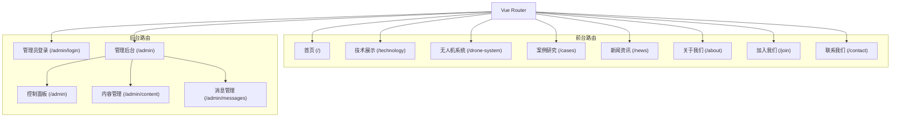
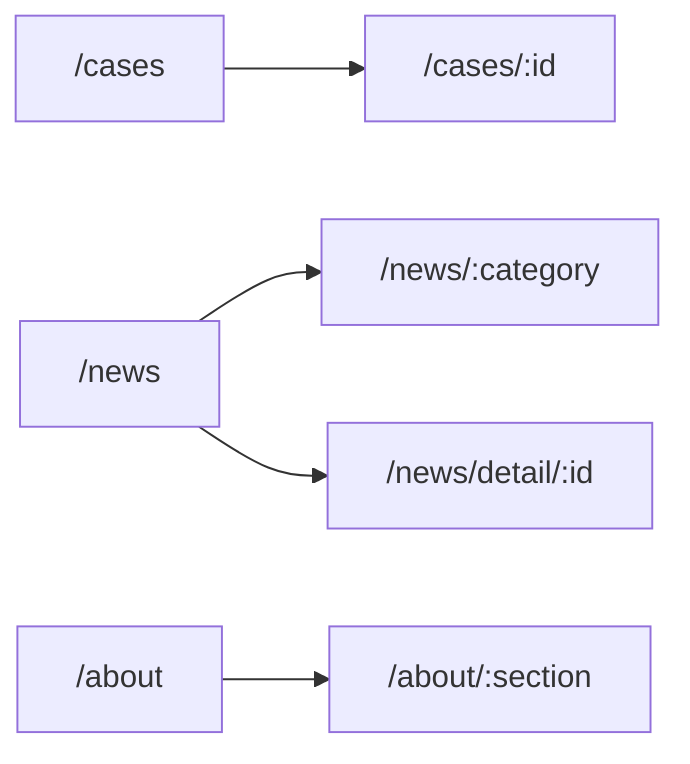
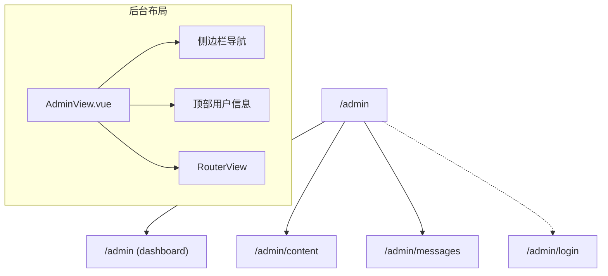
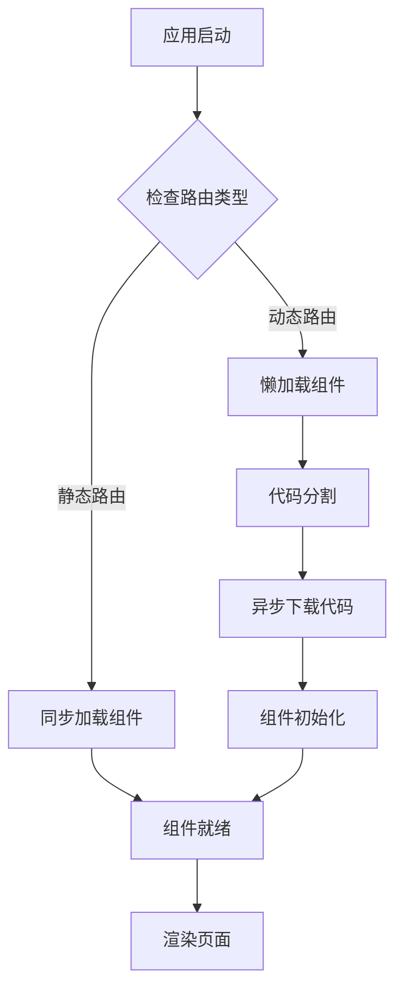
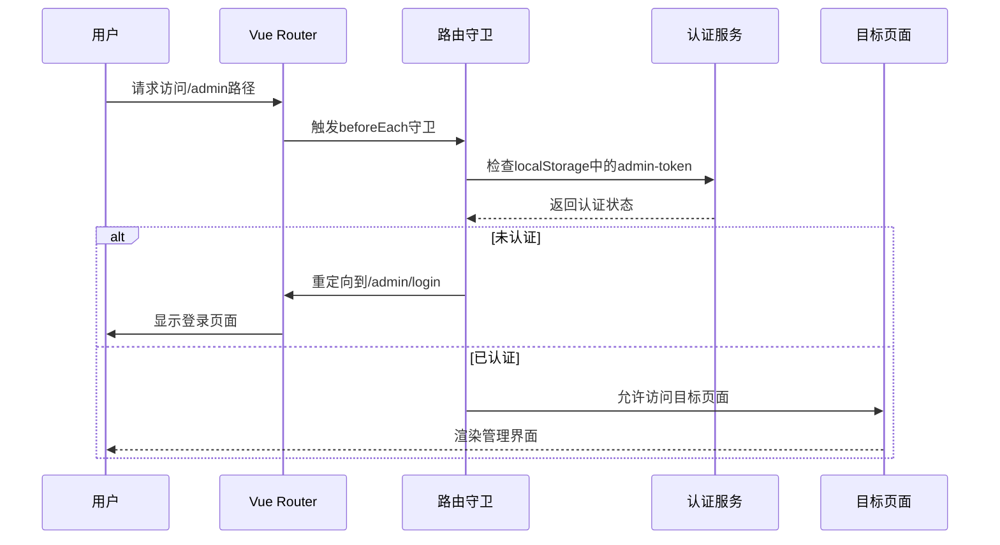
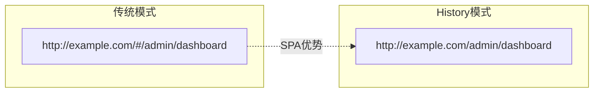
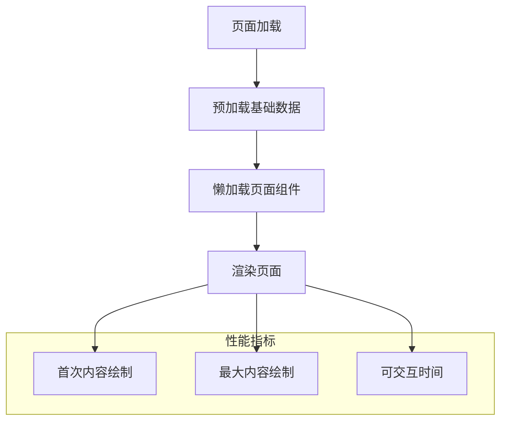

# Vue Router系统详细文档

<cite>
**本文档引用的文件**
- [src/router/index.js](file://src/router/index.js)
- [src/App.vue](file://src/App.vue)
- [src/views/HomeView.vue](file://src/views/HomeView.vue)
- [src/views/TechnologyView.vue](file://src/views/TechnologyView.vue)
- [src/views/admin/AdminLoginView.vue](file://src/views/admin/AdminLoginView.vue)
- [src/views/admin/AdminView.vue](file://src/views/admin/AdminView.vue)
- [src/views/admin/DashboardView.vue](file://src/views/admin/DashboardView.vue)
- [vite.config.js](file://vite.config.js)
- [package.json](file://package.json)
</cite>

## 目录
1. [项目概述](#项目概述)
2. [路由架构概览](#路由架构概览)
3. [前台页面路由配置](#前台页面路由配置)
4. [后台管理路由配置](#后台管理路由配置)
5. [动态路由与懒加载](#动态路由与懒加载)
6. [路由守卫与权限控制](#路由守卫与权限控制)
7. [编程式导航](#编程式导航)
8. [历史模式与URL美化](#历史模式与URL美化)
9. [路由表清单](#路由表清单)
10. [SEO优化与性能考虑](#SEO优化与性能考虑)
11. [常见问题排查](#常见问题排查)
12. [总结](#总结)

## 项目概述

本项目采用Vue 3 + Vue Router 4构建的单页应用(SPA)，实现了前后台分离的路由架构。前端主要面向普通用户，提供企业介绍、技术展示、案例研究、新闻资讯等功能；后台管理则专为管理员设计，包含登录验证、内容管理、消息处理等核心功能。

项目使用Vite作为构建工具，支持热更新开发环境，生产环境下通过history模式实现URL美化，提升用户体验和SEO友好性。

## 路由架构概览

Vue Router系统采用模块化设计，将前台页面和后台管理分别组织，通过嵌套路由实现复杂的页面结构。



**图表来源**
- [src/router/index.js](file://src/router/index.js#L1-L122)

**章节来源**
- [src/router/index.js](file://src/router/index.js#L1-L122)

## 前台页面路由配置

前台路由负责展示企业的核心业务内容，采用按需加载的方式提升首屏性能。

### 基础路由配置

```javascript
{
  path: '/',
  name: 'home',
  component: HomeView
},
{
  path: '/technology',
  name: 'technology',
  component: () => import('../views/TechnologyView.vue')
}
```

### 动态参数路由

系统支持动态参数路由，用于处理详情页面和分类浏览：

```javascript
{
  path: '/cases/:id',
  name: 'case-detail',
  component: () => import('../views/CaseDetailView.vue')
},
{
  path: '/news/:category',
  name: 'news-category',
  component: () => import('../views/NewsCategoryView.vue')
}
```

### 嵌套路由结构



**图表来源**
- [src/router/index.js](file://src/router/index.js#L18-L35)

**章节来源**
- [src/router/index.js](file://src/router/index.js#L1-L50)

## 后台管理路由配置

后台管理路由采用嵌套路由设计，实现层级化的管理界面。

### 管理员登录路由

```javascript
{
  path: '/admin/login',
  name: 'admin-login',
  component: () => import('../views/admin/AdminLoginView.vue')
}
```

### 管理后台主路由

```javascript
{
  path: '/admin',
  name: 'admin',
  component: () => import('../views/admin/AdminView.vue'),
  meta: { requiresAuth: true },
  children: [
    {
      path: '',
      name: 'admin-dashboard',
      component: () => import('../views/admin/DashboardView.vue')
    },
    {
      path: 'content',
      name: 'admin-content',
      component: () => import('../views/admin/ContentView.vue')
    },
    {
      path: 'messages',
      name: 'admin-messages',
      component: () => import('../views/admin/MessagesView.vue')
    }
  ]
}
```

### 后台路由层次结构



**图表来源**
- [src/router/index.js](file://src/router/index.js#L75-L95)
- [src/views/admin/AdminView.vue](file://src/views/admin/AdminView.vue#L1-L50)

**章节来源**
- [src/router/index.js](file://src/router/index.js#L75-L95)
- [src/views/admin/AdminView.vue](file://src/views/admin/AdminView.vue#L1-L144)

## 动态路由与懒加载

项目广泛采用动态导入实现懒加载，显著提升应用性能。

### 懒加载实现方式

```javascript
// 静态导入 - 适合核心组件
import HomeView from '../views/HomeView.vue'

// 动态导入 - 适合非核心组件
component: () => import('../views/TechnologyView.vue')
```

### 性能优化策略



**图表来源**
- [src/router/index.js](file://src/router/index.js#L15-L20)

### Vite代码分割配置

项目在vite.config.js中配置了手动分块策略：

```javascript
rollupOptions: {
  output: {
    manualChunks(id) {
      if (id.includes('node_modules')) {
        return 'vendor';
      }
    }
  }
}
```

**章节来源**
- [src/router/index.js](file://src/router/index.js#L15-L20)
- [vite.config.js](file://vite.config.js#L15-L25)

## 路由守卫与权限控制

系统实现了完善的路由守卫机制，确保后台管理功能的安全访问。

### 全局前置守卫

```javascript
router.beforeEach((to, from, next) => {
  if (to.matched.some(record => record.meta.requiresAuth)) {
    // 检查用户是否已登录
    const isLoggedIn = localStorage.getItem('admin-token')
    if (!isLoggedIn) {
      // 如果没有登录，重定向到登录页面
      next({ name: 'admin-login' })
    } else {
      next()
    }
  } else {
    next()
  }
})
```

### 权限控制流程



**图表来源**
- [src/router/index.js](file://src/router/index.js#L97-L110)

### 认证状态管理

```javascript
// 登录成功后的重定向
const login = async () => {
  const result = await authStore.login(credentials)
  if (result.success) {
    router.push('/admin') // 重定向到管理后台
  }
}

// 退出登录
const logout = () => {
  authStore.logout()
  router.push('/admin/login') // 重定向到登录页面
}
```

**章节来源**
- [src/router/index.js](file://src/router/index.js#L97-L110)
- [src/views/admin/AdminLoginView.vue](file://src/views/admin/AdminLoginView.vue#L45-L55)
- [src/views/admin/AdminView.vue](file://src/views/admin/AdminView.vue#L85-L95)

## 编程式导航

项目中广泛使用编程式导航实现页面跳转，提供更灵活的导航控制。

### 基础导航方法

```javascript
// 基于名称的导航
router.push({ name: 'admin-dashboard' })

// 基于路径的导航
router.push('/admin')

// 带查询参数的导航
router.push({
  path: '/cases',
  query: { category: tag }
})
```

### 实际应用示例

```javascript
// 在HomeView中导航到案例分类
const navigateToCase = (tag) => {
  router.push({
    path: '/cases',
    query: { category: tag }
  })
}

// 在新闻列表中导航到详情页
const navigateToNewsDetail = (newsId) => {
  router.push(`/news/detail/${newsId}`)
}
```

### 导航动画效果

```javascript
// 使用Transition组件实现页面过渡
<RouterView v-slot="{ Component }">
  <Transition name="fade" mode="out-in">
    <component :is="Component" />
  </Transition>
</RouterView>
```

**章节来源**
- [src/views/HomeView.vue](file://src/views/HomeView.vue#L736-L740)
- [src/App.vue](file://src/App.vue#L100-L110)

## 历史模式与URL美化

项目采用HTML5 History模式，实现干净美观的URL结构。

### History模式配置

```javascript
const router = createRouter({
  history: createWebHistory(import.meta.env.BASE_URL),
  routes: [...]
})
```

### URL美化效果



**图表来源**
- [src/router/index.js](file://src/router/index.js#L4-L5)

### SEO友好性

History模式的优势：
- 更简洁的URL格式
- 支持书签收藏
- 对搜索引擎更友好
- 符合现代Web标准

**章节来源**
- [src/router/index.js](file://src/router/index.js#L4-L5)

## 路由表清单

以下是完整的路由配置清单：

| 路径 | 名称 | 组件 | 元信息 | 子路由 |
|------|------|------|--------|--------|
| `/` | home | HomeView | 无 | 无 |
| `/technology` | technology | TechnologyView | 无 | 无 |
| `/drone-system` | drone-system | DroneSystemView | 无 | 无 |
| `/cases` | cases | CasesView | 无 | 无 |
| `/cases/:id` | case-detail | CaseDetailView | 无 | 无 |
| `/news` | news | NewsView | 无 | 无 |
| `/news/:category` | news-category | NewsCategoryView | 无 | 无 |
| `/news/detail/:id` | news-detail | NewsDetailView | 无 | 无 |
| `/about` | about | AboutView | 无 | 无 |
| `/about/:section` | about-section | AboutSectionView | 无 | 无 |
| `/join` | join | JoinView | 无 | 无 |
| `/contact` | contact | ContactView | 无 | 无 |
| `/admin/login` | admin-login | AdminLoginView | 无 | 无 |
| `/admin` | admin | AdminView | requiresAuth: true | dashboard, content, messages |

**章节来源**
- [src/router/index.js](file://src/router/index.js#L8-L95)

## SEO优化与性能考虑

### 滚动行为优化

```javascript
scrollBehavior(to, from, savedPosition) {
  if (savedPosition) {
    return savedPosition
  } else {
    return { top: 0 }
  }
}
```

### 预加载策略

```javascript
// 应用级预加载
const preloadBaseData = async () => {
  try {
    const result = await contentStore.fetchContent('site-info')
    return true
  } catch (error) {
    console.error('基础数据加载失败:', error)
    return false
  }
}
```

### 性能监控



**章节来源**
- [src/router/index.js](file://src/router/index.js#L90-L95)
- [src/App.vue](file://src/App.vue#L150-L170)

## 常见问题排查

### 路由重定向问题

**问题**：访问/admin路径时未正确重定向到登录页面

**排查步骤**：
1. 检查localStorage中是否存在admin-token
2. 验证路由守卫逻辑
3. 确认meta.requiresAuth配置

**解决方案**：
```javascript
// 检查认证状态
console.log('Admin token:', localStorage.getItem('admin-token'))
console.log('Route meta:', to.meta)
```

### 组件懒加载失败

**问题**：动态导入的组件无法加载

**排查步骤**：
1. 检查文件路径是否正确
2. 验证webpack配置
3. 查看浏览器开发者工具网络请求

**解决方案**：
```javascript
// 使用相对路径确保正确解析
component: () => import('../views/ComponentName.vue')
```

### 嵌套路由显示异常

**问题**：后台管理页面的RouterView不显示内容

**排查步骤**：
1. 检查AdminView.vue中的RouterView配置
2. 验证子路由路径配置
3. 确认组件导出方式

**解决方案**：
```javascript
// 正确的RouterView使用方式
<RouterView v-slot="{ Component }">
  <Transition name="fade" mode="out-in">
    <component :is="Component" />
  </Transition>
</RouterView>
```

### 编程式导航失效

**问题**：router.push调用无效

**排查步骤**：
1. 确认router实例获取方式
2. 检查Vue Router版本兼容性
3. 验证组件生命周期阶段

**解决方案**：
```javascript
// 在setup函数中正确获取router实例
import { useRouter } from 'vue-router'
const router = useRouter()
```

## 总结

本Vue Router系统展现了现代前端应用的最佳实践：

1. **模块化设计**：清晰分离前台和后台路由，便于维护和扩展
2. **性能优化**：广泛采用懒加载和代码分割，提升应用启动速度
3. **安全性**：完善的路由守卫机制，确保后台功能的安全访问
4. **用户体验**：History模式实现美观的URL，配合过渡动画提升交互体验
5. **SEO友好**：合理的路由配置有利于搜索引擎抓取和索引

该系统为朗德智能科技有限公司提供了稳定可靠的前端路由基础设施，支持企业级应用的持续发展和功能扩展。通过合理的架构设计和性能优化，系统能够满足当前业务需求并具备良好的可扩展性。