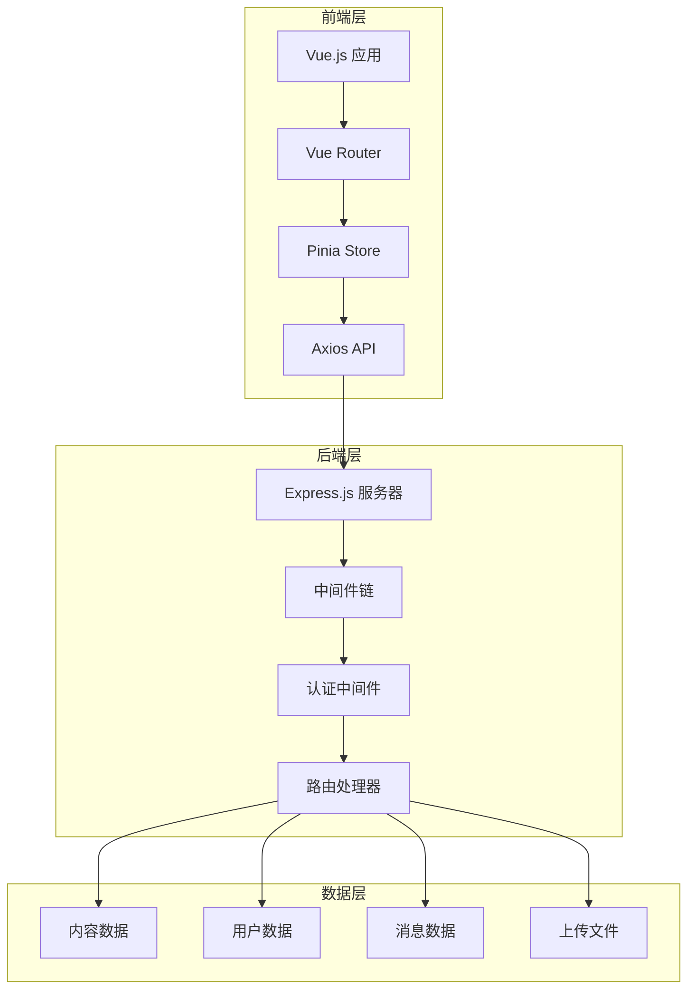
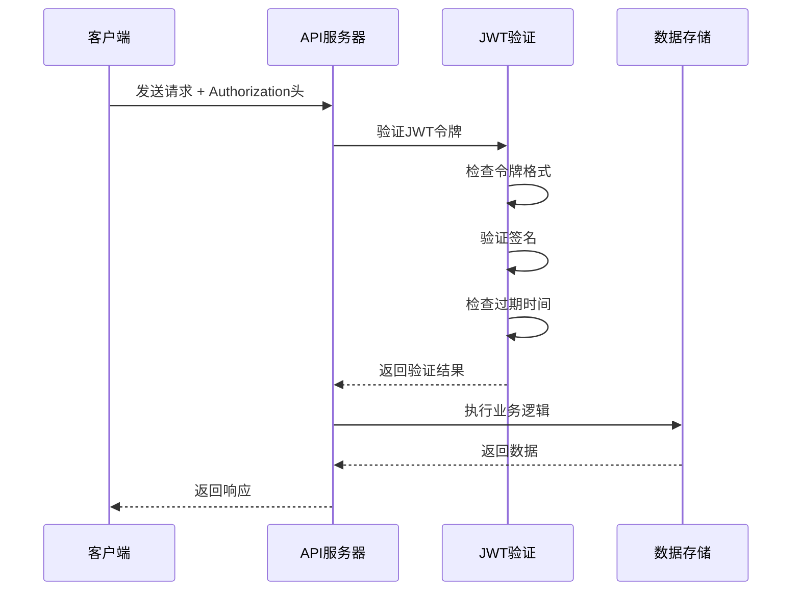
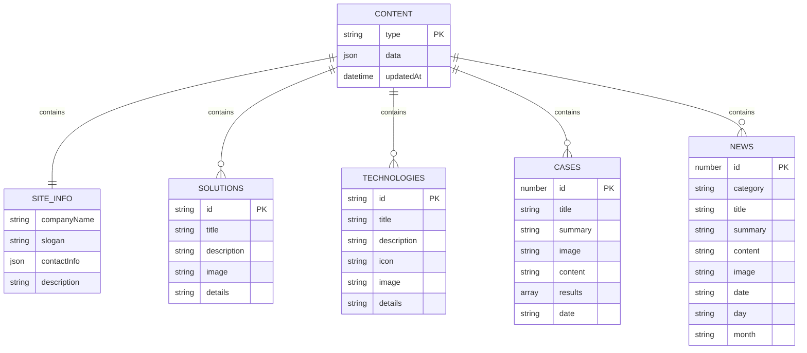
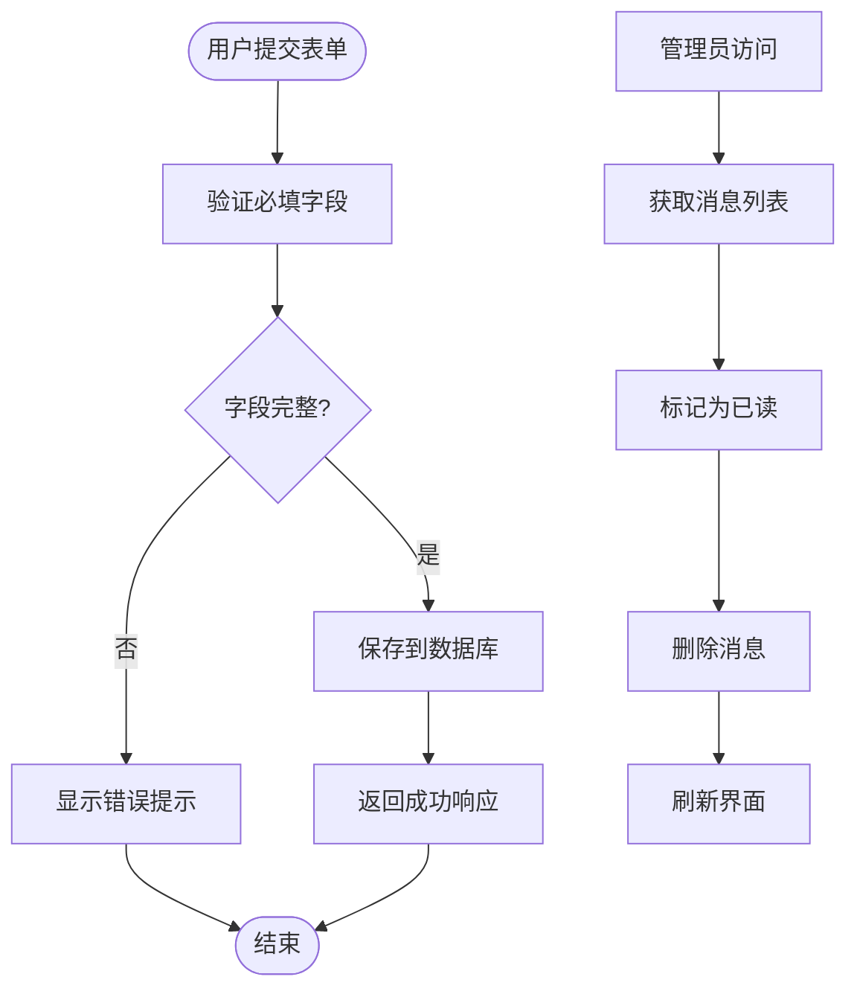
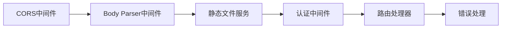

# API接口说明

<cite>
**本文档中引用的文件**
- [app.js](file://app.js)
- [src/api/index.js](file://src/api/index.js)
- [src/router/index.js](file://src/router/index.js)
- [src/store/modules/auth.js](file://src/store/modules/auth.js)
- [src/store/modules/content.js](file://src/store/modules/content.js)
- [src/store/modules/contact.js](file://src/store/modules/contact.js)
- [server.cjs](file://server.cjs)
- [package.json](file://package.json)
</cite>

## 目录
1. [简介](#简介)
2. [项目架构概览](#项目架构概览)
3. [核心API接口](#核心api接口)
4. [认证系统](#认证系统)
5. [内容管理系统](#内容管理系统)
6. [联系表单系统](#联系表单系统)
7. [API路由注册机制](#api路由注册机制)
8. [错误处理策略](#错误处理策略)
9. [前端调用示例](#前端调用示例)
10. [接口版本控制建议](#接口版本控制建议)

## 简介

本文档详细描述了基于Express.js构建的RESTful API接口系统，主要服务于朗德智能科技公司的内容管理系统。该系统提供了完整的用户认证、内容管理、联系表单处理等功能，采用前后端分离架构，支持Vue.js前端框架和Express.js后端服务。

## 项目架构概览



**图表来源**
- [src/router/index.js](file://src/router/index.js#L1-L122)
- [src/store/index.js](file://src/store/index.js#L1-L5)
- [server.cjs](file://server.cjs#L1-L298)

**章节来源**
- [src/router/index.js](file://src/router/index.js#L1-L122)
- [src/store/modules/auth.js](file://src/store/modules/auth.js#L1-L86)
- [server.cjs](file://server.cjs#L1-L298)

## 核心API接口

### 认证相关接口

#### POST /api/auth/login
**功能**: 用户登录认证
**请求参数**:
```javascript
{
  username: String,    // 用户名
  password: String     // 密码
}
```

**响应格式**:
```javascript
{
  token: String,       // JWT访问令牌
  user: {
    id: Number,        // 用户ID
    username: String,  // 用户名
    role: String       // 用户角色
  }
}
```

**状态码**:
- 200: 登录成功
- 401: 用户名或密码错误

#### POST /api/auth/validate
**功能**: 验证JWT令牌有效性
**请求参数**:
```javascript
{
  token: String        // JWT令牌
}
```

**响应格式**:
```javascript
{
  valid: Boolean,      // 令牌有效性
  user?: Object       // 用户信息（仅当有效时返回）
}
```

#### GET /api/auth/me
**功能**: 获取当前登录用户信息
**认证要求**: 需要有效的JWT令牌
**响应格式**:
```javascript
{
  id: Number,
  username: String,
  role: String
}
```

### 内容管理接口

#### GET /api/content/:type
**功能**: 获取指定类型的内容数据
**路径参数**:
- `type`: 内容类型标识符（如'site-info', 'solutions'等）

**响应格式**:
```javascript
{
  // 根据内容类型不同而变化
  // 示例：站点信息
  companyName: String,
  slogan: String,
  description: String,
  contactInfo: {
    address: String,
    phone: String,
    email: String
  }
}
```

#### PUT /api/admin/content/:type
**功能**: 更新指定类型的内容数据
**认证要求**: 需要管理员权限的JWT令牌
**路径参数**:
- `type`: 内容类型标识符

**请求参数**:
```javascript
{
  // 根据内容类型不同而变化
  // 示例：解决方案数据
  id: String,
  title: String,
  description: String,
  image: String,
  details: String
}
```

**响应格式**:
```javascript
{
  success: Boolean,
  message: String
}
```

#### POST /api/admin/upload
**功能**: 上传图片文件
**认证要求**: 需要管理员权限的JWT令牌
**请求格式**: multipart/form-data
**请求参数**:
- `image`: 图片文件

**响应格式**:
```javascript
{
  success: Boolean,
  url: String         // 图片访问URL
}
```

### 联系表单接口

#### POST /api/contact
**功能**: 提交联系表单
**请求参数**:
```javascript
{
  name: String,        // 姓名
  email: String,       // 邮箱
  phone: String,       // 电话
  message: String,     // 留言内容
  language: String     // 语言标识（zh/en）
}
```

**响应格式**:
```javascript
{
  success: Boolean,
  message: String
}
```

#### GET /api/admin/messages
**功能**: 获取所有联系消息列表
**认证要求**: 需要管理员权限的JWT令牌
**响应格式**:
```javascript
[
  {
    id: Number,
    name: String,
    email: String,
    phone: String,
    message: String,
    read: Boolean,
    createdAt: String  // ISO日期字符串
  }
]
```

#### PUT /api/admin/messages/:id/read
**功能**: 将指定消息标记为已读
**认证要求**: 需要管理员权限的JWT令牌
**路径参数**:
- `id`: 消息ID

**响应格式**:
```javascript
{
  success: Boolean
}
```

#### DELETE /api/admin/messages/:id
**功能**: 删除指定消息
**认证要求**: 需要管理员权限的JWT令牌
**路径参数**:
- `id`: 消息ID

**响应格式**:
```javascript
{
  success: Boolean
}
```

**章节来源**
- [server.cjs](file://server.cjs#L130-L298)
- [src/api/index.js](file://src/api/index.js#L1-L95)

## 认证系统

### JWT令牌机制

系统采用JSON Web Token (JWT)作为认证机制，提供以下特性：

1. **无状态认证**: 服务器无需维护会话状态
2. **安全性**: 使用密钥签名，防止令牌篡改
3. **有效期**: 默认24小时过期时间
4. **权限控制**: 支持角色基础的权限验证

### 认证中间件流程



**图表来源**
- [server.cjs](file://server.cjs#L95-L110)
- [src/store/modules/auth.js](file://src/store/modules/auth.js#L30-L50)

### 认证流程详解

1. **登录阶段**:
   - 用户提交凭据
   - 服务器验证用户名密码
   - 成功后生成JWT令牌
   - 令牌包含用户身份信息和角色

2. **请求阶段**:
   - 前端将令牌存储在localStorage
   - 每次API请求自动附加Authorization头
   - 后端中间件验证令牌有效性

3. **登出阶段**:
   - 清除localStorage中的令牌
   - 前端路由守卫检查认证状态
   - 401错误自动跳转到登录页面

**章节来源**
- [server.cjs](file://server.cjs#L95-L110)
- [src/store/modules/auth.js](file://src/store/modules/auth.js#L1-L86)

## 内容管理系统

### 数据结构设计

内容管理系统采用灵活的数据结构设计，支持多语言内容管理：



**图表来源**
- [src/store/modules/content.js](file://src/store/modules/content.js#L40-L200)
- [server.cjs](file://server.cjs#L45-L80)

### 内容更新机制

系统支持实时内容更新，采用以下机制：

1. **数据持久化**: 使用JSON文件存储内容数据
2. **缓存策略**: Pinia store提供状态管理和缓存
3. **语言切换**: 支持中英文双语内容自动切换
4. **异步加载**: 使用Promise模拟API调用，避免真实网络请求

### 内容类型说明

- **site-info**: 站点基本信息
- **solutions**: 解决方案数据
- **technologies**: 核心技术数据
- **cases**: 典型案例数据
- **news**: 新闻资讯数据

**章节来源**
- [src/store/modules/content.js](file://src/store/modules/content.js#L1-L648)
- [server.cjs](file://server.cjs#L45-L80)

## 联系表单系统

### 表单数据流



**图表来源**
- [src/store/modules/contact.js](file://src/store/modules/contact.js#L30-L50)
- [server.cjs](file://server.cjs#L115-L130)

### 消息管理功能

1. **消息存储**: 使用JSON文件存储联系消息
2. **状态跟踪**: 支持已读/未读状态管理
3. **时间戳**: 自动记录消息创建时间
4. **管理员权限**: 限制消息管理操作的访问权限

**章节来源**
- [src/store/modules/contact.js](file://src/store/modules/contact.js#L1-L135)
- [server.cjs](file://server.cjs#L115-L130)

## API路由注册机制

### Express中间件链

系统采用Express中间件架构，按以下顺序执行：



**图表来源**
- [server.cjs](file://server.cjs#L15-L25)

### 路由守卫机制

Vue Router实现了基于meta字段的路由守卫：

1. **requiresAuth**: 标记需要认证的路由
2. **认证检查**: 在beforeEach守卫中验证token
3. **重定向**: 未认证用户自动跳转到登录页面
4. **权限控制**: 管理员专用路由只能由管理员访问

### 前端API封装

前端使用Axios封装API调用：

1. **统一配置**: baseURL设置为'/api'
2. **请求拦截**: 自动添加Authorization头
3. **响应拦截**: 处理401错误和自动登出
4. **错误处理**: 统一的错误响应格式

**章节来源**
- [src/router/index.js](file://src/router/index.js#L85-L100)
- [src/api/index.js](file://src/api/index.js#L1-L95)

## 错误处理策略

### 后端错误处理

系统实现了多层次的错误处理机制：

1. **输入验证**: 参数完整性检查
2. **权限验证**: JWT令牌验证和角色检查
3. **文件上传**: Multer中间件错误处理
4. **数据持久化**: 文件读写错误捕获

### 前端错误处理

前端采用统一的错误处理策略：

1. **状态管理**: 使用Pinia store管理错误状态
2. **用户反馈**: 显示友好的错误提示
3. **自动恢复**: 错误清除和状态重置
4. **日志记录**: 控制台错误日志输出

### 错误响应格式

```javascript
{
  message: String,     // 错误描述
  // 可能包含额外的错误信息
}
```

**章节来源**
- [server.cjs](file://server.cjs#L115-L130)
- [src/store/modules/contact.js](file://src/store/modules/contact.js#L35-L50)

## 前端调用示例

### Axios调用示例

```javascript
// 登录
await axios.post('/api/auth/login', {
  username: 'admin',
  password: 'admin123'
});

// 获取内容
await axios.get('/api/content/site-info');

// 更新内容（需要认证）
await axios.put('/api/admin/content/site-info', {
  companyName: '新公司名称',
  slogan: '新标语'
});

// 提交联系表单
await axios.post('/api/contact', {
  name: '张三',
  email: 'zhangsan@example.com',
  phone: '13800138000',
  message: '咨询无人机解决方案'
});
```

### Vue组件调用示例

```javascript
// 使用Pinia store
import { useAuthStore } from '@/store/modules/auth';

const authStore = useAuthStore();

// 登录
async function handleLogin() {
  const result = await authStore.login({
    username: 'admin',
    password: 'admin123'
  });
  
  if (result.success) {
    // 登录成功处理
  }
}

// 获取内容
import { useContentStore } from '@/store/modules/content';

const contentStore = useContentStore();
await contentStore.initializeContent();
```

### 错误处理示例

```javascript
try {
  const response = await axios.post('/api/auth/login', credentials);
  // 处理成功响应
} catch (error) {
  if (error.response) {
    // 服务器返回错误响应
    console.error('API Error:', error.response.data.message);
  } else if (error.request) {
    // 请求已发出但未收到响应
    console.error('Network Error');
  } else {
    // 其他错误
    console.error('Error:', error.message);
  }
}
```

**章节来源**
- [src/api/index.js](file://src/api/index.js#L1-L95)
- [src/store/modules/auth.js](file://src/store/modules/auth.js#L15-L40)

## 接口版本控制建议

### 版本控制策略

1. **URL版本控制**: 在API路径中包含版本号
   ```
   /api/v1/auth/login
   /api/v1/content/:type
   ```

2. **媒体类型版本控制**: 使用Accept头指定版本
   ```
   Accept: application/vnd.lande.v1+json
   ```

3. **查询参数版本控制**: 通过查询参数指定版本
   ```
   /api/auth/login?version=1
   ```

### 向后兼容性

1. **新增字段**: 不影响现有客户端
2. **字段弃用**: 提供过渡期和弃用警告
3. **破坏性变更**: 创建新版本并逐步迁移
4. **文档更新**: 及时更新API文档和变更日志

### 性能优化建议

1. **缓存策略**: 实现适当的HTTP缓存头
2. **分页**: 对大量数据使用分页机制
3. **压缩**: 启用Gzip压缩减少传输大小
4. **CDN**: 使用CDN加速静态资源访问

### 安全增强建议

1. **HTTPS强制**: 所有API请求必须使用HTTPS
2. **CORS配置**: 严格控制跨域访问
3. **速率限制**: 防止API滥用和DDoS攻击
4. **输入验证**: 严格的输入参数验证和清理