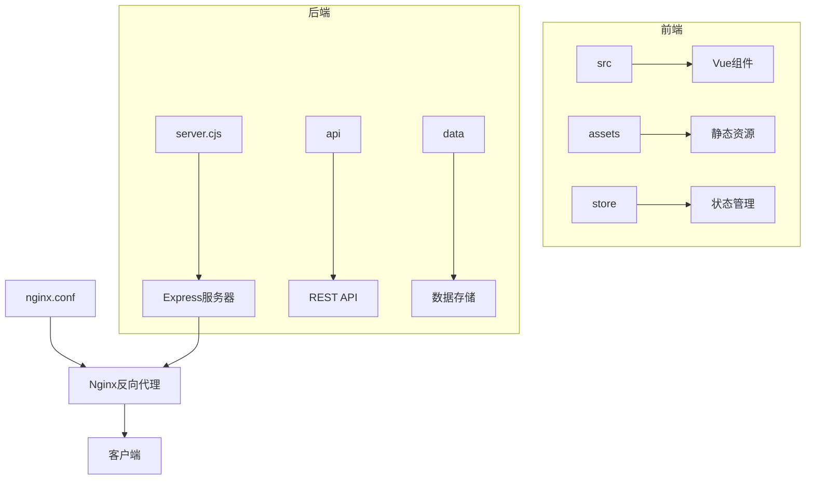
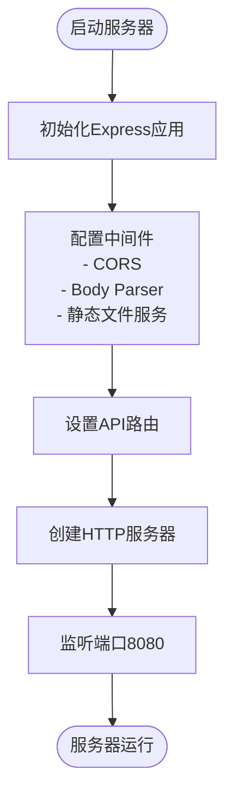
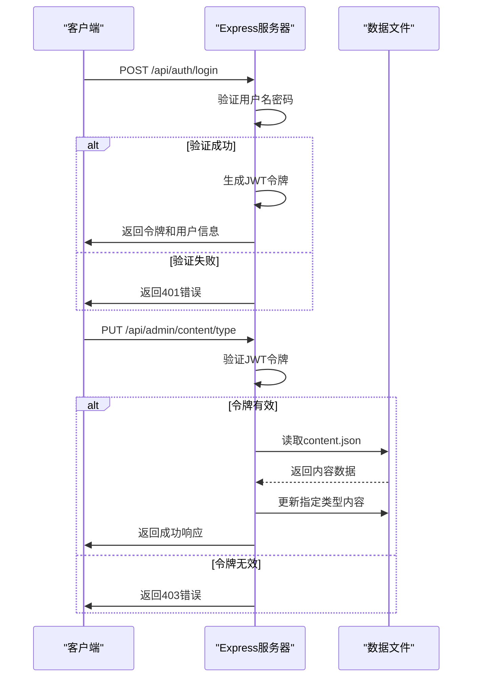
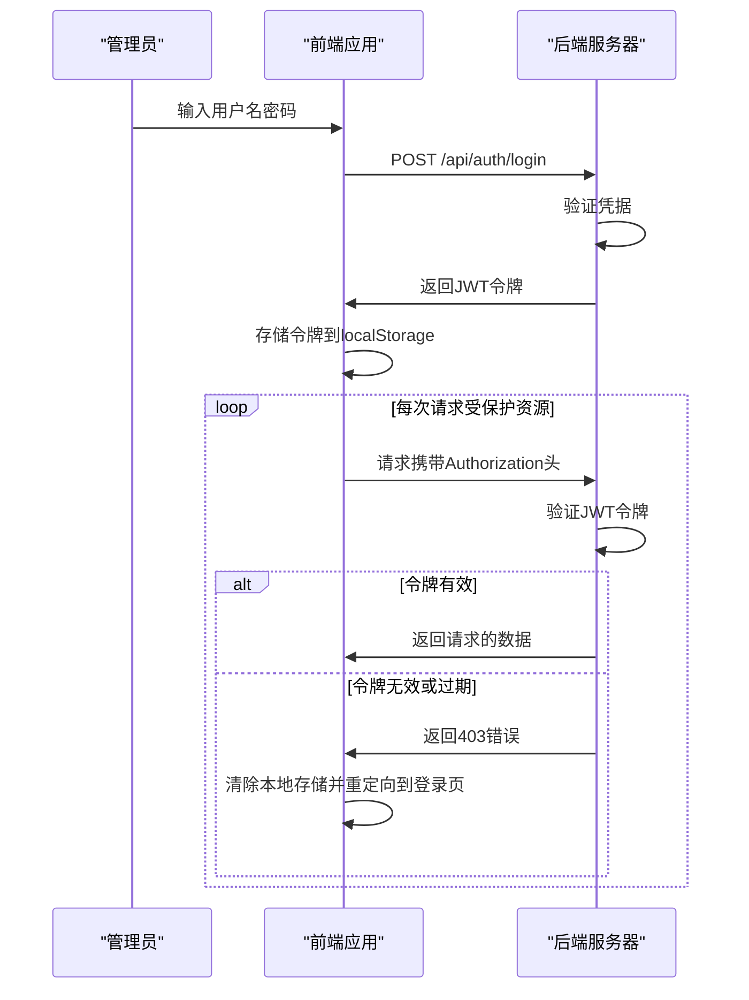
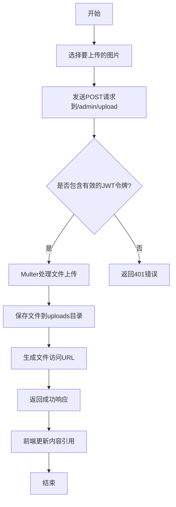
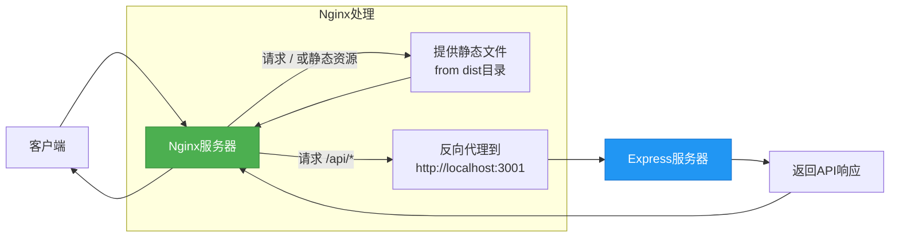

# 后端架构

<cite>
**本文档引用的文件**
- [server.cjs](file://server.cjs)
- [nginx.conf](file://nginx.conf)
- [package.json](file://package.json)
- [src/api/index.js](file://src/api/index.js)
- [src/store/modules/auth.js](file://src/store/modules/auth.js)
- [src/views/admin/AdminLoginView.vue](file://src/views/admin/AdminLoginView.vue)
- [src/components/ContactForm.vue](file://src/components/ContactForm.vue)
</cite>

## 目录
1. [项目结构](#项目结构)
2. [后端服务器配置](#后端服务器配置)
3. [API路由与处理逻辑](#api路由与处理逻辑)
4. [JWT身份验证机制](#jwt身份验证机制)
5. [Multer文件上传处理](#multer文件上传处理)
6. [Nginx反向代理配置](#nginx反向代理配置)
7. [部署拓扑视图](#部署拓扑视图)

## 项目结构

根据项目目录结构，该系统采用前后端分离架构。前端代码位于`src`目录下，使用Vue 3框架构建单页应用；后端服务由Express框架实现，主要配置在`server.cjs`文件中。静态资源经过Vite构建后输出到`dist`目录，由Express和Nginx共同提供服务。



**图表来源**
- [server.cjs](file://server.cjs#L1-L298)
- [nginx.conf](file://nginx.conf#L1-L47)

**本节来源**
- [server.cjs](file://server.cjs#L1-L298)
- [nginx.conf](file://nginx.conf#L1-L47)
- [package.json](file://package.json#L1-L34)

## 后端服务器配置

后端服务器基于Express框架构建，在`server.cjs`文件中进行配置。服务器通过`express()`初始化，并设置了一系列中间件来处理跨域请求、JSON解析和URL编码。服务器监听8080端口（可由环境变量PORT配置），并设置了JWT密钥用于身份验证。

服务器配置了静态文件服务，将`dist`目录作为根静态资源目录，同时将`uploads`目录专门用于存放用户上传的文件。这种分离式设计提高了文件管理的安全性和可维护性。



**图表来源**
- [server.cjs](file://server.cjs#L1-L298)

**本节来源**
- [server.cjs](file://server.cjs#L1-L298)
- [package.json](file://package.json#L1-L34)

## API路由与处理逻辑

系统提供了完整的RESTful API接口，主要分为三类：内容管理、用户认证和联系表单处理。API端点均以`/api`为前缀，通过`app.get`、`app.post`、`app.put`和`app.delete`方法注册不同的HTTP动词处理函数。

`/auth/login`端点接收用户名和密码，验证成功后返回JWT令牌和用户信息。`/admin/content`端点用于更新网站内容，需要管理员身份验证。这些路由的处理逻辑直接写在`server.cjs`文件中，通过读取和写入JSON文件实现数据持久化。



**图表来源**
- [server.cjs](file://server.cjs#L1-L298)
- [src/api/index.js](file://src/api/index.js#L1-L95)

**本节来源**
- [server.cjs](file://server.cjs#L1-L298)
- [src/api/index.js](file://src/api/index.js#L1-L95)

## JWT身份验证机制

系统采用JWT（JSON Web Token）实现管理员身份验证。当用户在登录页面提交正确的用户名和密码后，`/api/auth/login`端点会生成一个包含用户信息的JWT令牌，并设置24小时的有效期。

所有需要管理员权限的API端点都使用`authenticateToken`中间件进行保护。该中间件从请求头的Authorization字段提取JWT令牌，使用预设的密钥进行验证。验证成功后，用户信息会被附加到请求对象上，供后续处理函数使用。



**图表来源**
- [server.cjs](file://server.cjs#L1-L298)
- [src/store/modules/auth.js](file://src/store/modules/auth.js#L1-L86)

**本节来源**
- [server.cjs](file://server.cjs#L1-L298)
- [src/store/modules/auth.js](file://src/store/modules/auth.js#L1-L86)
- [src/views/admin/AdminLoginView.vue](file://src/views/admin/AdminLoginView.vue#L1-L105)

## Multer文件上传处理

系统使用Multer中间件处理图片文件上传。在`server.cjs`文件中，配置了磁盘存储策略，指定上传文件保存到`uploads`目录，并为每个文件生成唯一的文件名以避免冲突。

`/api/admin/upload`端点专门处理图片上传请求，该端点受到JWT身份验证保护。上传成功后，返回包含文件访问URL的JSON响应，前端可以将此URL保存到相应的内容条目中。这种设计使得内容管理系统能够动态更新网站图片资源。



**图表来源**
- [server.cjs](file://server.cjs#L1-L298)
- [src/api/index.js](file://src/api/index.js#L1-L95)

**本节来源**
- [server.cjs](file://server.cjs#L1-L298)
- [src/api/index.js](file://src/api/index.js#L1-L95)

## Nginx反向代理配置

Nginx配置文件`nginx.conf`定义了生产环境下的反向代理规则。Nginx监听80端口，作为前端静态资源和后端API请求的统一入口。通过`location`指令，实现了前端静态资源与后端API请求的分离处理。

对于根路径和其他静态资源请求，Nginx直接从`/var/www/langdetech/dist`目录提供文件服务。而对于`/api/`前缀的请求，则通过`proxy_pass`指令转发到运行在3001端口的后端Express服务器。这种架构提高了系统的安全性和性能。

Nginx还配置了gzip压缩，对多种MIME类型的响应进行压缩，减少网络传输数据量。同时设置了合理的缓存策略，对静态资源设置7天的缓存有效期，提升页面加载速度。



**图表来源**
- [nginx.conf](file://nginx.conf#L1-L47)
- [server.cjs](file://server.cjs#L1-L298)

**本节来源**
- [nginx.conf](file://nginx.conf#L1-L47)
- [server.cjs](file://server.cjs#L1-L298)

## 部署拓扑视图

整个系统的部署拓扑体现了典型的前后端分离架构。客户端通过域名访问Nginx服务器，Nginx根据请求路径决定是直接提供静态资源还是代理到后端API服务器。这种设计实现了关注点分离，提高了系统的可扩展性和安全性。

生产环境中，前端构建产物部署在Nginx服务器的静态文件目录中，而后端Express服务器独立运行。开发环境中，通过Vite的开发服务器和Node.js服务器并行运行，使用并发工具`concurrently`简化启动流程。

```mermaid
graph TB
User[用户浏览器] --> LB[负载均衡器/DNS]
subgraph "Web服务器"
LB --> Nginx((Nginx))
subgraph "静态资源"
Nginx --> Dist[/var/www/langdetech/dist]
Dist --> IndexHtml[index.html]
Dist --> Assets[CSS/JS/Images]
end
subgraph "API网关"
Nginx --> Node[Node.js服务器:3001]
subgraph "后端服务"
Node --> Express[Express应用]
Express --> Data[(data目录)]
Express --> Uploads[(uploads目录)]
end
end
end
style Nginx fill:#FF9800,stroke:#F57C00,color:white
style Node fill:#2196F3,stroke:#1976D2,color:white
style Dist fill:#4CAF50,stroke:#388E3C,color:white
```

**图表来源**
- [nginx.conf](file://nginx.conf#L1-L47)
- [server.cjs](file://server.cjs#L1-L298)
- [package.json](file://package.json#L1-L34)

**本节来源**
- [nginx.conf](file://nginx.conf#L1-L47)
- [server.cjs](file://server.cjs#L1-L298)
- [package.json](file://package.json#L1-L34)