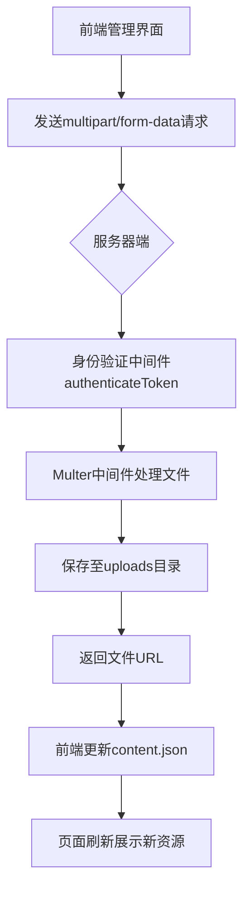
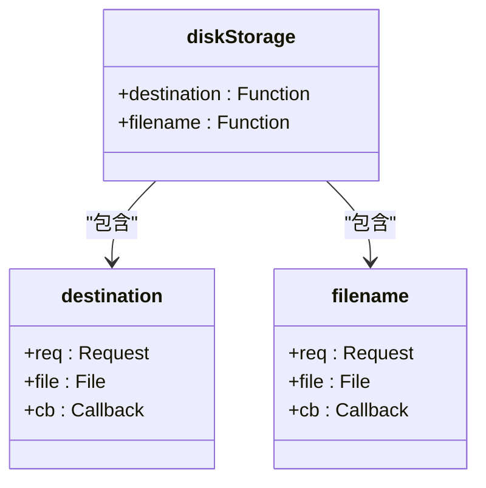
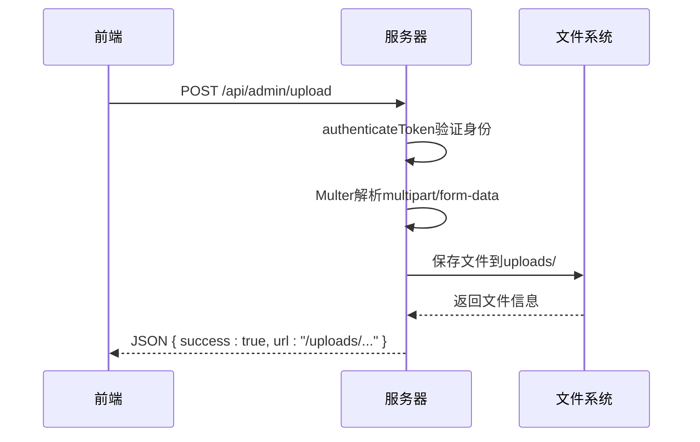

# 文件上传处理

<cite>
**本文档引用文件**  
- [server.cjs](file://server.cjs)
- [package.json](file://package.json)
- [data/content.json](file://data/content.json)
- [src/api/index.js](file://src/api/index.js)
- [src/views/admin/ContentView.vue](file://src/views/admin/ContentView.vue)
- [src/store/modules/content.js](file://src/store/modules/content.js)
</cite>

## 目录
1. [简介](#简介)
2. [项目结构与文件上传流程](#项目结构与文件上传流程)
3. [Multer中间件配置分析](#multer中间件配置分析)
4. [文件上传API接口实现](#文件上传api接口实现)
5. [前端上传功能集成](#前端上传功能集成)
6. [content.json数据同步机制](#contentjson数据同步机制)
7. [异常处理机制](#异常处理机制)
8. [优化建议](#优化建议)
9. [结论](#结论)

## 简介
本系统为内容管理系统，支持管理员通过管理后台上传图片等静态资源。文件上传功能基于Express框架的Multer中间件实现，用于处理图片上传请求，并将生成的URL写入`content.json`以供前端展示。系统具备完整的认证机制、路径管理、文件命名策略和错误处理能力。

## 项目结构与文件上传流程



**Diagram sources**  
- [server.cjs](file://server.cjs#L100-L150)
- [src/views/admin/ContentView.vue](file://src/views/admin/ContentView.vue#L100-L200)

**Section sources**
- [server.cjs](file://server.cjs#L1-L50)
- [package.json](file://package.json#L1-L20)

## Multer中间件配置分析

### 存储配置
Multer使用`diskStorage`引擎进行文件存储，具体配置如下：



**Diagram sources**  
- [server.cjs](file://server.cjs#L100-L115)

#### 文件存储路径设置
文件存储路径由`UPLOADS_DIR`常量定义，指向项目根目录下的`uploads`文件夹：
- 路径：`path.join(__dirname, 'uploads')`
- 自动创建：若目录不存在则自动创建（`fs.mkdirSync`配合`recursive: true`）

#### 文件名映射规则
采用唯一性命名策略防止冲突：
- 前缀：原始字段名（`file.fieldname`）
- 中段：时间戳+随机数（`Date.now() + '-' + Math.round(Math.random() * 1E9)`）
- 后缀：保留原始扩展名（`path.extname(file.originalname)`）
- 示例：`image-1718523456789-123456789.jpg`

#### 文件大小限制与类型过滤
当前配置中未显式设置文件大小限制和MIME类型过滤，但可通过以下方式扩展：

```javascript
const upload = multer({ 
  storage,
  limits: {
    fileSize: 5 * 1024 * 1024 // 5MB限制
  },
  fileFilter: (req, file, cb) => {
    const allowedTypes = /jpeg|jpg|png|gif/;
    const extname = allowedTypes.test(path.extname(file.originalname).toLowerCase());
    const mimetype = allowedTypes.test(file.mimetype);
    if (mimetype && extname) {
      return cb(null, true);
    } else {
      cb(new Error('仅允许上传JPG、PNG、GIF格式图片'));
    }
  }
});
```

**Section sources**
- [server.cjs](file://server.cjs#L100-L120)

## 文件上传API接口实现

### 接口定义
| 属性 | 值 |
|------|-----|
| HTTP方法 | POST |
| 路径 | `/api/admin/upload` |
| 认证要求 | 是（JWT令牌） |
| 请求体类型 | multipart/form-data |
| 字段名 | image |

### 处理流程


**Diagram sources**  
- [server.cjs](file://server.cjs#L145-L155)

### 异常处理机制
系统对常见异常进行了处理：
- **磁盘空间不足**：Node.js底层会抛出`ENOSPC`错误，应捕获并返回适当响应
- **非法文件类型**：可通过`fileFilter`函数拦截并拒绝
- **上传失败**：检查`req.file`是否存在，否则返回400状态码

示例增强代码：
```javascript
app.post('/api/admin/upload', authenticateToken, upload.single('image'), (req, res) => {
  if (!req.file) {
    return res.status(400).json({ 
      message: '文件上传失败', 
      error: req.error?.message || '未知错误' 
    });
  }
  
  try {
    // 验证文件大小
    if (req.file.size > 5 * 1024 * 1024) {
      fs.unlinkSync(req.file.path); // 删除已上传部分
      return res.status(413).json({ message: '文件大小超过5MB限制' });
    }
    
    res.json({
      success: true,
      url: `/uploads/${req.file.filename}`,
      filename: req.file.filename,
      size: req.file.size
    });
  } catch (err) {
    // 清理残留文件
    fs.unlinkSync(req.file.path);
    res.status(500).json({ message: '服务器内部错误' });
  }
});
```

**Section sources**
- [server.cjs](file://server.cjs#L145-L155)

## 前端上传功能集成

### API调用封装
在`src/api/index.js`中定义了统一的上传接口：

```javascript
uploadImage: (formData) => api.post('/admin/upload', formData, {
  headers: {
    'Content-Type': 'multipart/form-data'
  }
})
```

### 组件集成
虽然`ContentView.vue`当前版本尚未实现图像上传组件，但已预留结构可扩展：

```vue
<div class="form-group">
  <label for="solutionImage">图片URL</label>
  <input type="text" id="solutionImage" v-model="currentSolution.image" class="form-control">
  <!-- 可添加上传按钮 -->
  <button @click="triggerUpload">选择图片</button>
</div>
```

未来可集成文件输入控件并通过FormData发送请求。

**Section sources**
- [src/api/index.js](file://src/api/index.js#L50-L55)
- [src/views/admin/ContentView.vue](file://src/views/admin/ContentView.vue#L150-L160)

## content.json数据同步机制

### 数据结构分析
`content.json`采用多层级结构组织内容数据：

```json
{
  "site-info": { /* 网站基本信息 */ },
  "solutions": [ /* 解决方案列表 */ ],
  ...
}
```

### 同步流程
1. 管理员在前端修改内容（如解决方案图片URL）
2. 调用`updateContent` API (`PUT /api/admin/content/:type`)
3. 服务端更新`content.json`文件
4. 前端重新获取数据并刷新视图

### 更新操作示例
```javascript
// 在store中调用
await contentStore.updateContent('solutions', updatedSolutionsArray);
```

该操作最终触发`axios.put('/api/admin/content/solutions', data)`请求。

**Section sources**
- [data/content.json](file://data/content.json#L1-L28)
- [server.cjs](file://server.cjs#L75-L85)
- [src/store/modules/content.js](file://src/store/modules/content.js#L600-L620)

## 异常处理机制

### 已实现的异常处理
- **身份验证失败**：返回401或403状态码
- **内容不存在**：GET请求返回40