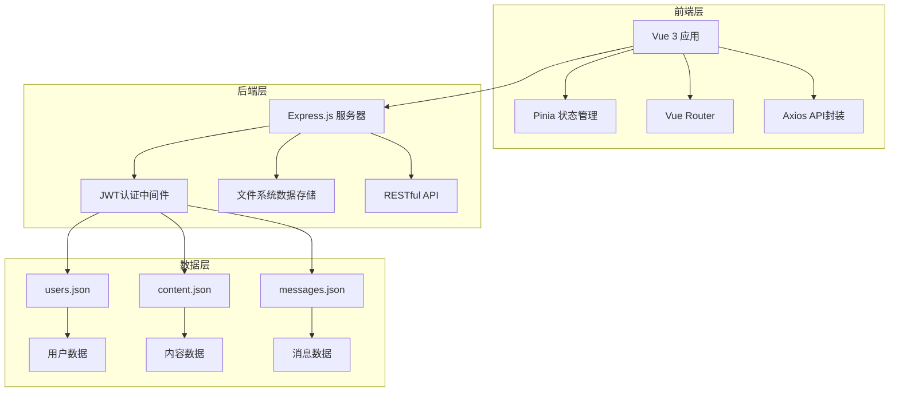
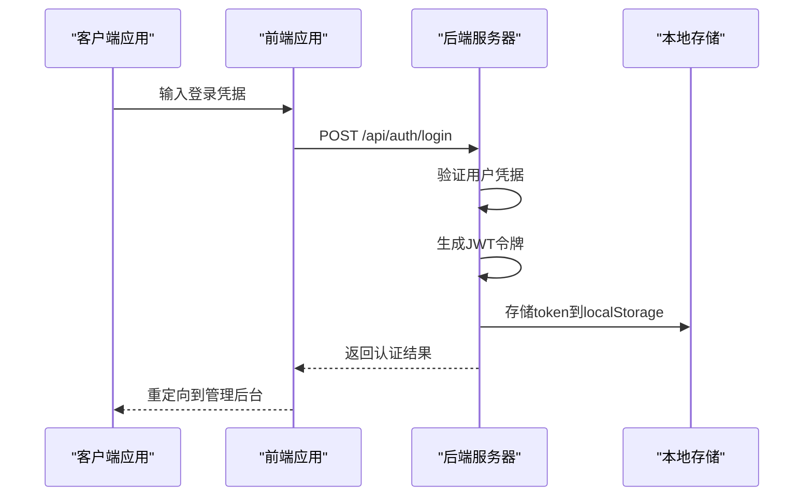
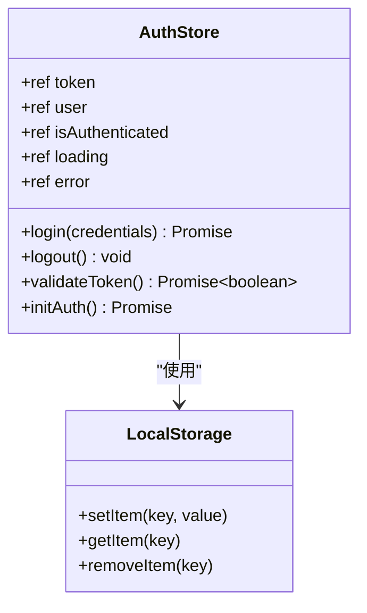
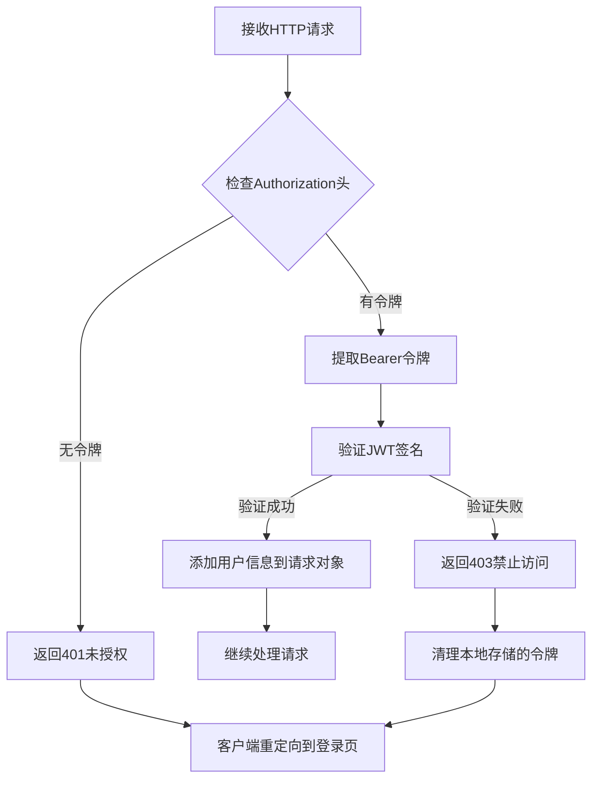
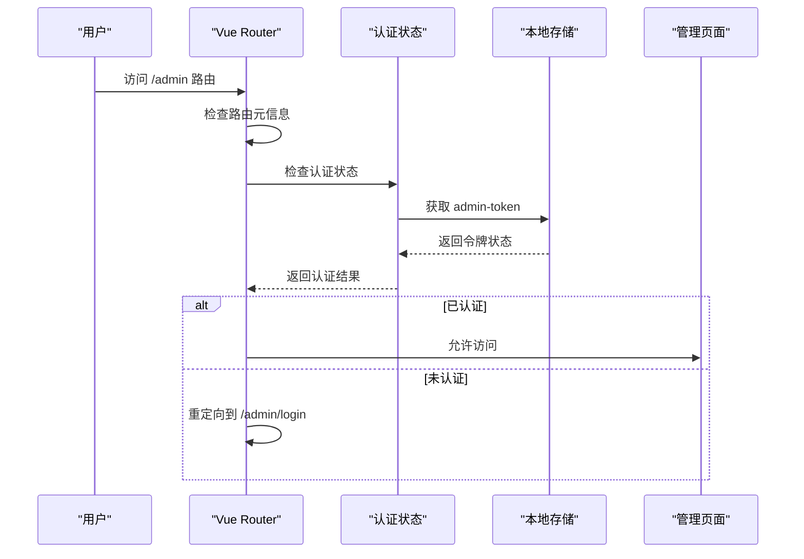
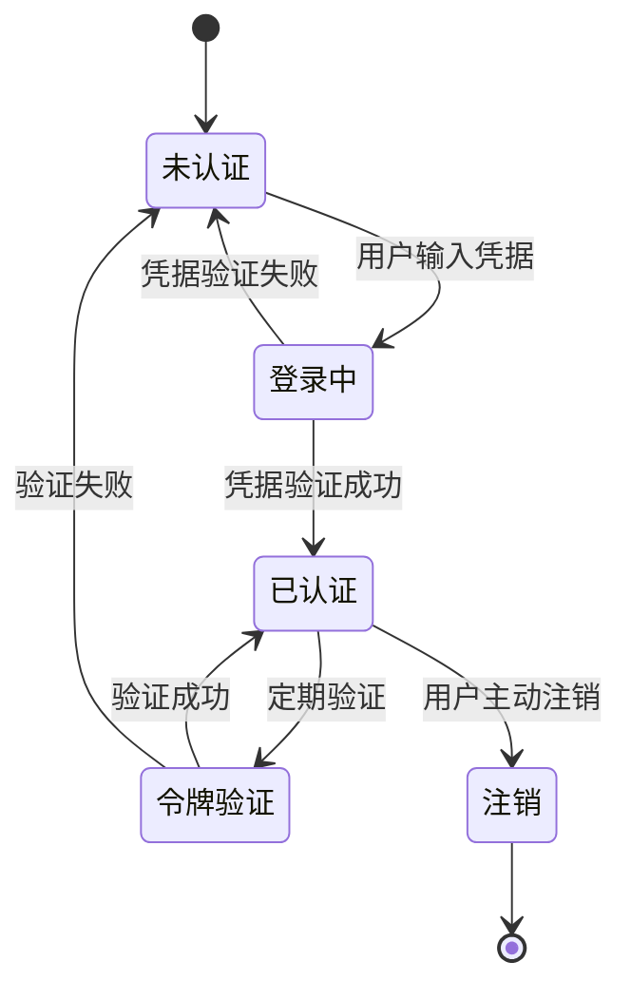

# 认证机制

<cite>
**本文档中引用的文件**
- [app.js](file://app.js)
- [src/api/index.js](file://src/api/index.js)
- [src/store/modules/auth.js](file://src/store/modules/auth.js)
- [src/views/admin/AdminLoginView.vue](file://src/views/admin/AdminLoginView.vue)
- [src/router/index.js](file://src/router/index.js)
- [server.cjs](file://server.cjs)
- [data/users.json](file://data/users.json)
- [package.json](file://package.json)
- [README.md](file://README.md)
</cite>

## 目录
1. [简介](#简介)
2. [项目架构概览](#项目架构概览)
3. [JWT认证机制](#jwt认证机制)
4. [前端认证实现](#前端认证实现)
5. [后端认证实现](#后端认证实现)
6. [路由守卫机制](#路由守卫机制)
7. [安全防护措施](#安全防护措施)
8. [调试与故障排除](#调试与故障排除)
9. [总结](#总结)

## 简介

本文档深入阐述基于JWT（JSON Web Token）的身份验证机制实现细节，重点分析杭州朗德智能科技有限公司官网项目中的认证流程。该项目采用现代化的Vue 3前端框架配合Express.js后端，实现了完整的管理员身份验证系统，包括token生成、签发、校验以及会话管理等功能。

认证系统的核心特点：
- 基于JWT的标准身份验证机制
- 前后端分离的架构设计
- 完整的管理员权限控制
- 安全的会话管理和令牌过期处理
- 多层次的安全防护措施

## 项目架构概览



**图表来源**
- [src/api/index.js](file://src/api/index.js#L1-L95)
- [server.cjs](file://server.cjs#L1-L298)

**章节来源**
- [README.md](file://README.md#L1-L137)
- [package.json](file://package.json#L1-L34)

## JWT认证机制

### Token生成与签发流程

JWT认证系统的核心在于token的生成、签发和验证过程。整个流程遵循标准的JWT规范，确保安全性的同时保持高效的性能。



**图表来源**
- [server.cjs](file://server.cjs#L230-L250)
- [src/store/modules/auth.js](file://src/store/modules/auth.js#L15-L35)

### Token结构与内容

JWT令牌包含三个主要部分：头部（Header）、载荷（Payload）和签名（Signature）。在本项目中，令牌载荷包含以下关键信息：

- **用户标识**：`id` - 用户唯一标识符
- **用户名**：`username` - 用户登录名
- **角色权限**：`role` - 用户角色（admin）
- **过期时间**：`exp` - 令牌有效期（24小时）

### Authorization头解析过程

前端应用通过Axios拦截器自动处理Authorization头的添加：

```javascript
// 请求拦截器 - 自动添加JWT令牌
api.interceptors.request.use(
  config => {
    const token = localStorage.getItem('admin-token')
    if (token) {
      config.headers.Authorization = `Bearer ${token}`
    }
    return config
  },
  error => {
    return Promise.reject(error)
  }
)
```

这种设计确保每次API请求都自动携带有效的认证令牌，无需手动处理。

**章节来源**
- [src/api/index.js](file://src/api/index.js#L10-L25)
- [server.cjs](file://server.cjs#L230-L250)

## 前端认证实现

### Pinia状态管理

前端采用Pinia作为状态管理工具，集中管理认证相关的状态和操作：



**图表来源**
- [src/store/modules/auth.js](file://src/store/modules/auth.js#L1-L85)

### 登录流程实现

登录流程包含完整的错误处理和用户体验优化：

```javascript
// 登录方法实现
const login = async (credentials) => {
  loading.value = true
  error.value = null
  
  try {
    const response = await axios.post('/api/auth/login', credentials)
    
    if (response.data.token) {
      token.value = response.data.token
      user.value = response.data.user
      isAuthenticated.value = true
      
      // 保存到本地存储
      localStorage.setItem('admin-token', token.value)
      localStorage.setItem('admin-user', JSON.stringify(user.value))
      
      return { success: true }
    } else {
      throw new Error('认证失败')
    }
  } catch (e) {
    error.value = e.message || '登录失败，请检查账号和密码'
    return { success: false, error: error.value }
  } finally {
    loading.value = false
  }
}
```

### 令牌验证机制

系统提供了自动化的令牌验证机制，在应用初始化时检查令牌的有效性：

```javascript
// 初始化用户认证状态
const initAuth = async () => {
  if (token.value) {
    const isValid = await validateToken()
    isAuthenticated.value = isValid
    if (!isValid) logout()
  }
}

// 验证令牌有效性
const validateToken = async () => {
  if (!token.value) return false
  
  try {
    const response = await axios.post('/api/auth/validate', { token: token.value })
    return response.data.valid
  } catch (e) {
    logout()
    return false
  }
}
```

**章节来源**
- [src/store/modules/auth.js](file://src/store/modules/auth.js#L15-L85)
- [src/views/admin/AdminLoginView.vue](file://src/views/admin/AdminLoginView.vue#L40-L50)

## 后端认证实现

### JWT认证中间件

后端实现了专门的JWT认证中间件，用于保护需要认证的API端点：



**图表来源**
- [server.cjs](file://server.cjs#L100-L120)

### 认证中间件实现

```javascript
// JWT认证中间件
const authenticateToken = (req, res, next) => {
  const authHeader = req.headers['authorization']
  const token = authHeader && authHeader.split(' ')[1]
  
  if (!token) {
    return res.status(401).json({ message: '未提供认证令牌' })
  }
  
  jwt.verify(token, JWT_SECRET, (err, user) => {
    if (err) {
      return res.status(403).json({ message: '令牌无效或已过期' })
    }
    req.user = user
    next()
  })
}
```

### 用户登录处理

登录请求的处理流程包括凭据验证和JWT令牌生成：

```javascript
// 用户登录
app.post('/api/auth/login', (req, res) => {
  const { username, password } = req.body
  const users = readDataFile(USERS_FILE) || []
  
  const user = users.find(u => u.username === username && u.password === password)
  
  if (user) {
    // 生成JWT令牌
    const token = jwt.sign(
      { id: user.id, username: user.username, role: user.role },
      JWT_SECRET,
      { expiresIn: '24h' }
    )
    
    res.json({
      token,
      user: {
        id: user.id,
        username: user.username,
        role: user.role
      }
    })
  } else {
    res.status(401).json({ message: '用户名或密码错误' })
  }
})
```

### 令牌验证API

为了支持前端的令牌验证功能，后端提供了专门的验证API：

```javascript
// 验证令牌
app.post('/api/auth/validate', (req, res) => {
  const { token } = req.body
  
  if (!token) {
    return res.json({ valid: false })
  }
  
  jwt.verify(token, JWT_SECRET, (err, decoded) => {
    if (err) {
      return res.json({ valid: false })
    }
    
    res.json({ valid: true, user: decoded })
  })
})
```

**章节来源**
- [server.cjs](file://server.cjs#L100-L120)
- [server.cjs](file://server.cjs#L230-L250)
- [server.cjs](file://server.cjs#L252-L270)

## 路由守卫机制

### 前端路由守卫

Vue Router提供了全局前置守卫，用于保护需要认证的路由：



**图表来源**
- [src/router/index.js](file://src/router/index.js#L95-L110)

### 路由配置

```javascript
// 路由守卫，用于管理员认证
router.beforeEach((to, from, next) => {
  if (to.matched.some(record => record.meta.requiresAuth)) {
    // 检查用户是否已登录
    const isLoggedIn = localStorage.getItem('admin-token')
    if (!isLoggedIn) {
      // 如果没有登录，重定向到登录页面
      next({ name: 'admin-login' })
    } else {
      next()
    }
  } else {
    next()
  }
})
```

### 后端路由保护

后端API路由也采用了相应的保护措施：

```javascript
// 更新内容（需要认证）
app.put('/api/admin/content/:type', authenticateToken, (req, res) => {
  // 只有通过认证的请求才能访问此端点
  const contentType = req.params.type
  const newContent = req.body
  const contentData = readDataFile(CONTENT_FILE)
  
  if (contentData) {
    contentData[contentType] = newContent
    writeDataFile(CONTENT_FILE, contentData)
    res.json({ success: true, message: '内容已更新' })
  } else {
    res.status(500).json({ message: '内容数据读取失败' })
  }
})
```

**章节来源**
- [src/router/index.js](file://src/router/index.js#L95-L110)
- [server.cjs](file://server.cjs#L122-L135)

## 安全防护措施

### 防止重放攻击

系统通过多种机制防止重放攻击：

1. **令牌过期机制**：JWT令牌设置24小时有效期
2. **单次使用原则**：令牌在有效期内只能使用一次
3. **即时失效**：一旦发现异常，立即使令牌失效

### 会话管理



### 错误处理与安全响应

后端实现了完善的错误处理机制：

```javascript
// 响应拦截器 - 处理认证错误
api.interceptors.response.use(
  response => {
    return response
  },
  error => {
    if (error.response) {
      // 处理401错误（未授权）
      if (error.response.status === 401) {
        localStorage.removeItem('admin-token')
        localStorage.removeItem('admin-user')
        // 如果是在管理后台，则跳转到登录页面
        if (window.location.pathname.startsWith('/admin')) {
          window.location.href = '/admin/login'
        }
      }
    }
    return Promise.reject(error)
  }
)
```

### 安全最佳实践

1. **HTTPS强制使用**：建议在生产环境中启用HTTPS
2. **JWT密钥管理**：使用环境变量存储密钥
3. **密码存储**：实际应用中应使用加密存储密码
4. **请求限制**：添加适当的请求频率限制
5. **文件上传安全**：验证上传文件类型和大小

**章节来源**
- [src/api/index.js](file://src/api/index.js#L27-L45)
- [README.md](file://README.md#L85-L95)

## 调试与故障排除

### 常见认证失败场景

#### 场景1：令牌过期
**症状**：用户登录后一段时间无法访问受保护的页面
**原因**：JWT令牌有效期为24小时，过期后需要重新登录
**解决方案**：
- 检查浏览器开发者工具中的Network面板
- 查看响应状态码是否为403
- 重新登录获取新的令牌

#### 场景2：本地存储损坏
**症状**：登录后仍然提示未认证
**原因**：localStorage中的令牌数据被意外修改或删除
**解决方案**：
```javascript
// 手动清除本地存储并重新登录
localStorage.removeItem('admin-token')
localStorage.removeItem('admin-user')
// 刷新页面重新登录
```

#### 场景3：后端JWT密钥不匹配
**症状**：令牌验证总是失败
**原因**：前端和后端使用的JWT密钥不一致
**解决方案**：
- 检查后端的JWT_SECRET配置
- 确保前后端使用相同的密钥
- 重启服务器应用新的密钥配置

### 调试方法

#### 前端调试
1. 打开浏览器开发者工具
2. 查看Application -> Storage -> Local Storage
3. 检查admin-token是否存在且格式正确
4. 使用Network面板查看API请求和响应

#### 后端调试
1. 启用调试模式：`DEBUG=express:* npm run server`
2. 检查服务器控制台输出
3. 验证JWT密钥配置
4. 查看文件系统权限

### 性能监控

建议监控以下指标：
- JWT令牌生成时间
- 认证中间件处理时间
- API响应时间
- 错误率统计

**章节来源**
- [src/api/index.js](file://src/api/index.js#L27-L45)
- [server.cjs](file://server.cjs#L100-L120)

## 总结

本项目实现了一个完整且安全的JWT认证系统，具有以下特点：

### 技术优势
1. **标准化实现**：完全遵循JWT标准规范
2. **前后端分离**：清晰的架构分离，便于维护
3. **状态管理**：使用Pinia实现集中式状态管理
4. **路由保护**：双重保护机制确保安全性

### 安全特性
1. **令牌过期**：24小时有效期防止长期滥用
2. **自动验证**：定期验证令牌有效性
3. **错误处理**：完善的错误处理和用户反馈
4. **会话管理**：自动清理无效会话

### 扩展性
1. **模块化设计**：易于扩展新的认证方式
2. **插件化架构**：支持第三方认证服务集成
3. **多语言支持**：内置国际化支持
4. **响应式设计**：适配各种设备和屏幕尺寸

### 改进建议
1. **数据库迁移**：从文件系统迁移到数据库存储
2. **密码加密**：使用bcrypt等算法加密存储密码
3. **多因素认证**：添加短信验证码等额外验证
4. **审计日志**：记录用户登录和操作日志
5. **速率限制**：添加API请求频率限制

该认证系统为杭州朗德智能科技有限公司提供了可靠的身份验证基础，确保了管理后台的安全访问，同时保持了良好的用户体验和系统的可维护性。