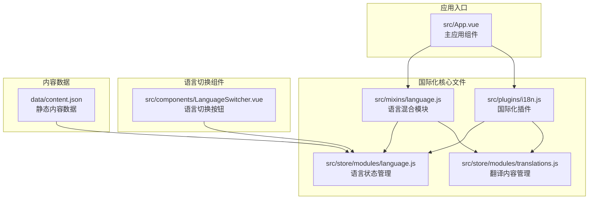
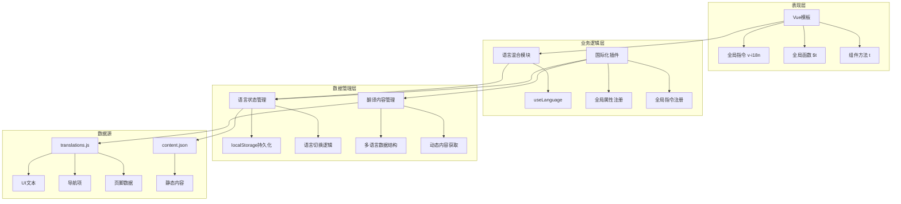
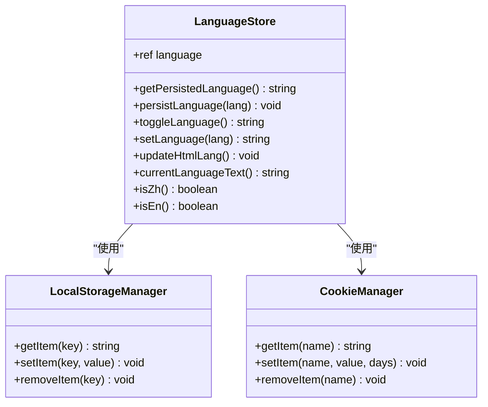
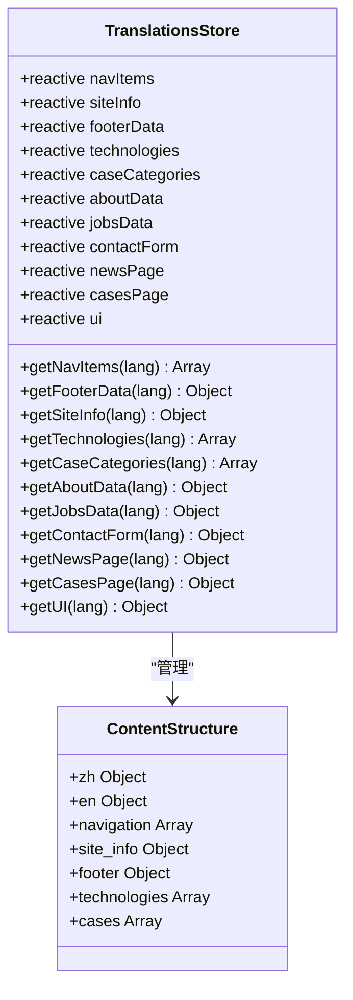
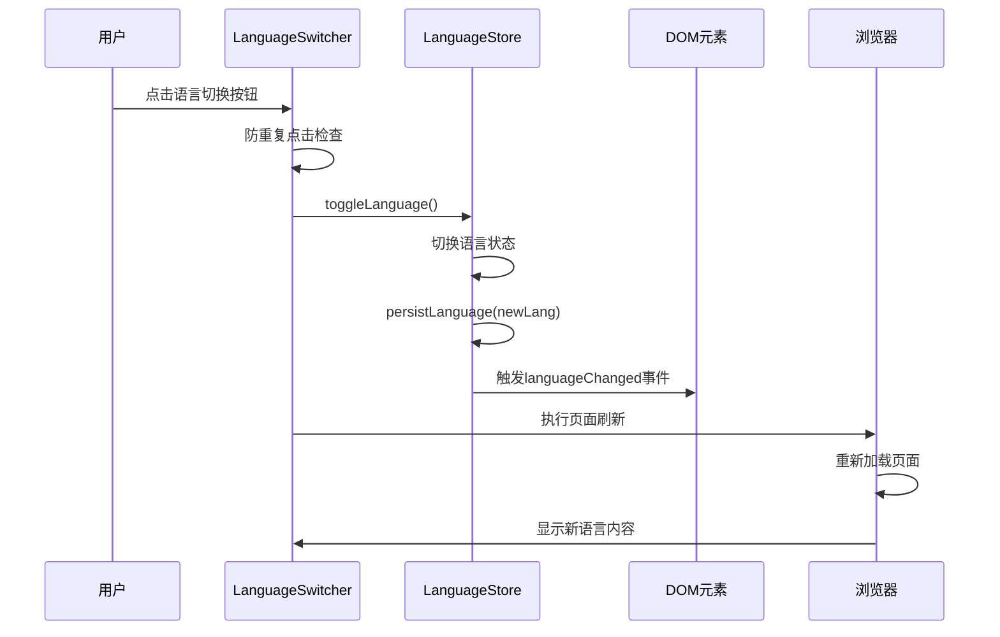
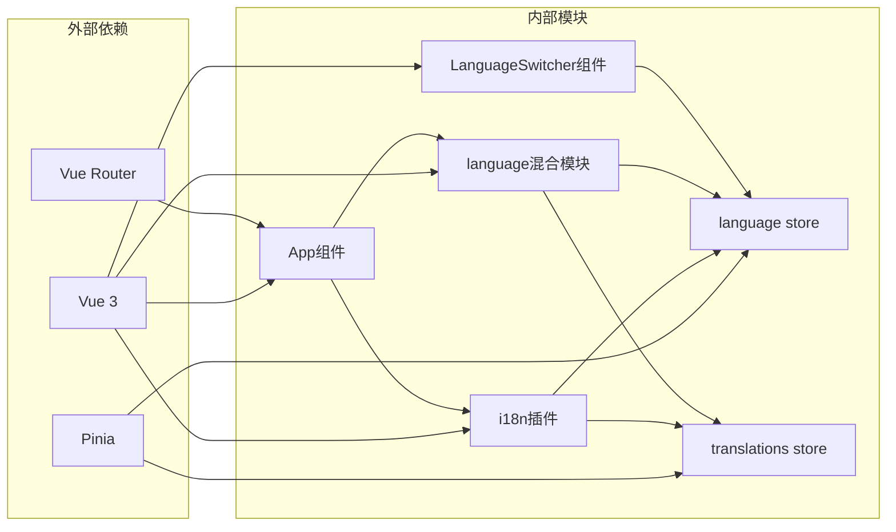

# 国际化实现

<cite>
**本文档中引用的文件**
- [src/plugins/i18n.js](file://src/plugins/i18n.js)
- [src/mixins/language.js](file://src/mixins/language.js)
- [src/store/modules/language.js](file://src/store/modules/language.js)
- [src/store/modules/translations.js](file://src/store/modules/translations.js)
- [src/components/LanguageSwitcher.vue](file://src/components/LanguageSwitcher.vue)
- [src/App.vue](file://src/App.vue)
- [src/views/HomeView.vue](file://src/views/HomeView.vue)
- [data/content.json](file://data/content.json)
</cite>

## 目录
1. [简介](#简介)
2. [项目结构](#项目结构)
3. [核心组件](#核心组件)
4. [架构概览](#架构概览)
5. [详细组件分析](#详细组件分析)
6. [依赖关系分析](#依赖关系分析)
7. [性能考虑](#性能考虑)
8. [故障排除指南](#故障排除指南)
9. [结论](#结论)

## 简介

该项目实现了一套完整的国际化(i18n)支持机制，为多语言网站提供了全面的本地化解决方案。系统支持中文和英文两种语言，通过Vue.js生态系统中的Pinia状态管理库、自定义插件和混合模块实现了灵活且高效的多语言支持。

该国际化系统的核心特点包括：
- 基于Pinia的状态管理
- 全局语言切换功能
- 自动语言持久化
- Vue模板中的直接翻译支持
- 组件级别的语言切换
- 完整的多语言内容管理

## 项目结构

国际化系统的文件组织结构如下：



**图表来源**
- [src/plugins/i18n.js](file://src/plugins/i18n.js#L1-L72)
- [src/mixins/language.js](file://src/mixins/language.js#L1-L127)
- [src/store/modules/language.js](file://src/store/modules/language.js#L1-L215)
- [src/store/modules/translations.js](file://src/store/modules/translations.js#L1-L633)

## 核心组件

### 国际化插件 (i18n.js)

国际化插件是整个系统的核心，负责注册全局语言功能和指令：

```javascript
// 注册全局翻译函数
app.config.globalProperties.$t = (key, defaultValue = '') => {
  const ui = translationsStore.getUI(languageStore.language)
  return ui[key] || defaultValue
}

// 注册全局指令
app.directive('i18n', {
  mounted(el, binding) {
    const ui = translationsStore.getUI(languageStore.language)
    el.textContent = ui[binding.value] || binding.value
    
    // 添加语言变化监听器
    const updateText = () => {
      const currentUi = translationsStore.getUI(languageStore.language)
      el.textContent = currentUi[binding.value] || binding.value
    }
    
    el._i18nHandler = () => updateText()
    document.addEventListener('languageChanged', el._i18nHandler)
  }
})
```

### 语言混合模块 (language.js)

语言混合模块提供了组件级别的语言功能封装：

```javascript
export function useLanguage() {
  const languageStore = useLanguageStore()
  const translationsStore = useTranslationsStore()
  
  const currentLanguage = computed(() => languageStore.language)
  const isZh = computed(() => languageStore.isZh())
  const isEn = computed(() => languageStore.isEn())
  
  const toggleLanguage = () => languageStore.toggleLanguage()
  const setLanguage = (lang) => languageStore.setLanguage(lang)
  
  return {
    currentLanguage,
    isZh,
    isEn,
    toggleLanguage,
    setLanguage,
    t: (key, defaultValue = '') => translationsStore.getUI(currentLanguage.value)[key] || defaultValue
  }
}
```

**章节来源**
- [src/plugins/i18n.js](file://src/plugins/i18n.js#L1-L72)
- [src/mixins/language.js](file://src/mixins/language.js#L1-L127)

## 架构概览

国际化系统采用分层架构设计，确保了代码的模块化和可维护性：



**图表来源**
- [src/plugins/i18n.js](file://src/plugins/i18n.js#L1-L72)
- [src/mixins/language.js](file://src/mixins/language.js#L1-L127)
- [src/store/modules/language.js](file://src/store/modules/language.js#L1-L215)
- [src/store/modules/translations.js](file://src/store/modules/translations.js#L1-L633)

## 详细组件分析

### 语言状态管理模块

语言状态管理模块负责维护当前语言状态并提供持久化功能：



**图表来源**
- [src/store/modules/language.js](file://src/store/modules/language.js#L1-L215)

#### 语言持久化机制

系统实现了双重持久化策略，确保语言设置的可靠性：

```javascript
// 从localStorage和cookie尝试获取语言设置
function getPersistedLanguage() {
  let lang = null;
  
  // 首先从localStorage读取
  try {
    lang = localStorage.getItem('language');
  } catch (e) {
    console.error('从localStorage读取语言失败:', e);
  }
  
  // 如果localStorage没有，尝试从cookie读取
  if (!lang || (lang !== 'zh' && lang !== 'en')) {
    try {
      const cookies = document.cookie.split(';');
      for (let cookie of cookies) {
        const [name, value] = cookie.trim().split('=');
        if (name === 'language') {
          lang = value;
          break;
        }
      }
    } catch (e) {
      console.error('从cookie读取语言失败:', e);
    }
  }
  
  return lang || 'zh';
}

// 持久化保存语言设置到localStorage和cookie
function persistLanguage(lang) {
  try {
    localStorage.setItem('language', lang);
  } catch (e) {
    console.error('保存到localStorage失败:', e);
  }
  
  try {
    document.cookie = `language=${lang}; path=/; max-age=${60*60*24*30}`;
  } catch (e) {
    console.error('保存到cookie失败:', e);
  }
}
```

### 翻译内容管理模块

翻译内容管理模块提供了完整的多语言内容结构：



**图表来源**
- [src/store/modules/translations.js](file://src/store/modules/translations.js#L1-L633)

#### 多语言内容结构示例

系统采用键值对的形式组织多语言内容：

```javascript
// UI元素翻译
const ui = reactive({
  zh: {
    loading: '加载中...',
    readMore: '阅读更多',
    contact: '联系我们',
    submit: '提交',
    menu: '菜单导航',
    home: '首页'
  },
  en: {
    loading: 'Loading...',
    readMore: 'Read More',
    contact: 'Contact Us',
    submit: 'Submit',
    menu: 'Navigation',
    home: 'Home'
  }
})

// 导航项翻译
const navItems = reactive({
  zh: [
    { text: '首页', link: '/', id: 'home' },
    { text: '反无人机系统', link: '/technology', id: 'technology' },
    { text: '无人机系统', link: '/drone-system', id: 'drone-system' }
  ],
  en: [
    { text: 'Home', link: '/', id: 'home' },
    { text: 'Anti-UAV System', link: '/technology', id: 'technology' },
    { text: 'Drone Systems', link: '/drone-system', id: 'drone-system' }
  ]
})
```

### 语言切换组件

语言切换组件提供了用户友好的语言切换界面：



**图表来源**
- [src/components/LanguageSwitcher.vue](file://src/components/LanguageSwitcher.vue#L1-L184)

#### 语言切换流程

语言切换组件实现了复杂的刷新机制以确保语言设置的一致性：

```javascript
const handleLanguageSwitch = () => {
  if (isProcessing.value) return;
  
  isProcessing.value = true;
  
  try {
    const currentLang = languageStore.language;
    const newLang = currentLang === 'zh' ? 'en' : 'zh';
    
    // 确保localStorage和cookie设置正确
    localStorage.setItem('language', newLang);
    document.cookie = `language=${newLang}; path=/; max-age=${60*60*24*30}`;
    
    // 插入强制确保语言设置的脚本
    const forceScript = document.createElement('script');
    forceScript.textContent = `
      localStorage.setItem('language', "${newLang}");
      document.cookie = 'language=${newLang}; path=/; max-age=${60*60*24*30}';
    `;
    document.head.appendChild(forceScript);
    
    // 最后调用store的toggleLanguage
    languageStore.setLanguage(newLang);
    
    // 执行页面刷新
    setTimeout(() => {
      window.location.reload();
    }, 100);
    
  } catch (error) {
    console.error('语言切换出错:', error);
    isProcessing.value = false;
  }
}
```

**章节来源**
- [src/store/modules/language.js](file://src/store/modules/language.js#L1-L215)
- [src/store/modules/translations.js](file://src/store/modules/translations.js#L1-L633)
- [src/components/LanguageSwitcher.vue](file://src/components/LanguageSwitcher.vue#L1-L184)

## 依赖关系分析

国际化系统的依赖关系展现了清晰的分层架构：



**图表来源**
- [src/plugins/i18n.js](file://src/plugins/i18n.js#L1-L72)
- [src/mixins/language.js](file://src/mixins/language.js#L1-L127)
- [src/store/modules/language.js](file://src/store/modules/language.js#L1-L215)
- [src/store/modules/translations.js](file://src/store/modules/translations.js#L1-L633)

### 核心依赖关系

1. **i18n插件**依赖于：
   - language store：获取当前语言状态
   - translations store：获取翻译内容

2. **language混合模块**依赖于：
   - language store：获取语言状态
   - translations store：获取翻译内容
   - content store：获取动态内容
   - contact store：获取联系表单翻译
   - cases store：获取案例数据

3. **语言切换组件**依赖于：
   - language store：执行语言切换
   - vue-router：页面路由跳转

**章节来源**
- [src/plugins/i18n.js](file://src/plugins/i18n.js#L1-L72)
- [src/mixins/language.js](file://src/mixins/language.js#L1-L127)
- [src/components/LanguageSwitcher.vue](file://src/components/LanguageSwitcher.vue#L1-L184)

## 性能考虑

### 语言切换性能优化

系统采用了多种性能优化策略：

1. **延迟加载**：翻译内容按需加载，避免一次性加载所有语言数据
2. **缓存机制**：翻译内容使用reactive对象缓存，避免重复计算
3. **事件监听优化**：使用事件委托减少内存占用
4. **DOM操作优化**：批量更新DOM元素，减少重绘和回流

### 内存管理

```javascript
// 组件卸载时清理事件监听器
unmounted(el) {
  document.removeEventListener('languageChanged', el._i18nHandler)
  delete el._i18nHandler
}
```

### 语言切换动画

系统提供了流畅的语言切换动画体验：

```css
/* 语言切换按钮动画 */
@keyframes langSwitchFade {
  0% { opacity: 0; transform: translateY(10px); }
  100% { opacity: 1; transform: translateY(0); }
}

.lang-switch span {
  animation: langSwitchFade 0.3s ease forwards;
}
```

## 故障排除指南

### 常见问题及解决方案

#### 1. 语言切换后页面不刷新

**问题描述**：点击语言切换按钮后，页面内容没有更新

**解决方案**：
- 检查localStorage中是否存在`language`键
- 确认浏览器允许使用localStorage
- 验证cookie设置是否正确

```javascript
// 调试语言设置
console.log('localStorage language:', localStorage.getItem('language'))
console.log('document.cookie:', document.cookie)
```

#### 2. 翻译内容缺失

**问题描述**：某些文本没有正确翻译

**解决方案**：
- 检查translations.js中对应的翻译键值
- 确认当前语言设置正确
- 验证翻译键名拼写

#### 3. 语言切换组件失效

**问题描述**：语言切换按钮点击无反应

**解决方案**：
- 检查组件是否正确注册
- 确认store实例可用
- 验证事件监听器是否正常工作

**章节来源**
- [src/store/modules/language.js](file://src/store/modules/language.js#L1-L215)
- [src/components/LanguageSwitcher.vue](file://src/components/LanguageSwitcher.vue#L1-L184)

## 结论

该项目的国际化实现展现了现代前端应用的最佳实践，通过以下特点实现了高质量的多语言支持：

### 主要优势

1. **架构清晰**：采用分层架构，职责分离明确
2. **性能优秀**：优化的缓存机制和DOM操作
3. **用户体验好**：流畅的语言切换动画和即时反馈
4. **可维护性强**：模块化设计，易于扩展和维护
5. **可靠性高**：双重持久化策略，确保语言设置稳定

### 扩展建议

1. **支持更多语言**：可以通过扩展translations.js中的语言键值来添加新语言
2. **动态内容管理**：可以考虑将content.json中的内容也支持多语言
3. **翻译工具集成**：可以集成专业的翻译管理工具
4. **SEO优化**：为搜索引擎提供多语言版本支持

该国际化系统为构建全球化的Web应用提供了坚实的基础，其设计理念和实现方式值得在类似项目中借鉴和应用。