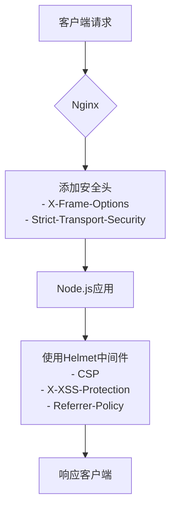

# 安全考虑

<cite>
**本文档引用的文件**  
- [app.js](file://app.js)
- [src/api/index.js](file://src/api/index.js)
- [data/users.json](file://data/users.json)
- [src/router/index.js](file://src/router/index.js)
- [src/store/modules/auth.js](file://src/store/modules/auth.js)
- [src/views/admin/AdminView.vue](file://src/views/admin/AdminView.vue)
- [package.json](file://package.json)
- [nginx.conf](file://nginx.conf)
</cite>

## 目录
1. [JWT认证机制实现](#jwt认证机制实现)  
2. [敏感信息存储风险](#敏感信息存储风险)  
3. [输入验证缺失与XSS风险](#输入验证缺失与xss风险)  
4. [CSRF防护缺失](#csrf防护缺失)  
5. [安全增强建议](#安全增强建议)  
6. [安全审计检查清单](#安全审计检查清单)  
7. [API访问控制设计原则](#api访问控制设计原则)

## JWT认证机制实现

项目通过 `jsonwebtoken` 库在后端实现了基于JWT的认证机制。管理员登录时，服务器验证凭据后签发包含用户信息和过期时间的JWT令牌，并通过响应返回给前端。

前端在 `src/api/index.js` 中配置了请求拦截器，自动将存储在 `localStorage` 中的 `admin-token` 添加到后续请求的 `Authorization` 头中，格式为 `Bearer <token>`。当后端返回401未授权错误时，响应拦截器会清除本地的token和用户信息，并将管理员重定向至登录页面。

Vuex模块 `auth.js` 负责管理认证状态，包括登录、登出、令牌验证和初始化。路由守卫确保所有以 `/admin` 开头的路径都需要有效的认证状态才能访问。

**Section sources**
- [src/api/index.js](file://src/api/index.js#L1-L94)
- [src/store/modules/auth.js](file://src/store/modules/auth.js#L1-L85)
- [src/router/index.js](file://src/router/index.js#L1-L121)

## 敏感信息存储风险

当前系统存在严重的敏感信息存储风险。管理员用户的凭证直接以明文形式存储在 `data/users.json` 文件中，包括用户名和密码（"password": "admin123"）。这种做法极不安全，一旦该文件被泄露或服务器被入侵，攻击者将能立即获取管理员权限。

正确的做法是使用强哈希算法（如bcrypt）对密码进行单向加密存储。即使数据库泄露，攻击者也无法轻易还原原始密码。此外，`users.json` 文件应移出公开可访问的目录，并设置严格的文件系统权限。

**Section sources**
- [data/users.json](file://data/users.json#L1-L7)

## 输入验证缺失与XSS风险

系统目前缺乏对用户输入的有效验证和清理（sanitization），这带来了跨站脚本（XSS）攻击的风险。例如，在新闻资讯模块中，如果允许管理员在新闻标题或摘要中注入恶意JavaScript代码（如 ``），这些代码将在其他用户浏览页面时被执行。

由于前端框架Vue在渲染数据时默认会进行HTML转义，一定程度上缓解了此风险，但任何动态插入HTML内容的功能（如富文本编辑器）都可能成为攻击入口。攻击者可以利用此漏洞窃取用户的cookie、会话令牌或执行未经授权的操作。

**Section sources**
- [app.js](file://app.js#L1-L424)
- [src/views/NewsDetailView.vue](file://src/views/NewsDetailView.vue)

## CSRF防护缺失

管理员接口（如内容更新、消息删除等）目前缺乏针对跨站请求伪造（CSRF）攻击的防护措施。攻击者可以构造一个恶意网页，诱导已登录的管理员用户访问，从而在用户不知情的情况下，以该管理员的身份发起请求，修改网站内容或删除重要数据。

虽然JWT通常被认为具有一定的抗CSRF能力（因为无法通过简单的方式从其他域读取localStorage），但如果令牌通过Cookie存储或存在其他漏洞，CSRF攻击仍然可行。最佳实践是实施双重提交Cookie模式或同步器令牌模式来防御此类攻击。

**Section sources**
- [src/api/index.js](file://src/api/index.js#L1-L94)
- [src/views/admin/AdminView.vue](file://src/views/admin/AdminView.vue#L1-L143)

## 安全增强建议

为了显著提升系统的安全性，建议采取以下改进措施：

### 使用Helmet增强HTTP安全头
集成 `helmet` 中间件，自动设置一系列关键的安全HTTP头：
- `Content-Security-Policy (CSP)`：限制可加载的资源来源，有效防御XSS。
- `X-Content-Type-Options: nosniff`：防止MIME类型嗅探攻击。
- `X-Frame-Options: DENY`：防止点击劫持（Clickjacking）。
- `Strict-Transport-Security (HSTS)`：强制浏览器使用HTTPS连接。

**Diagram sources**
- [nginx.conf](file://nginx.conf#L1-L46)
- [package.json](file://package.json#L1-L33)

### 对用户输入进行Sanitize处理
在服务端对所有用户提交的数据进行严格的清理和验证：
- 使用 `DOMPurify` 等库净化任何可能包含HTML的内容。
- 对字符串长度、格式（如邮箱、电话）进行校验。
- 拒绝包含潜在危险字符（如 `<`, `>`, `&`, `'`, `"`）的输入，或对其进行实体编码。

### 限制文件上传类型
对于图片上传功能，必须严格限制文件类型：
- 只允许 `.jpg`, `.jpeg`, `.png`, `.gif` 等安全的图片格式。
- 在服务端验证文件的MIME类型和实际文件头，而不仅仅是扩展名。
- 将上传的文件存储在非Web根目录下，或通过代理服务提供访问。

### 启用HTTPS
生产环境必须启用HTTPS：
- 通过Let's Encrypt等CA机构获取SSL/TLS证书。
- 在 `nginx.conf` 中配置443端口监听和证书路径。
- 将所有HTTP请求重定向到HTTPS，确保传输层安全。

**Section sources**
- [package.json](file://package.json#L1-L33)
- [nginx.conf](file://nginx.conf#L1-L46)

## 安全审计检查清单

为便于开发者进行安全审查，提供以下检查清单：

| 检查项 | 当前状态 | 建议措施 |
| :--- | :--- | :--- |
| 密码是否加密存储 | ❌ 明文存储 | 使用bcrypt等算法哈希密码 |
| 是否有输入验证和清理 | ⚠️ 缺失 | 集成sanitize库，验证所有输入 |
| 是否启用HTTPS | ⚠️ Nginx配置注释 | 配置SSL证书并强制HTTPS |
| 是否有CSRF防护 | ❌ 缺失 | 实现CSRF令牌机制 |
| HTTP安全头是否完整 | ⚠️ 部分由Nginx设置 | 集成Helmet中间件 |
| 文件上传是否有类型限制 | ❓ 未知 | 服务端验证MIME类型和扩展名 |
| JWT令牌是否有合理过期时间 | ✅ 是 | 确保过期时间不过长 |
| 错误信息是否泄露细节 | ⚠️ 未知 | 统一处理错误，避免堆栈暴露 |

**Section sources**
- [data/users.json](file://data/users.json#L1-L7)
- [nginx.conf](file://nginx.conf#L1-L46)

## API访问控制设计原则

建议遵循最小权限原则（Principle of Least Privilege）设计API访问控制：
- **角色分离**：定义不同的用户角色（如admin, editor, viewer），每个角色拥有完成其工作所需的最小权限集。
- **端点保护**：所有敏感API端点（如`/admin/content/*`, `/admin/messages/*`）都必须经过身份验证和授权检查。
- **细粒度控制**：根据业务需求，实现更精细的权限控制，例如，编辑员只能修改自己创建的内容。
- **审计日志**：记录关键操作（如登录、内容修改、用户删除）的日志，便于追踪和审计。

通过实施这些原则，可以有效降低因凭证被盗或权限滥用导致的安全风险。

**Section sources**
- [src/api/index.js](file://src/api/index.js#L1-L94)
- [src/router/index.js](file://src/router/index.js#L1-L121)