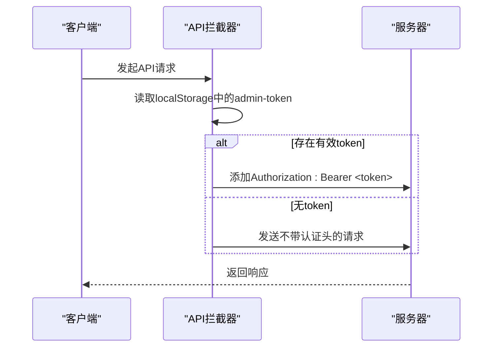

# 认证安全

<cite>
**本文档引用的文件**
- [app.js](file://app.js)
- [src/store/modules/auth.js](file://src/store/modules/auth.js)
- [src/api/index.js](file://src/api/index.js)
- [src/router/index.js](file://src/router/index.js)
</cite>

## 目录
1. [JWT认证机制实现细节](#jwt认证机制实现细节)
2. [Pinia Store中的Token管理](#pinia-store中的token管理)
3. [安全风险分析与改进建议](#安全风险分析与改进建议)

## JWT认证机制实现细节

项目中通过Express中间件进行JWT token验证，实现了完整的认证流程。在客户端代码中，`src/api/index.js`文件定义了axios实例，并配置了请求和响应拦截器来处理token。

请求拦截器会从localStorage中获取名为`admin-token`的JWT令牌，并将其添加到HTTP请求头的`Authorization`字段中，采用Bearer令牌格式。这确保了每个发送到服务器的API请求都携带有效的身份验证信息。

**Diagram sources**
- [src/api/index.js](file://src/api/index.js#L4-L35)

**Section sources**
- [src/api/index