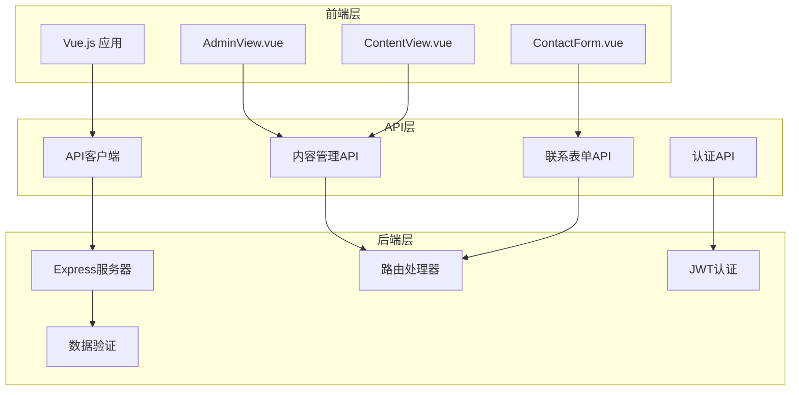

# 输入验证安全分析报告

<cite>
**本文档中引用的文件**
- [app.js](file://app.js)
- [src/views/admin/ContentView.vue](file://src/views/admin/ContentView.vue)
- [src/api/index.js](file://src/api/index.js)
- [src/store/modules/content.js](file://src/store/modules/content.js)
- [server.cjs](file://server.cjs)
- [package.json](file://package.json)
</cite>

## 目录
1. [概述](#概述)
2. [项目结构分析](#项目结构分析)
3. [现有安全措施](#现有安全措施)
4. [输入安全隐患分析](#输入安全隐患分析)
5. [防护措施建议](#防护措施建议)
6. [实施指南](#实施指南)
7. [总结](#总结)

## 概述

本文档分析了一个基于Vue.js和Express.js构建的无人机防御系统管理平台的安全输入验证情况。该项目包含前端Vue组件、后端Express API以及完整的管理后台系统，存在多个潜在的输入安全风险，特别是在用户输入处理和数据验证方面。

## 项目结构分析



**图表来源**
- [app.js](file://app.js#L1-L50)
- [src/views/admin/ContentView.vue](file://src/views/admin/ContentView.vue#L1-L30)
- [src/api/index.js](file://src/api/index.js#L1-L50)

## 现有安全措施

### 1. 基础认证机制
项目实现了基本的JWT认证机制：

```javascript
// JWT认证中间件
const authenticateToken = (req, res, next) => {
  const authHeader = req.headers['authorization'];
  const token = authHeader && authHeader.split(' ')[1];
  
  if (!token) {
    return res.status(401).json({ message: '未提供认证令牌' });
  }
  
  jwt.verify(token, JWT_SECRET, (err, user) => {
    if (err) {
      return res.status(403).json({ message: '令牌无效或已过期' });
    }
    req.user = user;
    next();
  });
};
```

### 2. 前端简单验证
前端表单提交包含基本的非空验证：

```javascript
// 联系表单提交验证
const submitContactForm = () => {
  let isValid = true;
  
  // 简单验证所有字段是否填写
  for (const key in contactForm) {
    if (!contactForm[key].trim()) {
      isValid = false;
      break;
    }
  }
  
  if (isValid) {
    // 提交逻辑
  } else {
    alert('请填写所有必填字段');
  }
};
```

### 3. 后端基本验证
后端API包含简单的必填字段验证：

```javascript
// 联系表单提交验证
app.post('/api/contact', (req, res) => {
  const { name, email, phone, message } = req.body;
  
  if (!name || !email || !phone || !message) {
    return res.status(400).json({ message: '请填写所有必填字段' });
  }
  // 处理逻辑...
});
```

**章节来源**
- [server.cjs](file://server.cjs#L100-L120)
- [app.js](file://app.js#L300-L350)

## 输入安全隐患分析

### 1. 前端输入验证不足

#### a) Content Management 表单验证缺失
在`ContentView.vue`中，内容管理表单缺乏以下验证：
- **长度限制**：新闻标题、案例描述等字段没有长度限制
- **格式验证**：电子邮件、电话号码等字段缺少格式验证
- **特殊字符过滤**：HTML内容可以直接输入，存在XSS风险
- **富文本内容**：解决方案详情、技术描述等字段允许HTML输入但未进行清理

```javascript
// 存在问题的表单字段示例
<div class="form-group">
  <label for="solutionTitle">标题</label>
  <input type="text" id="solutionTitle" v-model="currentSolution.title" class="form-control">
</div>

<div class="form-group">
  <label for="solutionDetails">详细内容</label>
  <textarea id="solutionDetails" v-model="currentSolution.details" class="form-control" rows="6"></textarea>
</div>
```

#### b) 管理后台表单验证不足
管理后台的表单字段缺乏：
- **必填字段验证**：部分字段未设置必填属性
- **数据类型验证**：数字、日期等字段缺少类型验证
- **范围验证**：价格、数量等字段缺少合理范围限制
- **重复验证**：用户名、邮箱等字段缺少唯一性验证

### 2. 后端输入验证缺失

#### a) 内容更新接口安全风险
`/api/admin/content/:type`接口直接接收前端传递的数据，缺乏验证：

```javascript
// 存在安全风险的代码
app.put('/api/admin/content/:type', authenticateToken, (req, res) => {
  const contentType = req.params.type;
  const newContent = req.body;  // 直接使用未经验证的数据
  const contentData = readDataFile(CONTENT_FILE);
  
  if (contentData) {
    contentData[contentType] = newContent;  // 直接赋值给文件
    writeDataFile(CONTENT_FILE, contentData);
    res.json({ success: true, message: '内容已更新' });
  }
});
```

#### b) 文件上传安全风险
文件上传接口虽然使用了multer，但缺乏：
- **文件类型验证**：只检查扩展名，未验证实际文件类型
- **文件大小限制**：未设置合理的文件大小限制
- **恶意文件检测**：未扫描上传文件中的恶意代码
- **文件名安全**：文件名可能包含路径遍历攻击

```javascript
// 文件上传配置
const storage = multer.diskStorage({
  destination: (req, file, cb) => {
    cb(null, UPLOADS_DIR);
  },
  filename: (req, file, cb) => {
    const uniqueSuffix = Date.now() + '-' + Math.round(Math.random() * 1E9);
    cb(null, file.fieldname + '-' + uniqueSuffix + path.extname(file.originalname));
  }
});
```

#### c) 联系表单安全风险
联系表单接口存在SQL注入和XSS风险：

```javascript
// 存在安全风险的代码
app.post('/api/contact', (req, res) => {
  const { name, email, phone, message } = req.body;
  
  const newMessage = {
    id: Date.now(),
    name,
    email,
    phone,
    message,  // 直接存储用户输入
    read: false,
    createdAt: new Date().toISOString()
  };
  
  messages.push(newMessage);
  writeDataFile(MESSAGES_FILE, messages);
});
```

**章节来源**
- [src/views/admin/ContentView.vue](file://src/views/admin/ContentView.vue#L100-L150)
- [server.cjs](file://server.cjs#L150-L200)

## 防护措施建议

### 1. 集成express-validator中间件

推荐使用express-validator进行服务端输入验证：

```javascript
const { body, param, validationResult } = require('express-validator');

// 内容更新验证中间件
const validateContentUpdate = [
  param('type').isIn(['site-info', 'solutions', 'technologies', 'cases', 'news', 'about', 'jobs']),
  body('*').customSanitizer(value => {
    // 基本的字符串清理
    if (typeof value === 'string') {
      return value.trim();
    }
    return value;
  }),
  body('title').isLength({ min: 1, max: 100 }).withMessage('标题长度应在1-100字符之间'),
  body('description').isLength({ max: 500 }).withMessage('描述长度不应超过500字符'),
  body('details').custom((value) => {
    // 验证富文本内容
    if (value && typeof value === 'string') {
      // 检查是否包含危险标签
      const dangerousTags = ['script', 'iframe', 'object', 'embed', 'applet'];
      for (const tag of dangerousTags) {
        if (value.toLowerCase().includes(`<${tag}`)) {
          throw new Error(`内容包含不允许的标签: <${tag}>`);
        }
      }
    }
    return true;
  })
];

// 使用验证中间件
app.put('/api/admin/content/:type', authenticateToken, validateContentUpdate, (req, res) => {
  const errors = validationResult(req);
  if (!errors.isEmpty()) {
    return res.status(400).json({ errors: errors.array() });
  }
  
  // 处理验证通过的数据
  const contentType = req.params.type;
  const newContent = req.body;
  // ...
});
```

### 2. 建立统一的输入清洗机制

推荐使用DOMPurify库对HTML内容进行清理：

```javascript
const DOMPurify = require('dompurify');
const { JSDOM } = require('jsdom');

// 创建DOMPurify环境
const window = new JSDOM('').window;
const DOMPurifyInstance = DOMPurify(window);

// 输入清洗函数
const sanitizeInput = (input) => {
  if (typeof input === 'string') {
    // 基本清理
    let sanitized = input.trim();
    
    // 使用DOMPurify清理HTML
    sanitized = DOMPurifyInstance.sanitize(sanitized, {
      ALLOWED_TAGS: ['b', 'i', 'u', 'strong', 'em', 'p', 'br', 'ul', 'ol', 'li', 'a'],
      ALLOWED_ATTR: ['href', 'title', 'target'],
      ADD_ATTR: ['target="_blank"']
    });
    
    return sanitized;
  }
  return input;
};

// 在数据写入前进行清理
app.put('/api/admin/content/:type', authenticateToken, validateContentUpdate, (req, res) => {
  const contentType = req.params.type;
  const newContent = req.body;
  
  // 清理内容数据
  const cleanedContent = {};
  for (const key in newContent) {
    cleanedContent[key] = sanitizeInput(newContent[key]);
  }
  
  // 保存清理后的内容
  // ...
});
```

### 3. 完善前端验证规则

在Vue组件中添加更严格的验证规则：

```javascript
// ContentView.vue 中的改进验证
const validateFormData = () => {
  const errors = [];
  
  // 标题验证
  if (!currentSolution.title || currentSolution.title.trim().length < 1) {
    errors.push('标题不能为空');
  }
  
  // 描述验证
  if (currentSolution.description && 
      currentSolution.description.trim().length > 500) {
    errors.push('描述不能超过500字符');
  }
  
  // 详细内容验证
  if (currentSolution.details && 
      currentSolution.details.trim().length > 5000) {
    errors.push('详细内容不能超过5000字符');
  }
  
  // 图片URL验证
  if (currentSolution.image && 
      !/^https?:\/\/.*\.(jpg|jpeg|png|gif|webp)$/i.test(currentSolution.image)) {
    errors.push('图片URL格式不正确');
  }
  
  return errors;
};

// 在保存前调用验证
const saveSolution = async () => {
  const validationErrors = validateFormData();
  if (validationErrors.length > 0) {
    alert('验证错误: ' + validationErrors.join(', '));
    return;
  }
  
  // 执行保存逻辑
};
```

### 4. 实施文件上传安全策略

```javascript
const crypto = require('crypto');
const fileType = require('file-type');

// 改进的文件上传验证
const upload = multer({
  storage: multer.diskStorage({
    destination: (req, file, cb) => {
      cb(null, UPLOADS_DIR);
    },
    filename: (req, file, cb) => {
      // 生成安全的文件名
      const ext = path.extname(file.originalname).toLowerCase();
      const safeFilename = crypto.randomBytes(16).toString('hex') + ext;
      cb(null, safeFilename);
    }
  }),
  limits: {
    fileSize: 5 * 1024 * 1024, // 5MB限制
    files: 1
  },
  fileFilter: (req, file, cb) => {
    // 验证文件类型
    const allowedTypes = ['image/jpeg', 'image/png', 'image/gif', 'image/webp'];
    const detectedType = fileType(file.buffer);
    
    if (detectedType && allowedTypes.includes(detectedType.mime)) {
      cb(null, true);
    } else {
      cb(new Error('不支持的文件类型'));
    }
  }
});

// 文件上传处理
app.post('/api/admin/upload', authenticateToken, upload.single('image'), (req, res) => {
  if (!req.file) {
    return res.status(400).json({ message: '上传失败' });
  }
  
  // 验证文件内容
  const filePath = path.join(UPLOADS_DIR, req.file.filename);
  const fileBuffer = fs.readFileSync(filePath);
  
  // 检查文件是否包含恶意内容
  if (containsMaliciousContent(fileBuffer)) {
    fs.unlinkSync(filePath);
    return res.status(400).json({ message: '文件包含恶意内容' });
  }
  
  res.json({
    success: true,
    url: `/uploads/${req.file.filename}`
  });
});
```

**章节来源**
- [server.cjs](file://server.cjs#L150-L250)
- [src/views/admin/ContentView.vue](file://src/views/admin/ContentView.vue#L200-L250)

## 实施指南

### 1. 安装必要的依赖

```bash
npm install express-validator dompurify jsdom file-type
```

### 2. 创建验证中间件文件

```javascript
// middleware/validation.js
const { body, param, query, validationResult } = require('express-validator');

exports.validateContentUpdate = [
  param('type').isIn(['site-info', 'solutions', 'technologies', 'cases', 'news', 'about', 'jobs']),
  body('*').customSanitizer(value => {
    if (typeof value === 'string') {
      return value.trim();
    }
    return value;
  }),
  body('title').isLength({ min: 1, max: 100 }),
  body('description').isLength({ max: 500 }),
  body('details').custom((value) => {
    if (value && typeof value === 'string') {
      const dangerousTags = ['script', 'iframe', 'object', 'embed', 'applet'];
      for (const tag of dangerousTags) {
        if (value.toLowerCase().includes(`<${tag}`)) {
          throw new Error(`内容包含不允许的标签: <${tag}>`);
        }
      }
    }
    return true;
  })
];

exports.validateContactForm = [
  body('name').notEmpty().withMessage('姓名不能为空'),
  body('email').isEmail().withMessage('邮箱格式不正确'),
  body('phone').matches(/^[\d\s\-()+]+$/).withMessage('电话格式不正确'),
  body('message').notEmpty().withMessage('留言内容不能为空')
];
```

### 3. 更新服务器路由

```javascript
// 更新服务器路由以使用新的验证中间件
const { validateContentUpdate, validateContactForm } = require('./middleware/validation');

// 内容更新路由
app.put('/api/admin/content/:type', 
  authenticateToken, 
  validateContentUpdate, 
  (req, res) => {
    const errors = validationResult(req);
    if (!errors.isEmpty()) {
      return res.status(400).json({ errors: errors.array() });
    }
    
    const contentType = req.params.type;
    const newContent = req.body;
    
    // 清理和验证内容
    const cleanedContent = {};
    for (const key in newContent) {
      cleanedContent[key] = sanitizeInput(newContent[key]);
    }
    
    // 保存内容
    // ...
  });

// 联系表单路由
app.post('/api/contact', 
  validateContactForm, 
  (req, res) => {
    const errors = validationResult(req);
    if (!errors.isEmpty()) {
      return res.status(400).json({ errors: errors.array() });
    }
    
    const { name, email, phone, message } = req.body;
    const sanitizedMessage = sanitizeInput(message);
    
    // 保存消息
    // ...
  });
```

### 4. 前端验证增强

```javascript
// 在Vue组件中添加验证逻辑
const useFormValidation = () => {
  const validateForm = (formData) => {
    const errors = [];
    
    // 标题验证
    if (!formData.title || formData.title.trim().length < 1) {
      errors.push('标题不能为空');
    }
    
    // 长度验证
    if (formData.description && formData.description.trim().length > 500) {
      errors.push('描述不能超过500字符');
    }
    
    // URL验证
    if (formData.image && !/^https?:\/\/.*\.(jpg|jpeg|png|gif|webp)$/i.test(formData.image)) {
      errors.push('图片URL格式不正确');
    }
    
    return errors;
  };
  
  const handleSubmit = async (formData) => {
    const validationErrors = validateForm(formData);
    if (validationErrors.length > 0) {
      alert('验证错误: ' + validationErrors.join(', '));
      return;
    }
    
    // 执行提交
    try {
      await updateContent(formData);
      showNotification('更新成功!', 'success');
    } catch (error) {
      showNotification('更新失败: ' + error.message, 'error');
    }
  };
  
  return { validateForm, handleSubmit };
};
```

## 总结

通过对该项目的深入分析，我们发现了多个输入安全方面的隐患，主要集中在：

1. **前端验证不足**：管理后台表单缺乏全面的验证规则
2. **后端验证缺失**：API接口直接使用未经验证的用户输入
3. **XSS风险**：HTML内容未经过适当清理
4. **文件上传安全**：文件类型和内容验证不充分

建议的改进措施包括：
- 集成express-validator中间件进行服务端验证
- 使用DOMPurify库进行HTML内容清理
- 完善前端验证规则
- 实施文件上传安全策略

这些改进将显著提升系统的安全性，防止常见的Web安全漏洞，如XSS攻击、CSRF攻击和文件上传漏洞。通过实施这些安全措施，可以确保用户输入得到有效验证和清理，保护系统免受恶意输入的侵害。