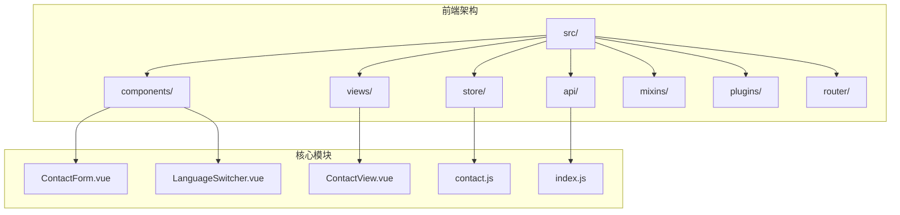
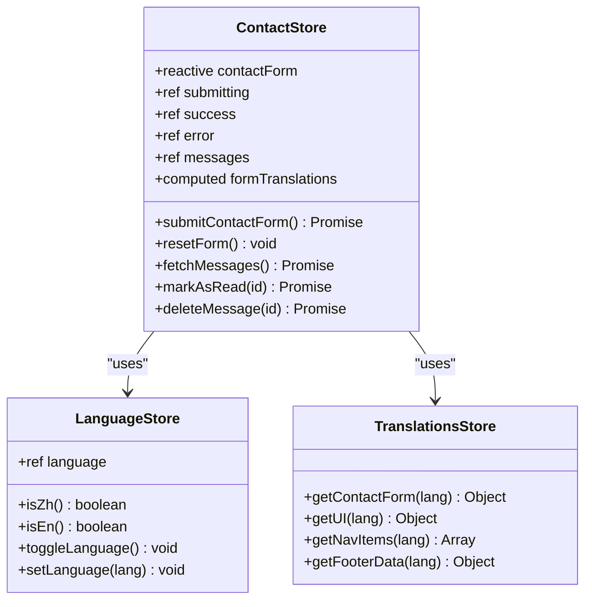
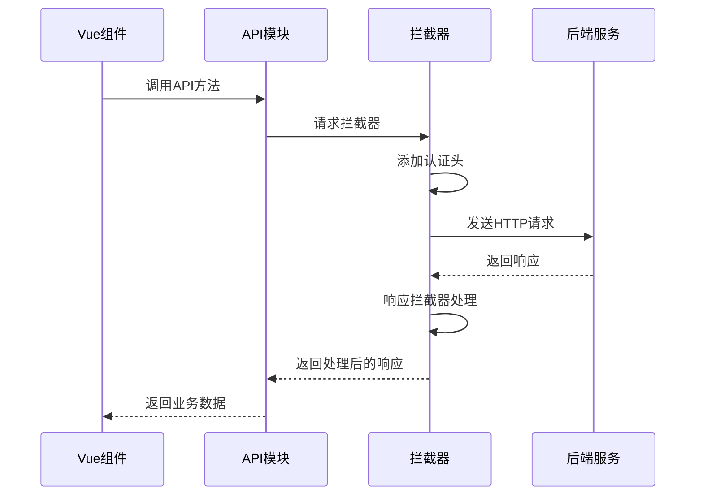
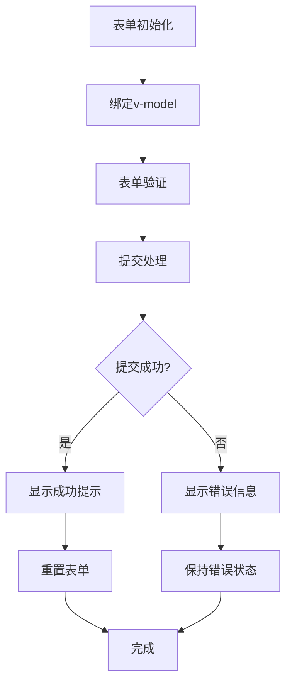
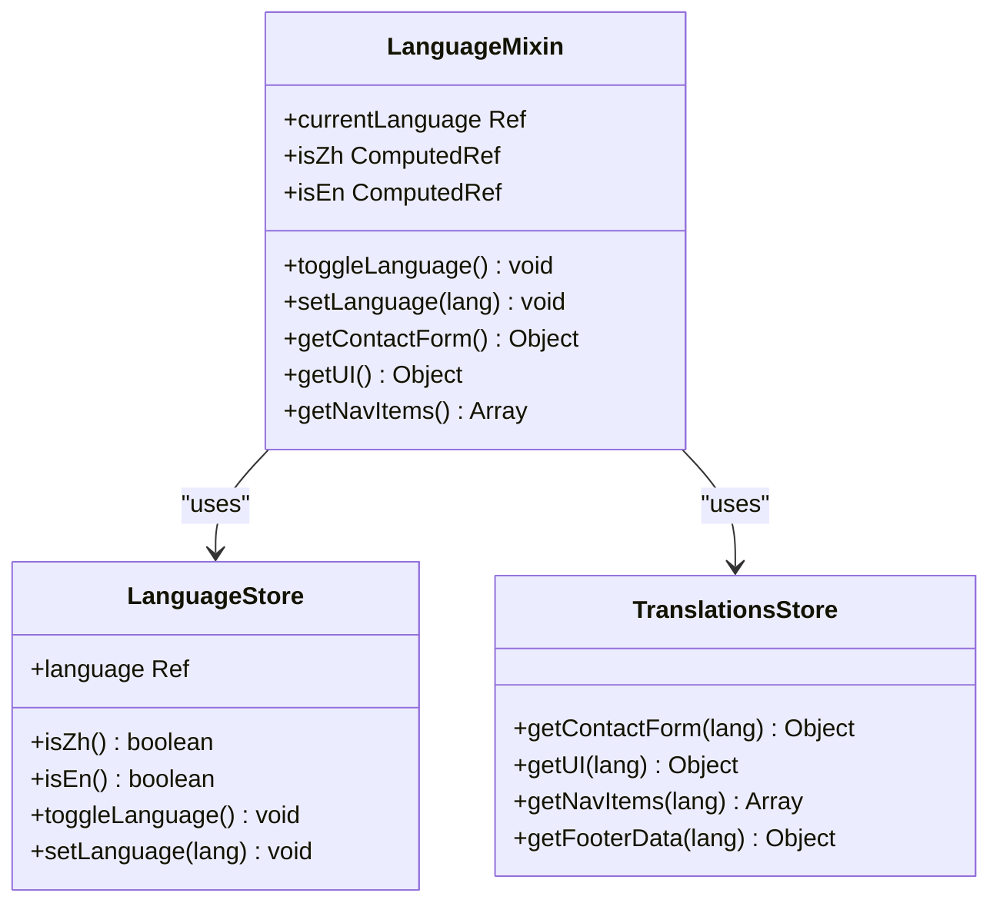

# 开发指南

<cite>
**本文档中引用的文件**
- [README.md](file://README.md)
- [ContactForm.vue](file://src/components/ContactForm.vue)
- [contact.js](file://src/store/modules/contact.js)
- [language.js](file://src/mixins/language.js)
- [index.js](file://src/api/index.js)
- [ContactView.vue](file://src/views/ContactView.vue)
- [main.js](file://src/main.js)
- [i18n.js](file://src/plugins/i18n.js)
- [index.js](file://src/router/index.js)
</cite>

## 目录
1. [项目概述](#项目概述)
2. [开发环境搭建](#开发环境搭建)
3. [Vue组件开发规范](#vue组件开发规范)
4. [状态管理最佳实践](#状态管理最佳实践)
5. [API对接流程](#api对接流程)
6. [表单开发实战](#表单开发实战)
7. [多语言支持实现](#多语言支持实现)
8. [调试技巧与工具](#调试技巧与工具)
9. [代码复用策略](#代码复用策略)
10. [常见问题解决](#常见问题解决)

## 项目概述

本项目是杭州朗德智能科技有限公司的官方网站，采用现代化的Vue 3框架开发，包含完整的前后端实现。项目使用Pinia作为状态管理库，Axios进行API请求，支持多语言切换和响应式设计。

### 技术栈概览

- **前端框架**: Vue 3 (Composition API)
- **状态管理**: Pinia
- **路由管理**: Vue Router 4
- **HTTP客户端**: Axios
- **构建工具**: Vite
- **样式处理**: CSS Modules + 响应式设计

**章节来源**
- [README.md](file://README.md#L1-L50)

## 开发环境搭建

### 环境要求

- Node.js (建议使用LTS版本)
- npm 或 yarn 包管理器
- 文本编辑器 (推荐VS Code)

### 安装步骤

1. **克隆项目**
```bash
git clone [项目仓库地址]
cd lande-project
```

2. **安装依赖**
```bash
npm install
```

3. **启动开发服务器**
```bash
# 仅启动前端
npm run dev

# 仅启动后端
npm run server

# 同时启动前端和后端
npm run dev:all
```

4. **构建生产版本**
```bash
npm run build
```

### 项目结构理解



**图表来源**
- [README.md](file://README.md#L25-L45)

**章节来源**
- [README.md](file://README.md#L51-L80)

## Vue组件开发规范

### 命名约定

Vue组件必须使用PascalCase命名法，例如：
- ✅ 正确: `ContactForm.vue`
- ❌ 错误: `contact-form.vue` 或 `contactform.vue`

### 组件结构标准

每个Vue组件应遵循以下标准结构：

```vue
<template>
  <!-- 组件模板 -->
</template>

<script setup>
// 组件逻辑
import { ref, computed } from 'vue'
import { useStore } from 'pinia'
</script>

<style scoped>
/* 组件样式 */
</style>
```

### Props类型校验

使用`defineProps`进行props类型校验：

```javascript
const props = defineProps({
  modelValue: {
    type: String,
    required: true
  },
  disabled: {
    type: Boolean,
    default: false
  }
})
```

### Emit事件命名

事件名称使用kebab-case命名法：

```javascript
const emit = defineEmits([
  'update:model-value',
  'submit-success',
  'form-error'
])

// 触发事件
emit('submit-success', { data: responseData })
```

**章节来源**
- [ContactForm.vue](file://src/components/ContactForm.vue#L1-L30)

## 状态管理最佳实践

### Store状态建模原则

Pinia store的设计应遵循单一职责原则，每个模块负责特定的功能领域：



**图表来源**
- [contact.js](file://src/store/modules/contact.js#L1-L50)
- [language.js](file://src/mixins/language.js#L1-L30)

### 避免直接修改state

正确的做法是通过actions提交mutations：

```javascript
// ✅ 正确：通过action修改state
const actions = {
  async submitContactForm() {
    this.submitting = true
    try {
      const response = await api.submitForm(this.contactForm)
      this.success = true
      this.resetForm()
    } catch (error) {
      this.error = error.message
    } finally {
      this.submitting = false
    }
  }
}

// ❌ 错误：直接修改state
const wrongActions = {
  submitContactForm() {
    // 直接操作state，违反最佳实践
    contactForm.value.name = ''
    submitting.value = false
  }
}
```

### Store组合使用

合理组合多个store来实现复杂功能：

```javascript
// 在组件中组合使用多个store
const { isZh, isEn, getContactForm } = useLanguage()
const contactStore = useContactStore()

// 使用计算属性组合数据
const formText = computed(() => ({
  ...getContactForm(),
  submit: isZh.value ? '提交' : 'Submit'
}))
```

**章节来源**
- [contact.js](file://src/store/modules/contact.js#L25-L80)
- [language.js](file://src/mixins/language.js#L15-L50)

## API对接流程

### API封装设计

项目使用Axios创建统一的API客户端：



**图表来源**
- [index.js](file://src/api/index.js#L1-L40)

### 请求拦截器实现

```javascript
// 请求拦截器：自动添加认证信息
api.interceptors.request.use(
  config => {
    const token = localStorage.getItem('admin-token')
    if (token) {
      config.headers.Authorization = `Bearer ${token}`
    }
    return config
  },
  error => Promise.reject(error)
)

// 响应拦截器：处理认证错误
api.interceptors.response.use(
  response => response,
  error => {
    if (error.response?.status === 401) {
      // 清除认证信息并跳转到登录页
      localStorage.removeItem('admin-token')
      if (window.location.pathname.startsWith('/admin')) {
        window.location.href = '/admin/login'
      }
    }
    return Promise.reject(error)
  }
)
```

### API调用模式

```javascript
// 在store中调用API
const submitContactForm = async () => {
  submitting.value = true
  success.value = false
  error.value = null
  
  try {
    // 调用API
    await axios.post('/api/contact', {
      ...contactForm,
      language: languageStore.language
    })
    
    // 成功处理
    success.value = true
    resetForm()
    return { success: true }
  } catch (e) {
    // 错误处理
    const errorMessage = languageStore.isZh() 
      ? '提交失败，请稍后再试' 
      : 'Submission failed, please try again later'
    
    error.value = e.message || errorMessage
    return { success: false, error: error.value }
  } finally {
    submitting.value = false
  }
}
```

**章节来源**
- [index.js](file://src/api/index.js#L15-L60)
- [contact.js](file://src/store/modules/contact.js#L35-L65)

## 表单开发实战

### ContactForm组件分析

以ContactForm.vue为例，展示完整的表单开发流程：



**图表来源**
- [ContactForm.vue](file://src/components/ContactForm.vue#L1-L50)
- [contact.js](file://src/store/modules/contact.js#L35-L70)

### 表单状态管理

```javascript
// 表单数据模型
const contactForm = reactive({
  name: '',
  email: '',
  phone: '',
  subject: '',
  company: '',
  message: ''
})

// 表单状态
const submitting = ref(false)
const success = ref(false)
const error = ref(null)
```

### 提交流程实现

```javascript
const submitForm = async () => {
  // 1. 设置提交状态
  await contactStore.submitContactForm()
  
  // 2. store内部处理异步逻辑
  // - 设置submitting = true
  // - 调用API
  // - 处理成功/失败
  // - 重置表单
  // - 设置success/error状态
}
```

### 表单验证与反馈

```vue
<!-- 表单模板 -->
<form @submit.prevent="submitForm">
  <!-- 输入字段 -->
  <div class="form-group">
    <label for="name">{{ formText.name }}</label>
    <input 
      type="text" 
      id="name" 
      v-model="contactForm.name" 
      class="form-control" 
      required
    >
  </div>
  
  <!-- 错误提示 -->
  <div v-if="error" class="alert alert-error">
    {{ error }}
  </div>
  
  <!-- 成功提示 -->
  <div v-if="success" class="alert alert-success">
    {{ formText.success }}
  </div>
  
  <!-- 提交按钮 -->
  <button type="submit" class="btn" :disabled="submitting">
    <span v-if="submitting">{{ isZh ? '提交中...' : 'Submitting...' }}</span>
    <span v-else>{{ formText.submit }}</span>
  </button>
</form>
```

### Loading状态处理

```javascript
// 在store中管理loading状态
const submitContactForm = async () => {
  submitting.value = true
  try {
    // 异步操作
    await api.submitForm(contactForm)
    success.value = true
    resetForm()
  } catch (error) {
    error.value = error.message
  } finally {
    submitting.value = false
  }
}
```

**章节来源**
- [ContactForm.vue](file://src/components/ContactForm.vue#L1-L155)
- [contact.js](file://src/store/modules/contact.js#L35-L85)

## 多语言支持实现

### 语言切换机制

项目实现了完整的多语言支持系统，包括：



**图表来源**
- [language.js](file://src/mixins/language.js#L15-L80)

### 语言切换实现

```javascript
// 语言切换功能
const toggleLanguage = () => {
  languageStore.toggleLanguage()
  // 触发语言变更事件
  document.dispatchEvent(new CustomEvent('languageChanged', {
    detail: languageStore.language
  }))
}

// 语言检测顺序
const checkLanguageSources = () => {
  // 1. 强制语言变量
  if (window.__forceLanguage) return window.__forceLanguage
  
  // 2. localStorage
  const localStorageLang = localStorage.getItem('language')
  if (['zh', 'en'].includes(localStorageLang)) return localStorageLang
  
  // 3. Cookie
  const cookieLang = getCookie('language')
  if (['zh', 'en'].includes(cookieLang)) return cookieLang
  
  // 4. 默认中文
  return 'zh'
}
```

### 国际化插件实现

```javascript
// 全局插件注册
export default {
  install: (app) => {
    const languageStore = useLanguageStore()
    const translationsStore = useTranslationsStore()
    
    // 注册全局属性
    app.config.globalProperties.$language = languageStore.language
    app.config.globalProperties.$isZh = () => languageStore.isZh()
    app.config.globalProperties.$isEn = () => languageStore.isEn()
    
    // 简易翻译函数
    app.config.globalProperties.$t = (key, defaultValue = '') => {
      const ui = translationsStore.getUI(languageStore.language)
      return ui[key] || defaultValue
    }
  }
}
```

### 动态语言切换

```vue
<!-- 语言切换按钮 -->
<button @click="$toggleLanguage()">
  {{ $isZh() ? 'English' : '中文' }}
</button>

<!-- 指令式翻译 -->
<h1 v-i18n="'contact.title'"></h1>

<!-- 计算属性翻译 -->
<script setup>
const { isZh, getContactForm } = useLanguage()
const formText = computed(() => getContactForm())
</script>
```

**章节来源**
- [language.js](file://src/mixins/language.js#L1-L127)
- [i18n.js](file://src/plugins/i18n.js#L1-L72)
- [main.js](file://src/main.js#L50-L150)

## 调试技巧与工具

### Vue DevTools使用

1. **安装Vue DevTools**
   - Chrome扩展商店搜索"Vue.js devtools"
   - Firefox扩展商店搜索"Vue.js devtools"

2. **监控store变化**
```javascript
// 在store中添加调试日志
const submitContactForm = async () => {
  console.log('提交表单开始', { contactForm: contactForm.value })
  
  try {
    const response = await api.submitForm(contactForm.value)
    console.log('提交成功', { response })
    // ... 其他逻辑
  } catch (error) {
    console.error('提交失败', { error })
    // ... 错误处理
  }
}
```

3. **组件状态监控**
```javascript
// 在组件中添加状态跟踪
watch(submitting, (newValue) => {
  console.log('提交状态变化:', newValue)
})

watch(success, (newValue) => {
  console.log('成功状态变化:', newValue)
})
```

### API请求调试

```javascript
// 在main.js中添加API调试
if (process.env.NODE_ENV === 'development') {
  // 开发环境启用详细日志
  api.interceptors.request.use(config => {
    console.log('API请求:', { url: config.url, method: config.method, data: config.data })
    return config
  })
  
  api.interceptors.response.use(response => {
    console.log('API响应:', { status: response.status, data: response.data })
    return response
  }, error => {
    console.error('API错误:', { 
      url: error.config?.url, 
      method: error.config?.method, 
      error: error.message 
    })
    return Promise.reject(error)
  })
}
```

### 错误捕获与处理

```javascript
// 全局错误处理
window.addEventListener('unhandledrejection', (event) => {
  console.error('未处理的Promise拒绝:', event.reason)
  // 可以在这里发送错误报告
})

// 组件级错误边界
const handleError = (error, context) => {
  console.error(`组件错误 (${context}):`, error)
  // 显示友好的错误信息
  error.value = error.message || '发生未知错误'
}
```

**章节来源**
- [main.js](file://src/main.js#L15-L50)
- [contact.js](file://src/store/modules/contact.js#L40-L70)

## 代码复用策略

### Language Mixin使用

项目提供了完整的language mixin，用于在组件中快速获取语言相关功能：

```javascript
// 在组件中使用language mixin
<script setup>
import { useLanguage } from '@/mixins/language'

// 获取语言功能
const { 
  isZh, 
  isEn, 
  toggleLanguage, 
  currentLanguage,
  getContactForm,
  getUI 
} = useLanguage()

// 使用语言功能
const formText = computed(() => getContactForm())

// 监听语言变化
watch(isZh, (newVal) => {
  console.log('语言切换到中文:', newVal)
})
</script>
```

### 组件复用模式

```vue
<!-- ContactView复用ContactForm组件 -->
<template>
  <div class="contact-page">
    <ContactForm />
  </div>
</template>

<script setup>
import ContactForm from '@/components/ContactForm.vue'
</script>
```

### 插件化设计

```javascript
// i18n插件实现
export default {
  install: (app) => {
    // 注册全局方法
    app.config.globalProperties.$t = (key, defaultValue = '') => {
      // 翻译逻辑
    }
    
    // 注册全局指令
    app.directive('i18n', {
      mounted(el, binding) {
        // 指令逻辑
      }
    })
  }
}
```

### 配置共享

```javascript
// 共享配置常量
export const FORM_CONFIG = {
  MAX_NAME_LENGTH: 100,
  MAX_EMAIL_LENGTH: 254,
  VALID_EMAIL_REGEX: /^[^\s@]+@[^\s@]+\.[^\s@]+$/
}

// 在组件中使用
import { FORM_CONFIG } from '@/constants/formConfig'
```

**章节来源**
- [language.js](file://src/mixins/language.js#L15-L80)
- [ContactView.vue](file://src/views/ContactView.vue#L1-L20)
- [i18n.js](file://src/plugins/i18n.js#L1-L30)

## 常见问题解决

### 表单提交问题

**问题**: 表单提交后状态没有正确更新
**解决方案**:
```javascript
// 确保正确使用storeToRefs
import { storeToRefs } from 'pinia'

const contactStore = useContactStore()
const { contactForm, submitting, success, error } = storeToRefs(contactStore)

// 在submitForm中正确调用store方法
const submitForm = async () => {
  await contactStore.submitContactForm()
  // 状态会自动更新
}
```

**问题**: 语言切换不生效
**解决方案**:
```javascript
// 确保正确触发语言变更事件
const toggleLanguage = () => {
  languageStore.toggleLanguage()
  // 必须手动触发事件
  document.dispatchEvent(new CustomEvent('languageChanged', {
    detail: languageStore.language
  }))
}
```

### 状态管理问题

**问题**: store状态无法响应式更新
**解决方案**:
```javascript
// 使用reactive而不是ref
const contactForm = reactive({
  name: '',
  email: '',
  phone: ''
})

// 或者使用storeToRefs
const { contactForm } = storeToRefs(useContactStore())
```

### API请求问题

**问题**: 401未授权错误
**解决方案**:
```javascript
// 在响应拦截器中处理
api.interceptors.response.use(
  response => response,
  error => {
    if (error.response?.status === 401) {
      // 清除认证信息
      localStorage.removeItem('admin-token')
      // 跳转到登录页
      if (window.location.pathname.startsWith('/admin')) {
        window.location.href = '/admin/login'
      }
    }
    return Promise.reject(error)
  }
)
```

### 性能优化建议

1. **组件懒加载**
```javascript
// 路由配置中使用动态导入
{
  path: '/admin',
  component: () => import('../views/admin/AdminView.vue')
}
```

2. **图片预加载**
```javascript
// 在main.js中预加载关键图片
const preloadImages = () => {
  const imagesToPreload = ['/images/hero-bg.jpg']
  return Promise.all(imagesToPreload.map(src => {
    return new Promise(resolve => {
      const img = new Image()
      img.onload = img.onerror = resolve
      img.src = src
    })
  }))
}
```

3. **状态缓存**
```javascript
// 在store中缓存翻译数据
const translationsCache = new Map()

const getContactForm = (lang) => {
  if (!translationsCache.has(lang)) {
    translationsCache.set(lang, fetchTranslations(lang))
  }
  return translationsCache.get(lang)
}
```

**章节来源**
- [contact.js](file://src/store/modules/contact.js#L25-L50)
- [index.js](file://src/api/index.js#L30-L50)
- [main.js](file://src/main.js#L180-L230)

## 结语

本指南涵盖了Vue 3项目开发的核心实践，从基础的组件开发到高级的状态管理和API集成。通过遵循这些最佳实践，您可以：

- **提高开发效率**: 使用标准化的组件和状态管理模式
- **保证代码质量**: 通过类型检查和错误处理确保稳定性
- **提升用户体验**: 实现流畅的多语言切换和响应式设计
- **简化维护工作**: 通过代码复用和模块化设计降低维护成本

记住，良好的开发实践不仅体现在代码本身，更体现在对用户体验的关注和对技术细节的把握。希望这份指南能够帮助您更好地理解和掌握Vue 3项目的开发流程。