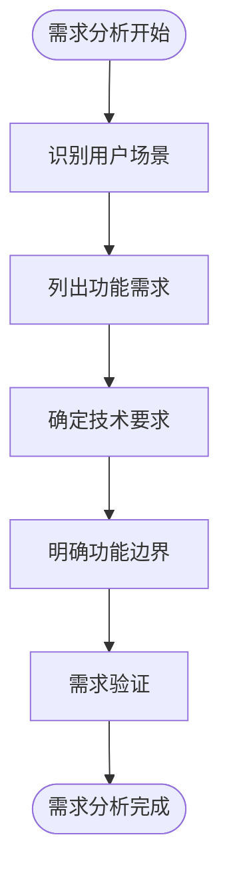
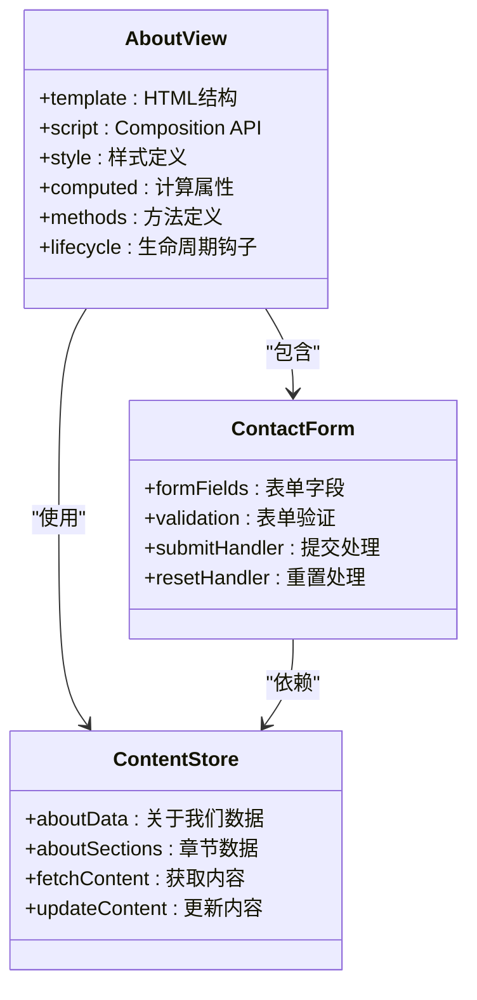
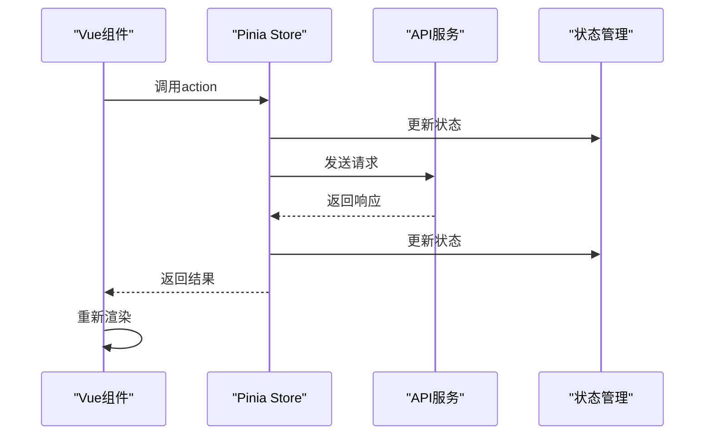
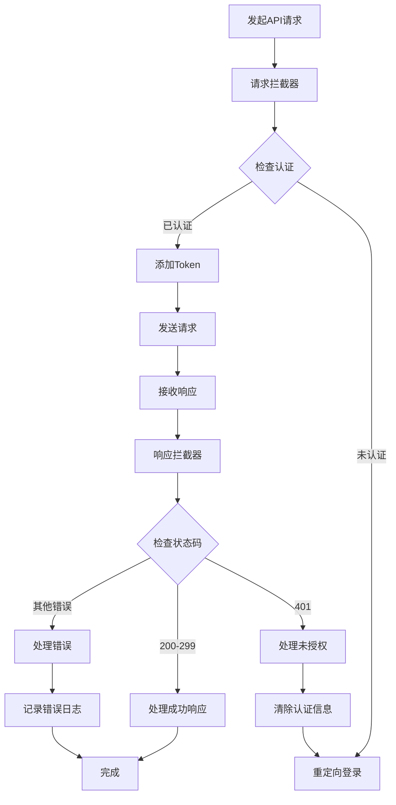
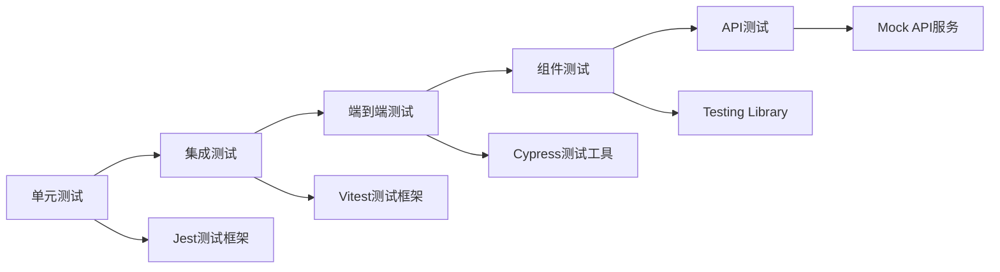
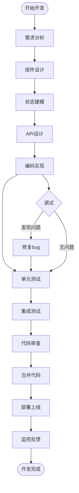
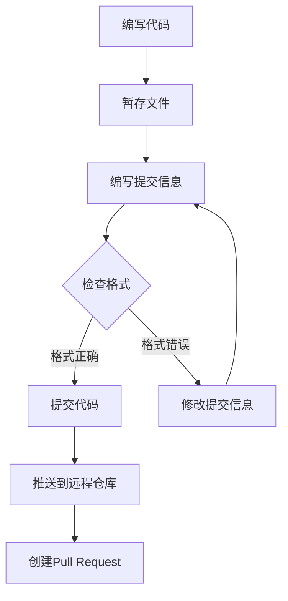
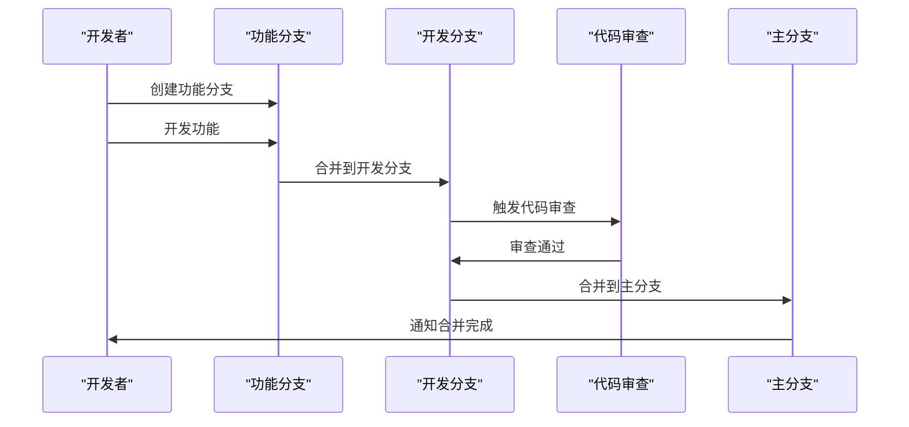
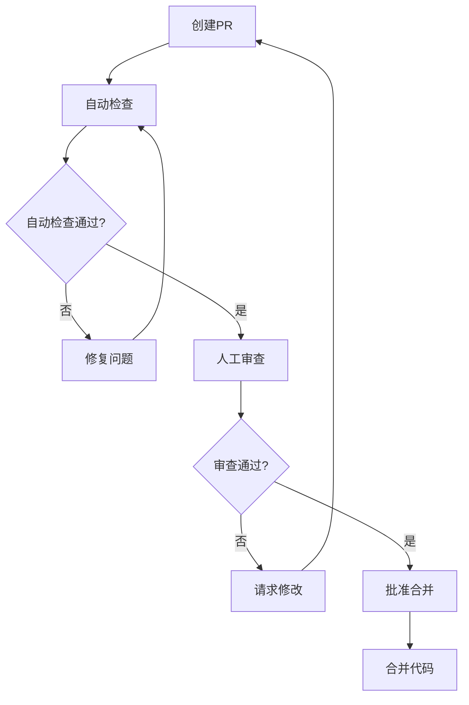

# 新功能开发流程指南

<cite>
**本文档引用的文件**
- [README.md](file://README.md)
- [AboutView.vue](file://src/views/AboutView.vue)
- [contact.js](file://src/store/modules/contact.js)
- [index.js](file://src/api/index.js)
- [ContactForm.vue](file://src/components/ContactForm.vue)
- [package.json](file://package.json)
</cite>

## 目录
1. [项目概述](#项目概述)
2. [需求分析阶段](#需求分析阶段)
3. [组件设计阶段](#组件设计阶段)
4. [状态建模阶段](#状态建模阶段)
5. [API对接阶段](#api对接阶段)
6. [测试验证阶段](#测试验证阶段)
7. [开发工作流](#开发工作流)
8. [代码提交规范](#代码提交规范)
9. [分支管理策略](#分支管理策略)
10. [PR审查要点](#pr审查要点)
11. [总结](#总结)

## 项目概述

杭州朗德智能科技有限公司官网是一个采用现代化Vue 3技术栈开发的企业官网项目。项目包含完整的前后端实现，具有以下特点：

- **前端技术栈**：Vue 3 (Composition API)、Vue Router 4、Pinia状态管理、Axios请求库
- **功能模块**：公司信息展示、解决方案展示、核心技术展示、案例展示、新闻资讯、联系表单、管理后台
- **架构特点**：模块化设计、组件化开发、状态集中管理、RESTful API设计

**章节来源**
- [README.md](file://README.md#L1-L137)

## 需求分析阶段

### 功能边界确定

在开发新功能之前，首先需要明确功能边界和用户场景：

#### 1. 用户场景分析
- **普通访客**：浏览公司信息、查看解决方案、提交咨询表单
- **管理员**：管理网站内容、查看用户消息、维护系统设置
- **潜在客户**：了解公司实力、获取技术支持、建立业务联系

#### 2. 功能需求梳理
基于现有项目结构，新功能开发需要考虑以下方面：
- **页面级功能**：新增或修改页面视图组件
- **交互功能**：表单提交、数据展示、状态管理
- **管理功能**：内容管理、消息管理、权限控制

### 需求文档模板



## 组件设计阶段

### UI分解和组件划分

以`AboutView.vue`为例，展示页面级组件的结构设计：

#### 1. 组件层次结构



**图表来源**
- [AboutView.vue](file://src/views/AboutView.vue#L1-L50)
- [ContactForm.vue](file://src/components/ContactForm.vue#L1-L50)

#### 2. 组件职责划分

- **AboutView.vue**：负责整体页面布局和数据展示
- **ContactForm.vue**：负责表单输入和提交逻辑
- **ContentStore**：负责数据管理和状态同步

#### 3. 设计原则

- **单一职责**：每个组件只负责一个特定功能
- **可复用性**：通用组件可以在多个页面中使用
- **可维护性**：清晰的组件结构便于后续维护

**章节来源**
- [AboutView.vue](file://src/views/AboutView.vue#L1-L199)
- [ContactForm.vue](file://src/components/ContactForm.vue#L1-L154)

## 状态建模阶段

### Pinia Store设计模式

以`contact.js`中的表单状态管理为例，展示状态建模的最佳实践：

#### 1. State定义

```javascript
// 联系表单数据
const contactForm = reactive({
  name: '',
  email: '',
  phone: '',
  subject: '',
  company: '',
  message: ''
})

// 表单提交状态
const submitting = ref(false)
const success = ref(false)
const error = ref(null)

// 获取的消息列表
const messages = ref([])
```

#### 2. Actions设计

```javascript
// 提交表单
const submitContactForm = async () => {
  submitting.value = true
  success.value = false
  error.value = null
  
  try {
    await axios.post('/api/contact', {
      ...contactForm,
      language: languageStore.language
    })
    
    success.value = true
    resetForm()
    return { success: true }
  } catch (e) {
    error.value = e.message || errorMessage
    return { success: false, error: error.value }
  } finally {
    submitting.value = false
  }
}

// 重置表单
const resetForm = () => {
  contactForm.name = ''
  contactForm.email = ''
  contactForm.phone = ''
  contactForm.subject = ''
  contactForm.company = ''
  contactForm.message = ''
}
```

#### 3. Getters设计

```javascript
// 获取当前语言的表单翻译
const formTranslations = computed(() => {
  return translationsStore.getContactForm(languageStore.language)
})
```

### 状态管理架构



**图表来源**
- [contact.js](file://src/store/modules/contact.js#L1-L134)

**章节来源**
- [contact.js](file://src/store/modules/contact.js#L1-L134)

## API对接阶段

### Axios封装和请求处理

以`index.js`中的API封装为例，展示完整的API对接流程：

#### 1. Axios实例配置

```javascript
// 创建axios实例
const api = axios.create({
  baseURL: '/api',
  timeout: 10000,
  headers: {
    'Content-Type': 'application/json'
  }
})
```

#### 2. 请求拦截器

```javascript
// 请求拦截器
api.interceptors.request.use(
  config => {
    const token = localStorage.getItem('admin-token')
    if (token) {
      config.headers.Authorization = `Bearer ${token}`
    }
    return config
  },
  error => {
    return Promise.reject(error)
  }
)
```

#### 3. 响应拦截器

```javascript
// 响应拦截器
api.interceptors.response.use(
  response => {
    return response
  },
  error => {
    if (error.response) {
      if (error.response.status === 401) {
        localStorage.removeItem('admin-token')
        localStorage.removeItem('admin-user')
        if (window.location.pathname.startsWith('/admin')) {
          window.location.href = '/admin/login'
        }
      }
    }
    return Promise.reject(error)
  }
)
```

#### 4. API模块设计

```javascript
// 内容相关API
export const contentApi = {
  getContent: (type) => api.get(`/content/${type}`),
  updateContent: (type, data) => api.put(`/admin/content/${type}`, data),
  uploadImage: (formData) => api.post('/admin/upload', formData, {
    headers: {
      'Content-Type': 'multipart/form-data'
    }
  })
}

// 联系表单相关API
export const contactApi = {
  submitForm: (formData) => api.post('/contact', formData),
  getMessages: () => api.get('/admin/messages'),
  markAsRead: (id) => api.put(`/admin/messages/${id}/read`),
  deleteMessage: (id) => api.delete(`/admin/messages/${id}`)
}
```

### API对接流程



**图表来源**
- [index.js](file://src/api/index.js#L1-L94)

**章节来源**
- [index.js](file://src/api/index.js#L1-L94)

## 测试验证阶段

### 组件测试策略

#### 1. 单元测试覆盖范围

- **组件渲染**：确保组件正确渲染
- **事件处理**：验证用户交互行为
- **状态更新**：测试状态变化是否正确
- **API调用**：模拟API响应进行测试

#### 2. 集成测试重点

- **组件间通信**：测试父子组件数据传递
- **状态同步**：验证store与组件的状态一致性
- **路由导航**：测试页面跳转功能
- **错误处理**：验证异常情况下的表现

### 测试工具和方法



## 开发工作流

### 完整开发流程图



### 开发任务分解

1. **前期准备**
   - 需求确认和文档编写
   - 技术选型和架构设计
   - 开发环境搭建

2. **核心开发**
   - 组件开发和设计
   - 状态管理和数据流设计
   - API接口开发和对接

3. **质量保证**
   - 编写测试用例
   - 进行代码审查
   - 性能优化和安全检查

4. **部署上线**
   - 代码合并和分支管理
   - 生产环境部署
   - 上线后的监控和维护

## 代码提交规范

### Commit Message格式

根据项目的技术栈，推荐以下Commit Message格式：

#### 1. 格式规范

```
<type>(<scope>): <subject>

<body>

<footer>
```

#### 2. 类型分类

- **feat**: 新功能开发
- **fix**: Bug修复
- **docs**: 文档更新
- **style**: 代码格式调整
- **refactor**: 代码重构
- **test**: 测试相关
- **chore**: 构建过程或辅助工具的变动

#### 3. 示例

```
feat(contact): 添加联系表单组件

- 创建ContactForm.vue组件
- 实现表单验证逻辑
- 集成Pinia状态管理
- 添加国际化支持

Closes #123
```

### 提交最佳实践



## 分支管理策略

### Git Flow工作流

基于项目的实际情况，建议采用以下分支管理策略：

#### 1. 主要分支

- **main**: 生产环境分支
- **develop**: 开发环境分支
- **feature/***: 功能开发分支
- **hotfix/***: 紧急修复分支
- **release/***: 发布准备分支

#### 2. 分支命名规范

```
feature/new-contact-feature    # 新功能开发
bugfix/form-validation         # Bug修复
hotfix/security-issue         # 紧急修复
release/v1.2.0               # 版本发布
```

#### 3. 分支合并流程



### 分支管理最佳实践

1. **频繁提交**：保持小而频繁的提交
2. **清晰描述**：使用有意义的提交信息
3. **及时合并**：定期从主分支拉取更新
4. **清理分支**：功能完成后及时删除临时分支

## PR审查要点

### 审查清单

#### 1. 代码质量

- **语法规范**：遵循ESLint规则
- **命名规范**：变量、函数命名清晰
- **注释说明**：关键逻辑添加适当注释
- **性能考虑**：避免不必要的计算和渲染

#### 2. 功能完整性

- **需求覆盖**：所有需求点都得到实现
- **边界处理**：正确处理边界条件和异常情况
- **用户体验**：界面友好，操作流畅
- **兼容性**：支持目标浏览器版本

#### 3. 测试覆盖

- **单元测试**：关键功能有对应的单元测试
- **集成测试**：组件间交互有测试覆盖
- **手动测试**：重要功能进行手动验证
- **自动化测试**：持续集成中有测试执行

#### 4. 安全性

- **输入验证**：对用户输入进行严格验证
- **权限控制**：敏感操作有适当的权限检查
- **数据保护**：敏感信息妥善处理
- **XSS防护**：防止跨站脚本攻击

### 审查流程



## 总结

新功能开发流程是一个系统性的工程，需要从需求分析到上线维护的全过程管理。通过遵循本文档提供的开发流程和最佳实践，可以确保：

### 关键成功因素

1. **清晰的需求分析**：准确理解用户需求和功能边界
2. **合理的设计规划**：采用模块化和组件化的设计理念
3. **完善的状态管理**：使用Pinia进行统一的状态管理
4. **可靠的API对接**：通过Axios封装实现稳定的API通信
5. **全面的测试验证**：多层次的测试确保代码质量
6. **规范的开发流程**：遵循Git Flow和代码审查制度

### 最佳实践建议

- **持续学习**：关注Vue 3和相关生态的最新发展
- **代码复用**：充分利用现有组件和工具函数
- **性能优化**：关注首屏加载时间和运行时性能
- **用户体验**：始终以用户为中心进行设计和开发
- **文档维护**：及时更新技术文档和使用说明

通过严格执行这些流程和规范，可以提高开发效率，降低维护成本，确保项目的长期稳定发展。新功能开发不仅是技术实现的过程，更是团队协作和质量保证的体现。