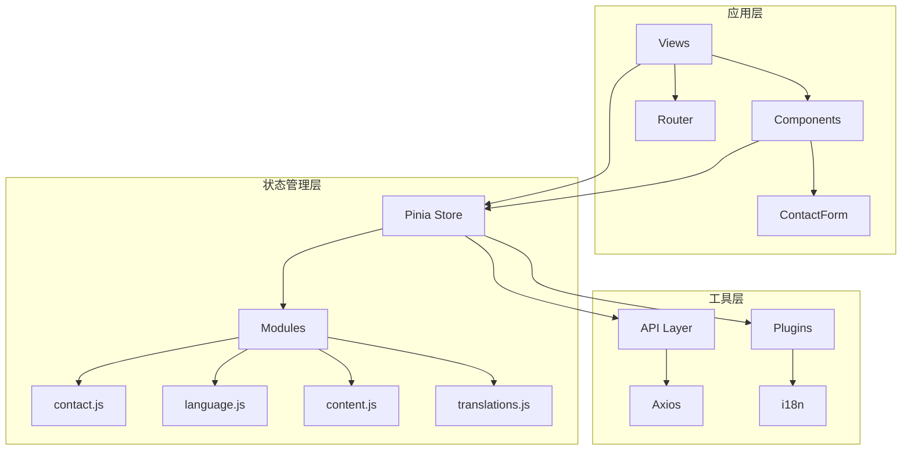
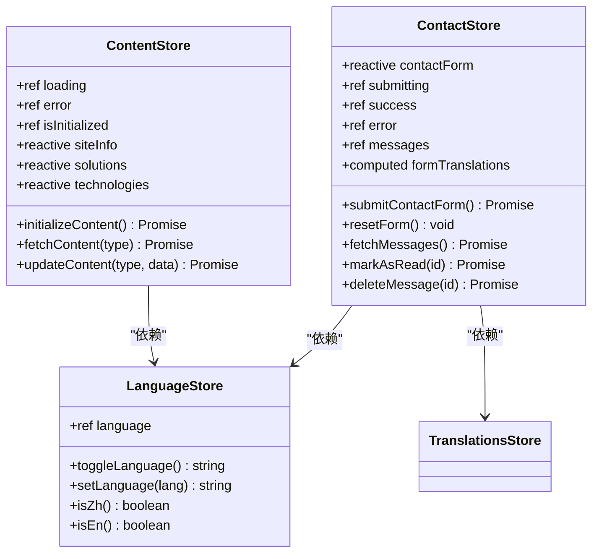
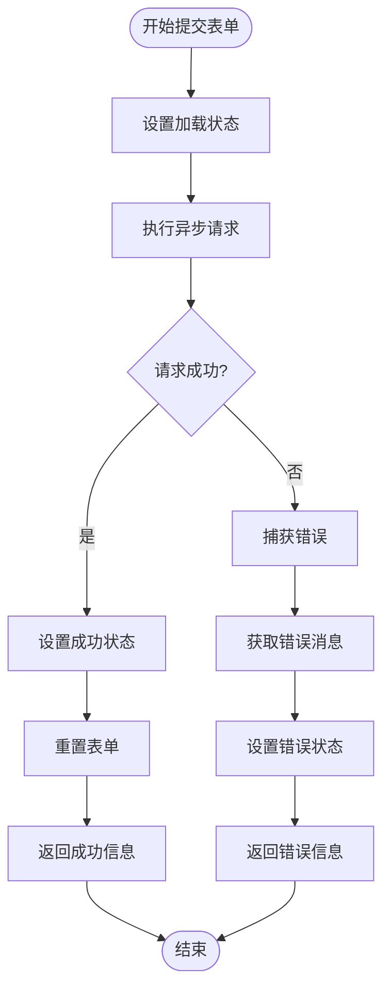
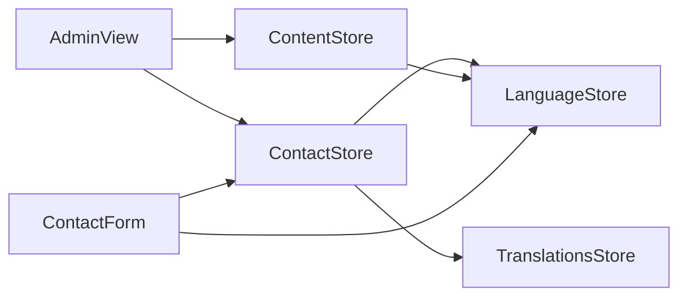
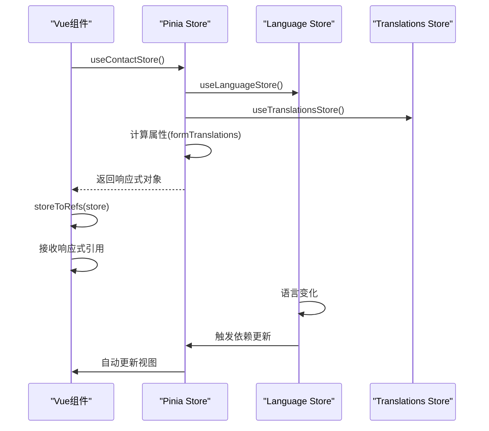
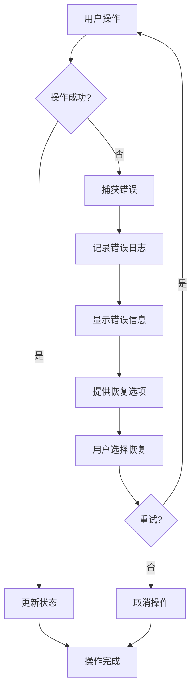
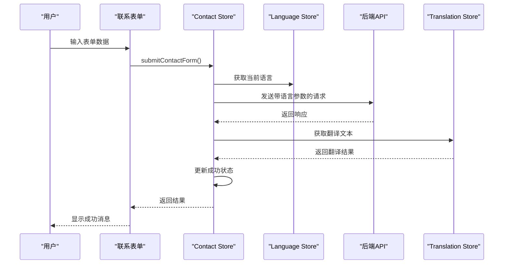

# Pinia状态管理最佳实践指南

<cite>
**本文档中引用的文件**
- [package.json](file://package.json)
- [src/store/index.js](file://src/store/index.js)
- [src/store/modules/contact.js](file://src/store/modules/contact.js)
- [src/store/modules/language.js](file://src/store/modules/language.js)
- [src/store/modules/content.js](file://src/store/modules/content.js)
- [src/store/modules/translations.js](file://src/store/modules/translations.js)
- [src/components/ContactForm.vue](file://src/components/ContactForm.vue)
- [src/views/ContactView.vue](file://src/views/ContactView.vue)
- [src/router/index.js](file://src/router/index.js)
- [src/main.js](file://src/main.js)
</cite>

## 目录
1. [引言](#引言)
2. [项目结构概览](#项目结构概览)
3. [核心模块化设计原则](#核心模块化设计原则)
4. [State设计规范](#state设计规范)
5. [Action异步操作最佳实践](#action异步操作最佳实践)
6. [组件间依赖关系管理](#组件间依赖关系管理)
7. [响应性管理](#响应性管理)
8. [性能优化策略](#性能优化策略)
9. [错误处理机制](#错误处理机制)
10. [实际应用示例](#实际应用示例)
11. [总结](#总结)

## 引言

本文档基于朗德智能无人机系统的Pinia状态管理架构，深入阐述了现代Vue.js应用中状态管理的最佳实践。该系统展示了如何通过模块化设计、响应性管理、错误处理和性能优化来构建可维护、可扩展的状态管理系统。

## 项目结构概览



**图表来源**
- [src/store/index.js](file://src/store/index.js#L1-L6)
- [src/main.js](file://src/main.js#L1-L20)

**章节来源**
- [src/store/index.js](file://src/store/index.js#L1-L6)
- [src/main.js](file://src/main.js#L1-L50)

## 核心模块化设计原则

### 功能域独立模块化

系统采用按功能域划分的模块化设计，每个功能域对应独立的store模块：

```javascript
// 主store入口文件
export * from './modules/content'
export * from './modules/auth'
export * from './modules/contact'
export * from './modules/cases'
export * from './modules/news'
```

这种设计遵循以下原则：
- **单一职责**：每个模块专注于特定业务领域
- **松耦合**：模块间通过明确的接口交互
- **高内聚**：相关状态和操作集中在同一模块

### 模块命名规范

- **contact.js**：联系表单管理
- **language.js**：国际化语言管理
- **content.js**：网站内容管理
- **translations.js**：翻译文本管理

**章节来源**
- [src/store/index.js](file://src/store/index.js#L1-L6)
- [src/store/modules/contact.js](file://src/store/modules/contact.js#L1-L10)

## State设计规范

### 函数式State初始化

Pinia推荐使用函数返回对象的方式初始化state，避免引用共享问题：

```javascript
export const useContactStore = defineStore('contact', () => {
  // 正确：函数返回新的对象实例
  const contactForm = reactive({
    name: '',
    email: '',
    phone: '',
    subject: '',
    company: '',
    message: ''
  })
  
  // 错误：直接定义对象会导致引用共享
  // const contactForm = {
  //   name: '',
  //   email: '',
  //   phone: '',
  //   subject: '',
  //   company: '',
  //   message: ''
  // }
})
```

### 响应式数据结构

```javascript
// 使用ref管理简单状态
const submitting = ref(false)
const success = ref(false)
const error = ref(null)

// 使用reactive管理复杂对象
const contactForm = reactive({
  name: '',
  email: '',
  phone: '',
  subject: '',
  company: '',
  message: ''
})
```

### 状态分割策略



**图表来源**
- [src/store/modules/contact.js](file://src/store/modules/contact.js#L8-L25)
- [src/store/modules/language.js](file://src/store/modules/language.js#L60-L80)
- [src/store/modules/content.js](file://src/store/modules/content.js#L10-L30)

**章节来源**
- [src/store/modules/contact.js](file://src/store/modules/contact.js#L8-L25)
- [src/store/modules/language.js](file://src/store/modules/language.js#L60-L80)

## Action异步操作最佳实践

### 完整的异步操作流程

以contactStore.submitContactForm()为例，展示完整的异步请求模式：

```javascript
const submitContactForm = async () => {
  // 1. 设置加载状态
  submitting.value = true
  success.value = false
  error.value = null
  
  try {
    // 2. 执行异步操作
    await axios.post('/api/contact', {
      ...contactForm,
      language: languageStore.language // 添加语言信息
    })
    
    // 3. 处理成功结果
    success.value = true
    resetForm()
    
    return { success: true }
  } catch (e) {
    // 4. 错误处理
    const errorMessage = languageStore.isZh() 
      ? '提交失败，请稍后再试' 
      : 'Submission failed, please try again later'
    
    error.value = e.message || errorMessage
    return { success: false, error: error.value }
  } finally {
    // 5. 清理工作
    submitting.value = false
  }
}
```

### 错误处理策略



**图表来源**
- [src/store/modules/contact.js](file://src/store/modules/contact.js#L30-L55)

### 管理后台操作模式

```javascript
// 获取消息列表（用于管理后台）
const fetchMessages = async () => {
  try {
    const response = await axios.get('/api/admin/messages')
    messages.value = response.data
    return { success: true }
  } catch (e) {
    console.error('Error fetching messages:', e)
    return { success: false, error: e.message }
  }
}

// 标记消息为已读（用于管理后台）
const markAsRead = async (id) => {
  try {
    await axios.put(`/api/admin/messages/${id}/read`)
    
    // 更新本地数据
    const index = messages.value.findIndex(msg => msg.id === id)
    if (index !== -1) {
      messages.value[index].read = true
    }
    
    return { success: true }
  } catch (e) {
    console.error(`Error marking message ${id} as read:`, e)
    return { success: false, error: e.message }
  }
}
```

**章节来源**
- [src/store/modules/contact.js](file://src/store/modules/contact.js#L30-L85)

## 组件间依赖关系管理

### Store间依赖注入

```javascript
export const useContactStore = defineStore('contact', () => {
  // 获取其他store实例
  const languageStore = useLanguageStore()
  const translationsStore = useTranslationsStore()
  
  // 计算属性依赖其他store的状态
  const formTranslations = computed(() => {
    return translationsStore.getContactForm(languageStore.language)
  })
  
  return {
    // ...其他状态和方法
    formTranslations,
    // ...
  }
})
```

### 依赖关系图



**图表来源**
- [src/store/modules/contact.js](file://src/store/modules/contact.js#L8-L10)
- [src/store/modules/content.js](file://src/store/modules/content.js#L8-L10)

### 语言切换联动机制

```javascript
// language.js中的语言切换逻辑
const toggleLanguage = () => {
  const newLang = language.value === 'zh' ? 'en' : 'zh'
  
  // 更新状态
  language.value = newLang
  
  // 发布语言变化事件
  document.dispatchEvent(new CustomEvent('languageChanged', { detail: newLang }))
  
  // 更新HTML标签的lang属性
  updateHtmlLang()
  
  // 强制触发页面重新渲染
  setTimeout(() => {
    window.dispatchEvent(new Event('resize'))
  }, 50)
  
  return newLang
}
```

**章节来源**
- [src/store/modules/contact.js](file://src/store/modules/contact.js#L8-L15)
- [src/store/modules/language.js](file://src/store/modules/language.js#L60-L120)

## 响应性管理

### storeToRefs的正确使用

```javascript
<script setup>
import { storeToRefs } from 'pinia'
import { useContactStore } from '@/store/modules/contact'

const contactStore = useContactStore()
// 正确：使用storeToRefs保持响应性
const { contactForm, submitting, success, error } = storeToRefs(contactStore)

// 错误：直接解构会失去响应性
// const { contactForm, submitting, success, error } = contactStore
</script>
```

### 响应性传递机制



**图表来源**
- [src/components/ContactForm.vue](file://src/components/ContactForm.vue#L30-L45)
- [src/store/modules/contact.js](file://src/store/modules/contact.js#L20-L25)

### 计算属性的响应性

```javascript
// 基于其他store状态的计算属性
const formTranslations = computed(() => {
  return translationsStore.getContactForm(languageStore.language)
})

// 基于本地状态的计算属性
const getSiteInfo = computed(() => {
  if (!isInitialized.value) return null
  return languageStore.language === 'zh' ? siteInfo.zh : siteInfo.en
})
```

**章节来源**
- [src/components/ContactForm.vue](file://src/components/ContactForm.vue#L30-L45)
- [src/store/modules/contact.js](file://src/store/modules/contact.js#L20-L25)

## 性能优化策略

### 状态分割与惰性加载

```javascript
// 按需加载内容
const fetchContent = async (contentType) => {
  if (!isInitialized.value) return null
  
  try {
    loading.value = true
    error.value = null
    
    // 构建API请求URL
    const url = `/content/${contentType}`
    
    // 发送请求
    const response = await axios.get(url)
    
    // 只更新需要的数据
    if (contentType === 'site-info') {
      Object.assign(siteInfo.zh, response.data?.zh || {})
      Object.assign(siteInfo.en, response.data?.en || {})
    } else if (contentType === 'technologies') {
      if (response.data?.zh) technologies.zh = response.data.zh
      if (response.data?.en) technologies.en = response.data.en
    }
    
    return response.data
  } catch (err) {
    error.value = err.message || '数据加载失败'
    return null
  } finally {
    loading.value = false
  }
}
```

### 持久化策略

```javascript
// 增强的持久化保存方法
function persistLanguage(lang) {
  if (lang !== 'zh' && lang !== 'en') {
    console.warn('无效的语言值，不保存:', lang)
    return
  }
  
  // 保存到localStorage
  try {
    localStorage.setItem('language', lang)
  } catch (e) {
    console.error('保存到localStorage失败:', e)
  }
  
  // 同时保存到cookie，作为备份
  try {
    document.cookie = `language=${lang}; path=/; max-age=${60*60*24*30}` // 30天过期
  } catch (e) {
    console.error('保存到cookie失败:', e)
  }
}
```

### 应用初始化优化

```javascript
// 预加载关键图片减少加载时间
const preloadImages = () => {
  const imagesToPreload = [
    '/images/tech/detection.jpg',
    '/images/tech/jamming.jpg'
  ]
  
  return Promise.all(imagesToPreload.map(src => {
    return new Promise((resolve) => {
      const img = new Image()
      img.onload = img.onerror = resolve
      img.src = src
    })
  }))
}

// 快速应用挂载
const initApp = async () => {
  try {
    // 挂载应用，不等待图片预加载
    app.mount('#app')
    
    // 在后台预加载图片
    preloadImages().catch(error => {
      console.error('图片预加载失败:', error)
    })
  } catch (error) {
    console.error('应用初始化失败:', error)
    app.mount('#app')
  }
}
```

**章节来源**
- [src/store/modules/content.js](file://src/store/modules/content.js#L580-L620)
- [src/store/modules/language.js](file://src/store/modules/language.js#L20-L50)
- [src/main.js](file://src/main.js#L60-L100)

## 错误处理机制

### 分层错误处理

```javascript
// 组件级错误处理
const submitForm = async () => {
  try {
    await contactStore.submitContactForm()
  } catch (error) {
    // 组件层面的错误处理
    console.error('表单提交失败:', error)
    // 显示友好的错误提示
  }
}

// Store级错误处理
const submitContactForm = async () => {
  try {
    // ...主要业务逻辑
  } catch (e) {
    // Store内部的错误处理
    const errorMessage = languageStore.isZh() 
      ? '提交失败，请稍后再试' 
      : 'Submission failed, please try again later'
    
    error.value = e.message || errorMessage
    return { success: false, error: error.value }
  }
}
```

### 错误恢复机制



**图表来源**
- [src/store/modules/contact.js](file://src/store/modules/contact.js#L30-L55)

## 实际应用示例

### 完整的表单提交流程

```javascript
// ContactForm.vue中的使用示例
<script setup>
import { storeToRefs } from 'pinia'
import { useContactStore } from '@/store/modules/contact'
import { useLanguage } from '@/mixins/language'
import { computed } from 'vue'

// 使用语言功能
const { isZh, isEn, getContactForm, getFormTranslations } = useLanguage()

// 获取表单文本 - 可以使用两种方式
const formText = computed(() => getContactForm())

const contactStore = useContactStore()
const { contactForm, submitting, success, error } = storeToRefs(contactStore)

const submitForm = async () => {
  await contactStore.submitContactForm()
}
</script>
```

### 多语言支持的完整流程



**图表来源**
- [src/components/ContactForm.vue](file://src/components/ContactForm.vue#L30-L45)
- [src/store/modules/contact.js](file://src/store/modules/contact.js#L30-L55)

### 管理后台操作示例

```javascript
// 管理后台的消息管理
const markAsRead = async (id) => {
  try {
    await axios.put(`/api/admin/messages/${id}/read`)
    
    // 更新本地数据
    const index = messages.value.findIndex(msg => msg.id === id)
    if (index !== -1) {
      messages.value[index].read = true
    }
    
    return { success: true }
  } catch (e) {
    console.error(`Error marking message ${id} as read:`, e)
    return { success: false, error: e.message }
  }
}

const deleteMessage = async (id) => {
  try {
    await axios.delete(`/api/admin/messages/${id}`)
    
    // 更新本地数据
    messages.value = messages.value.filter(msg => msg.id !== id)
    
    return { success: true }
  } catch (e) {
    console.error(`Error deleting message ${id}:`, e)
    return { success: false, error: e.message }
  }
}
```

**章节来源**
- [src/components/ContactForm.vue](file://src/components/ContactForm.vue#L30-L45)
- [src/store/modules/contact.js](file://src/store/modules/contact.js#L85-L110)

## 总结

本文档基于朗德智能无人机系统的Pinia状态管理架构，总结了以下最佳实践：

### 核心原则
1. **模块化设计**：按功能域划分store模块，实现高内聚低耦合
2. **响应性管理**：使用storeToRefs保持组件与store的响应性连接
3. **错误处理**：分层错误处理，提供用户友好的错误信息
4. **性能优化**：状态分割、惰性加载和智能缓存策略

### 关键要点
- State必须为函数返回的对象，避免引用共享
- 所有异步操作必须包含完整的错误处理
- 禁止直接修改state，必须通过actions提交变更
- 正确使用storeToRefs避免解构破坏响应性
- 实现store间的依赖关系管理

### 性能优化
- 按需加载内容数据
- 图片预加载策略
- 智能持久化存储
- 应用初始化优化

通过遵循这些最佳实践，可以构建出可维护、可扩展且高性能的Vue.js状态管理系统。