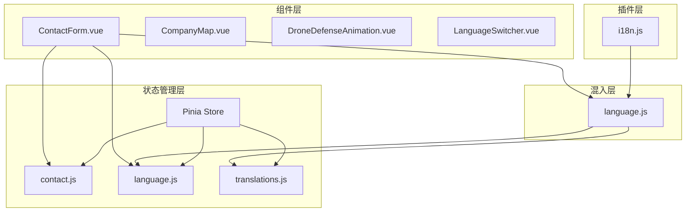
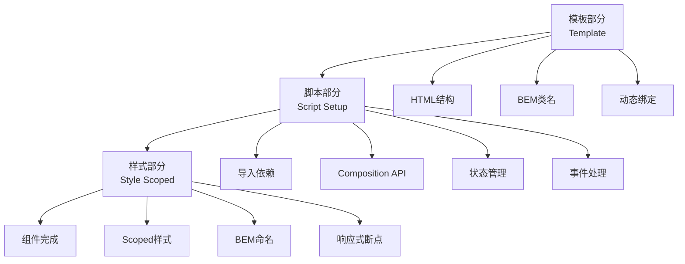

# Vue组件开发规范

<cite>
**本文档中引用的文件**
- [ContactForm.vue](file://src/components/ContactForm.vue)
- [language.js](file://src/mixins/language.js)
- [contact.js](file://src/store/modules/contact.js)
- [language.js](file://src/store/modules/language.js)
- [i18n.js](file://src/plugins/i18n.js)
- [responsive.css](file://src/assets/responsive.css)
- [base.css](file://src/assets/base.css)
</cite>

## 目录
1. [简介](#简介)
2. [项目结构概述](#项目结构概述)
3. [命名约定](#命名约定)
4. [组件结构规范](#组件结构规范)
5. [Props类型校验规范](#props类型校验规范)
6. [Composition API使用规范](#composition-api使用规范)
7. [v-model和事件处理](#v-model和事件处理)
8. [可复用性原则](#可复用性原则)
9. [样式作用域规范](#样式作用域规范)
10. [响应式布局实现](#响应式布局实现)
11. [最佳实践示例](#最佳实践示例)
12. [总结](#总结)

## 简介

本文档基于朗德智能科技项目的实际开发经验，制定了Vue组件开发的标准化规范。该规范涵盖了从基础命名约定到高级架构模式的各个方面，旨在提高代码质量、增强可维护性和促进团队协作。

## 项目结构概述

项目采用模块化的Vue 3架构，主要分为以下几个核心模块：



**图表来源**
- [ContactForm.vue](file://src/components/ContactForm.vue#L1-L155)
- [language.js](file://src/mixins/language.js#L1-L127)

## 命名约定

### 组件文件命名

所有Vue组件文件必须采用PascalCase命名法：

- ✅ 正确：`ContactForm.vue`
- ❌ 错误：`contact-form.vue`、`contactForm.vue`

### Props命名

组件的props参数必须使用camelCase命名：

```javascript
// props定义示例
defineProps({
  modelValue: {
    type: String,
    default: ''
  },
  requiredField: {
    type: Boolean,
    default: false,
    required: true
  }
})
```

### 事件命名

组件发出的事件名必须使用kebab-case命名：

```javascript
// emit定义示例
const emit = defineEmits([
  'update:model-value',
  'form-submitted',
  'field-changed'
])
```

**章节来源**
- [ContactForm.vue](file://src/components/ContactForm.vue#L1-L155)

## 组件结构规范

### 单文件组件(SFC)结构

标准的Vue 3单文件组件应按照以下顺序组织：



**图表来源**
- [ContactForm.vue](file://src/components/ContactForm.vue#L1-L155)

### 模板部分规范

1. **HTML结构清晰**：使用语义化标签，保持嵌套层次不超过3层
2. **BEM命名方法**：采用Block__Element--Modifier命名规范
3. **动态绑定**：合理使用v-bind和v-on指令

```vue
<template>
  <div class="contact-form">
    <form @submit.prevent="submitForm">
      <div class="form-group">
        <label for="name">{{ formText.name }}</label>
        <input 
          type="text" 
          id="name" 
          v-model="contactForm.name" 
          class="form-control" 
          required
        >
      </div>
    </form>
  </div>
</template>
```

**章节来源**
- [ContactForm.vue](file://src/components/ContactForm.vue#L1-L30)

## Props类型校验规范

### 完整的Prop定义

每个prop都必须完整定义其类型、默认值和必需属性：

```javascript
// 完整的props定义示例
const props = defineProps({
  // 字符串类型，有默认值，非必需
  modelValue: {
    type: String,
    default: '',
    required: false
  },
  
  // 布尔类型，必需
  requiredField: {
    type: Boolean,
    default: false,
    required: true
  },
  
  // 对象类型，复杂验证
  formData: {
    type: Object,
    default: () => ({}),
    required: true,
    validator: (value) => {
      return value && typeof value === 'object' && Object.keys(value).length > 0
    }
  }
})
```

### 类型检查最佳实践

1. **使用具体类型**：避免使用`Object`或`Array`作为通用类型
2. **提供合理的默认值**：确保组件在缺少prop时仍能正常工作
3. **添加验证器**：对于复杂对象，使用validator函数进行额外验证

**章节来源**
- [ContactForm.vue](file://src/components/ContactForm.vue#L31-L45)

## Composition API使用规范

### Script Setup语法糖

推荐使用script setup语法糖，它提供了更简洁的API：

```javascript
<script setup>
import { ref, computed, watch } from 'vue'
import { useStore } from 'vuex'

// 响应式数据
const count = ref(0)
const message = ref('Hello World')

// 计算属性
const doubleCount = computed(() => count.value * 2)

// 方法
const increment = () => {
  count.value++
}

// 生命周期钩子
onMounted(() => {
  console.log('Component mounted')
})

// 监听器
watch(count, (newValue, oldValue) => {
  console.log('Count changed:', newValue, oldValue)
})
</script>
```

### 组合式API组织方式

1. **按功能分组**：将相关的逻辑组织在一起
2. **导出公共接口**：通过defineExpose暴露必要的公共方法
3. **避免副作用**：尽量将副作用封装在独立的函数中

```javascript
// 组合式API组织示例
<script setup>
// 1. 导入部分
import { useLanguage } from '@/mixins/language'
import { useContactStore } from '@/store/modules/contact'

// 2. 语言功能
const { isZh, isEn, getContactForm } = useLanguage()

// 3. 状态管理
const contactStore = useContactStore()
const { contactForm, submitting, success, error } = storeToRefs(contactStore)

// 4. 计算属性
const formText = computed(() => getContactForm())

// 5. 方法
const submitForm = async () => {
  await contactStore.submitContactForm()
}

// 6. 暴露公共接口
defineExpose({
  submitForm
})
</script>
```

**章节来源**
- [ContactForm.vue](file://src/components/ContactForm.vue#L31-L45)

## v-model和事件处理

### v-model双向绑定

在组件中正确使用v-model进行双向数据绑定：

```vue
<template>
  <input 
    type="text" 
    :value="modelValue"
    @input="$emit('update:model-value', $event.target.value)"
  >
</template>

<script setup>
defineProps({
  modelValue: {
    type: String,
    default: ''
  }
})

defineEmits(['update:model-value'])
</script>
```

### 自定义事件处理

```javascript
// 事件定义和处理
const emit = defineEmits([
  'update:model-value',
  'form-submitted',
  'field-changed'
])

const handleFieldChange = (field, value) => {
  emit('field-changed', { field, value })
  emit('update:model-value', value)
}
```

**章节来源**
- [ContactForm.vue](file://src/components/ContactForm.vue#L3-L25)

## 可复用性原则

### Mixin的正确使用

项目中通过language.js mixin提供可复用的语言功能：

```javascript
// language.js mixin示例
export function useLanguage() {
  // 使用store
  const languageStore = useLanguageStore()
  const translationsStore = useTranslationsStore()
  
  // 尝试从provide/inject机制获取
  const injectedLanguage = inject('currentLanguage', null)
  const injectedIsZh = inject('isEn', null)
  
  // 返回可复用的功能
  return {
    currentLanguage,
    isZh,
    isEn,
    toggleLanguage,
    setLanguage,
    // ...其他功能
  }
}
```

### Provide/Inject机制应用

```javascript
// 父组件提供语言上下文
provide('currentLanguage', languageStore.language)
provide('isZh', computed(() => languageStore.isZh()))
provide('isEn', computed(() => languageStore.isEn()))

// 子组件注入
const currentLanguage = inject('currentLanguage')
const isZh = inject('isZh')
```

### Pinia Store集成

```javascript
// store模块示例
export const useContactStore = defineStore('contact', () => {
  const contactForm = reactive({
    name: '',
    email: '',
    phone: '',
    subject: '',
    message: ''
  })

  const submitContactForm = async () => {
    // 实际业务逻辑
  }

  return {
    contactForm,
    submitContactForm
  }
})
```

**章节来源**
- [language.js](file://src/mixins/language.js#L1-L127)
- [contact.js](file://src/store/modules/contact.js#L1-L135)

## 样式作用域规范

### Scoped CSS使用

所有组件必须使用scoped CSS防止样式污染：

```vue
<style scoped>
.contact-form {
  background: var(--light-bg);
  padding: 30px;
  border-radius: 8px;
}

.form-control {
  margin-bottom: 5px;
  width: 100%;
  padding: 12px;
  border-radius: 6px;
  border: 1px solid #e2e8f0;
  font-size: 16px;
  transition: all 0.3s ease;
}
</style>
```

### CSS变量使用

项目使用CSS自定义属性实现主题化：

```css
:root {
  --primary-color: #0ea5e9;
  --secondary-color: #0284c7;
  --accent-color: #38bdf8;
  --text-color: #1e293b;
  --light-text: #f8fafc;
  --bg-color: #ffffff;
  --light-bg: #f1f5f9;
  --dark-bg: #0f172a;
  --border-color: #e2e8f0;
  --shadow: 0 4px 6px rgba(0, 0, 0, 0.1);
  --transition: all 0.3s ease;
}
```

### BEM命名方法

遵循BEM(Block Element Modifier)命名规范：

- **Block**: `.contact-form`
- **Element**: `.contact-form__group`
- **Modifier**: `.contact-form--large`

**章节来源**
- [ContactForm.vue](file://src/components/ContactForm.vue#L110-L155)
- [base.css](file://src/assets/base.css#L1-L50)

## 响应式布局实现

### 断点定义

项目使用预定义的断点实现响应式设计：

```css
/* 响应式断点 */
@media (min-width: 1200px) { /* 大屏幕 */ }
@media (max-width: 1199px) { /* 中等屏幕 */ }
@media (max-width: 991px) { /* 平板 */ }
@media (max-width: 767px) { /* 手机 */ }
@media (max-width: 575px) { /* 小手机 */ }
```

### 移动端适配

```css
/* 移动端优化示例 */
@media (max-width: 767px) {
  .hero {
    min-height: 100vh;
    align-items: flex-start;
  }
  
  .hero-content-wrapper {
    padding: 120px 0 60px;
  }
  
  .hero-content h2 {
    font-size: 2rem;
    margin-bottom: 1rem;
  }
  
  nav {
    position: fixed;
    top: 0;
    right: -100%;
    width: 85%;
    max-width: 350px;
  }
}
```

### 响应式组件设计

```vue
<template>
  <div class="contact-form">
    <!-- 响应式布局 -->
    <div class="form-container">
      <div class="form-column" v-if="!isMobile">
        <div class="form-group">
          <label for="name">{{ formText.name }}</label>
          <input type="text" id="name" v-model="contactForm.name" class="form-control">
        </div>
      </div>
      
      <div class="form-column" v-else>
        <div class="form-group">
          <label for="name">{{ formText.name }}</label>
          <input type="text" id="name" v-model="contactForm.name" class="form-control">
        </div>
      </div>
    </div>
  </div>
</template>

<script setup>
import { ref, onMounted, onUnmounted } from 'vue'

const isMobile = ref(false)

const checkMobile = () => {
  isMobile.value = window.innerWidth <= 767
}

onMounted(() => {
  checkMobile()
  window.addEventListener('resize', checkMobile)
})

onUnmounted(() => {
  window.removeEventListener('resize', checkMobile)
})
</script>
```

**章节来源**
- [responsive.css](file://src/assets/responsive.css#L1-L100)
- [ContactForm.vue](file://src/components/ContactForm.vue#L1-L155)

## 最佳实践示例

### ContactForm.vue完整示例

以下是基于项目实际的ContactForm.vue组件，展示了所有规范的最佳实践：

```vue
<template>
  <div class="contact-form">
    <form @submit.prevent="submitForm" class="form-wrapper">
      <!-- 姓名字段 -->
      <div class="form-group">
        <label for="name">{{ formText.name }}</label>
        <input 
          type="text" 
          id="name" 
          v-model="contactForm.name" 
          class="form-control" 
          required
          placeholder="{{ formText.namePlaceholder }}"
        >
      </div>
      
      <!-- 邮箱字段 -->
      <div class="form-group">
        <label for="email">{{ formText.email }}</label>
        <input 
          type="email" 
          id="email" 
          v-model="contactForm.email" 
          class="form-control" 
          required
          placeholder="{{ formText.emailPlaceholder }}"
        >
      </div>
      
      <!-- 主题选择 -->
      <div class="form-group">
        <label for="subject">{{ formText.subject }}</label>
        <select 
          id="subject" 
          v-model="contactForm.subject" 
          class="form-control" 
          required
        >
          <option value="" disabled selected>
            -- {{ isZh ? '请选择' : 'Please select' }} --
          </option>
          <option v-for="(option, index) in formText.subjectOptions" :key="index" :value="option">
            {{ option }}
          </option>
        </select>
      </div>
      
      <!-- 消息字段 -->
      <div class="form-group">
        <label for="message">{{ formText.message }}</label>
        <textarea 
          id="message" 
          v-model="contactForm.message" 
          class="form-control" 
          rows="5" 
          required
          placeholder="{{ formText.messagePlaceholder }}"
        ></textarea>
      </div>
      
      <!-- 成功提示 -->
      <div v-if="success" class="alert alert-success">
        {{ formText.success }}
      </div>
      
      <!-- 错误提示 -->
      <div v-if="error" class="alert alert-error">
        {{ formText.error }}
      </div>
      
      <!-- 提交按钮 -->
      <button 
        type="submit" 
        class="btn" 
        :disabled="submitting"
      >
        <span v-if="submitting">
          {{ isZh ? '提交中...' : 'Submitting...' }}
        </span>
        <span v-else>{{ formText.submit }}</span>
      </button>
    </form>
  </div>
</template>

<script setup>
import { storeToRefs } from 'pinia'
import { useContactStore } from '@/store/modules/contact'
import { useLanguage } from '@/mixins/language'
import { computed } from 'vue'

// 使用语言功能
const { isZh, isEn, getContactForm } = useLanguage()

// 获取表单文本
const formText = computed(() => getContactForm())

// 获取store状态
const contactStore = useContactStore()
const { contactForm, submitting, success, error } = storeToRefs(contactStore)

// 表单提交方法
const submitForm = async () => {
  try {
    await contactStore.submitContactForm()
  } catch (error) {
    console.error('Form submission failed:', error)
  }
}

// 暴露公共方法
defineExpose({
  submitForm
})
</script>

<style scoped>
.contact-form {
  background: var(--light-bg);
  padding: 30px;
  border-radius: 8px;
  box-shadow: var(--shadow);
}

.form-wrapper {
  max-width: 600px;
  margin: 0 auto;
}

.form-group {
  margin-bottom: 20px;
}

label {
  display: block;
  margin-bottom: 8px;
  font-weight: 500;
  color: var(--text-color);
}

.form-control {
  width: 100%;
  padding: 12px;
  border-radius: 6px;
  border: 1px solid var(--border-color);
  font-size: 16px;
  transition: var(--transition);
}

.form-control:focus {
  border-color: var(--accent-color);
  box-shadow: 0 0 0 3px rgba(56, 189, 248, 0.2);
  outline: none;
}

select.form-control {
  appearance: none;
  background-image: url("data:image/svg+xml;charset=utf-8,%3Csvg xmlns='http://www.w3.org/2000/svg' width='16' height='16' viewBox='0 0 24 24' fill='none' stroke='%234facfe' stroke-width='2' stroke-linecap='round' stroke-linejoin='round'%3E%3Cpolyline points='6 9 12 15 18 9'/%3E%3C/svg%3E");
  background-repeat: no-repeat;
  background-position: right 12px center;
  background-size: 16px;
  padding-right: 40px;
}

.btn {
  width: 100%;
  margin-top: 10px;
  background: var(--tech-gradient);
  color: var(--light-text);
  border: none;
  padding: 14px;
  border-radius: 6px;
  font-weight: 600;
  cursor: pointer;
  transition: var(--transition);
}

.btn:hover {
  transform: translateY(-2px);
  box-shadow: var(--tech-glow);
}

.btn:disabled {
  background: #94a3b8;
  cursor: not-allowed;
  transform: none;
  box-shadow: none;
}

.alert {
  margin-bottom: 15px;
  padding: 12px;
  border-radius: 6px;
  font-size: 14px;
}

.alert-success {
  background-color: rgba(34, 197, 94, 0.1);
  color: #16a34a;
  border: 1px solid rgba(34, 197, 94, 0.3);
}

.alert-error {
  background-color: rgba(239, 68, 68, 0.1);
  color: #dc2626;
  border: 1px solid rgba(239, 68, 68, 0.3);
}

@media (max-width: 767px) {
  .contact-form {
    padding: 20px;
  }
  
  .btn {
    padding: 12px;
  }
}
</style>
```

**章节来源**
- [ContactForm.vue](file://src/components/ContactForm.vue#L1-L155)

## 总结

本文档详细阐述了Vue组件开发的标准化规范，包括：

1. **命名约定**：采用PascalCase文件命名，camelCase prop命名，kebab-case事件命名
2. **组件结构**：遵循SFC标准结构，使用script setup语法糖
3. **类型校验**：完整定义props的type、default和required属性
4. **Composition API**：合理使用组合式API，按功能组织代码
5. **v-model和事件**：正确实现双向绑定和自定义事件
6. **可复用性**：通过mixin和provide/inject机制提升组件复用性
7. **样式规范**：使用scoped CSS和BEM命名方法
8. **响应式设计**：实现跨设备的响应式布局

这些规范基于朗德智能科技项目的实际开发经验，旨在提高代码质量和开发效率，同时确保组件的可维护性和可扩展性。开发者应严格遵循这些规范，以保证项目的一致性和专业性。