# 技术栈

<cite>
**本文档中引用的文件**
- [package.json](file://package.json)
- [vite.config.js](file://vite.config.js)
- [app.js](file://app.js)
- [src/main.js](file://src/main.js)
- [src/components/DroneDefenseScene.vue](file://src/components/DroneDefenseScene.vue)
- [src/router/index.js](file://src/router/index.js)
- [src/store/index.js](file://src/store/index.js)
- [src/store/modules/auth.js](file://src/store/modules/auth.js)
- [src/store/modules/contact.js](file://src/store/modules/contact.js)
- [src/api/index.js](file://src/api/index.js)
- [src/components/ContactForm.vue](file://src/components/ContactForm.vue)
- [src/views/DroneSystemView.vue](file://src/views/DroneSystemView.vue)
</cite>

## 目录
1. [项目概述](#项目概述)
2. [前端技术栈](#前端技术栈)
3. [后端技术栈](#后端技术栈)
4. [构建工具与开发环境](#构建工具与开发环境)
5. [技术选型分析](#技术选型分析)
6. [版本约束与兼容性](#版本约束与兼容性)
7. [前后端联调机制](#前后端联调机制)
8. [性能优化策略](#性能优化策略)
9. [总结](#总结)

## 项目概述

本项目是一个现代化的智能科技公司官网，采用前后端分离架构，专注于展示无人机系统解决方案。项目集成了多种前沿技术，包括3D渲染、动画效果、国际化支持等，为用户提供沉浸式的交互体验。

## 前端技术栈

### Vue 3 框架核心

Vue 3 是项目的核心前端框架，提供了响应式数据绑定和组件化开发能力。

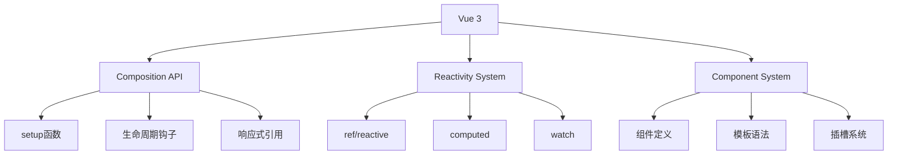

**图表来源**
- [src/main.js](file://src/main.js#L1-L230)
- [src/App.vue](file://src/App.vue)

### Pinia 状态管理

Pinia 替代 Vuex 成为状态管理解决方案，提供更简洁的API和更好的TypeScript支持。

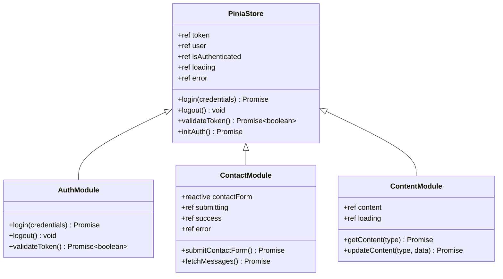

**图表来源**
- [src/store/modules/auth.js](file://src/store/modules/auth.js#L1-L86)
- [src/store/modules/contact.js](file://src/store/modules/contact.js#L1-L135)

### Vue Router 路由系统

Vue Router 提供了完整的客户端路由解决方案，支持嵌套路由和路由守卫。

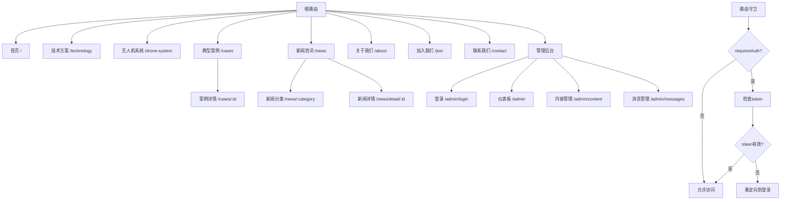

**图表来源**
- [src/router/index.js](file://src/router/index.js#L1-L122)

### GSAP 动画库

GSAP (GreenSock Animation Platform) 提供高性能的动画效果，用于页面过渡和交互动画。

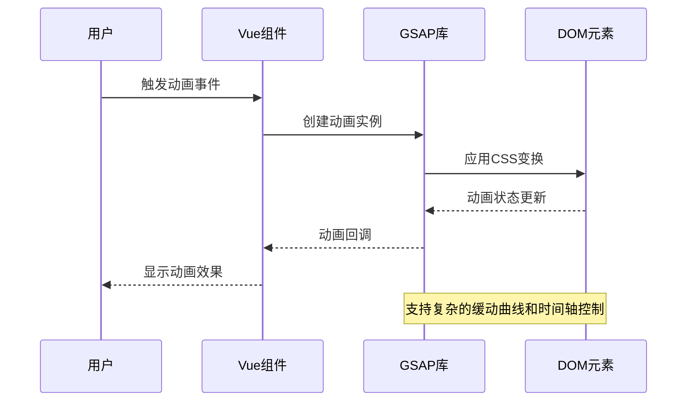

**图表来源**
- [src/components/DroneDefenseScene.vue](file://src/components/DroneDefenseScene.vue#L1-L782)

### Three.js 3D渲染引擎

Three.js 用于实现复杂的3D反无人机场景，提供逼真的视觉效果和交互体验。

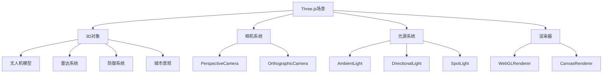

**图表来源**
- [src/components/DroneDefenseScene.vue](file://src/components/DroneDefenseScene.vue#L40-L120)

### Axios HTTP客户端

Axios 提供了简洁的HTTP请求接口，支持Promise和拦截器功能。

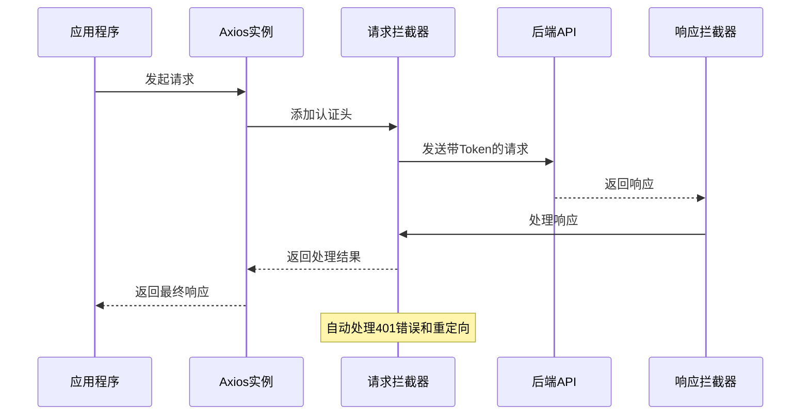

**图表来源**
- [src/api/index.js](file://src/api/index.js#L1-L95)

**章节来源**
- [package.json](file://package.json#L10-L22)
- [src/main.js](file://src/main.js#L1-L50)
- [src/router/index.js](file://src/router/index.js#L1-L30)
- [src/store/modules/auth.js](file://src/store/modules/auth.js#L1-L30)
- [src/api/index.js](file://src/api/index.js#L1-L20)

## 后端技术栈

### Express Web框架

Express 作为Node.js的Web应用框架，提供了灵活的路由和中间件支持。

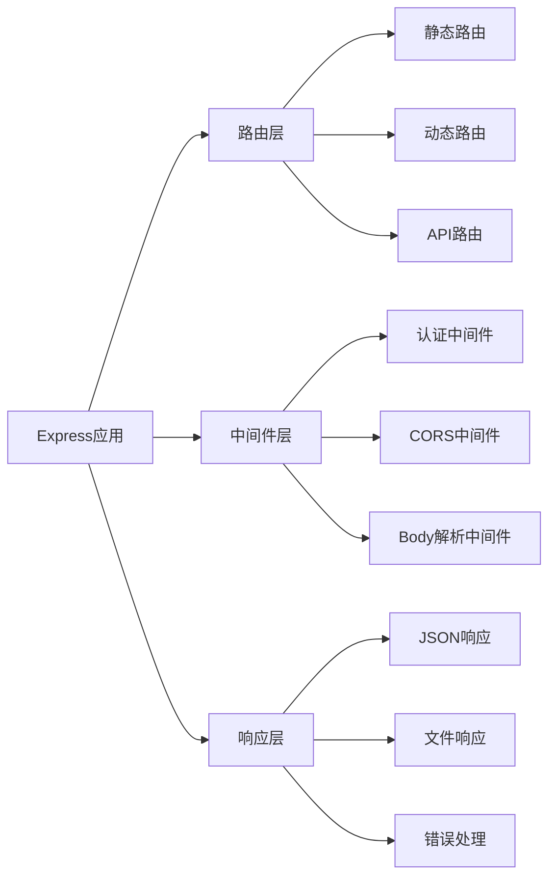

**图表来源**
- [app.js](file://app.js#L1-L50)

### JWT 认证机制

JWT (JSON Web Token) 用于实现无状态的身份验证，支持跨域和移动端应用。

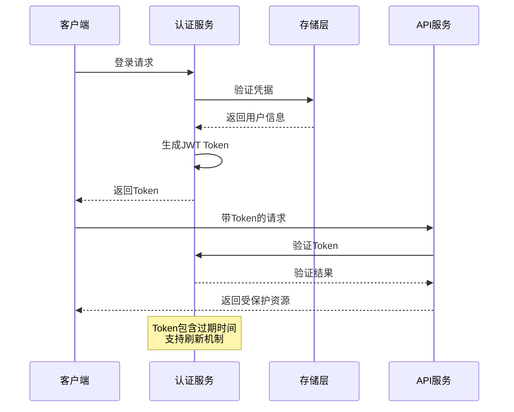

**图表来源**
- [src/store/modules/auth.js](file://src/store/modules/auth.js#L15-L45)

### Multer 文件上传处理

Multer 中间件专门处理multipart/form-data类型的文件上传。

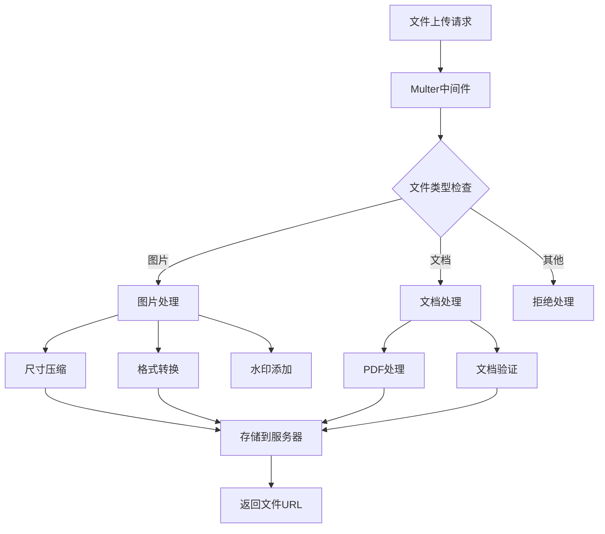

**图表来源**
- [src/store/modules/contact.js](file://src/store/modules/contact.js#L30-L50)

**章节来源**
- [package.json](file://package.json#L15-L20)
- [src/store/modules/auth.js](file://src/store/modules/auth.js#L1-L86)

## 构建工具与开发环境

### Vite 构建工具

Vite 作为现代前端构建工具，提供了快速的开发体验和高效的生产构建。

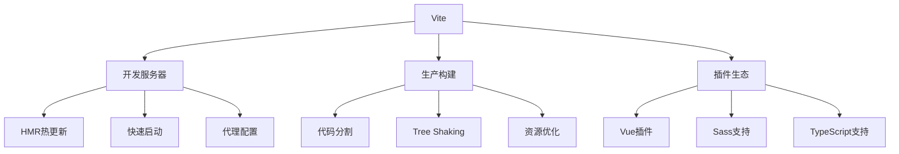

**图表来源**
- [vite.config.js](file://vite.config.js#L1-L41)

### Vite 插件生态系统

项目使用了多个Vite插件来增强开发体验和构建功能。

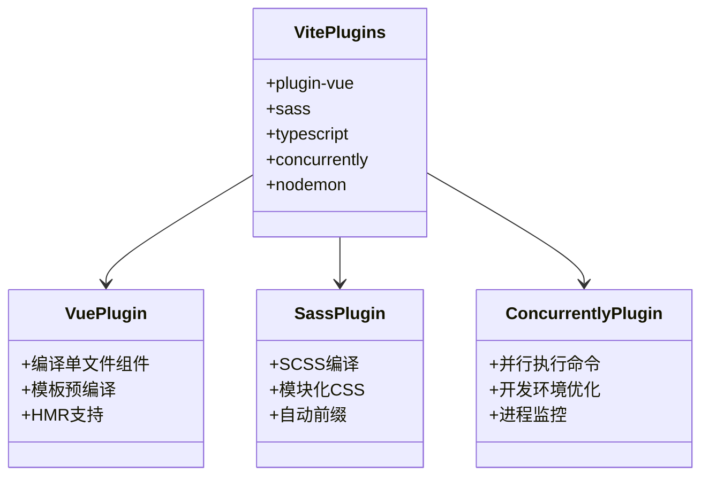

**图表来源**
- [package.json](file://package.json#L23-L28)
- [vite.config.js](file://vite.config.js#L4-L6)

**章节来源**
- [package.json](file://package.json#L5-L10)
- [vite.config.js](file://vite.config.js#L1-L41)

## 技术选型分析

### Vue 3 vs Vue 2 的优势

Vue 3 相较于 Vue 2 提供了多项改进：

1. **Composition API**：更灵活的代码组织方式
2. **更好的TypeScript支持**：原生TypeScript类型推断
3. **性能优化**：更快的渲染速度和更小的包体积
4. **Fragment支持**：组件可以返回多个根节点
5. **Teleport**：组件可以在DOM树的任意位置渲染

### Pinia vs Vuex 的轻量化优势

Pinia 相对于 Vuex 的主要改进：

1. **更简洁的API**：减少样板代码
2. **TypeScript友好**：更好的类型推断
3. **模块化设计**：更清晰的状态组织
4. **热重载支持**：开发时状态保持
5. **更小的包体积**：减少应用大小

### Three.js 在3D反无人机场景中的必要性

Three.js 在本项目中的关键作用：

1. **复杂3D场景渲染**：实现逼真的无人机和城市环境
2. **实时交互**：支持用户与3D场景的互动
3. **性能优化**：针对WebGL的优化渲染
4. **动画系统**：复杂的无人机飞行和防御动画
5. **跨平台兼容**：在各种设备上提供一致的3D体验

### Vite 快速开发体验的优势

Vite 相较于传统构建工具的优势：

1. **冷启动速度快**：基于ESM的按需编译
2. **热更新快**：基于浏览器原生ESM的HMR
3. **零配置开箱即用**：减少配置复杂度
4. **TypeScript支持**：内置TypeScript编译
5. **插件生态丰富**：支持各种开发需求

## 版本约束与兼容性

### 依赖版本约束分析

项目中各依赖项的版本约束考虑：

```javascript
// Vue 3.3.8 - 最新稳定版本，支持Composition API
"vue": "^3.3.8"

// Pinia 2.1.7 - 状态管理的最佳实践版本
"pinia": "^2.1.7"

// Vue Router 4.2.5 - 完整的路由功能支持
"vue-router": "^4.2.5"

// Three.js 0.177.0 - 最新的3D渲染功能
"three": "^0.177.0"

// GSAP 3.13.0 - 高性能动画库
"gsap": "^3.13.0"

// Axios 1.6.2 - 稳定的HTTP客户端
"axios": "^1.6.2"
```

### 兼容性考虑

1. **浏览器兼容性**：支持现代浏览器（Chrome 80+, Firefox 75+, Safari 14+）
2. **移动端适配**：响应式设计支持各种移动设备
3. **性能优化**：针对低端设备的性能优化
4. **渐进增强**：非JavaScript环境下仍能正常显示

**章节来源**
- [package.json](file://package.json#L10-L28)

## 前后端联调机制

### Vite 代理配置

Vite 提供了便捷的代理配置，简化前后端联调过程。

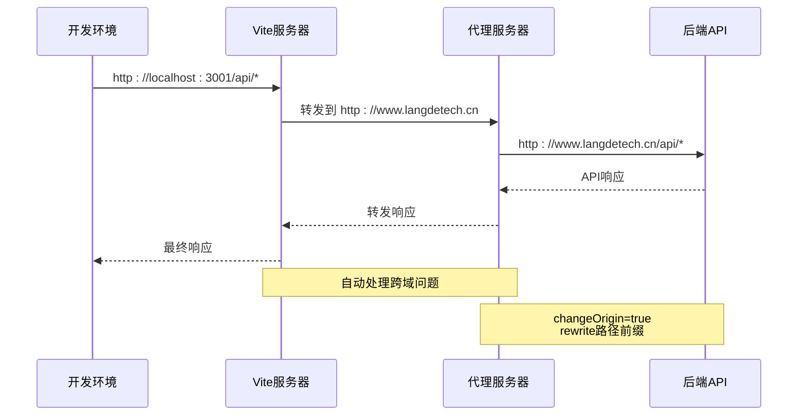

**图表来源**
- [vite.config.js](file://vite.config.js#L25-L35)

### 开发环境配置

开发环境的联调配置特点：

1. **端口分离**：前端运行在3001端口，后端独立运行
2. **代理转发**：自动将/api前缀的请求转发到后端
3. **跨域处理**：通过changeOrigin解决跨域问题
4. **路径重写**：自动移除/api前缀

### 生产环境部署

生产环境的部署策略：

1. **静态资源部署**：Vite构建后的静态文件部署
2. **API代理配置**：Nginx或其他反向代理配置
3. **CDN加速**：静态资源使用CDN分发
4. **缓存策略**：合理的缓存配置提升性能

**章节来源**
- [vite.config.js](file://vite.config.js#L25-L35)

## 性能优化策略

### 前端性能优化

1. **代码分割**：按路由和组件进行代码分割
2. **懒加载**：路由组件和图片的懒加载
3. **资源预加载**：关键资源的预加载策略
4. **缓存优化**：合理利用浏览器缓存
5. **3D场景优化**：针对不同设备的性能调整

### 构建优化

1. **Tree Shaking**：移除未使用的代码
2. **压缩优化**：JS和CSS的压缩
3. **图片优化**：自动压缩和格式转换
4. **Bundle分析**：定期分析bundle大小

### 运行时优化

1. **虚拟DOM优化**：减少不必要的重新渲染
2. **事件委托**：优化事件处理性能
3. **防抖节流**：合理使用防抖和节流
4. **内存管理**：及时清理不需要的资源

## 总结

本项目采用了现代化的技术栈组合，每个技术的选择都有其特定的理由和优势：

1. **Vue 3 + Pinia + Vue Router**：提供了现代化的前端开发体验和最佳实践
2. **Three.js + GSAP**：实现了复杂的3D动画效果和交互体验
3. **Axios + JWT**：建立了完善的前后端通信和认证机制
4. **Vite + 插件生态**：提供了高效的开发和构建体验

这种技术组合不仅满足了当前项目的需求，也为未来的功能扩展和技术演进奠定了坚实的基础。对于新加入团队的开发者，建议重点关注以下方面：

- **Vue 3 Composition API**：掌握新的开发模式
- **Pinia状态管理**：理解状态管理的最佳实践
- **3D场景开发**：学习Three.js的高级用法
- **性能优化**：关注前端性能的各个方面

通过深入理解和实践这些技术，开发者能够更好地参与到项目的开发和维护工作中，为用户提供更好的产品体验。