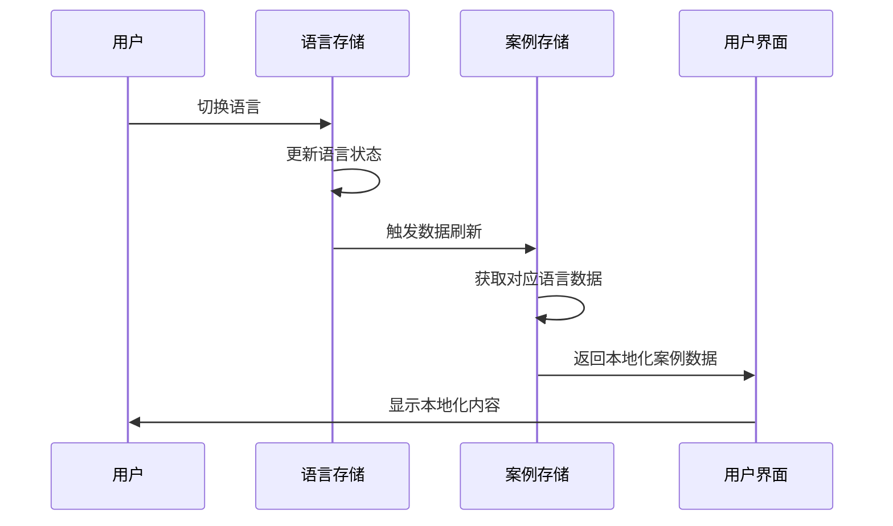
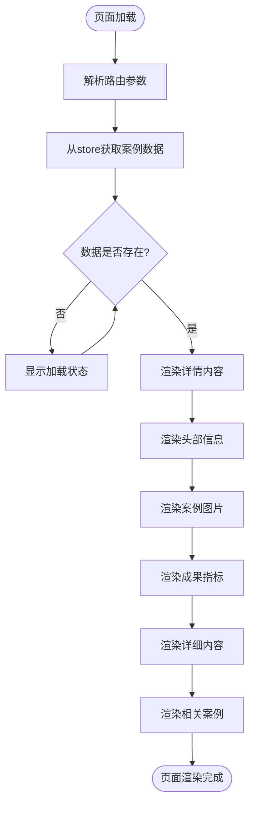
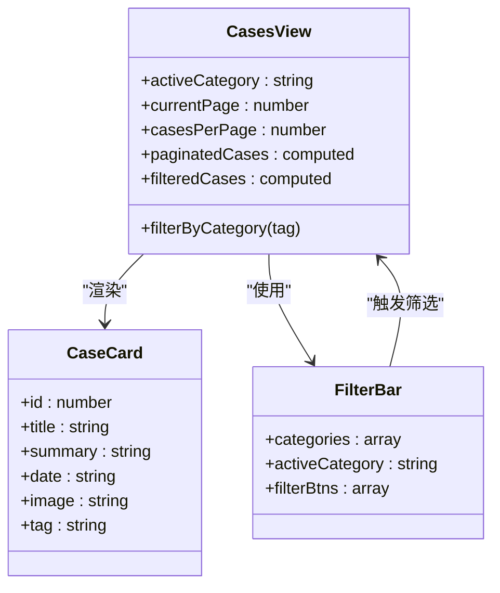
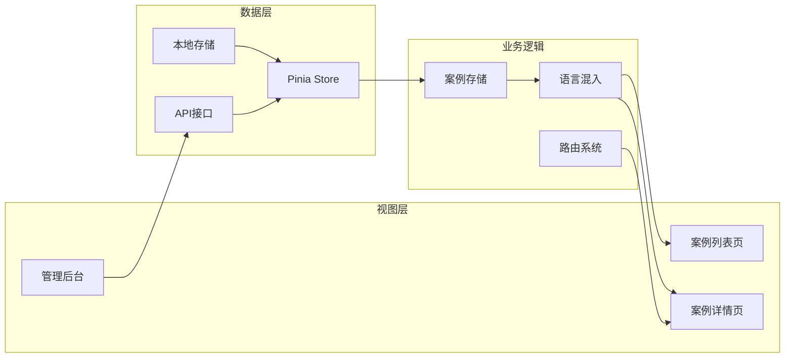
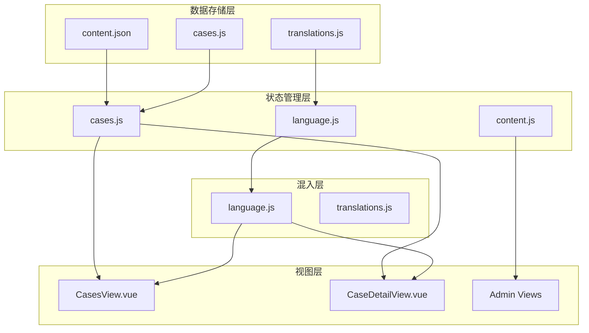

# 典型案例模型文档

<cite>
**本文档引用的文件**
- [cases.js](file://src/store/modules/cases.js)
- [CaseDetailView.vue](file://src/views/CaseDetailView.vue)
- [CasesView.vue](file://src/views/CasesView.vue)
- [language.js](file://src/store/modules/language.js)
- [language.js](file://src/mixins/language.js)
- [content.js](file://src/store/modules/content.js)
- [translations.js](file://src/store/modules/translations.js)
- [content.json](file://data/content.json)
</cite>

## 目录
1. [概述](#概述)
2. [案例实体结构](#案例实体结构)
3. [多语言数据映射机制](#多语言数据映射机制)
4. [核心功能实现](#核心功能实现)
5. [数据流分析](#数据流分析)
6. [内容管理系统](#内容管理系统)
7. [性能优化策略](#性能优化策略)
8. [故障排除指南](#故障排除指南)
9. [总结](#总结)

## 概述

朗德智能科技有限公司的典型案例模型是一个高度结构化的数据系统，专门用于管理和展示公司在各个领域的成功案例。该模型采用现代化的Vue.js架构，结合Pinia状态管理，实现了完整的多语言支持、动态内容管理和高效的前端渲染。

案例模型的核心价值在于：
- 提供结构化的案例数据存储和检索
- 支持多语言国际化展示
- 实现前后端分离的数据管理模式
- 提供灵活的内容编辑和更新机制

## 案例实体结构

### 基础字段定义

案例实体包含以下核心字段：

```javascript
interface CaseEntity {
  id: number;           // 唯一标识符
  title: string;        // 案例标题
  tag: string;         // 分类标签
  date: string;        // 发布日期
  image: string;       // 案例图片路径
  summary: string;     // 案例摘要
  highlight: string;   // 亮点概述
  content: string;     // 详细内容（HTML格式）
  results: string[];   // 成果指标列表
}
```

### 字段详细说明

#### 必需字段
- **id**: 案例的唯一标识符，用于路由导航和数据检索
- **title**: 案例的标题，支持中英文双语显示
- **tag**: 案例分类标签，用于筛选和归类
- **date**: 案例发布日期，格式为YYYY-MM-DD

#### 展示字段
- **image**: 案例配图，支持默认图片回退机制
- **summary**: 案例简要描述，用于列表页预览
- **highlight**: 案例亮点概述，突出展示关键成果

#### 内容字段
- **content**: 详细的案例内容，采用HTML格式存储，支持富文本展示
- **results**: 成果指标数组，每个指标都是独立的字符串描述

### 结果字段设计原理

`results`字段作为成果指标列表的设计体现了以下考虑：

1. **结构化展示**: 将复杂的成果信息分解为可读性强的列表形式
2. **灵活性**: 支持不同数量和类型的成果指标
3. **SEO友好**: 便于搜索引擎抓取和索引
4. **用户体验**: 提供直观的成果概览

```javascript
// 示例结果字段
results: [
  '100%无人机探测率',
  '干扰范围达5公里',
  '全年运行零误报',
  '部署后无侵入事件'
]
```

### 多媒体支持字段

#### 图片字段
- **image**: 支持相对路径和绝对路径
- **默认回退**: 当图片路径为空时自动使用'/images/cases/default.jpg'
- **响应式适配**: 支持不同尺寸的图片展示

#### 日期字段
- **date**: 格式化为YYYY-MM-DD
- **本地化显示**: 根据用户语言自动转换显示格式
- **排序依据**: 支持按日期进行案例排序

## 多语言数据映射机制

### 语言存储结构

案例数据采用双语言存储结构，分别存储中文和英文版本：

```javascript
const cases = {
  zh: [...],  // 中文案例数据
  en: [...]   // 英文案例数据
}
```

### 语言切换机制



**图表来源**
- [language.js](file://src/store/modules/language.js#L80-L120)
- [cases.js](file://src/store/modules/cases.js#L15-L25)

### 动态语言映射

案例模型通过computed属性实现动态语言映射：

```javascript
// 计算属性：获取当前语言的所有案例
getAllCases(state) {
  return state.cases[state.language] || state.cases.zh;
},

// 计算属性：根据ID获取特定案例
getCaseById: (state) => (id) => {
  const currentCases = state.cases[state.language] || state.cases.zh;
  return currentCases.find(c => c.id === parseInt(id));
}
```

**章节来源**
- [cases.js](file://src/store/modules/cases.js#L58-L64)

## 核心功能实现

### 案例详情页渲染

案例详情页通过`CaseDetailView.vue`组件实现：



**图表来源**
- [CaseDetailView.vue](file://src/views/CaseDetailView.vue#L87-L156)

### 相关案例推荐

系统通过智能算法推荐相关案例：

```javascript
const relatedCases = computed(() => {
  if (!caseData.value) return [];
  
  return casesStore.getAllCases
    .filter(item => item.id !== parseInt(caseId) && item.tag === caseData.value.tag)
    .slice(0, 3);
});
```

### 成果指标展示

成果指标采用网格布局，支持动态图标分配：

```javascript
const getResultIcon = (index) => {
  const icons = [
    'fas fa-check-circle',
    'fas fa-chart-line', 
    'fas fa-shield-alt',
    'fas fa-bolt'
  ];
  return icons[index % icons.length];
};
```

**章节来源**
- [CaseDetailView.vue](file://src/views/CaseDetailView.vue#L140-L156)

### 案例列表页功能

案例列表页提供完整的筛选和分页功能：



**图表来源**
- [CasesView.vue](file://src/views/CasesView.vue#L0-L39)

**章节来源**
- [CasesView.vue](file://src/views/CasesView.vue#L142-L164)

## 数据流分析

### 前端数据流



**图表来源**
- [cases.js](file://src/store/modules/cases.js#L1-L25)
- [language.js](file://src/mixins/language.js#L0-L50)

### 状态管理架构

案例模型采用Pinia进行状态管理：

```javascript
export const useCasesStore = defineStore('cases', {
  state: () => {
    const languageStore = useLanguageStore();
    
    return {
      language: computed(() => languageStore.language),
      cases: {
        zh: [],  // 中文案例数据
        en: []   // 英文案例数据
      }
    };
  },
  
  getters: {
    getAllCases(state) {
      return state.cases[state.language] || state.cases.zh;
    },
    
    getCaseById: (state) => (id) => {
      const currentCases = state.cases[state.language] || state.cases.zh;
      return currentCases.find(c => c.id === parseInt(id));
    }
  }
})
```

**章节来源**
- [cases.js](file://src/store/modules/cases.js#L5-L64)

## 内容管理系统

### 数据结构设计

案例数据采用嵌套对象结构，支持多维度查询：

```javascript
// 案例数据结构
const cases = {
  zh: [
    {
      id: 1,
      title: '军事要地无人机防御系统',
      tag: '军事安全',
      date: '2024-05-15',
      image: '/images/cases/military-defense.jpg',
      summary: '为北部军事要地部署朗德智能防御系统...',
      highlight: '实现100%无人机探测率...',
      content: '<h2>项目背景</h2>...',
      results: ['100%无人机探测率', '干扰范围达5公里']
    }
  ],
  en: [
    {
      id: 1,
      title: 'Military Site Anti-Drone Defense System',
      tag: 'Military Security',
      date: '2024-05-15',
      image: '/images/cases/military-defense.jpg',
      summary: 'Deployed Lande Intelligent defense system...',
      highlight: 'Achieved 100% drone detection rate...',
      content: '<h2>Project Background</h2>...',
      results: ['100% drone detection rate', 'Jamming range of 5km']
    }
  ]
}
```

### 内容更新机制

系统提供完整的CRUD操作支持：

```javascript
// 获取内容数据
const fetchContent = async (contentType) => {
  try {
    const url = `/content/${contentType}`;
    const response = await axios.get(url);
    
    if (contentType === 'cases') {
      if (response.data?.zh) cases.zh = response.data.zh;
      if (response.data?.en) cases.en = response.data.en;
    }
    
    return response.data;
  } catch (err) {
    console.error(`获取${contentType}数据失败:`, err);
    return null;
  }
};

// 更新内容
const updateContent = async (contentType, data, lang) => {
  try {
    await axios.put(`/api/admin/content/${contentType}`, {
      data,
      language: lang || languageStore.language
    });
    return { success: true };
  } catch (error) {
    console.error(`Error updating ${contentType}:`, error);
    return { success: false, error: error.message };
  }
};
```

**章节来源**
- [content.js](file://src/store/modules/content.js#L580-L620)

### 文件组织结构



**图表来源**
- [content.js](file://src/store/modules/content.js#L1-L50)
- [cases.js](file://src/store/modules/cases.js#L1-L50)

## 性能优化策略

### 数据缓存机制

案例数据采用多层次缓存策略：

1. **内存缓存**: Pinia store中的响应式数据
2. **本地存储**: 浏览器localStorage缓存语言偏好
3. **CDN加速**: 图片资源通过CDN分发

### 懒加载策略

```javascript
// 按需加载案例数据
const caseData = computed(() => {
  isLoading.value = false;
  return casesStore.getCaseById(caseId);
});

// 相关案例懒加载
const relatedCases = computed(() => {
  if (!caseData.value) return [];
  
  return casesStore.getAllCases
    .filter(item => item.id !== parseInt(caseId) && item.tag === caseData.value.tag)
    .slice(0, 3);
});
```

### 组件优化

- **虚拟滚动**: 对于大量案例列表使用虚拟滚动技术
- **图片优化**: 采用WebP格式和响应式图片
- **代码分割**: 按路由进行代码分割

**章节来源**
- [CaseDetailView.vue](file://src/views/CaseDetailView.vue#L95-L110)

## 故障排除指南

### 常见问题诊断

#### 案例数据加载失败

**症状**: 页面显示"未找到案例"或空白内容

**排查步骤**:
1. 检查网络连接状态
2. 验证API接口可用性
3. 查看浏览器控制台错误信息
4. 确认案例ID的有效性

**解决方案**:
```javascript
// 添加错误处理
const caseData = computed(() => {
  try {
    return casesStore.getCaseById(caseId);
  } catch (error) {
    console.error('案例数据加载失败:', error);
    return null;
  }
});
```

#### 多语言切换失效

**症状**: 语言切换后内容未更新

**排查步骤**:
1. 检查语言存储状态
2. 验证computed属性依赖
3. 确认store状态同步

**解决方案**:
```javascript
// 强制刷新语言状态
watch(() => languageStore.language, async (newLang) => {
  await initializeContent();
  // 触发UI重新渲染
  document.dispatchEvent(new CustomEvent('languageChanged', { detail: newLang }));
});
```

#### 图片加载失败

**症状**: 案例图片显示为默认占位符

**排查步骤**:
1. 检查图片路径有效性
2. 验证CDN服务状态
3. 确认图片格式支持

**解决方案**:
```javascript
// 图片加载失败处理

```

**章节来源**
- [CaseDetailView.vue](file://src/views/CaseDetailView.vue#L100-L120)

## 总结

朗德智能的典型案例模型是一个设计精良、功能完备的数据管理系统。它通过以下特点实现了高效的内容展示和管理：

### 核心优势

1. **结构化数据设计**: 完整的案例实体结构，支持多维度查询和展示
2. **多语言国际化**: 双语言存储和动态映射机制，满足全球化需求
3. **前后端分离**: 清晰的架构分层，便于维护和扩展
4. **性能优化**: 多层次缓存和懒加载策略，提升用户体验
5. **内容管理**: 完整的CRUD操作支持，便于内容更新

### 技术特色

- **Vue 3 Composition API**: 现代化的组件开发模式
- **Pinia状态管理**: 类型安全的状态管理方案
- **TypeScript支持**: 提供完整的类型定义
- **响应式设计**: 适配不同设备和屏幕尺寸
- **SEO友好**: 结构化数据和语义化标签

### 应用价值

该案例模型不仅为朗德智能提供了完善的内容展示平台，更为其他类似项目提供了可参考的最佳实践。通过合理的数据结构设计、完善的多语言支持和高效的性能优化，该系统能够很好地支撑企业的业务发展和市场推广需求。