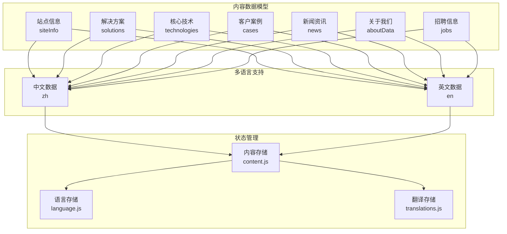
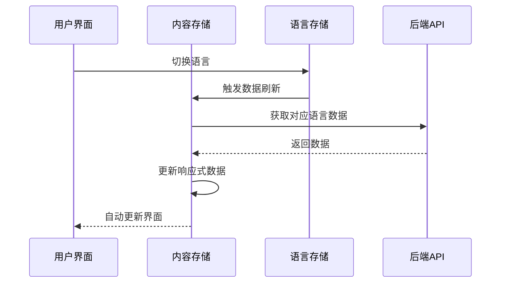
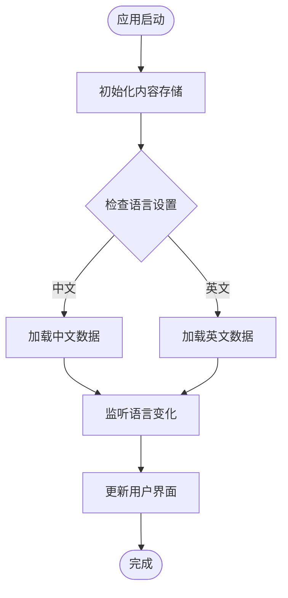

# 内容数据模型

<cite>
**本文档中引用的文件**
- [content.json](file://data/content.json)
- [content.js](file://src/store/modules/content.js)
- [translations.js](file://src/store/modules/translations.js)
- [i18n.js](file://src/plugins/i18n.js)
- [index.js](file://src/api/index.js)
- [HomeView.vue](file://src/views/HomeView.vue)
- [TechnologyView.vue](file://src/views/TechnologyView.vue)
</cite>

## 目录
1. [概述](#概述)
2. [数据结构定义](#数据结构定义)
3. [核心实体详解](#核心实体详解)
4. [多语言支持机制](#多语言支持机制)
5. [数据流分析](#数据流分析)
6. [API接口规范](#api接口规范)
7. [使用示例](#使用示例)
8. [最佳实践](#最佳实践)

## 概述

本文档详细定义了朗德智能科技有限公司网站的内容数据模型，涵盖所有前端展示所需的核心数据结构。该数据模型采用多语言支持设计，包含完整的站点信息、解决方案、核心技术、客户案例、新闻资讯和招聘信息等实体。

数据模型基于Vue.js和Pinia的状态管理架构，通过响应式数据绑定实现实时内容更新。所有内容均支持中英文双语显示，满足国际化业务需求。

## 数据结构定义

### 整体数据架构



**图表来源**
- [content.js](file://src/store/modules/content.js#L1-L648)
- [translations.js](file://src/store/modules/translations.js#L1-L633)

### 数据类型规范

所有数据字段均遵循以下类型规范：

| 字段类型 | 描述 | 示例 |
|---------|------|-----|
| `string` | 文本字符串 | `"杭州朗德智能科技有限公司"` |
| `number` | 数值类型 | `2025` |
| `boolean` | 布尔值 | `true` |
| `array` | 数组集合 | `[...]` |
| `object` | 对象结构 | `{...}` |
| `date` | 日期时间 | `"2025-06-15"` |

## 核心实体详解

### 1. 站点信息 (siteInfo)

站点信息是网站的基础配置数据，包含公司基本信息和联系方式。

```javascript
// 中文数据结构
{
  companyName: "杭州朗德智能科技有限公司",
  slogan: "智能反无人机，守护空域安全",
  description: "领先的反无人机系统及反无人机解决方案提供商",
  contactInfo: {
    address: "浙江省杭州市滨江区科技园区创新大厦A座15楼",
    phone: "0571-8888 9999",
    email: "info@landedrone.com"
  }
}

// 英文数据结构
{
  companyName: "Hangzhou Lande Intelligent Technology Co., Ltd.",
  slogan: "Smart Anti-Drone Systems, Securing Airspace",
  description: "Leading provider of anti-drone systems and solutions",
  contactInfo: {
    address: "15F, Building A, Innovation Tower, Science & Technology Park, Binjiang District, Hangzhou, Zhejiang",
    phone: "0571-8888 9999",
    email: "info@landedrone.com"
  }
}
```

**字段说明：**

| 字段名 | 类型 | 必填 | 描述 |
|-------|-----|-----|------|
| `companyName` | string | 是 | 公司全称 |
| `slogan` | string | 是 | 公司口号 |
| `description` | string | 是 | 公司简介 |
| `contactInfo.address` | string | 是 | 公司地址 |
| `contactInfo.phone` | string | 是 | 联系电话 |
| `contactInfo.email` | string | 是 | 联系邮箱 |

**节来源**
- [content.js](file://src/store/modules/content.js#L40-L60)
- [translations.js](file://src/store/modules/translations.js#L25-L45)

### 2. 解决方案 (solutions)

解决方案模块展示公司的主要产品和服务，采用无人机系列为主题。

```javascript
// 解决方案数据结构
[
  {
    id: "reconnaissance",
    title: "侦察无人机",
    description: "高续航、高稳定性的侦察无人机，搭载高清光电吊舱...",
    image: "https://via.placeholder.com/600x400?text=侦察无人机",
    details: "朗德侦察无人机采用碳纤维复合材料机身..."
  },
  {
    id: "multipurpose",
    title: "多用途无人机",
    description: "模块化设计的多用途无人机，可根据不同任务快速更换载荷...",
    image: "https://via.placeholder.com/600x400?text=多用途无人机",
    details: "朗德多用途无人机采用模块化设计理念..."
  }
]
```

**字段说明：**

| 字段名 | 类型 | 必填 | 描述 |
|-------|-----|-----|------|
| `id` | string | 是 | 唯一标识符 |
| `title` | string | 是 | 解决方案标题 |
| `description` | string | 是 | 简短描述 |
| `image` | string | 是 | 图片URL |
| `details` | string | 是 | 详细说明 |

**节来源**
- [content.js](file://src/store/modules/content.js#L70-L120)

### 3. 核心技术 (technologies)

核心技术模块详细介绍公司的技术优势和产品特点。

```javascript
// 核心技术数据结构
[
  {
    id: "detection",
    title: "无人机探测系统",
    description: "多传感器融合的无人机探测系统，可实现全天候、全方位监控",
    icon: "fas fa-shield-alt",
    details: "采用雷达、光电、无线电信号等多种探测手段相结合...",
    image: "/images/tech/detection.jpg"
  },
  {
    id: "jamming",
    title: "电子干扰系统",
    description: "高效定向干扰系统，可阻断无人机控制链路和导航信号",
    icon: "fas fa-shield-alt",
    details: "针对常见无人机通信频段设计的智能干扰系统...",
    image: "/images/tech/jamming.jpg"
  }
]
```

**字段说明：**

| 字段名 | 类型 | 必填 | 描述 |
|-------|-----|-----|------|
| `id` | string | 是 | 技术唯一标识 |
| `title` | string | 是 | 技术名称 |
| `description` | string | 是 | 简短描述 |
| `icon` | string | 是 | FontAwesome图标类名 |
| `details` | string | 是 | 详细技术说明 |
| `image` | string | 是 | 技术图片URL |

**节来源**
- [content.js](file://src/store/modules/content.js#L130-L220)

### 4. 客户案例 (cases)

客户案例展示公司的成功项目和应用实例。

```javascript
// 客户案例数据结构
[
  {
    id: 1,
    title: "某国际机场反无人机防御系统部署",
    summary: "为大型国际机场提供全方位的反无人机防御系统...",
    image: "/images/cases/military-defense.jpg",
    content: "本项目为某国际机场实施反无人机综合防御系统...",
    results: [
      "探测范围覆盖机场全域",
      "无人机威胁处置成功率99.9%",
      "系统可靠性达99.99%",
      "机场航班延误率降低30%"
    ],
    date: "2024-05-15"
  }
]
```

**字段说明：**

| 字段名 | 类型 | 必填 | 描述 |
|-------|-----|-----|------|
| `id` | number | 是 | 案例唯一编号 |
| `title` | string | 是 | 案例标题 |
| `summary` | string | 是 | 案例概要 |
| `image` | string | 是 | 案例图片URL |
| `content` | string | 是 | 详细内容 |
| `results` | array | 是 | 成果列表 |
| `date` | string | 是 | 发布日期 |

**节来源**
- [content.js](file://src/store/modules/content.js#L230-L320)

### 5. 新闻资讯 (news)

新闻资讯模块展示公司动态和行业新闻。

```javascript
// 新闻数据结构
[
  {
    id: 1,
    category: "company",
    title: "朗德智能推出新一代高性能反无人机系统",
    summary: "近日，朗德智能正式发布新一代高性能反无人机系统...",
    content: "详细新闻内容...",
    image: "https://via.placeholder.com/600x400?text=反无人机系统新闻",
    date: "2025-06-15",
    day: "15",
    month: "06 / 2025"
  }
]
```

**字段说明：**

| 字段名 | 类型 | 必填 | 描述 |
|-------|-----|-----|------|
| `id` | number | 是 | 新闻唯一编号 |
| `category` | string | 是 | 新闻分类 |
| `title` | string | 是 | 新闻标题 |
| `summary` | string | 是 | 新闻摘要 |
| `content` | string | 是 | 新闻正文 |
| `image` | string | 是 | 新闻图片URL |
| `date` | string | 是 | 发布日期 |
| `day` | string | 是 | 日期天数 |
| `month` | string | 是 | 月份信息 |

**节来源**
- [content.js](file://src/store/modules/content.js#L330-L420)

### 6. 招聘信息 (jobs)

招聘信息模块展示公司的人才需求和职位详情。

```javascript
// 招聘数据结构
[
  {
    id: 1,
    title: "无人机系统工程师",
    responsibilities: "负责无人机飞控系统开发，优化飞行性能...",
    requirements: "航空航天、自动化相关专业硕士及以上学历...",
    location: "杭州",
    type: "全职",
    salary: "25k-40k"
  }
]
```

**字段说明：**

| 字段名 | 类型 | 必填 | 描述 |
|-------|-----|-----|------|
| `id` | number | 是 | 职位唯一编号 |
| `title` | string | 是 | 职位名称 |
| `responsibilities` | string | 是 | 工作职责 |
| `requirements` | string | 是 | 任职要求 |
| `location` | string | 是 | 工作地点 |
| `type` | string | 是 | 职位类型 |
| `salary` | string | 是 | 薪资范围 |

**节来源**
- [content.js](file://src/store/modules/content.js#L500-L550)

## 多语言支持机制

### 国际化架构



**图表来源**
- [content.js](file://src/store/modules/content.js#L20-L35)
- [i18n.js](file://src/plugins/i18n.js#L1-L72)

### 语言切换流程

1. **语言状态管理**：通过`useLanguageStore`管理当前语言状态
2. **自动刷新**：监听语言变化，自动触发数据重新加载
3. **响应式更新**：利用Vue响应式系统自动更新界面
4. **缓存机制**：避免重复请求相同语言的数据

**节来源**
- [content.js](file://src/store/modules/content.js#L20-L35)
- [i18n.js](file://src/plugins/i18n.js#L10-L20)

## 数据流分析

### 数据初始化流程



**图表来源**
- [content.js](file://src/store/modules/content.js#L35-L50)

### 数据更新机制

1. **API调用**：通过`fetchContent`方法从后端获取数据
2. **数据验证**：验证返回数据的有效性
3. **状态更新**：更新对应的响应式状态
4. **错误处理**：捕获并处理API错误

**节来源**
- [content.js](file://src/store/modules/content.js#L580-L620)

## API接口规范

### 内容管理API

```javascript
// 获取内容数据
GET /api/content/{type}

// 更新内容数据（需要管理员权限）
PUT /api/admin/content/{type}
{
  data: {...},
  language: "zh"
}

// 上传图片（需要管理员权限）
POST /api/admin/upload
Content-Type: multipart/form-data
```

**节来源**
- [index.js](file://src/api/index.js#L30-L50)

### 错误处理机制

- **401未授权**：自动清除认证信息并跳转登录页
- **数据加载失败**：返回null而非抛出异常
- **网络错误**：提供友好的错误提示

**节来源**
- [index.js](file://src/api/index.js#L20-L40)

## 使用示例

### Vue组件中的使用

```javascript
// 在组件中使用内容数据
<script setup>
import { useContentStore } from '@/store/modules/content'
import { storeToRefs } from 'pinia'

const contentStore = useContentStore()
const { currentTechnologies, currentSolutions } = storeToRefs(contentStore)

// 监听语言变化
watch(
  () => contentStore.language,
  () => {
    // 语言变化时的处理逻辑
  }
)
</script>

<template>
  <div v-for="tech in currentTechnologies" :key="tech.id">
    <h3>{{ tech.title }}</h3>
    <p>{{ tech.description }}</p>
  </div>
</template>
```

### 数据序列化示例

```javascript
// 序列化数据到JSON
const serializedData = JSON.stringify({
  siteInfo: contentStore.siteInfo,
  technologies: contentStore.technologies,
  solutions: contentStore.solutions
})

// 反序列化数据
const parsedData = JSON.parse(serializedData)
```

**节来源**
- [HomeView.vue](file://src/views/HomeView.vue#L1-L50)
- [TechnologyView.vue](file://src/views/TechnologyView.vue#L1-L100)

## 最佳实践

### 数据设计原则

1. **一致性**：所有实体保持统一的数据结构
2. **完整性**：确保必填字段的完整性
3. **可扩展性**：预留扩展字段以适应未来需求
4. **性能优化**：合理使用懒加载和分页

### 开发建议

1. **类型安全**：使用TypeScript或JSDoc注释确保类型正确
2. **错误处理**：完善的数据验证和错误处理机制
3. **缓存策略**：合理使用浏览器缓存减少API调用
4. **SEO优化**：为静态内容提供合适的元数据

### 维护指南

1. **版本控制**：对数据结构变更进行版本管理
2. **测试覆盖**：确保数据操作的单元测试
3. **文档同步**：及时更新数据模型文档
4. **性能监控**：监控数据加载性能和用户体验

### 后端对接要点

1. **数据格式**：严格遵循JSON格式规范
2. **接口约定**：明确API响应格式和状态码
3. **错误码**：使用标准HTTP状态码表示错误
4. **认证机制**：确保管理接口的安全访问

**节来源**
- [content.js](file://src/store/modules/content.js#L580-L648)