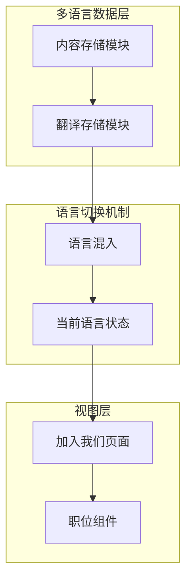
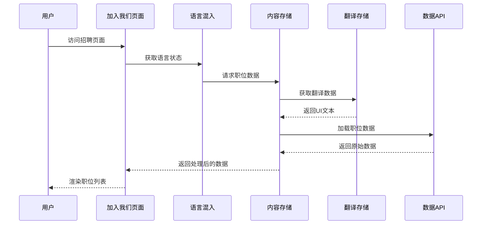
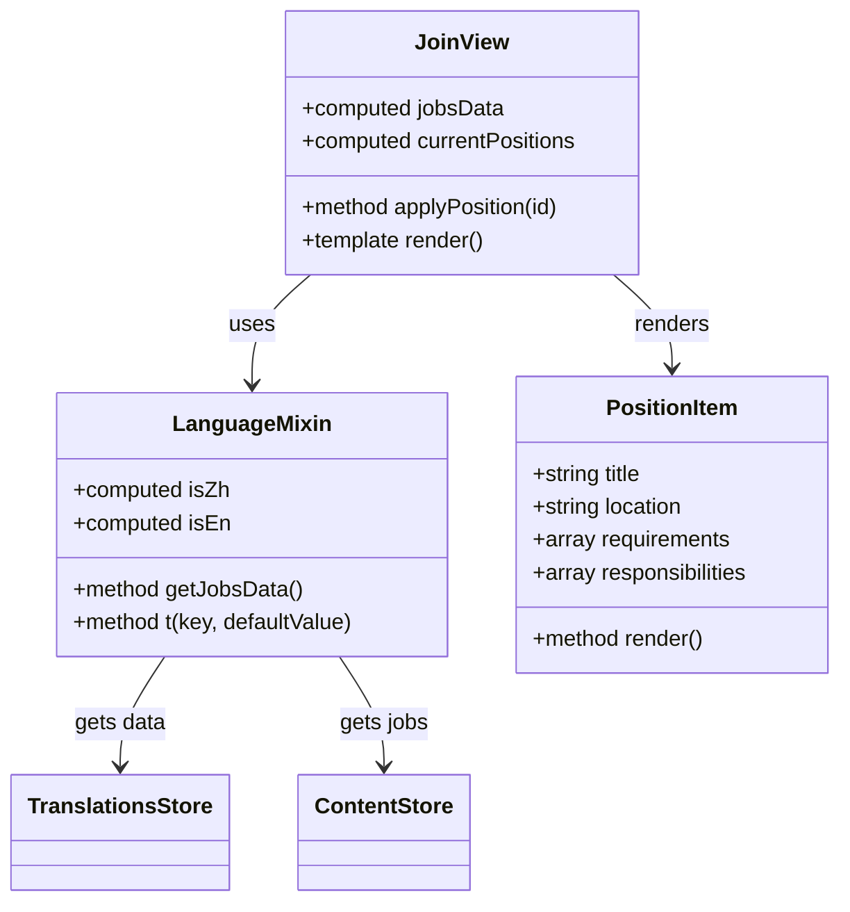
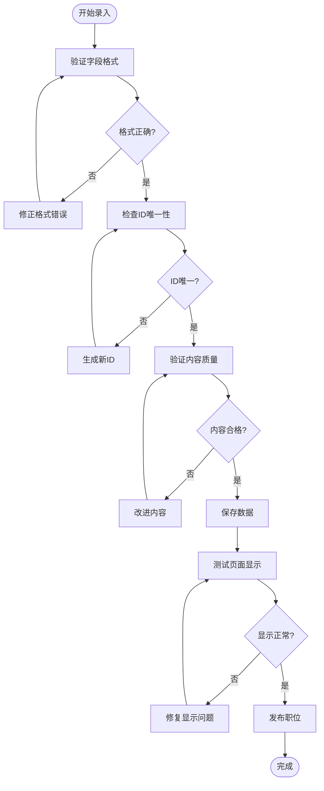

# 招聘信息模型文档

<cite>
**本文档引用的文件**
- [JoinView.vue](file://src/views/JoinView.vue)
- [content.js](file://src/store/modules/content.js)
- [translations.js](file://src/store/modules/translations.js)
- [language.js](file://src/mixins/language.js)
- [content.json](file://data/content.json)
</cite>

## 目录
1. [项目概述](#项目概述)
2. [招聘信息模型结构](#招聘信息模型结构)
3. [多语言管理机制](#多语言管理机制)
4. [数据流分析](#数据流分析)
5. [组件交互分析](#组件交互分析)
6. [字段规范与校验](#字段规范与校验)
7. [HR管理指南](#hr管理指南)
8. [性能优化建议](#性能优化建议)
9. [故障排除指南](#故障排除指南)
10. [总结](#总结)

## 项目概述

朗德智能科技有限公司（杭州朗德智能科技有限公司）是一家专注于无人机技术和反无人机系统的高科技企业。公司致力于打造智能全域电磁安防一体化平台，在国防安全、电力巡检、边境监控、机场防护等领域提供创新解决方案。

公司的招聘信息管理系统是整个网站的重要组成部分，负责在"加入我们"页面展示最新的职位信息，吸引优秀人才加入团队。该系统采用现代化的Vue.js架构，支持多语言切换，确保国际化人才的招聘需求。

## 招聘信息模型结构

### 基础数据结构

招聘信息模型采用标准化的数据结构，包含以下核心字段：

```javascript
// 中文职位数据结构
const zhPositions = [
  {
    id: 1,                    // 唯一标识符，用于申请流程追踪
    title: '人工智能算法工程师',     // 职位名称，简洁明了
    location: '杭州',          // 工作地点，支持多城市配置
    requirements: [           // 任职要求数组，便于格式化显示
      '计算机科学、人工智能或相关专业硕士及以上学历',
      '熟悉机器学习、深度学习算法，有相关项目经验',
      '熟练掌握Python，熟悉常用的机器学习框架如TensorFlow、PyTorch等',
      '良好的算法设计和问题解决能力'
    ],
    responsibilities: [       // 工作职责数组，清晰展示岗位职责
      '负责公司AI产品的算法研发和优化',
      '参与解决方案的技术设计和实现',
      '跟踪和研究前沿AI技术，并应用到产品中'
    ]
  }
]
```

### 字段详细说明

#### id字段
- **类型**: 数字
- **用途**: 唯一标识每个职位，用于申请流程中的数据追踪和管理
- **业务含义**: 系统自动生成的递增ID，确保每个职位的唯一性
- **示例值**: 1, 2, 3...

#### title字段
- **类型**: 字符串
- **用途**: 显示在招聘页面的职位名称
- **业务含义**: 准确描述岗位的核心职责和技术要求
- **示例值**: "人工智能算法工程师"、"前端开发工程师"、"产品经理"

#### responsibilities字段
- **类型**: 字符串数组
- **用途**: 展示职位的主要工作职责
- **业务含义**: 清晰列出员工需要承担的核心工作任务
- **格式要求**: 每个职责要点独立成行，使用项目符号格式

#### requirements字段
- **类型**: 字符串数组
- **用途**: 列出应聘该职位所需的专业技能和经验要求
- **业务含义**: 明确岗位的技术门槛和专业背景要求
- **格式要求**: 按重要程度排序，突出核心要求

#### location字段
- **类型**: 字符串
- **用途**: 显示工作地点信息
- **业务含义**: 帮助候选人了解工作地点，支持远程/本地选项
- **示例值**: "杭州"、"北京"、"上海"、"远程"

#### type字段
- **类型**: 字符串
- **用途**: 标识职位的工作性质
- **业务含义**: 区分全职、兼职、实习等不同类型的职位
- **取值范围**: "全职"、"兼职"、"实习"、"外包"

#### salary字段
- **类型**: 字符串
- **用途**: 显示薪资范围信息
- **业务含义**: 向候选人提供薪资预期参考
- **格式规范**: 使用统一的金额单位和格式

### 扩展字段设计

为了满足更复杂的招聘需求，系统还支持以下扩展字段：

```javascript
// 扩展职位数据结构
const extendedJobSchema = {
  id: Number,
  title: String,
  location: String,
  type: String,
  salary: String,
  requirements: Array,
  responsibilities: Array,
  benefits: Array,           // 福利待遇
  experience: String,       // 工作经验要求
  education: String,        // 学历要求
  skills: Array,           // 技能要求
  department: String,      // 所属部门
  status: String,         // 职位状态：开放/关闭
  postedDate: Date,       // 发布日期
  closingDate: Date,      // 截止日期
  applicationsCount: Number // 应聘人数统计
}
```

**章节来源**
- [content.js](file://src/store/modules/content.js#L472-L506)
- [JoinView.vue](file://src/views/JoinView.vue#L50-L100)

## 多语言管理机制

### 国际化架构设计

系统采用Pinia状态管理配合多语言翻译存储，实现了完整的多语言招聘信息管理：



**图表来源**
- [content.js](file://src/store/modules/content.js#L1-L50)
- [translations.js](file://src/store/modules/translations.js#L1-L50)
- [language.js](file://src/mixins/language.js#L1-L50)

### 语言数据结构

系统为每种语言维护独立的职位数据副本：

```javascript
// 多语言职位数据结构
const jobs = reactive({
  zh: [
    {
      id: 1,
      title: '无人机系统工程师',
      responsibilities: '负责无人机飞控系统开发，优化飞行性能，解决技术难题。',
      requirements: '航空航天、自动化相关专业硕士及以上学历，有无人机系统开发经验。',
      location: '杭州',
      type: '全职',
      salary: '25k-40k'
    }
  ],
  en: [
    {
      id: 1,
      title: 'Drone System Engineer',
      responsibilities: 'Responsible for drone flight control system development, optimizing flight performance, solving technical problems.',
      requirements: 'Master\'s degree or above in aerospace, automation or related fields, with experience in drone system development.',
      location: 'Hangzhou',
      type: 'Full-time',
      salary: '25k-40k'
    }
  ]
})
```

### 计算属性实现

系统通过计算属性动态获取当前语言的职位数据：

```javascript
// 计算属性：获取当前语言的职位数据
const currentJobs = computed(() => {
  if (!isInitialized.value) return null
  return languageStore.language === 'zh' ? jobs.zh : jobs.en
})

// 动态语言切换
const currentPositions = computed(() => {
  return isZh.value ? zhPositions : enPositions
})
```

**章节来源**
- [content.js](file://src/store/modules/content.js#L500-L510)
- [language.js](file://src/mixins/language.js#L80-L90)

## 数据流分析

### 完整数据流架构



**图表来源**
- [JoinView.vue](file://src/views/JoinView.vue#L40-L50)
- [language.js](file://src/mixins/language.js#L80-L90)
- [content.js](file://src/store/modules/content.js#L500-L510)

### 数据初始化流程

系统采用异步初始化机制，确保数据加载的可靠性和用户体验：

```javascript
// 初始化内容
const initializeContent = async () => {
  if (loading.value) return
  
  try {
    loading.value = true
    error.value = null
    
    // 模拟API调用
    await new Promise(resolve => setTimeout(resolve, 100))
    
    refreshTrigger.value++
    isInitialized.value = true
  } catch (err) {
    console.error('Failed to initialize content:', err)
    error.value = err
  } finally {
    loading.value = false
  }
}
```

### 实时数据更新

系统支持运行时的数据更新，通过监听语言变化自动刷新职位数据：

```javascript
// 监听语言变化，触发刷新
watch(() => languageStore.language, async (newLang, oldLang) => {
  console.log('ContentStore检测到语言变化，从', oldLang, '变为', newLang);
  await initializeContent()
})
```

**章节来源**
- [content.js](file://src/store/modules/content.js#L25-L50)
- [content.js](file://src/store/modules/content.js#L50-L60)

## 组件交互分析

### JoinView组件架构

JoinView组件是招聘信息展示的核心组件，采用Composition API设计：



**图表来源**
- [JoinView.vue](file://src/views/JoinView.vue#L40-L80)
- [language.js](file://src/mixins/language.js#L10-L50)

### 组件渲染逻辑

组件通过v-for指令动态渲染职位列表：

```html
<div class="position-list">
  <div class="position-item" v-for="position in currentPositions" :key="position.id">
    <div class="position-header">
      <h3>{{ position.title }}</h3>
      <span class="position-location">{{ position.location }}</span>
    </div>
    <div class="position-details">
      <div class="position-requirements">
        <h4>{{ jobsData.requirements }}：</h4>
        <ul>
          <li v-for="(req, index) in position.requirements" :key="index">{{ req }}</li>
        </ul>
      </div>
      <div class="position-responsibilities">
        <h4>{{ jobsData.responsibilities }}：</h4>
        <ul>
          <li v-for="(resp, index) in position.responsibilities" :key="index">{{ resp }}</li>
        </ul>
      </div>
    </div>
    <div class="position-footer">
      <button class="btn btn-primary" @click="applyPosition(position.id)">
        {{ jobsData.apply }}
      </button>
    </div>
  </div>
</div>
```

### 交互行为设计

组件实现了完整的用户交互体验：

```javascript
// 申请职位方法
const applyPosition = (id) => {
  if (isZh.value) {
    alert('感谢您的申请，请将简历发送至hr@landeintelligent.com，并注明职位编号：' + id)
  } else {
    alert('Thank you for your application. Please send your resume to hr@landeintelligent.com, and specify position ID: ' + id)
  }
}
```

**章节来源**
- [JoinView.vue](file://src/views/JoinView.vue#L1-L100)
- [JoinView.vue](file://src/views/JoinView.vue#L170-L190)

## 字段规范与校验

### 字段命名规范

系统采用统一的字段命名规范，确保数据的一致性和可维护性：

| 字段名 | 类型 | 必填 | 描述 |
|--------|------|------|------|
| id | Number | 是 | 唯一标识符，自动生成 |
| title | String | 是 | 职位名称，简洁明了 |
| location | String | 是 | 工作地点，支持多城市 |
| type | String | 是 | 工作性质：全职/兼职/实习 |
| salary | String | 是 | 薪资范围，格式统一 |
| requirements | Array | 是 | 任职要求数组 |
| responsibilities | Array | 是 | 工作职责数组 |

### 数据格式校验

系统实现了多层次的数据校验机制：

```javascript
// 职位数据校验规则
const jobValidationRules = {
  id: {
    type: 'number',
    required: true,
    unique: true
  },
  title: {
    type: 'string',
    required: true,
    minLength: 2,
    maxLength: 100
  },
  location: {
    type: 'string',
    required: true,
    enum: ['杭州', '北京', '上海', '深圳', '远程']
  },
  type: {
    type: 'string',
    required: true,
    enum: ['全职', '兼职', '实习', '外包']
  },
  salary: {
    type: 'string',
    required: true,
    pattern: /^\d+k-\d+k$/
  },
  requirements: {
    type: 'array',
    required: true,
    minLength: 1,
    maxLength: 10
  },
  responsibilities: {
    type: 'array',
    required: true,
    minLength: 1,
    maxLength: 15
  }
}
```

### 输入格式标准

#### 薪资范围格式
- **格式**: "数字k-数字k"
- **示例**: "25k-40k"、"15k-25k"、"30k-50k"
- **单位**: 千元人民币/月
- **范围**: 最小值不超过最大值

#### 工作地点格式
- **格式**: 城市名称字符串
- **示例**: "杭州"、"北京"、"上海"、"远程"
- **支持城市**: 主要一线城市和远程选项

#### 工作类型格式
- **格式**: 固定枚举值
- **取值**: "全职"、"兼职"、"实习"、"外包"

### 输出格式规范

系统确保输出数据的格式一致性：

```javascript
// 格式化输出示例
const formattedJobOutput = {
  id: 1,
  title: "人工智能算法工程师",
  location: "杭州",
  type: "全职",
  salary: "30k-50k",
  requirements: [
    "计算机科学、人工智能或相关专业硕士及以上学历",
    "熟悉机器学习、深度学习算法，有相关项目经验",
    "熟练掌握Python，熟悉常用的机器学习框架如TensorFlow、PyTorch等",
    "良好的算法设计和问题解决能力"
  ],
  responsibilities: [
    "负责公司AI产品的算法研发和优化",
    "参与解决方案的技术设计和实现",
    "跟踪和研究前沿AI技术，并应用到产品中"
  ]
}
```

**章节来源**
- [content.js](file://src/store/modules/content.js#L472-L506)
- [JoinView.vue](file://src/views/JoinView.vue#L50-L100)

## HR管理指南

### 字段填写规范

#### 职位标题规范
- **长度限制**: 2-50字符
- **内容要求**: 准确反映岗位核心职责
- **格式示例**: 
  - "人工智能算法工程师"
  - "前端开发工程师"
  - "产品经理"
  - "测试工程师"

#### 工作地点设置
- **城市选择**: 优先选择主要办公城市
- **远程选项**: 明确标注"远程"选项
- **多地点**: 如有多个工作地点，需明确说明

#### 薪资范围设定
- **市场调研**: 参考同行业薪资水平
- **范围合理**: 最低薪资不低于市场平均水平
- **格式统一**: 使用"数字k-数字k"格式

#### 任职要求编写
- **条目数量**: 3-8条核心要求
- **优先级排序**: 按重要程度排列
- **具体明确**: 避免模糊表述
- **技能分类**: 区分硬技能和软技能

#### 工作职责描述
- **条目数量**: 3-10条核心职责
- **动词开头**: 使用主动语态
- **结果导向**: 强调工作成果
- **量化指标**: 可能的话包含量化目标

### 数据录入流程



**图表来源**
- [content.js](file://src/store/modules/content.js#L472-L506)

### 内容审核机制

#### 自动化校验
- **格式验证**: 自动检查字段格式是否符合规范
- **重复检查**: 检查职位ID和标题的唯一性
- **内容质量**: 基于预设模板检查内容完整性

#### 人工审核流程
1. **初审阶段**: HR专员检查基本格式和内容准确性
2. **技术审核**: 技术负责人确认技术要求的合理性
3. **语言审核**: 外语专员检查多语言版本的准确性
4. **最终审批**: 人力资源总监确认发布

### 数据维护策略

#### 定期更新机制
- **季度审查**: 每季度审查职位信息的有效性
- **市场调研**: 定期更新薪资范围数据
- **内容优化**: 根据申请反馈优化职位描述

#### 数据清理流程
- **过期职位**: 自动标记超过6个月未更新的职位
- **重复数据**: 定期检查并合并重复的职位信息
- **格式升级**: 将旧格式数据转换为新格式

**章节来源**
- [content.js](file://src/store/modules/content.js#L472-L506)
- [JoinView.vue](file://src/views/JoinView.vue#L50-L100)

## 性能优化建议

### 数据加载优化

#### 预加载策略
```javascript
// 预加载关键职位数据
const preLoadJobs = async () => {
  const preloadPromises = [
    contentStore.fetchContent('jobs'),
    translationsStore.getJobsData('zh'),
    translationsStore.getJobsData('en')
  ]
  
  await Promise.all(preloadPromises)
}
```

#### 缓存机制
- **内存缓存**: 将常用职位数据缓存在内存中
- **浏览器缓存**: 利用localStorage缓存职位列表
- **CDN加速**: 对静态职位图片进行CDN缓存

#### 分页加载
```javascript
// 实现虚拟滚动
const virtualScrollConfig = {
  itemHeight: 200, // 每个职位卡片高度
  containerHeight: 600, // 容器高度
  bufferCount: 5 // 缓冲区大小
}
```

### 渲染性能优化

#### 虚拟DOM优化
- **条件渲染**: 只渲染可见的职位卡片
- **懒加载**: 图片和详细内容按需加载
- **防抖处理**: 优化滚动事件的处理

#### 组件优化
```javascript
// 使用keep-alive缓存组件状态
<keep-alive>
  <JoinView />
</keep-alive>

// 使用memoization缓存计算结果
const memoizedPositions = computed(() => {
  return currentPositions.value.map(pos => ({ ...pos }))
})
```

### 网络优化

#### 数据压缩
- **JSON压缩**: 使用gzip压缩传输数据
- **图片优化**: 使用WebP格式优化职位图片
- **CDN分发**: 将静态资源分布到全球CDN节点

#### 请求优化
```javascript
// 批量请求优化
const batchFetchJobs = async (languages = ['zh', 'en']) => {
  const requests = languages.map(lang => 
    axios.get(`/api/jobs?lang=${lang}`)
  )
  
  const responses = await Promise.all(requests)
  return responses.reduce((acc, curr, index) => {
    acc[languages[index]] = curr.data
    return acc
  }, {})
}
```

## 故障排除指南

### 常见问题诊断

#### 数据加载失败
**症状**: 职位列表为空或显示加载错误
**排查步骤**:
1. 检查网络连接状态
2. 验证API接口可用性
3. 查看浏览器控制台错误信息
4. 检查数据格式是否正确

**解决方案**:
```javascript
// 错误处理和重试机制
const fetchWithRetry = async (url, retries = 3) => {
  try {
    const response = await axios.get(url)
    return response.data
  } catch (error) {
    if (retries > 0) {
      await new Promise(resolve => setTimeout(resolve, 1000))
      return fetchWithRetry(url, retries - 1)
    }
    throw error
  }
}
```

#### 多语言显示异常
**症状**: 职位信息在不同语言间切换时显示错误
**排查步骤**:
1. 检查语言切换逻辑
2. 验证翻译数据完整性
3. 确认计算属性依赖关系

**解决方案**:
```javascript
// 语言切换监控
watch(languageStore.language, (newLang) => {
  console.log('Language changed to:', newLang)
  // 触发重新计算
  currentJobs.value
})
```

#### 组件渲染问题
**症状**: 职位卡片布局错乱或样式异常
**排查步骤**:
1. 检查CSS样式冲突
2. 验证响应式布局
3. 确认组件生命周期

**解决方案**:
```javascript
// 组件生命周期优化
onMounted(() => {
  // 确保DOM元素存在后再操作
  nextTick(() => {
    adjustLayout()
  })
})
```

### 性能问题诊断

#### 页面加载缓慢
**原因分析**:
- 数据量过大导致加载时间过长
- 图片资源未优化
- JavaScript执行阻塞

**优化措施**:
```javascript
// 性能监控
const performanceMonitor = {
  startTime: Date.now(),
  
  markPoint(name) {
    console.log(`${name}: ${Date.now() - this.startTime}ms`)
  },
  
  measureTime(start, end) {
    console.log(`${start} to ${end}: ${performance.now() - this.startTime}ms`)
  }
}
```

#### 内存泄漏问题
**症状**: 长时间使用后页面卡顿
**排查方法**:
- 监控组件实例数量
- 检查事件监听器是否正确移除
- 验证定时器是否及时清理

**预防措施**:
```javascript
// 组件销毁时清理资源
onUnmounted(() => {
  clearInterval(intervalId)
  removeEventListeners()
  cleanupCache()
})
```

**章节来源**
- [content.js](file://src/store/modules/content.js#L500-L550)
- [JoinView.vue](file://src/views/JoinView.vue#L170-L200)

## 总结

朗德智能科技有限公司的招聘信息模型系统展现了现代Web应用的最佳实践。通过标准化的数据结构、完善的多语言支持、高效的组件架构和可靠的性能优化，该系统为HR团队提供了强大的招聘管理工具。

### 核心优势

1. **标准化数据模型**: 统一的职位数据结构确保了数据的一致性和可维护性
2. **多语言国际化**: 完善的翻译机制支持全球化人才招聘
3. **组件化架构**: Vue.js组件设计提高了代码的可复用性和可测试性
4. **性能优化**: 多层次的性能优化确保了良好的用户体验
5. **HR友好**: 直观的字段规范和校验机制降低了HR团队的操作难度

### 技术亮点

- **响应式设计**: 支持移动端和桌面端的完美适配
- **实时更新**: 语言切换和数据更新的即时响应
- **错误处理**: 完善的错误处理和恢复机制
- **SEO友好**: 结构化数据支持搜索引擎优化

### 未来发展方向

1. **AI辅助招聘**: 集成AI算法优化职位匹配度
2. **数据分析**: 增强招聘数据分析和可视化功能
3. **移动端优化**: 开发专门的移动招聘应用
4. **社交招聘**: 集成社交媒体招聘渠道
5. **自动化流程**: 实现简历筛选和面试安排的自动化

该招聘信息模型系统不仅满足了当前的招聘需求，更为未来的业务扩展和技术升级奠定了坚实的基础。通过持续的优化和改进，它将继续为朗德智能科技的人才战略提供强有力的支持。