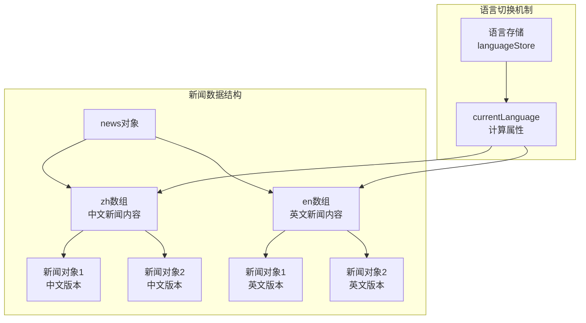
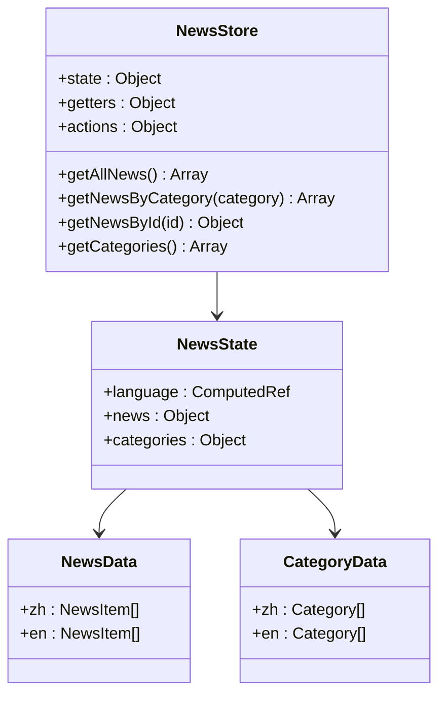
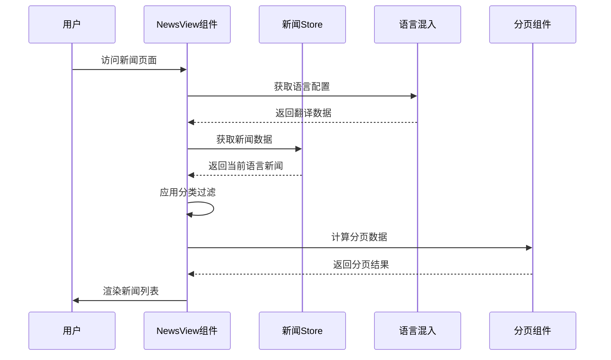
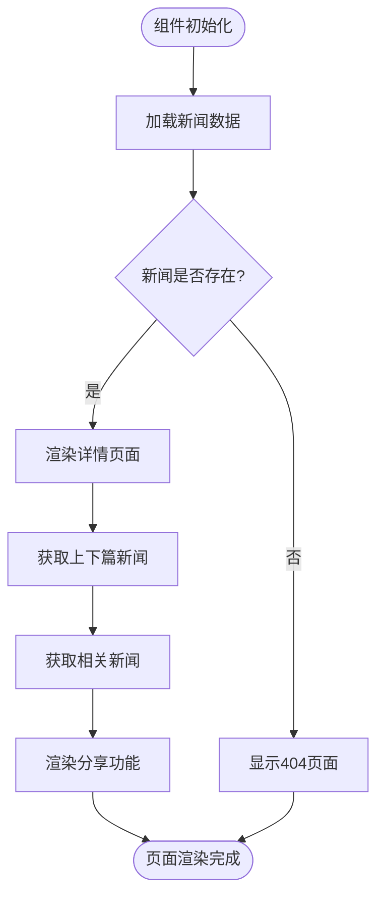
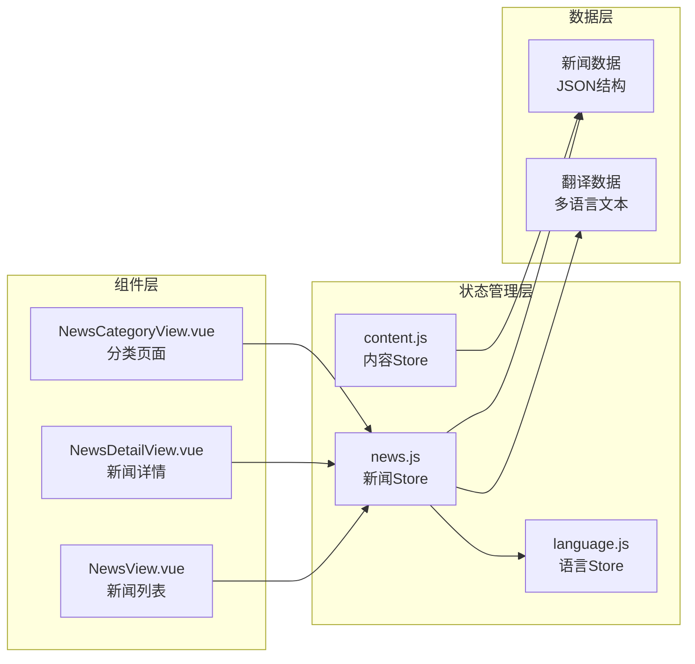
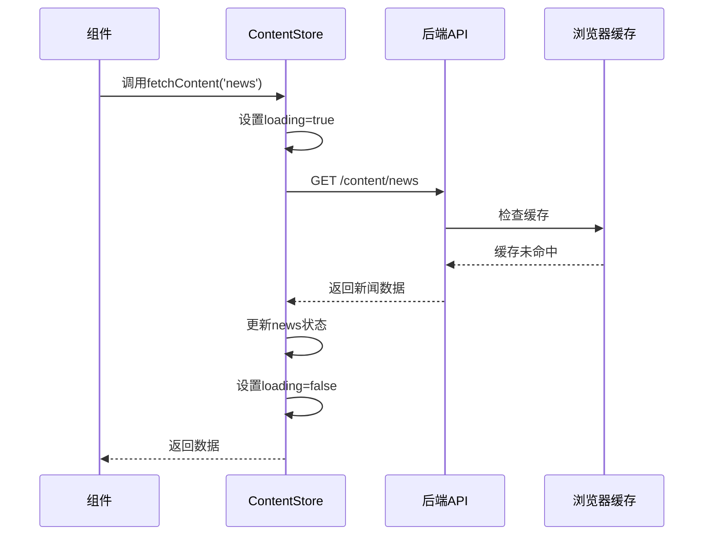

# 新闻资讯数据模型

<cite>
**本文档中引用的文件**
- [news.js](file://src/store/modules/news.js)
- [NewsView.vue](file://src/views/NewsView.vue)
- [NewsDetailView.vue](file://src/views/NewsDetailView.vue)
- [content.js](file://src/store/modules/content.js)
- [language.js](file://src/mixins/language.js)
- [translations.js](file://src/store/modules/translations.js)
- [NewsCategoryView.vue](file://src/views/NewsCategoryView.vue)
- [index.js](file://src/api/index.js)
</cite>

## 目录
1. [项目概述](#项目概述)
2. [新闻数据模型结构](#新闻数据模型结构)
3. [多语言新闻内容组织](#多语言新闻内容组织)
4. [新闻数据存储架构](#新闻数据存储架构)
5. [新闻视图组件分析](#新闻视图组件分析)
6. [数据流与组件绑定](#数据流与组件绑定)
7. [分类筛选与归档显示](#分类筛选与归档显示)
8. [API接口与数据加载](#API接口与数据加载)
9. [性能优化策略](#性能优化策略)
10. [总结与建议](#总结与建议)

## 项目概述

朗德智能科技有限公司的新闻资讯系统是一个基于Vue 3和Pinia的状态管理应用，专门用于管理和展示公司的新闻内容。该系统支持多语言（中文和英文）切换，提供完整的新闻列表、详情页和分类浏览功能。

## 新闻数据模型结构

### 核心新闻实体定义

新闻数据模型采用标准化的JSON结构，每个新闻对象包含以下核心字段：

```javascript
{
  id: Number,                    // 唯一标识符
  category: String,             // 分类标识符（如company、industry、media、blog）
  categoryName: String,         // 分类名称（多语言支持）
  title: String,               // 新闻标题
  summary: String,             // 新闻摘要
  content: String,             // 新闻正文内容（HTML格式）
  image: String,              // 新闻配图URL
  date: String,               // 完整日期字符串（YYYY-MM-DD）
  day: String,                // 日期中的天数部分
  month: String               // 月份和年份格式（MM / YYYY）
}
```

### 字段用途详解

**基础信息字段**：
- `id`: 作为新闻的唯一标识，在路由参数中使用
- `title`: 在新闻列表和详情页中显示的主要标题
- `summary`: 在新闻列表中显示的摘要信息
- `content`: 详细的新闻内容，支持HTML格式

**媒体字段**：
- `image`: 新闻配图，用于列表缩略图和详情页横幅
- `category`: 用于分类筛选和导航
- `categoryName`: 多语言支持的分类显示名称

**时间字段**：
- `date`: 完整的ISO日期格式，用于精确的时间排序
- `day`: 单独的天数字段，用于时间轴显示
- `month`: 月份和年份格式，用于归档显示

**Section sources**
- [news.js](file://src/store/modules/news.js#L10-L50)
- [content.js](file://src/store/modules/content.js#L400-L450)

## 多语言新闻内容组织

### currentNews计算属性分析

系统通过`currentNews`计算属性实现了动态的语言内容切换：

```javascript
const currentNews = computed(() => {
  if (!isInitialized.value) return null
  return languageStore.language === 'zh' ? news.zh : news.en
})
```

这种设计模式的优势：
1. **统一的数据源**: 所有新闻内容都存储在同一数据结构中
2. **高效的切换**: 通过计算属性实现零拷贝的语言切换
3. **内存优化**: 只加载当前语言的内容到内存中
4. **维护便利**: 单一数据源便于内容更新和维护

### 多语言内容结构



**图表来源**
- [content.js](file://src/store/modules/content.js#L400-L450)
- [language.js](file://src/mixins/language.js#L80-L90)

**Section sources**
- [content.js](file://src/store/modules/content.js#L400-L450)
- [language.js](file://src/mixins/language.js#L80-L90)

## 新闻数据存储架构

### Pinia Store设计

新闻数据存储采用模块化设计，主要包含以下几个部分：



**图表来源**
- [news.js](file://src/store/modules/news.js#L1-L141)

### 数据结构层次

1. **根级结构**: 包含语言状态和新闻数据
2. **语言维度**: 支持zh和en两种语言
3. **内容维度**: 每种语言包含新闻列表和分类列表
4. **新闻对象**: 每个新闻对象包含完整的元数据

**Section sources**
- [news.js](file://src/store/modules/news.js#L1-L141)

## 新闻视图组件分析

### NewsView.vue组件架构

NewsView.vue是新闻列表页面的核心组件，实现了完整的新闻展示功能：



**图表来源**
- [NewsView.vue](file://src/views/NewsView.vue#L1-L200)
- [news.js](file://src/store/modules/news.js#L80-L120)

### 组件状态管理

组件内部维护了多个响应式状态：

```javascript
// 分类状态
const currentCategory = ref('all')

// 分页状态
const currentPage = ref(1)
const newsPerPage = 4

// 语言状态
const currentLang = computed(() => languageStore.language)
```

### 数据过滤与分页逻辑

```javascript
// 分类过滤
const filteredNews = computed(() => {
  const newsByCategory = newsStore.getNewsByCategory(currentCategory.value)
  const startIndex = (currentPage.value - 1) * newsPerPage
  const endIndex = startIndex + newsPerPage
  return newsByCategory.slice(startIndex, endIndex)
})

// 总页数计算
const totalPages = computed(() => {
  const newsByCategory = newsStore.getNewsByCategory(currentCategory.value)
  return Math.max(1, Math.ceil(newsByCategory.length / newsPerPage))
})
```

**Section sources**
- [NewsView.vue](file://src/views/NewsView.vue#L1-L200)

### NewsDetailView.vue组件分析

NewsDetailView.vue负责单篇新闻的详细展示：



**图表来源**
- [NewsDetailView.vue](file://src/views/NewsDetailView.vue#L1-L200)

**Section sources**
- [NewsDetailView.vue](file://src/views/NewsDetailView.vue#L1-L200)

## 数据流与组件绑定

### 组件间数据绑定关系



**图表来源**
- [NewsView.vue](file://src/views/NewsView.vue#L1-L50)
- [NewsDetailView.vue](file://src/views/NewsDetailView.vue#L1-L50)
- [news.js](file://src/store/modules/news.js#L1-L50)

### 数据流向分析

1. **数据加载**: 通过`useNewsStore()`获取新闻数据
2. **语言切换**: 基于`languageStore.language`动态切换内容
3. **分类过滤**: 使用`getNewsByCategory()`按类别筛选新闻
4. **详情获取**: 使用`getNewsById()`获取指定新闻
5. **分页处理**: 前端实现分页逻辑，减少服务器压力

**Section sources**
- [NewsView.vue](file://src/views/NewsView.vue#L50-L150)
- [NewsDetailView.vue](file://src/views/NewsDetailView.vue#L50-L150)

## 分类筛选与归档显示

### 分类系统设计

系统提供了完整的分类筛选功能：

```javascript
// 分类数据结构
categories: {
  zh: [
    { id: 'all', name: '全部' },
    { id: 'company', name: '公司新闻' },
    { id: 'industry', name: '行业动态' },
    { id: 'media', name: '媒体报道' },
    { id: 'blog', name: '技术博客' }
  ],
  en: [
    { id: 'all', name: 'All' },
    { id: 'company', name: 'Company News' },
    { id: 'industry', name: 'Industry Updates' },
    { id: 'media', name: 'Media Coverage' },
    { id: 'blog', name: 'Tech Blog' }
  ]
}
```

### 归档显示机制

时间字段的设计支持灵活的归档显示：

```javascript
// 时间字段示例
{
  date: '2024-06-10',
  day: '10',
  month: '06 / 2024'
}
```

这种设计允许：
- **精确排序**: 使用完整的日期字符串进行精确排序
- **灵活展示**: day字段用于详细时间显示
- **归档友好**: month字段适合按月份归档显示

**Section sources**
- [news.js](file://src/store/modules/news.js#L60-L80)

## API接口与数据加载

### fetchContent方法分析

ContentStore中的`fetchContent`方法负责从API加载新闻数据：

```javascript
const fetchContent = async (contentType) => {
  try {
    loading.value = true
    error.value = null
    
    // 构建API请求URL
    const url = `/content/${contentType}`
    
    // 发送请求
    const response = await axios.get(url)
    
    // 更新相应的数据
    if (contentType === 'news') {
      if (response.data?.zh) news.zh = response.data.zh
      if (response.data?.en) news.en = response.data.en
    }
    
    loading.value = false
    return response.data
  } catch (err) {
    console.error(`获取${contentType}数据失败:`, err)
    error.value = err.message || '数据加载失败'
    loading.value = false
    return null
  }
}
```

### API调用流程



**图表来源**
- [content.js](file://src/store/modules/content.js#L500-L550)
- [index.js](file://src/api/index.js#L1-L50)

**Section sources**
- [content.js](file://src/store/modules/content.js#L500-L550)
- [index.js](file://src/api/index.js#L1-L50)

## 性能优化策略

### 前端性能优化

1. **计算属性缓存**: 使用Vue的计算属性避免重复计算
2. **懒加载**: 新闻内容按需加载，减少初始包大小
3. **虚拟滚动**: 对于大量新闻，考虑实现虚拟滚动
4. **图片优化**: 使用适当的图片格式和尺寸

### 状态管理优化

1. **模块化设计**: 将新闻数据独立为模块，便于维护
2. **响应式更新**: 只更新变化的部分，避免全量重渲染
3. **语言切换优化**: 通过计算属性实现零拷贝的语言切换

### 数据加载优化

1. **分页加载**: 避免一次性加载所有新闻
2. **缓存策略**: 利用浏览器缓存减少重复请求
3. **预加载**: 对常用数据进行预加载

## 总结与建议

### 系统优势

1. **完整的多语言支持**: 中英文双语内容管理
2. **灵活的分类系统**: 支持多种新闻分类和筛选
3. **优秀的用户体验**: 分页、搜索、分享等功能完善
4. **模块化架构**: 清晰的组件和状态分离

### 改进建议

1. **SEO优化**: 添加meta标签和结构化数据
2. **移动端适配**: 优化移动端浏览体验
3. **搜索功能**: 实现全文搜索和高级筛选
4. **数据分析**: 添加新闻点击统计和用户行为分析
5. **富媒体支持**: 支持视频、音频等多媒体内容

### 最佳实践

1. **数据一致性**: 确保多语言内容的一致性
2. **错误处理**: 完善的错误边界和降级策略
3. **性能监控**: 实施性能监控和优化
4. **内容管理**: 提供友好的内容编辑和发布流程

这个新闻资讯数据模型展现了现代Web应用的最佳实践，通过合理的架构设计和优化策略，为用户提供了一个功能完整、性能优异的新闻管理系统。