# 核心技术数据模型

<cite>
**本文档引用的文件**
- [content.json](file://data/content.json)
- [content.js](file://src/store/modules/content.js)
- [TechnologyView.vue](file://src/views/TechnologyView.vue)
- [language.js](file://src/store/modules/language.js)
- [language.js](file://src/mixins/language.js)
</cite>

## 目录
1. [简介](#简介)
2. [项目结构概览](#项目结构概览)
3. [核心技术实体结构](#核心技术实体结构)
4. [六类反无人机技术分类](#六类反无人机技术分类)
5. [数据模型架构](#数据模型架构)
6. [语言国际化机制](#语言国际化机制)
7. [前端可视化实现](#前端可视化实现)
8. [数据流分析](#数据流分析)
9. [性能考虑](#性能考虑)
10. [故障排除指南](#故障排除指南)
11. [总结](#总结)

## 简介

本文档详细阐述了朗德智能科技有限公司反无人机系统的核心技术数据模型。该模型作为核心技术展示模块的数据契约，定义了六类反无人机技术（探测、干扰、拦截、指挥控制、AI识别、系统集成）的完整数据结构，并提供了完整的国际化支持和可视化展示方案。

核心技术模型采用Vue 3 Composition API和Pinia状态管理，实现了响应式的语言切换和动态数据更新。该模型不仅支持中文和英文两种语言，还具备良好的扩展性，可以轻松适配更多语言和地区。

## 项目结构概览

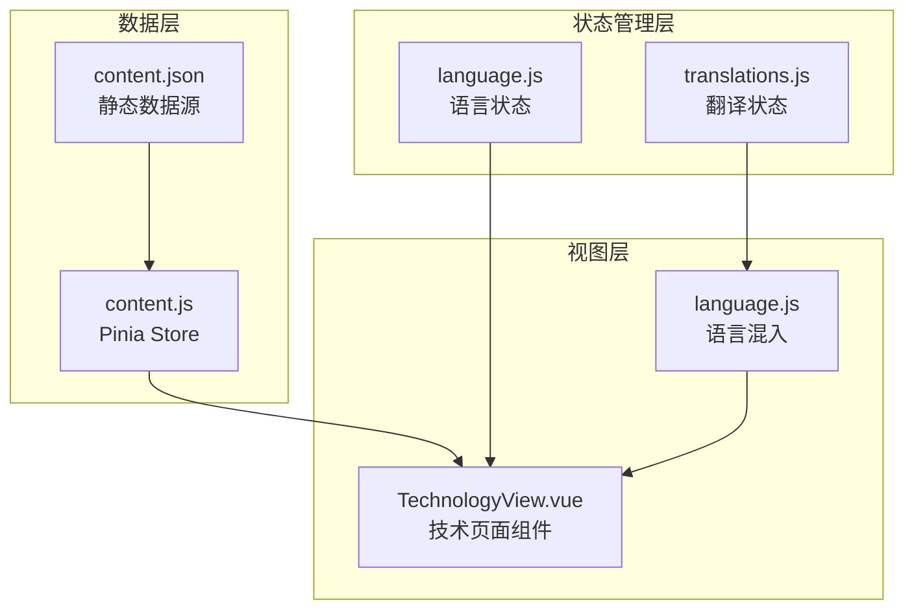

**图表来源**
- [content.js](file://src/store/modules/content.js#L1-L50)
- [TechnologyView.vue](file://src/views/TechnologyView.vue#L1-L50)
- [language.js](file://src/mixins/language.js#L1-L30)

**章节来源**
- [content.js](file://src/store/modules/content.js#L1-L100)
- [TechnologyView.vue](file://src/views/TechnologyView.vue#L1-L100)

## 核心技术实体结构

核心技术实体遵循标准化的数据结构设计，每个技术条目包含以下核心字段：

### 基础字段定义

```javascript
{
  id: "string",           // 唯一标识符，用于技术分类和索引
  title: "string",        // 技术名称，支持多语言显示
  description: "string",   // 技术概述，简洁明了的功能描述
  icon: "string",         // Font Awesome图标类名，用于视觉标识
  details: "string",      // 详细技术说明，支持HTML格式
  image: "string"         // 技术展示图片路径
}
```

### 字段详细说明

**id字段**：采用语义化命名规范，如'detection'、'jamming'、'interception'等，确保唯一性和可读性。

**title字段**：支持双语言显示，根据用户语言偏好自动切换，提供流畅的用户体验。

**description字段**：简洁的技术概述，帮助用户快速理解技术功能和价值。

**icon字段**：使用Font Awesome图标库，统一视觉风格，增强识别度。

**details字段**：详细的背景技术和实现原理，支持富文本格式，便于展示复杂的技术细节。

**image字段**：高质量的技术展示图片，提升视觉效果和专业形象。

**章节来源**
- [content.js](file://src/store/modules/content.js#L146-L260)

## 六类反无人机技术分类

核心技术模型定义了六类核心反无人机技术，每类技术都有明确的业务定位和技术特点：

### 探测系统 (Detection)

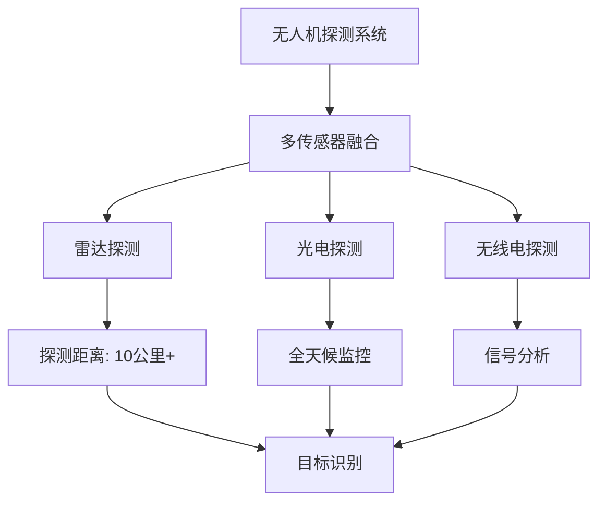

**图表来源**
- [content.js](file://src/store/modules/content.js#L150-L160)

**业务意义**：提供全天候、全方位的无人机探测能力，是反无人机系统的首要环节。

### 干扰系统 (Jamming)

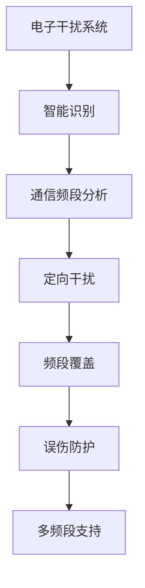

**图表来源**
- [content.js](file://src/store/modules/content.js#L162-L172)

**业务意义**：通过智能干扰技术阻断无人机控制链路，实现非接触式防御。

### 拦截系统 (Interception)

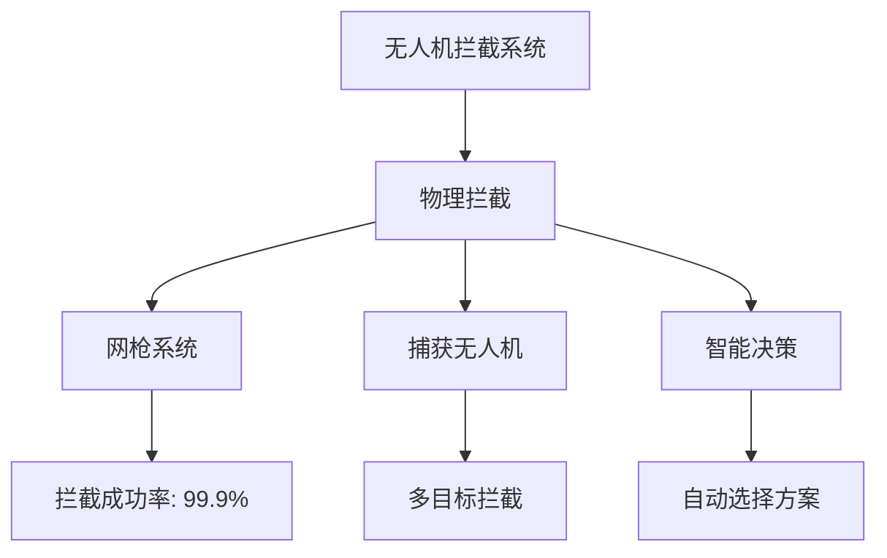

**图表来源**
- [content.js](file://src/store/modules/content.js#L174-L184)

**业务意义**：提供安全可靠的物理拦截手段，确保被探测目标得到有效处置。

### 指挥控制系统 (Command)

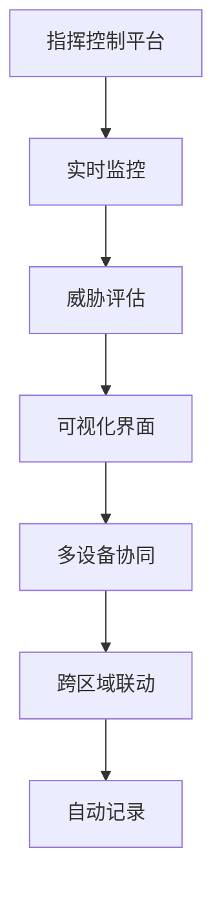

**图表来源**
- [content.js](file://src/store/modules/content.js#L186-L196)

**业务意义**：提供集中化的指挥调度能力，实现高效的威胁响应和处置。

### AI识别系统 (AI)

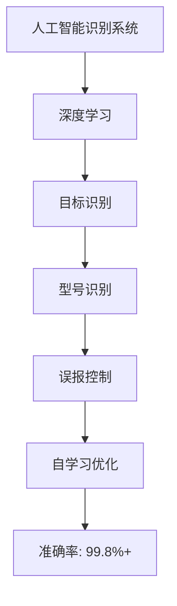

**图表来源**
- [content.js](file://src/store/modules/content.js#L198-L208)

**业务意义**：利用先进的人工智能技术，实现高精度的无人机识别和威胁评估。

### 系统集成方案 (Integration)

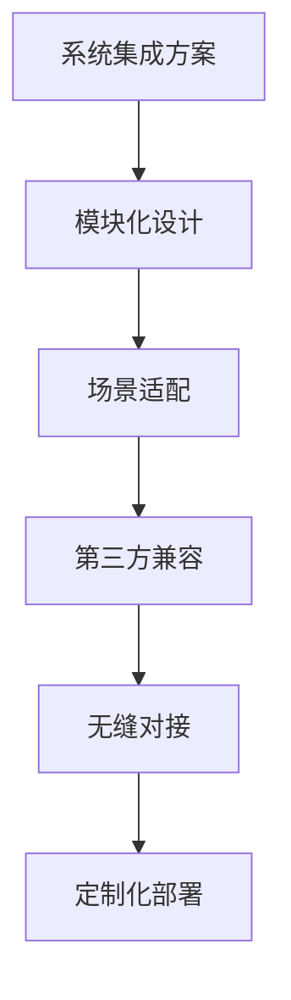

**图表来源**
- [content.js](file://src/store/modules/content.js#L210-L220)

**业务意义**：提供灵活的系统集成能力，确保与现有安防体系的完美融合。

**章节来源**
- [content.js](file://src/store/modules/content.js#L146-L220)

## 数据模型架构

核心技术数据模型采用分层架构设计，确保数据的组织性、可维护性和扩展性：

### 数据层次结构

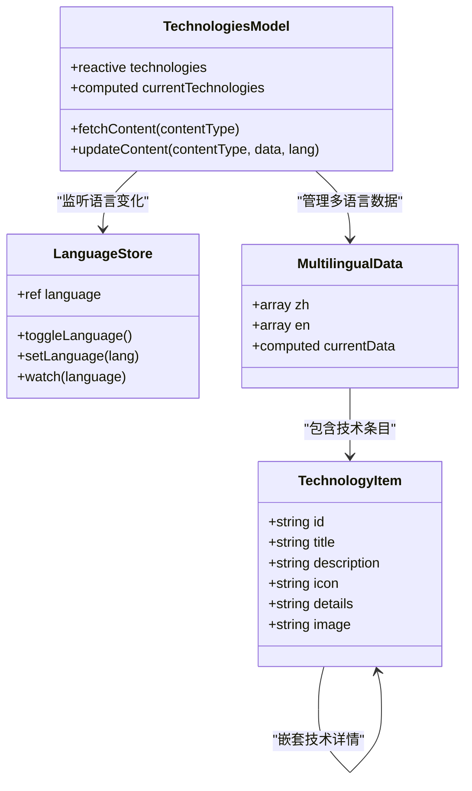

**图表来源**
- [content.js](file://src/store/modules/content.js#L146-L260)
- [language.js](file://src/store/modules/language.js#L50-L100)

### 数据流设计

核心技术模型的数据流遵循单向数据流原则，确保数据的一致性和可预测性：

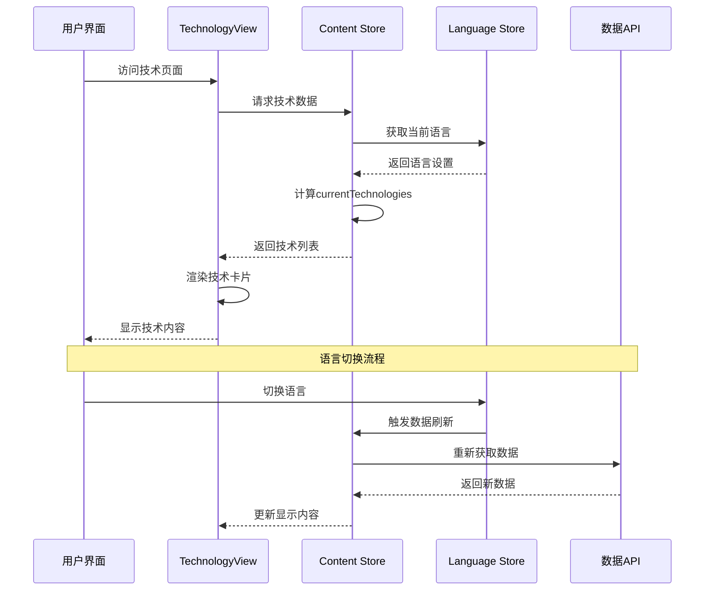

**图表来源**
- [TechnologyView.vue](file://src/views/TechnologyView.vue#L150-L200)
- [content.js](file://src/store/modules/content.js#L20-L50)

**章节来源**
- [content.js](file://src/store/modules/content.js#L146-L260)
- [TechnologyView.vue](file://src/views/TechnologyView.vue#L150-L250)

## 语言国际化机制

核心技术模型实现了完整的国际化支持，通过多层次的语言管理机制确保多语言内容的准确传递和及时更新：

### 语言状态管理

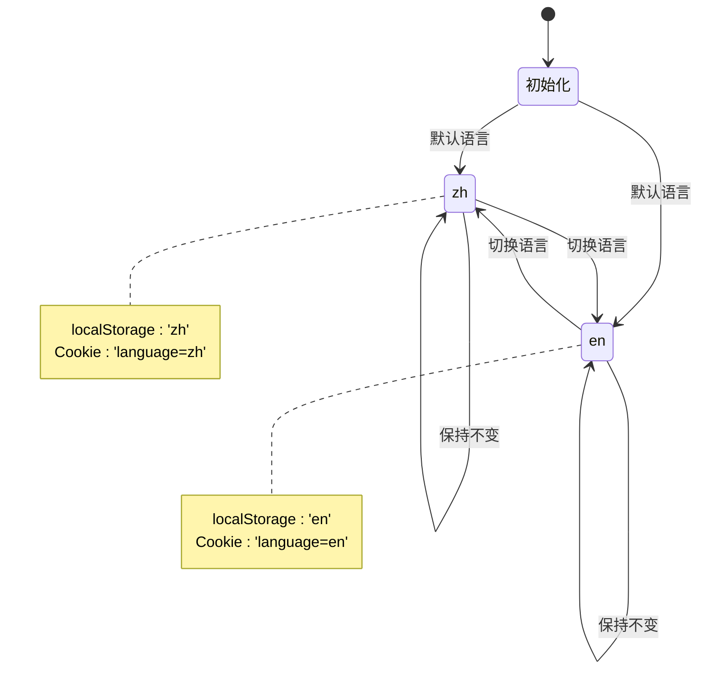

**图表来源**
- [language.js](file://src/store/modules/language.js#L1-L50)

### 语言切换机制

语言切换采用双重持久化策略，确保用户语言偏好的可靠保存：

1. **localStorage优先策略**：首先检查localStorage中的语言设置
2. **Cookie备选策略**：当localStorage无效时，从Cookie中恢复语言设置
3. **默认回退机制**：当所有持久化存储都无效时，使用中文作为默认语言

### 多语言数据结构

核心技术模型采用双语言并行的数据结构设计：

```javascript
// 技术数据的双语言结构
const technologies = reactive({
  zh: [
    {
      id: 'detection',
      title: '无人机探测系统',
      description: '多传感器融合的无人机探测系统...',
      // ...其他中文字段
    }
  ],
  en: [
    {
      id: 'detection',
      title: 'Drone Detection System',
      description: 'Multi-sensor fusion detection system...',
      // ...其他英文字段
    }
  ]
})
```

### 动态语言切换

当用户切换语言时，系统会自动触发以下流程：

1. **状态更新**：更新语言状态变量
2. **数据刷新**：重新计算currentTechnologies计算属性
3. **DOM更新**：触发Vue组件的重新渲染
4. **事件通知**：发布languageChanged事件
5. **样式重绘**：强制触发页面样式重新计算

**章节来源**
- [language.js](file://src/store/modules/language.js#L1-L100)
- [content.js](file://src/store/modules/content.js#L20-L50)

## 前端可视化实现

核心技术模型的前端实现采用了现代化的Vue 3 Composition API和响应式设计，提供了丰富的交互体验和视觉效果：

### 技术页面架构

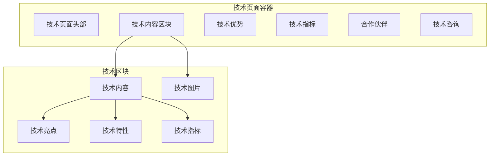

**图表来源**
- [TechnologyView.vue](file://src/views/TechnologyView.vue#L1-L50)

### 可视化组件设计

技术页面采用卡片式布局设计，每个技术条目都以独立的卡片形式展示：

```javascript
// 技术卡片的动态渲染
<div class="tech-section" v-for="(tech, index) in currentTechnologies" :key="tech.id">
  <div class="tech-content">
    <div class="tech-index">0{{ index + 1 }}</div>
    <div class="tech-badge">{{ getTechTag(index) }}</div>
    <h2>{{ tech.title }}</h2>
    <div class="tech-desc" v-html="tech.details"></div>
  </div>
  <div class="tech-image">
    
  </div>
</div>
```

### 交互设计模式

技术页面实现了多种交互设计模式：

1. **悬停效果**：鼠标悬停时产生微妙的动画效果
2. **图片错误处理**：自动处理图片加载失败的情况
3. **响应式布局**：适配不同屏幕尺寸的显示效果
4. **渐进式加载**：优化页面加载性能

### 图片处理机制

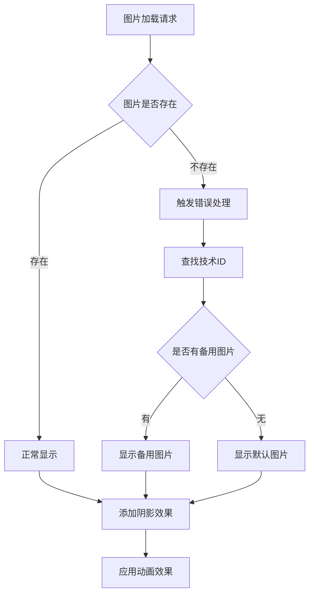

**图表来源**
- [TechnologyView.vue](file://src/views/TechnologyView.vue#L750-L780)

**章节来源**
- [TechnologyView.vue](file://src/views/TechnologyView.vue#L1-L100)
- [TechnologyView.vue](file://src/views/TechnologyView.vue#L150-L250)

## 数据流分析

核心技术模型的数据流设计体现了现代前端架构的最佳实践，确保了数据的一致性和系统的可维护性：

### 数据获取流程

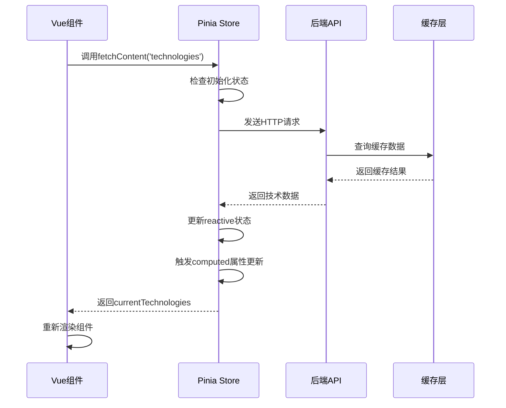

**图表来源**
- [content.js](file://src/store/modules/content.js#L540-L600)

### 状态管理机制

核心技术模型的状态管理采用Pinia框架，实现了清晰的状态分离和高效的响应式更新：

1. **响应式状态**：使用reactive包装技术数据
2. **计算属性**：通过computed实现语言切换的自动更新
3. **副作用处理**：使用watch监听语言变化
4. **异步处理**：支持异步数据获取和错误处理

### 性能优化策略

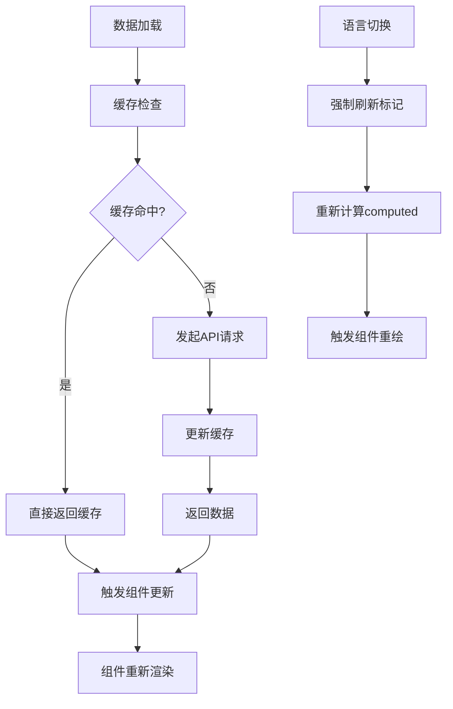

**图表来源**
- [content.js](file://src/store/modules/content.js#L20-L50)

**章节来源**
- [content.js](file://src/store/modules/content.js#L540-L600)
- [TechnologyView.vue](file://src/views/TechnologyView.vue#L150-L200)

## 性能考虑

核心技术模型在设计时充分考虑了性能优化，采用了多种策略确保系统的高效运行：

### 内存管理

1. **响应式对象优化**：使用Vue 3的响应式系统，避免不必要的内存占用
2. **计算属性缓存**：充分利用computed的缓存机制，减少重复计算
3. **组件生命周期管理**：合理使用onMounted和onUnmounted钩子

### 网络优化

1. **数据预加载**：在组件挂载时预加载必要的技术数据
2. **懒加载策略**：对于非关键数据采用懒加载方式
3. **缓存机制**：实现多层缓存策略，减少重复请求

### 渲染优化

1. **虚拟滚动**：对于大量技术条目，考虑使用虚拟滚动技术
2. **图片优化**：采用适当的图片格式和尺寸，平衡质量和大小
3. **CSS优化**：使用高效的CSS选择器和动画效果

## 故障排除指南

### 常见问题诊断

**问题1：技术数据显示为空**
- 检查contentStore.isInitialized状态
- 验证fetchContent方法是否正确执行
- 确认API接口是否正常返回数据

**问题2：语言切换失效**
- 检查localStorage和Cookie中的语言设置
- 验证languageStore.toggleLanguage方法
- 确认computed属性是否正确更新

**问题3：图片加载失败**
- 检查图片路径是否正确
- 验证handleImageError方法逻辑
- 确认备用图片是否可用

### 调试工具使用

```javascript
// 开发环境调试
console.log('Current technologies:', contentStore.currentTechnologies)
console.log('Language:', languageStore.language)
console.log('Loading state:', contentStore.getLoadingState)
```

**章节来源**
- [content.js](file://src/store/modules/content.js#L540-L600)
- [TechnologyView.vue](file://src/views/TechnologyView.vue#L750-L800)

## 总结

核心技术数据模型作为朗德智能科技有限公司反无人机系统的核心展示模块，展现了现代前端架构的最佳实践。该模型不仅实现了完整的六类反无人机技术展示，还提供了优秀的国际化支持和用户体验。

### 主要特性总结

1. **标准化数据结构**：采用统一的技术实体结构，确保数据的一致性和可维护性
2. **完整的国际化支持**：实现双语言切换，支持多语言内容的动态更新
3. **响应式设计**：采用现代化的Vue 3技术栈，提供流畅的交互体验
4. **性能优化**：通过多种策略确保系统的高效运行
5. **扩展性强**：模块化设计便于添加新的技术类别和功能

### 技术价值

该模型为反无人机技术的展示和推广提供了强有力的技术支撑，不仅提升了用户体验，也为企业的技术传播和品牌建设做出了重要贡献。通过这种标准化的数据模型，企业可以更有效地展示其技术实力，增强市场竞争力。