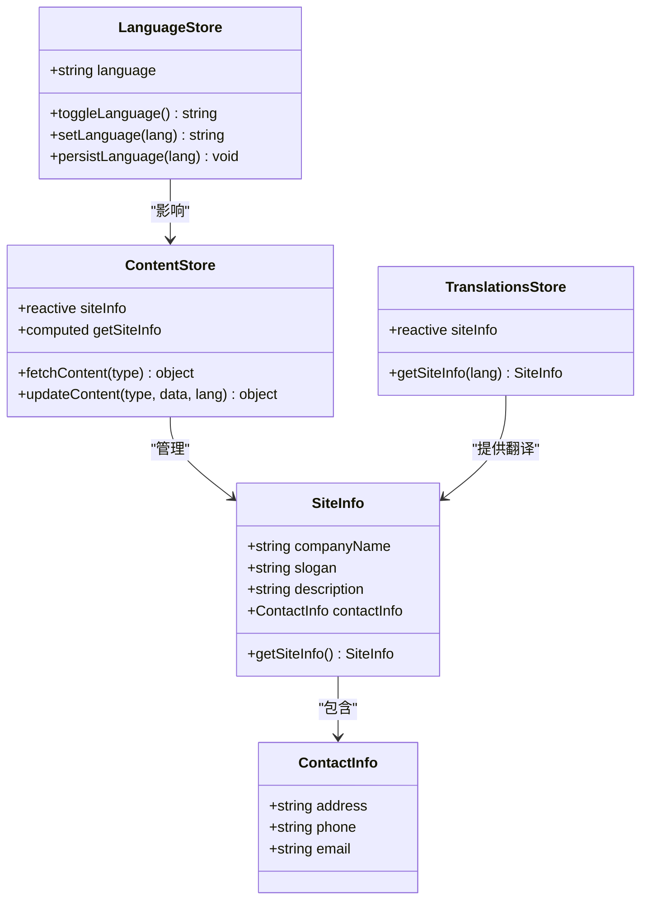
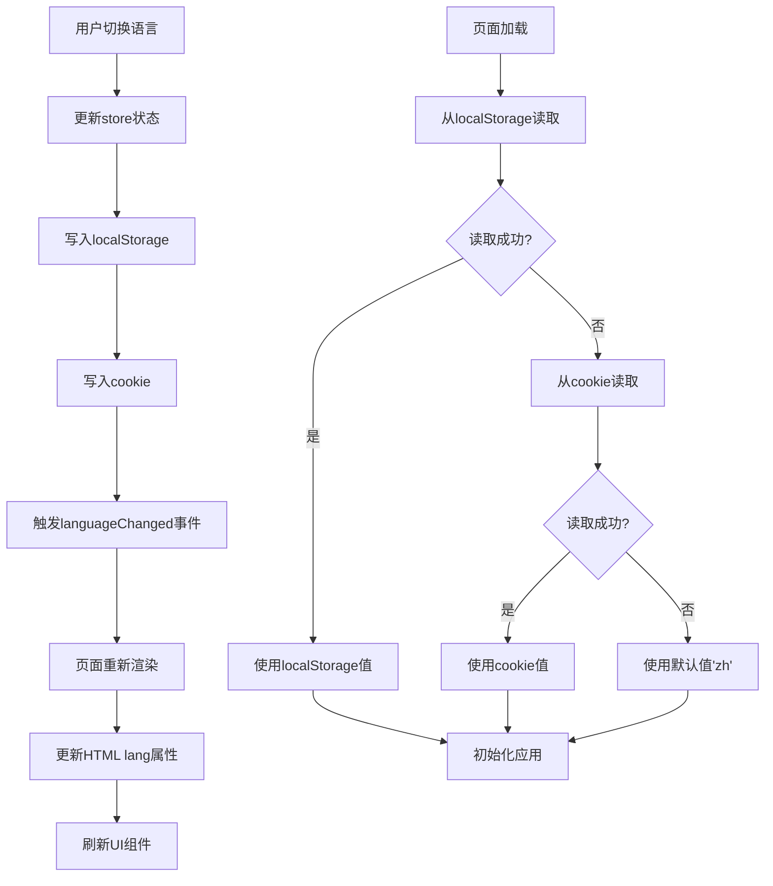
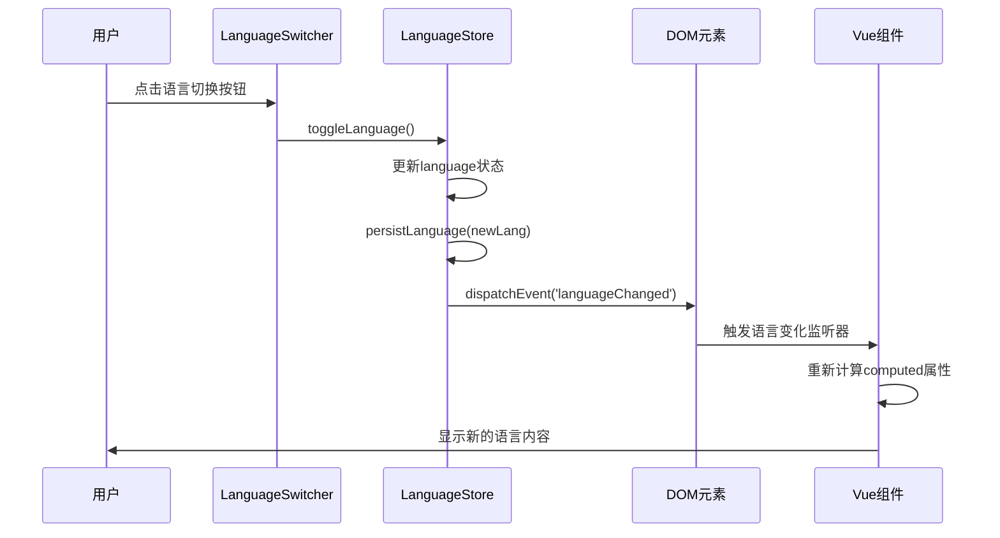
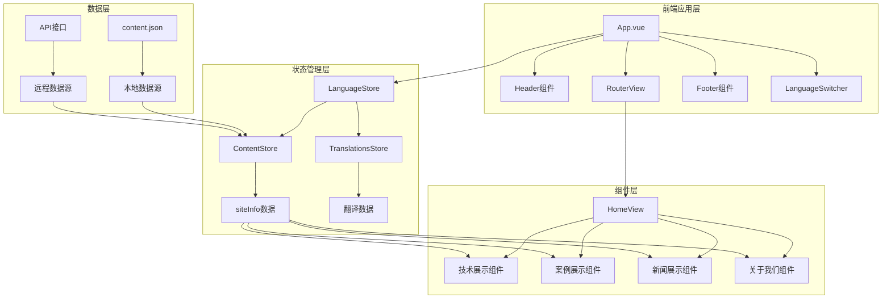
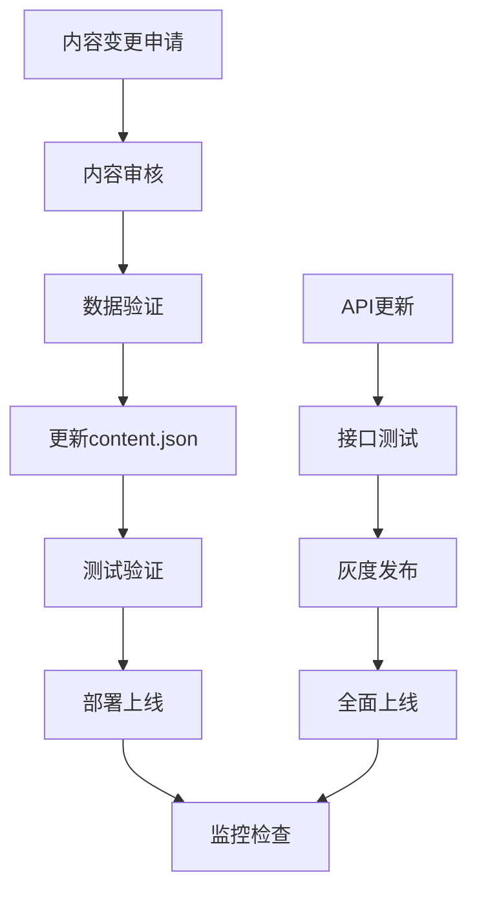

# 网站信息数据模型文档

<cite>
**本文档中引用的文件**
- [data/content.json](file://data/content.json)
- [src/store/modules/content.js](file://src/store/modules/content.js)
- [src/store/modules/language.js](file://src/store/modules/language.js)
- [src/store/modules/translations.js](file://src/store/modules/translations.js)
- [src/plugins/i18n.js](file://src/plugins/i18n.js)
- [src/views/HomeView.vue](file://src/views/HomeView.vue)
- [src/components/LanguageSwitcher.vue](file://src/components/LanguageSwitcher.vue)
- [src/App.vue](file://src/App.vue)
</cite>

## 目录
1. [项目概述](#项目概述)
2. [网站信息模型结构](#网站信息模型结构)
3. [数据模型详细分析](#数据模型详细分析)
4. [多语言支持机制](#多语言支持机制)
5. [前端应用架构](#前端应用架构)
6. [数据流分析](#数据流分析)
7. [组件应用实例](#组件应用实例)
8. [数据维护规范](#数据维护规范)
9. [性能优化建议](#性能优化建议)
10. [总结](#总结)

## 项目概述

本项目是一个基于Vue 3和Pinia的状态管理系统的现代化企业网站，专注于反无人机技术和智能科技解决方案。网站采用多语言架构，支持中文和英文两种语言版本，通过统一的数据模型为整个应用提供一致的信息展示。

网站的核心业务围绕杭州朗德智能科技有限公司的反无人机系统和无人机技术解决方案展开，涵盖技术展示、案例研究、新闻资讯、企业介绍等多个维度的内容。

## 网站信息模型结构

### 核心实体定义

网站信息模型主要由以下核心实体组成：



**图表来源**
- [src/store/modules/content.js](file://src/store/modules/content.js#L40-L60)
- [src/store/modules/language.js](file://src/store/modules/language.js#L1-L50)

### 字段详细说明

#### companyName（公司名称）
- **数据类型**: `string`
- **是否必填**: 是
- **多语言支持**: 支持
- **中文示例**: "杭州朗德智能科技有限公司"
- **英文示例**: "Hangzhou Lande Intelligent Technology Co., Ltd."

#### slogan（标语）
- **数据类型**: `string`
- **是否必填**: 是
- **多语言支持**: 支持
- **中文示例**: "智能反无人机，守护空域安全"
- **英文示例**: "Smart Anti-Drone Systems, Securing Airspace"

#### description（描述）
- **数据类型**: `string`
- **是否必填**: 是
- **多语言支持**: 支持
- **中文示例**: "领先的反无人机系统及反无人机解决方案提供商"
- **英文示例**: "Leading provider of anti-drone systems and solutions"

#### contactInfo（联系信息）
- **数据类型**: `object`
- **是否必填**: 是
- **包含字段**:
  - `address`: 地址信息
  - `phone`: 联系电话
  - `email`: 电子邮箱

**章节来源**
- [data/content.json](file://data/content.json#L1-L10)
- [src/store/modules/content.js](file://src/store/modules/content.js#L40-L60)

## 数据模型详细分析

### 内存数据结构

网站信息在内存中的存储采用分层结构，通过Pinia store进行管理：

```javascript
// 内存中的网站信息结构
const siteInfo = reactive({
  zh: {
    companyName: '杭州朗德智能科技有限公司',
    slogan: '智能反无人机，守护空域安全',
    description: '领先的反无人机系统及反无人机解决方案提供商',
    contactInfo: {
      address: '浙江省杭州市滨江区科技园区创新大厦A座15楼',
      phone: '0571-8888 9999',
      email: 'info@landedrone.com'
    }
  },
  en: {
    companyName: 'Hangzhou Lande Intelligent Technology Co., Ltd.',
    slogan: 'Smart Anti-Drone Systems, Securing Airspace',
    description: 'Leading provider of anti-drone systems and solutions',
    contactInfo: {
      address: '15F, Building A, Innovation Tower, Science & Technology Park, Binjiang District, Hangzhou, Zhejiang',
      phone: '0571-8888 9999',
      email: 'info@landedrone.com'
    }
  }
})
```

### 数据持久化机制

系统实现了多层次的数据持久化策略：



**图表来源**
- [src/store/modules/language.js](file://src/store/modules/language.js#L10-L40)
- [src/store/modules/language.js](file://src/store/modules/language.js#L150-L200)

**章节来源**
- [src/store/modules/content.js](file://src/store/modules/content.js#L40-L60)
- [src/store/modules/language.js](file://src/store/modules/language.js#L10-L80)

## 多语言支持机制

### 语言切换流程

系统采用事件驱动的语言切换机制，确保所有组件都能及时响应语言变化：



**图表来源**
- [src/components/LanguageSwitcher.vue](file://src/components/LanguageSwitcher.vue#L40-L80)
- [src/store/modules/language.js](file://src/store/modules/language.js#L150-L200)

### 语言状态管理

语言状态通过Pinia store进行集中管理，支持以下功能：

- **状态持久化**: 自动保存到localStorage和cookie
- **事件通知**: 语言变化时触发全局事件
- **自动刷新**: 监听语言变化自动更新UI
- **默认值处理**: 语言无效时自动回退到中文

**章节来源**
- [src/store/modules/language.js](file://src/store/modules/language.js#L150-L215)
- [src/components/LanguageSwitcher.vue](file://src/components/LanguageSwitcher.vue#L40-L100)

## 前端应用架构

### 整体架构设计



**图表来源**
- [src/App.vue](file://src/App.vue#L1-L50)
- [src/views/HomeView.vue](file://src/views/HomeView.vue#L1-L100)

### 组件通信机制

系统采用多种组件通信方式：

1. **依赖注入**: 通过provide/inject传递全局状态
2. **事件总线**: 通过CustomEvent实现跨组件通信
3. **Pinia Store**: 通过store管理共享状态
4. **props & emits**: 通过父子组件通信

**章节来源**
- [src/App.vue](file://src/App.vue#L100-L150)
- [src/plugins/i18n.js](file://src/plugins/i18n.js#L1-L50)

## 数据流分析

### 数据获取流程

```mermaid
flowchart LR
A[应用启动] --> B[初始化ContentStore]
B --> C[fetchContent('site-info')]
C --> D{数据来源}
D --> |本地| E[content.json]
D --> |远程| F[API接口]
E --> G[更新siteInfo]
F --> G
G --> H[计算属性getSiteInfo]
H --> I[组件渲染]
J[语言切换] --> K[watch监听]
K --> L[重新获取数据]
L --> M[更新计算属性]
M --> I
```

**图表来源**
- [src/store/modules/content.js](file://src/store/modules/content.js#L200-L250)
- [src/store/modules/content.js](file://src/store/modules/content.js#L60-L80)

### 计算属性机制

系统通过Vue的computed属性实现响应式数据更新：

```javascript
// 计算属性实现语言切换的响应式
const getSiteInfo = computed(() => {
  if (!isInitialized.value) return null
  return languageStore.language === 'zh' ? siteInfo.zh : siteInfo.en
})
```

这种设计确保：
- **性能优化**: 只在依赖变化时重新计算
- **响应式更新**: 语言变化时自动更新所有使用该计算属性的组件
- **内存高效**: 避免不必要的数据复制

**章节来源**
- [src/store/modules/content.js](file://src/store/modules/content.js#L60-L80)
- [src/store/modules/content.js](file://src/store/modules/content.js#L200-L250)

## 组件应用实例

### Header组件中的应用

在Header组件中，网站信息主要用于Logo下方的标语展示：

```vue
<!-- Header中的标语展示 -->
<h2 class="tech-headline">{{ currentSiteInfo.slogan }}</h2>
```

这里的`currentSiteInfo`是通过计算属性获取的响应式数据，会随着语言切换自动更新。

### Footer组件中的应用

Footer组件使用网站信息中的联系信息：

```vue
<!-- Footer中的联系方式 -->
<p>{{ currentSiteInfo.contactInfo.address }}</p>
<a :href="`tel:${currentSiteInfo.contactInfo.phone}`">
  {{ currentSiteInfo.contactInfo.phone }}
</a>
<a :href="`mailto:${currentSiteInfo.contactInfo.email}`">
  {{ currentSiteInfo.contactInfo.email }}
</a>
```

### HomeView中的综合应用

HomeView展示了网站信息在多个场景中的应用：

1. **Hero区域**: 展示公司标语和描述
2. **关于我们**: 展示公司简介和统计数据
3. **联系我们**: 展示详细的联系信息
4. **技术展示**: 结合技术内容展示公司定位

**章节来源**
- [src/views/HomeView.vue](file://src/views/HomeView.vue#L50-L100)
- [src/views/HomeView.vue](file://src/views/HomeView.vue#L200-L250)
- [src/views/HomeView.vue](file://src/views/HomeView.vue#L300-L350)

## 数据维护规范

### 内容编辑规范

#### 1. 数据格式要求
- **必填字段**: companyName、slogan、description、contactInfo
- **数据类型**: 所有字符串字段必须使用UTF-8编码
- **长度限制**: 单行文本不超过200字符，多行文本不超过1000字符
- **特殊字符**: 仅允许使用标准ASCII字符和常用中文字符

#### 2. 多语言内容维护
- **内容一致性**: 中文和英文内容应保持语义一致
- **术语统一**: 关键技术术语在两种语言中应使用统一的专业词汇
- **文化适配**: 英文内容应考虑目标受众的文化背景

#### 3. 联系信息规范
- **地址格式**: 按照"省市区街道详细地址"的顺序组织
- **电话格式**: 使用标准的区号+号码格式，如"0571-8888 9999"
- **邮箱格式**: 符合RFC 5322标准的电子邮件地址

### 开发维护规范

#### 1. 数据更新流程


#### 2. 错误处理机制
- **数据校验**: 在更新前验证数据完整性
- **回滚机制**: 更新失败时自动回滚到上一版本
- **监控告警**: 实时监控数据更新状态

#### 3. 性能优化措施
- **懒加载**: 非关键内容采用懒加载策略
- **缓存机制**: 合理使用浏览器缓存减少重复请求
- **CDN加速**: 静态资源通过CDN分发

**章节来源**
- [data/content.json](file://data/content.json#L1-L28)
- [src/store/modules/content.js](file://src/store/modules/content.js#L200-L250)

## 性能优化建议

### 1. 数据加载优化

#### 预加载策略
```javascript
// 预加载基础数据，避免白屏
const preloadBaseData = async () => {
  try {
    const result = await contentStore.fetchContent('site-info')
    if (result === null && contentStore.error) {
      console.error('基础数据加载失败:', contentStore.error)
      return false
    }
    return true
  } catch (error) {
    console.error('基础数据加载失败:', error)
    return false
  }
}
```

#### 缓存策略
- **内存缓存**: 将常用数据缓存在内存中
- **本地缓存**: 使用localStorage缓存用户偏好设置
- **HTTP缓存**: 合理设置HTTP缓存头

### 2. 渲染性能优化

#### 组件懒加载
```javascript
// 按需加载大型组件
const LargeComponent = defineAsyncComponent(() => 
  import('@/components/LargeComponent.vue')
)
```

#### 虚拟滚动
对于大量列表数据，采用虚拟滚动技术：
- 减少DOM节点数量
- 提升滚动性能
- 降低内存占用

### 3. 网络优化

#### 资源压缩
- 图片压缩: 使用WebP格式，按需加载
- 代码分割: 按路由分割JavaScript包
- 压缩传输: 启用Gzip/Brotli压缩

#### CDN优化
- 静态资源CDN分发
- 智能DNS解析
- 边缘缓存策略

## 总结

本网站信息数据模型通过精心设计的多层架构，实现了高效、可维护的企业级网站内容管理系统。主要特点包括：

### 核心优势

1. **统一的数据模型**: 通过标准化的JSON结构管理所有网站信息
2. **完善的多语言支持**: 实现了从数据存储到界面渲染的完整多语言解决方案
3. **响应式的状态管理**: 基于Vue 3和Pinia的现代状态管理模式
4. **灵活的组件架构**: 支持组件级别的独立开发和测试
5. **强大的扩展性**: 易于添加新的内容类型和语言版本

### 技术亮点

- **事件驱动的语言切换**: 通过CustomEvent实现全局状态同步
- **计算属性的响应式更新**: 自动更新所有使用该数据的组件
- **多层次的持久化机制**: localStorage和cookie双重保障
- **渐进式加载策略**: 优先加载关键内容，提升用户体验

### 应用价值

该数据模型不仅满足了当前业务需求，还为未来的功能扩展奠定了坚实基础。通过合理的架构设计和严格的数据规范，确保了系统的稳定性、可维护性和可扩展性，为企业数字化转型提供了强有力的技术支撑。