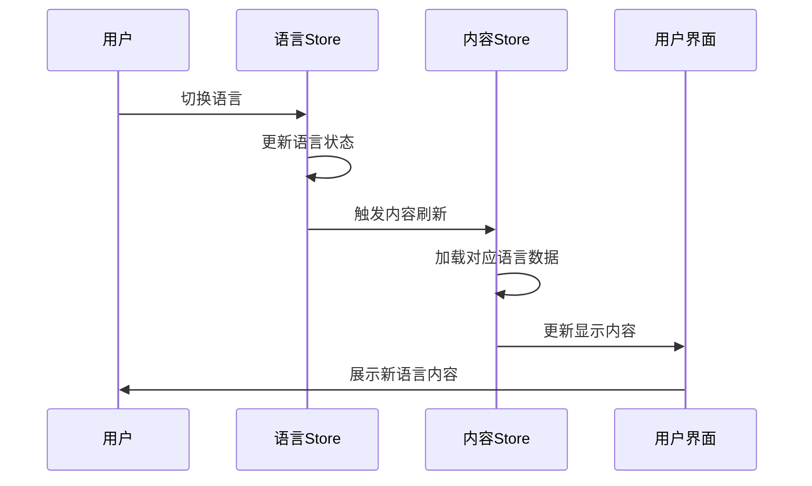
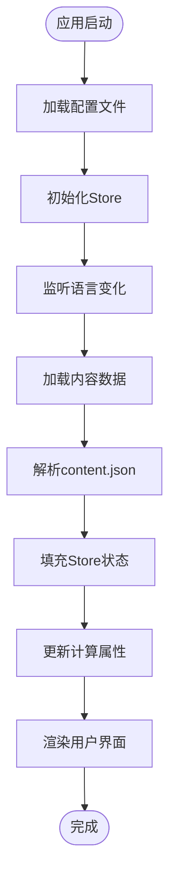
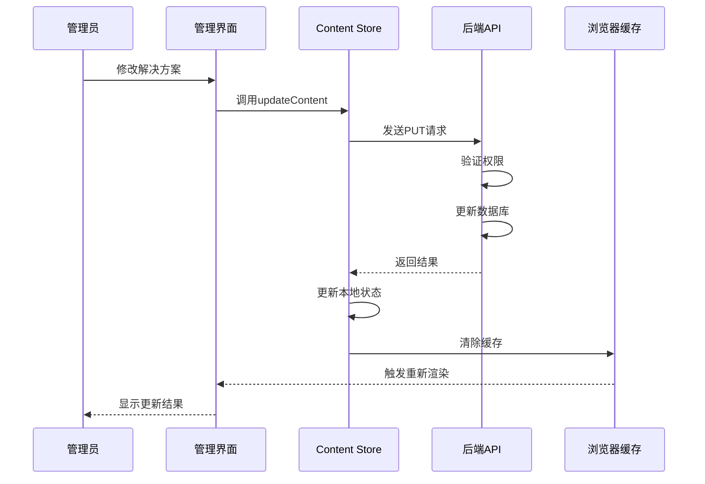
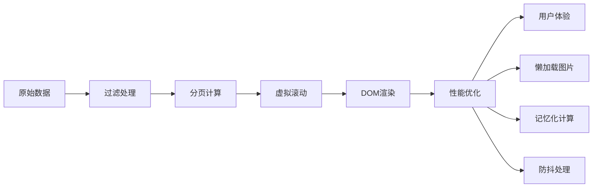
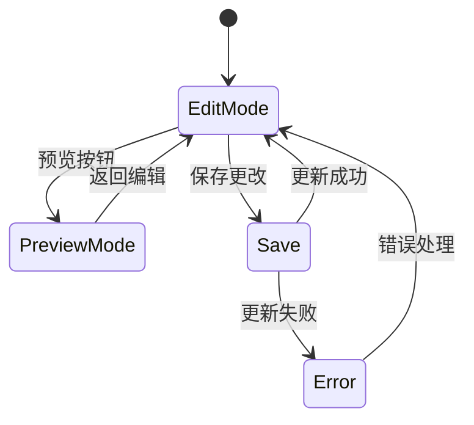

# 解决方案数据模型文档

<cite>
**本文档引用的文件**
- [content.json](file://data/content.json)
- [content.js](file://src/store/modules/content.js)
- [language.js](file://src/store/modules/language.js)
- [language.js](file://src/mixins/language.js)
- [CasesView.vue](file://src/views/CasesView.vue)
- [ContentView.vue](file://src/views/admin/ContentView.vue)
</cite>

## 目录
1. [简介](#简介)
2. [解决方案模型结构](#解决方案模型结构)
3. [多语言实现机制](#多语言实现机制)
4. [数据流分析](#数据流分析)
5. [前端渲染逻辑](#前端渲染逻辑)
6. [管理界面](#管理界面)
7. [性能考虑](#性能考虑)
8. [故障排除指南](#故障排除指南)
9. [总结](#总结)

## 简介

解决方案数据模型是朗德智能科技有限公司网站的核心数据结构之一，专门用于展示无人机产品系列解决方案。该模型包含了侦察无人机、多用途无人机、工业无人机和农业无人机四大系列产品，每个系列都提供了详细的中文和英文版本，支持动态语言切换和国际化展示。

## 解决方案模型结构

### 基础数据结构

解决方案模型采用数组集合形式，每个解决方案对象包含以下核心字段：

```javascript
{
  id: "string",           // 唯一标识符，用于路由和状态管理
  title: "string",        // 解决方案标题
  description: "string",  // 简短描述，用于列表展示
  image: "string",        // 图片URL，支持远程图片资源
  details: "string"       // 详细内容，支持富文本格式
}
```

### 数组集合特性

解决方案数据以数组形式组织，具有以下特点：

- **有序性**：数组按重要性或展示优先级排序
- **可扩展性**：支持动态添加新的解决方案类型
- **索引访问**：可通过ID快速定位特定解决方案
- **批量操作**：支持对整个解决方案集合进行统一操作

### 字段语义含义

| 字段名 | 类型 | 描述 | 示例 |
|--------|------|------|------|
| `id` | string | 唯一标识符，用于路由和状态管理 | "reconnaissance" |
| `title` | string | 解决方案标题，支持多语言 | "侦察无人机" |
| `description` | string | 简短描述，用于列表展示 | "高续航、高稳定性的侦察无人机..." |
| `image` | string | 图片URL，支持远程图片资源 | "/images/solution-1.jpg" |
| `details` | string | 详细内容，支持富文本格式 | "朗德侦察无人机采用碳纤维复合材料机身..." |

**章节来源**
- [content.js](file://src/store/modules/content.js#L82-L103)

## 多语言实现机制

### 双语版本架构

解决方案模型采用双语版本架构，分别维护中文（zh）和英文（en）两个版本：

```javascript
const solutions = reactive({
  zh: [
    {
      id: 'reconnaissance',
      title: '侦察无人机',
      description: '高续航、高稳定性的侦察无人机...',
      image: 'https://via.placeholder.com/600x400?text=侦察无人机',
      details: '朗德侦察无人机采用碳纤维复合材料机身...'
    }
  ],
  en: [
    {
      id: 'reconnaissance',
      title: 'Reconnaissance Drones',
      description: 'High endurance, high stability reconnaissance drone...',
      image: 'https://via.placeholder.com/600x400?text=Reconnaissance Drone',
      details: 'Lande reconnaissance drones feature carbon fiber composite airframes...'
    }
  ]
})
```

### 语言切换机制

语言切换通过Pinia store的状态管理实现：



**图表来源**
- [language.js](file://src/store/modules/language.js#L60-L90)
- [content.js](file://src/store/modules/content.js#L146-L181)

### 动态更新机制

当语言发生变化时，`currentSolutions`计算属性会自动返回对应语言的解决方案数据：

```javascript
const currentSolutions = computed(() => {
  if (!isInitialized.value) return null
  return languageStore.language === 'zh' ? solutions.zh : solutions.en
})
```

这种设计确保了：
- **实时响应**：语言切换立即反映在界面上
- **内存优化**：只加载当前语言的数据
- **一致性保证**：所有解决方案数据保持同步更新

**章节来源**
- [content.js](file://src/store/modules/content.js#L146-L181)
- [language.js](file://src/store/modules/language.js#L60-L90)

## 数据流分析

### 数据初始化流程



**图表来源**
- [content.js](file://src/store/modules/content.js#L25-L50)

### 数据更新流程

当管理员通过管理界面修改解决方案数据时：



**图表来源**
- [content.js](file://src/store/modules/content.js#L580-L610)
- [ContentView.vue](file://src/views/admin/ContentView.vue#L120-L150)

**章节来源**
- [content.js](file://src/store/modules/content.js#L25-L50)
- [content.js](file://src/store/modules/content.js#L580-L610)

## 前端渲染逻辑

### CasesView.vue 渲染机制

`CasesView.vue`组件展示了解决方案数据的列表渲染逻辑：

```javascript
// 分页相关状态
const currentPage = ref(1)
const casesPerPage = 4

// 根据分类筛选案例
const filteredCases = computed(() => {
  if (activeCategory.value === 'all') {
    return cases.value
  } else {
    // 多种匹配条件支持
    return cases.value.filter(item => {
      return item.tag === activeCategory.value ||
             item.tag === categoryTag ||
             item.tag === categoryName ||
             item.category === activeCategory.value
    })
  }
})

// 分页计算属性
const paginatedCases = computed(() => {
  const startIndex = (currentPage.value - 1) * casesPerPage
  const endIndex = startIndex + casesPerPage
  return filteredCases.value.slice(startIndex, endIndex)
})
```

### 交互模式

解决方案列表支持以下交互模式：

1. **分类筛选**：支持按应用场景（工业、农业、军事等）筛选
2. **分页浏览**：每页显示4个解决方案，支持前后翻页
3. **详情查看**：点击解决方案卡片进入详情页面
4. **语言切换**：实时切换中英文版本

### 渲染性能优化



**图表来源**
- [CasesView.vue](file://src/views/CasesView.vue#L120-L150)

**章节来源**
- [CasesView.vue](file://src/views/CasesView.vue#L120-L150)
- [CasesView.vue](file://src/views/CasesView.vue#L200-L250)

## 管理界面

### 解决方案管理功能

管理界面提供了完整的解决方案数据管理功能：

```javascript
// 编辑解决方案
const editSolution = (index) => {
  Object.assign(currentSolution, JSON.parse(JSON.stringify(editableSolutions.value[index])))
  showSolutionEditor.value = true
}

// 保存解决方案
const saveSolution = async () => {
  const index = editableSolutions.value.findIndex(s => s.id === currentSolution.id)
  if (index !== -1) {
    editableSolutions.value[index] = { ...currentSolution }
    await updateContent('solutions', editableSolutions.value)
    showSolutionEditor.value = false
  }
}
```

### 数据验证机制

管理界面实现了多层次的数据验证：

1. **前端验证**：表单输入验证
2. **格式检查**：确保必需字段完整
3. **类型验证**：验证数据类型正确性
4. **业务规则**：符合业务逻辑要求

### 实时预览功能



**图表来源**
- [ContentView.vue](file://src/views/admin/ContentView.vue#L120-L150)

**章节来源**
- [ContentView.vue](file://src/views/admin/ContentView.vue#L120-L150)
- [ContentView.vue](file://src/views/admin/ContentView.vue#L250-L280)

## 性能考虑

### 内存优化策略

1. **按需加载**：只加载当前语言的解决方案数据
2. **懒加载**：图片资源采用懒加载机制
3. **缓存机制**：利用浏览器缓存减少重复请求
4. **虚拟滚动**：大数据集采用虚拟滚动技术

### 渲染性能优化

1. **计算属性缓存**：利用Vue的计算属性缓存机制
2. **防抖处理**：语言切换事件采用防抖处理
3. **批量更新**：一次性更新多个相关状态
4. **异步渲染**：耗时操作采用异步处理

### 网络优化

1. **CDN加速**：静态资源使用CDN分发
2. **压缩传输**：启用Gzip压缩
3. **HTTP缓存**：合理设置缓存策略
4. **连接复用**：使用HTTP/2多路复用

## 故障排除指南

### 常见问题及解决方案

#### 1. 语言切换失效

**症状**：切换语言后解决方案内容未更新

**排查步骤**：
1. 检查语言Store状态是否正确更新
2. 验证currentSolutions计算属性是否返回正确数据
3. 确认UI组件是否监听到语言变化

**解决方案**：
```javascript
// 强制刷新视图
const refreshView = () => {
  forceRender.value += 1
  window.dispatchEvent(new Event('resize'))
}
```

#### 2. 数据加载失败

**症状**：解决方案数据为空或加载错误

**排查步骤**：
1. 检查API接口是否可用
2. 验证JSON数据格式是否正确
3. 查看浏览器控制台错误信息

**解决方案**：
```javascript
// 错误处理机制
try {
  const response = await axios.get(url)
  // 更新数据
} catch (err) {
  console.error('获取解决方案数据失败:', err)
  error.value = err.message || '数据加载失败'
}
```

#### 3. 图片加载问题

**症状**：解决方案图片无法显示

**排查步骤**：
1. 检查图片URL是否正确
2. 验证图片资源是否存在
3. 确认跨域访问权限

**解决方案**：
```javascript
// 默认图片处理

```

**章节来源**
- [content.js](file://src/store/modules/content.js#L580-L610)
- [CasesView.vue](file://src/views/CasesView.vue#L100-L120)

## 总结

解决方案数据模型是一个设计精良的多语言内容管理系统，具有以下核心优势：

### 技术优势

1. **模块化设计**：清晰的职责分离和模块化架构
2. **响应式编程**：充分利用Vue 3的响应式特性
3. **状态管理**：完善的Pinia store状态管理
4. **性能优化**：多层次的性能优化策略

### 功能特性

1. **多语言支持**：完整的中英文双语版本
2. **动态更新**：实时语言切换和数据更新
3. **管理便捷**：直观的管理界面和操作流程
4. **扩展性强**：易于添加新的解决方案类型

### 应用价值

该解决方案模型不仅满足了当前业务需求，还为未来的功能扩展奠定了坚实基础。通过合理的架构设计和性能优化，确保了系统的稳定性和可维护性，为用户提供优质的多语言内容体验。