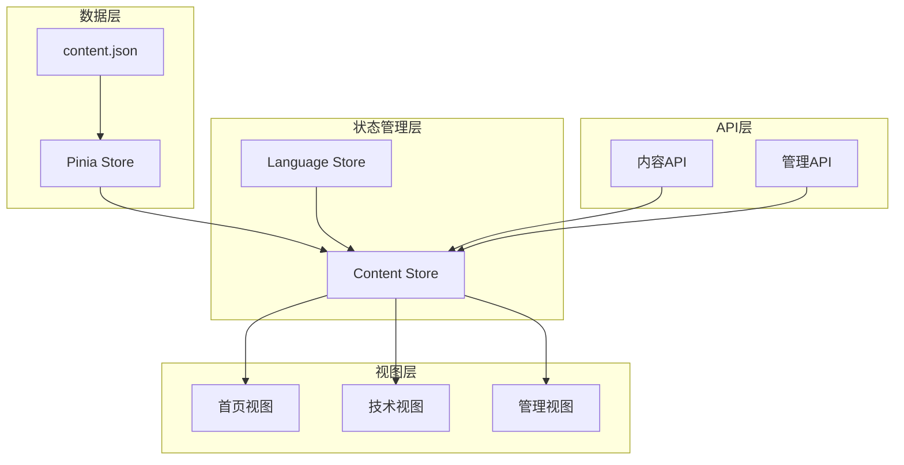
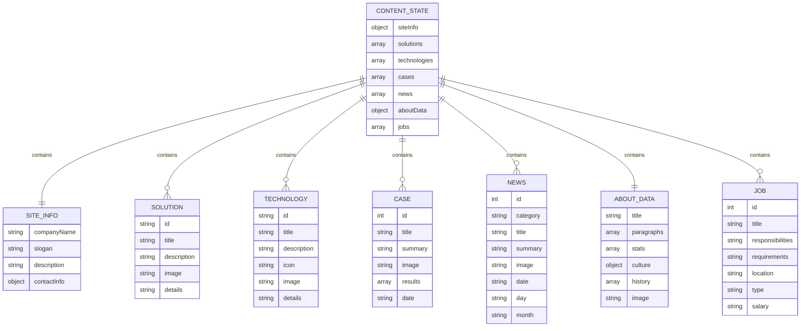
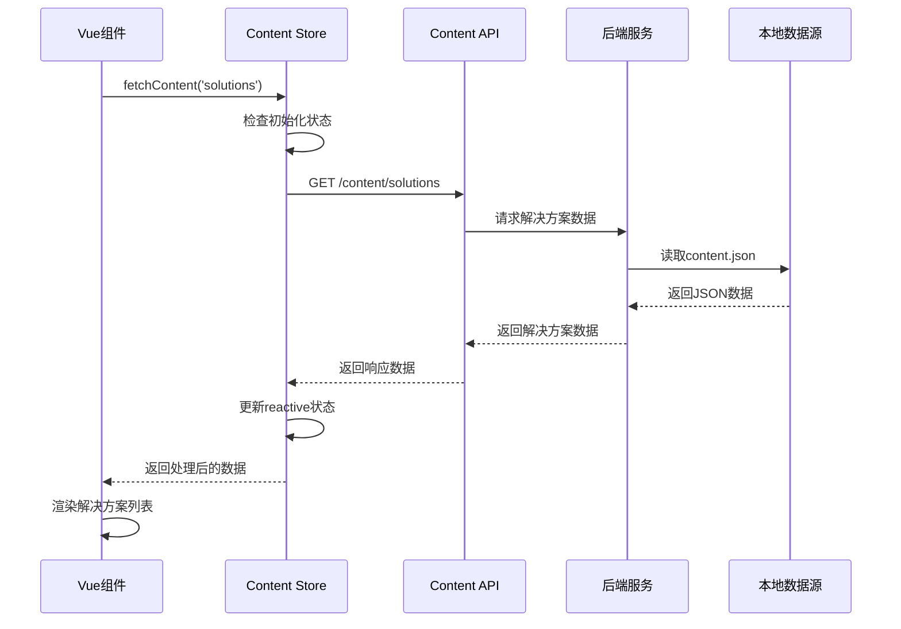
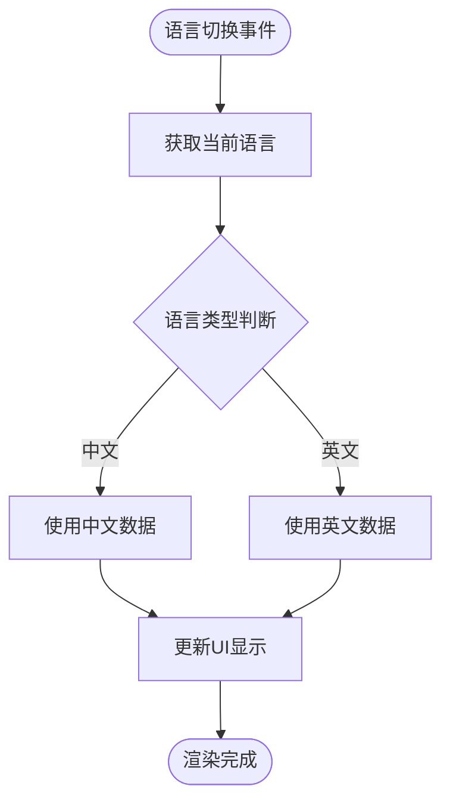
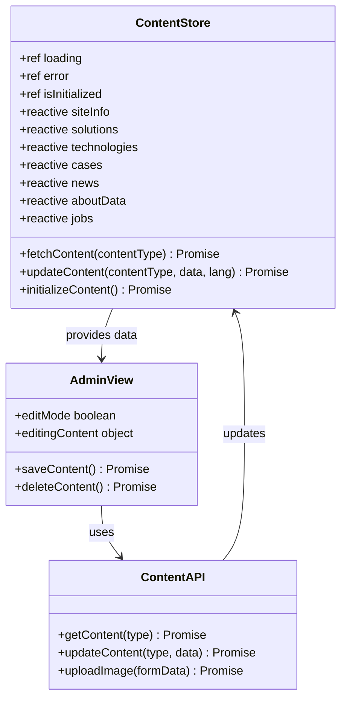

# 数据模型设计

<cite>
**本文档引用的文件**
- [data/content.json](file://data/content.json)
- [src/store/modules/content.js](file://src/store/modules/content.js)
- [src/views/HomeView.vue](file://src/views/HomeView.vue)
- [src/views/TechnologyView.vue](file://src/views/TechnologyView.vue)
- [src/views/admin/ContentView.vue](file://src/views/admin/ContentView.vue)
- [src/api/index.js](file://src/api/index.js)
- [src/store/index.js](file://src/store/index.js)
</cite>

## 目录
1. [简介](#简介)
2. [项目结构概览](#项目结构概览)
3. [核心数据模型](#核心数据模型)
4. [ContentState实体结构](#contentstate实体结构)
5. [数据流架构](#数据流架构)
6. [多语言支持机制](#多语言支持机制)
7. [数据序列化与反序列化](#数据序列化与反序列化)
8. [管理后台集成](#管理后台集成)
9. [性能考虑](#性能考虑)
10. [故障排除指南](#故障排除指南)
11. [总结](#总结)

## 简介

本文档详细定义了基于Vue.js和Pinia的状态管理系统中的内容数据模型。该系统采用统一的数据契约设计，支持多语言内容管理，为前端应用提供结构化的数据访问接口。系统涵盖了公司信息、解决方案、核心技术、客户案例、新闻资讯和招聘信息等七大核心业务模块。

## 项目结构概览



**图表来源**
- [src/store/modules/content.js](file://src/store/modules/content.js#L1-L50)
- [src/store/index.js](file://src/store/index.js#L1-L6)

## 核心数据模型

系统采用分层数据模型设计，将内容分为七个主要类别，每种类别都支持中英文双语版本：



**图表来源**
- [src/store/modules/content.js](file://src/store/modules/content.js#L35-L200)

## ContentState实体结构

### siteInfo（公司信息）

公司基本信息实体，包含品牌标识和联系方式：

| 字段名 | 数据类型 | 必填 | 描述 | 多语言支持 |
|--------|----------|------|------|------------|
| companyName | string | 是 | 公司全称 | ✅ 中英文 |
| slogan | string | 是 | 企业口号 | ✅ 中英文 |
| description | string | 是 | 企业简介 | ✅ 中英文 |
| contactInfo.address | string | 是 | 公司地址 | ✅ 中英文 |
| contactInfo.phone | string | 是 | 联系电话 | ✅ 中英文 |
| contactInfo.email | string | 是 | 联系邮箱 | ✅ 中英文 |

**节来源**
- [src/store/modules/content.js](file://src/store/modules/content.js#L35-L50)
- [data/content.json](file://data/content.json#L1-L15)

### solutions（解决方案）

无人机系统解决方案列表，每个方案包含详细的技术规格：

| 字段名 | 数据类型 | 必填 | 描述 | 多语言支持 |
|--------|----------|------|------|------------|
| id | string | 是 | 唯一标识符 | ❌ |
| title | string | 是 | 方案标题 | ✅ 中英文 |
| description | string | 是 | 方案概述 | ✅ 中英文 |
| image | string | 是 | 图片路径 | ❌ |
| details | string | 是 | 详细技术说明 | ✅ 中英文 |

**节来源**
- [src/store/modules/content.js](file://src/store/modules/content.js#L60-L120)

### technologies（核心技术）

反无人机系统核心技术条目，包含技术原理和应用场景：

| 字段名 | 数据类型 | 必填 | 描述 | 多语言支持 |
|--------|----------|------|------|------------|
| id | string | 是 | 技术标识符 | ❌ |
| title | string | 是 | 技术名称 | ✅ 中英文 |
| description | string | 是 | 技术概述 | ✅ 中英文 |
| icon | string | 是 | FontAwesome图标类名 | ❌ |
| image | string | 是 | 技术图片路径 | ❌ |
| details | string | 是 | 技术详细说明 | ✅ 中英文 |

**节来源**
- [src/store/modules/content.js](file://src/store/modules/content.js#L130-L250)

### cases（客户案例）

典型客户案例展示，包含实施成果和统计数据：

| 字段名 | 数据类型 | 必填 | 描述 | 多语言支持 |
|--------|----------|------|------|------------|
| id | int | 是 | 案例唯一编号 | ❌ |
| title | string | 是 | 案例标题 | ✅ 中英文 |
| summary | string | 是 | 案例摘要 | ✅ 中英文 |
| image | string | 是 | 案例图片路径 | ❌ |
| results | array | 是 | 实施成果数组 | ✅ 中英文 |
| date | string | 是 | 实施日期 | ❌ |

**节来源**
- [src/store/modules/content.js](file://src/store/modules/content.js#L260-L350)

### news（新闻资讯）

公司新闻和行业动态列表：

| 字段名 | 数据类型 | 必填 | 描述 | 多语言支持 |
|--------|----------|------|------|------------|
| id | int | 是 | 新闻唯一编号 | ❌ |
| category | string | 是 | 新闻分类 | ❌ |
| title | string | 是 | 新闻标题 | ✅ 中英文 |
| summary | string | 是 | 新闻摘要 | ✅ 中英文 |
| image | string | 是 | 新闻图片路径 | ❌ |
| date | string | 是 | 发布日期 | ❌ |
| day | string | 是 | 日期天数 | ❌ |
| month | string | 是 | 月份格式 | ❌ |

**节来源**
- [src/store/modules/content.js](file://src/store/modules/content.js#L360-L420)

### aboutData（关于我们）

公司介绍和企业文化数据：

| 字段名 | 数据类型 | 必填 | 描述 | 多语言支持 |
|--------|----------|------|------|------------|
| title | string | 是 | 公司名称 | ✅ 中英文 |
| paragraphs | array | 是 | 公司介绍段落 | ✅ 中英文 |
| stats | array | 是 | 企业统计信息 | ✅ 中英文 |
| culture.vision | string | 是 | 企业愿景 | ✅ 中英文 |
| culture.mission | string | 是 | 企业使命 | ✅ 中英文 |
| culture.values | array | 是 | 企业价值观 | ✅ 中英文 |
| history | array | 是 | 公司发展历程 | ✅ 中英文 |
| image | string | 是 | 公司图片路径 | ❌ |

**节来源**
- [src/store/modules/content.js](file://src/store/modules/content.js#L430-L520)

### jobs（招聘信息）

职位招聘信息列表：

| 字段名 | 数据类型 | 必填 | 描述 | 多语言支持 |
|--------|----------|------|------|------------|
| id | int | 是 | 职位唯一编号 | ❌ |
| title | string | 是 | 职位名称 | ✅ 中英文 |
| responsibilities | string | 是 | 工作职责 | ✅ 中英文 |
| requirements | string | 是 | 任职要求 | ✅ 中英文 |
| location | string | 是 | 工作地点 | ✅ 中英文 |
| type | string | 是 | 职位类型 | ✅ 中英文 |
| salary | string | 是 | 薪资范围 | ✅ 中英文 |

**节来源**
- [src/store/modules/content.js](file://src/store/modules/content.js#L530-L580)

## 数据流架构



**图表来源**
- [src/store/modules/content.js](file://src/store/modules/content.js#L540-L590)
- [src/api/index.js](file://src/api/index.js#L35-L45)

**节来源**
- [src/store/modules/content.js](file://src/store/modules/content.js#L540-L590)

## 多语言支持机制

系统采用双语言架构，每种内容类型都包含中英文版本：



**图表来源**
- [src/store/modules/content.js](file://src/store/modules/content.js#L15-L25)

语言切换通过Pinia store的watch机制自动触发：

```javascript
// 监听语言变化，触发刷新
watch(() => languageStore.language, async (newLang, oldLang) => {
  console.log('ContentStore检测到语言变化，从', oldLang, '变为', newLang);
  await initializeContent()
})
```

**节来源**
- [src/store/modules/content.js](file://src/store/modules/content.js#L15-L25)

## 数据序列化与反序列化

### fetchContent方法

`fetchContent`方法负责从后端API获取并序列化内容数据：

```javascript
const fetchContent = async (contentType) => {
  if (!isInitialized.value) return null
  
  try {
    loading.value = true
    error.value = null
    
    // 构建API请求URL
    const url = `/content/${contentType}`
    
    // 发送请求
    const response = await axios.get(url)
    
    // 更新相应的数据
    if (contentType === 'site-info') {
      // 更新网站基本信息
      Object.assign(siteInfo.zh, response.data?.zh || {})
      Object.assign(siteInfo.en, response.data?.en || {})
    } else if (contentType === 'technologies') {
      // 更新技术数据
      if (response.data?.zh) technologies.zh = response.data.zh
      if (response.data?.en) technologies.en = response.data.en
    }
    // ... 其他内容类型的处理
    
    return response.data
  } catch (err) {
    console.error(`获取${contentType}数据失败:`, err)
    error.value = err.message || '数据加载失败'
    return null
  } finally {
    loading.value = false
  }
}
```

### updateContent方法

`updateContent`方法用于管理后台更新内容数据：

```javascript
const updateContent = async (contentType, data, lang) => {
  if (!isInitialized.value) return null
  
  try {
    // 向API发送更新请求
    await axios.put(`/api/admin/content/${contentType}`, {
      data,
      language: lang || languageStore.language
    })
    
    return { success: true }
  } catch (error) {
    console.error(`Error updating ${contentType}:`, error)
    return { success: false, error: error.message }
  }
}
```

**节来源**
- [src/store/modules/content.js](file://src/store/modules/content.js#L540-L598)

## 管理后台集成

管理后台通过专门的API接口与内容管理系统交互：



**图表来源**
- [src/views/admin/ContentView.vue](file://src/views/admin/ContentView.vue#L165-L213)
- [src/api/index.js](file://src/api/index.js#L35-L55)

**节来源**
- [src/views/admin/ContentView.vue](file://src/views/admin/ContentView.vue#L165-L213)

## 性能考虑

### 数据缓存策略

系统采用以下性能优化策略：

1. **懒加载**: 内容按需加载，避免一次性加载所有数据
2. **状态缓存**: 使用Pinia的响应式状态缓存已加载的数据
3. **强制刷新**: 通过refreshTrigger标记实现数据强制刷新
4. **错误处理**: 完善的错误边界处理，防止单个内容加载失败影响整体应用

### 内存管理

```javascript
// 监听语言变化，触发刷新
watch(() => languageStore.language, async (newLang, oldLang) => {
  console.log('ContentStore检测到语言变化，从', oldLang, '变为', newLang);
  await initializeContent()
})
```

这种设计确保了：
- 语言切换时自动刷新相关数据
- 避免内存泄漏
- 提供一致的用户体验

## 故障排除指南

### 常见问题及解决方案

1. **数据加载失败**
   - 检查API端点是否可用
   - 验证网络连接状态
   - 查看浏览器控制台错误信息

2. **语言切换不生效**
   - 确认languageStore正确初始化
   - 检查watch监听器是否正常工作
   - 验证数据对象的双语结构

3. **内容更新失败**
   - 检查管理员权限验证
   - 确认API路由配置正确
   - 验证数据格式符合后端要求

**节来源**
- [src/store/modules/content.js](file://src/store/modules/content.js#L540-L598)

## 总结

本文档详细定义了基于Vue.js和Pinia的内容数据模型，涵盖了七大数据实体的完整结构规范。系统采用统一的数据契约设计，支持多语言内容管理，提供了完善的数据序列化和反序列化机制。通过清晰的架构设计和标准化的API接口，为前端应用提供了可靠的数据访问层，同时为内容编辑者和后端开发人员提供了权威的数据契约参考。

该数据模型设计充分考虑了现代Web应用的需求，包括性能优化、错误处理、多语言支持等关键特性，为构建高质量的企业级Web应用奠定了坚实的基础。