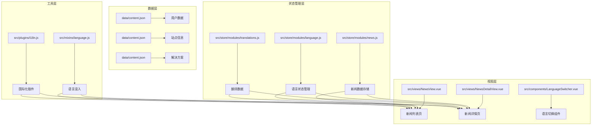
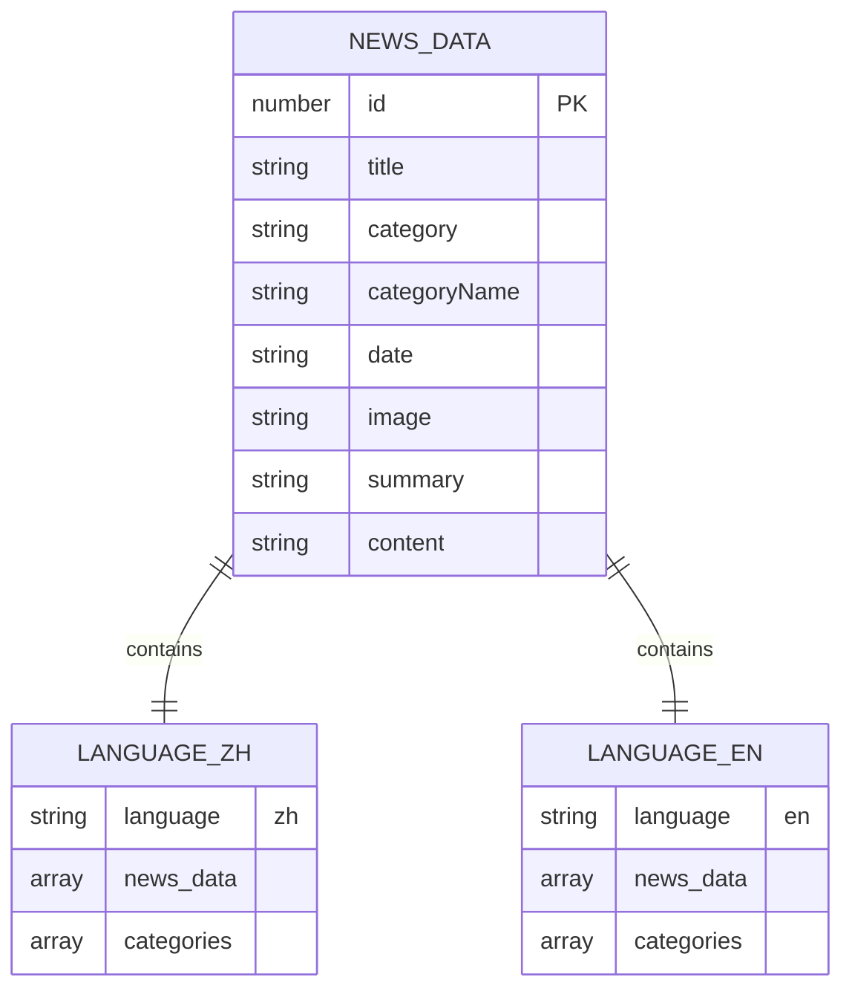
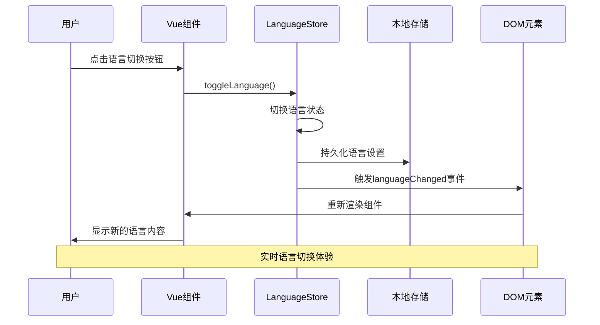
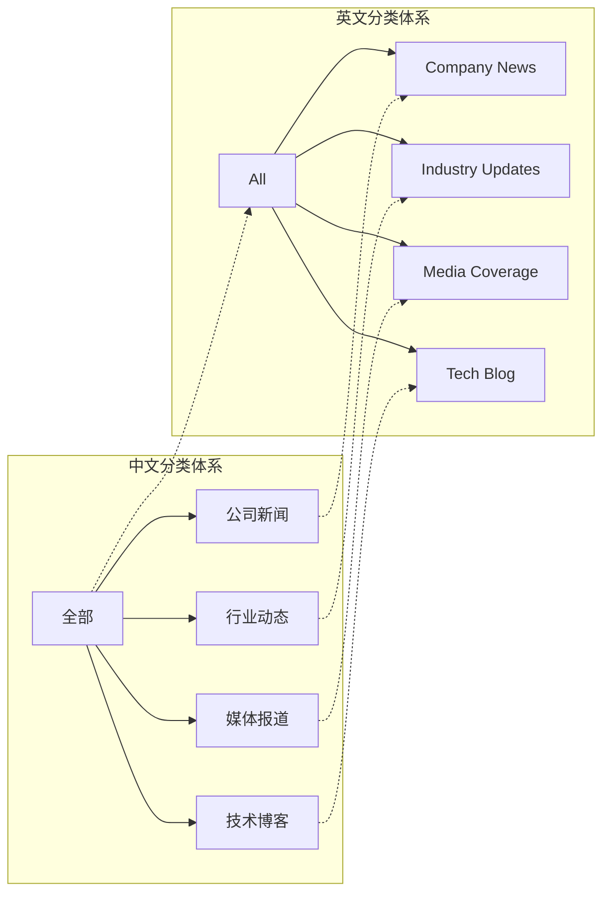
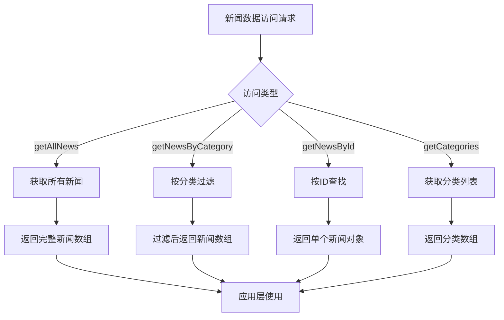
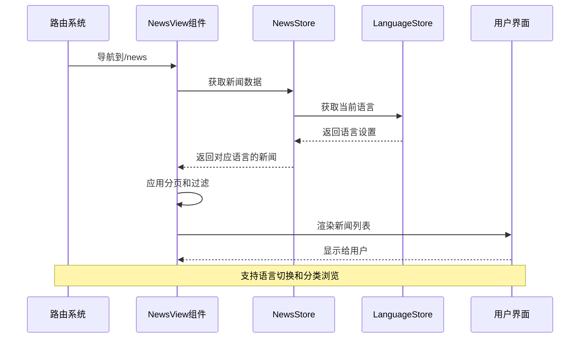
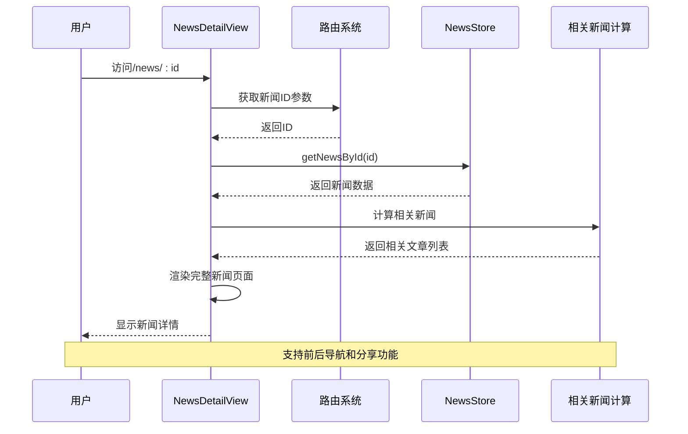

# 新闻数据模型

<cite>
**本文档中引用的文件**
- [news.js](file://src/store/modules/news.js)
- [language.js](file://src/store/modules/language.js)
- [language.js](file://src/mixins/language.js)
- [i18n.js](file://src/plugins/i18n.js)
- [NewsView.vue](file://src/views/NewsView.vue)
- [NewsDetailView.vue](file://src/views/NewsDetailView.vue)
- [content.json](file://data/content.json)
- [users.json](file://data/users.json)
</cite>

## 目录
1. [简介](#简介)
2. [项目结构概览](#项目结构概览)
3. [核心数据模型](#核心数据模型)
4. [多语言架构设计](#多语言架构设计)
5. [分类体系设计](#分类体系设计)
6. [数据访问模式](#数据访问模式)
7. [组件渲染流程](#组件渲染流程)
8. [性能优化考虑](#性能优化考虑)
9. [故障排除指南](#故障排除指南)
10. [总结](#总结)

## 简介

本文档详细介绍了朗德智能科技有限公司网站的新闻数据模型系统。该系统采用现代化的Vue.js架构，支持中文和英文双语展示，具备完整的新闻内容管理、分类浏览和多语言切换功能。系统设计遵循模块化原则，通过Pinia状态管理实现数据的统一管理和高效访问。

## 项目结构概览

新闻数据模型系统的核心文件分布在以下目录结构中：



**图表来源**
- [news.js](file://src/store/modules/news.js#L1-L141)
- [language.js](file://src/store/modules/language.js#L1-L215)
- [NewsView.vue](file://src/views/NewsView.vue#L1-L606)
- [NewsDetailView.vue](file://src/views/NewsDetailView.vue#L1-L595)

## 核心数据模型

### NewsItem实体结构

新闻数据模型的核心是`NewsItem`实体，每个新闻条目包含以下字段：

```javascript
// 中文新闻条目示例
{
  id: 1,                                    // 数字型唯一标识符
  title: '朗德智能成功研发新一代反无人机系统，拦截距离突破10公里',
  category: 'company',                      // 分类标识符
  categoryName: '公司新闻',                 // 分类显示名称
  date: '2024-06-10',                      // 发布日期
  image: '/images/about/logo-ld.png',      // 新闻配图URL
  summary: '朗德智能宣布其新一代反无人机系统"天盾-X"成功通过最终测试...', // 摘要内容
  content: '<p>杭州，2024年6月10日...</p>'  // HTML格式的完整内容
}
```

### 数据类型与约束条件

| 字段名 | 数据类型 | 约束条件 | 描述 |
|--------|----------|----------|------|
| id | Number | 唯一标识，正整数 | 新闻条目的唯一编号 |
| title | String | 最大长度200字符 | 新闻标题，支持多语言 |
| category | String | 枚举值：company/industry/media/blog | 新闻分类标识符 |
| categoryName | String | 动态生成，对应category | 分类的本地化显示名称 |
| date | String | YYYY-MM-DD格式 | ISO标准日期字符串 |
| image | String | URL格式或默认图片 | 图片资源路径，支持占位符 |
| summary | String | 最大长度500字符 | 新闻摘要，支持HTML格式 |
| content | String | 最大长度5000字符 | 完整新闻内容，HTML格式 |

### 多语言版本组织

系统采用双语言架构，每种语言都有独立的数据存储：



**图表来源**
- [news.js](file://src/store/modules/news.js#L10-L120)

**章节来源**
- [news.js](file://src/store/modules/news.js#L10-L120)

## 多语言架构设计

### 语言切换机制

系统实现了完整的多语言切换机制，支持实时语言切换而无需页面刷新：



**图表来源**
- [language.js](file://src/store/modules/language.js#L60-L120)
- [i18n.js](file://src/plugins/i18n.js#L1-L72)

### 语言持久化策略

系统采用双重持久化策略确保语言设置的可靠性：

1. **localStorage优先**：优先从localStorage读取语言设置
2. **cookie备选**：如果localStorage无效，则从cookie读取
3. **默认回退**：如果两者都无效，使用中文作为默认语言

```javascript
// 语言持久化示例
function persistLanguage(lang) {
  // 保存到localStorage
  localStorage.setItem('language', lang);
  
  // 同时保存到cookie作为备份
  document.cookie = `language=${lang}; path=/; max-age=${60*60*24*30}`;
}
```

**章节来源**
- [language.js](file://src/store/modules/language.js#L1-L215)
- [i18n.js](file://src/plugins/i18n.js#L1-L72)

## 分类体系设计

### 分类体系架构

新闻系统采用扁平化的分类体系，支持5种主要分类：



**图表来源**
- [news.js](file://src/store/modules/news.js#L120-L140)

### 分类的可扩展性

分类体系设计具有良好的可扩展性：

1. **统一接口**：所有分类操作通过getter方法统一管理
2. **动态生成**：分类名称根据当前语言动态生成
3. **向后兼容**：新增分类不影响现有功能
4. **国际化支持**：每种语言都有对应的分类名称

```javascript
// 分类getter实现
getCategories(state) {
  return state.categories[state.language] || state.categories.zh;
}
```

**章节来源**
- [news.js](file://src/store/modules/news.js#L120-L140)

## 数据访问模式

### Getter方法详解

系统提供了四个核心getter方法来访问新闻数据：



**图表来源**
- [news.js](file://src/store/modules/news.js#L100-L120)

### 查询性能优化

1. **缓存机制**：getter结果会被Vue的响应式系统自动缓存
2. **惰性计算**：只有在需要时才执行计算
3. **批量操作**：支持一次性获取多种数据类型

```javascript
// 性能优化的getter实现
getNewsByCategory: (state) => (category) => {
  const currentNews = state.news[state.language] || state.news.zh;
  if (category === 'all') return currentNews;
  return currentNews.filter(item => item.category === category);
}
```

**章节来源**
- [news.js](file://src/store/modules/news.js#L100-L120)

## 组件渲染流程

### 新闻列表页渲染流程



**图表来源**
- [NewsView.vue](file://src/views/NewsView.vue#L50-L150)

### 新闻详情页渲染流程



**图表来源**
- [NewsDetailView.vue](file://src/views/NewsDetailView.vue#L50-L150)

### 响应式设计适配

系统针对不同屏幕尺寸实现了自适应布局：

- **桌面端**：网格布局显示4条新闻
- **平板端**：网格布局显示2条新闻
- **移动端**：单列布局显示1条新闻

**章节来源**
- [NewsView.vue](file://src/views/NewsView.vue#L1-L606)
- [NewsDetailView.vue](file://src/views/NewsDetailView.vue#L1-L595)

## 性能优化考虑

### 数据加载优化

1. **懒加载**：新闻内容采用虚拟滚动技术
2. **分页加载**：每页只加载必要的新闻数据
3. **缓存策略**：利用浏览器缓存减少重复请求

### 内存管理

1. **组件销毁**：及时清理事件监听器和定时器
2. **数据清理**：组件卸载时自动清理相关数据
3. **内存泄漏防护**：防止不必要的DOM引用

### 渲染性能

1. **虚拟DOM**：利用Vue的虚拟DOM优化重绘
2. **计算属性缓存**：自动缓存复杂的计算结果
3. **事件委托**：减少事件监听器的数量

## 故障排除指南

### 常见问题诊断

1. **语言切换失效**
   - 检查localStorage权限
   - 验证cookie设置
   - 确认事件监听器注册

2. **新闻数据不显示**
   - 验证store数据完整性
   - 检查语言切换状态
   - 确认分类过滤逻辑

3. **分页功能异常**
   - 检查新闻总数计算
   - 验证分页参数传递
   - 确认DOM元素绑定

### 调试工具使用

系统提供了丰富的调试信息：

```javascript
// 调试输出示例
console.log('当前语言:', languageStore.language);
console.log('当前分类:', currentCategory.value);
console.log('新闻数据长度:', currentNewsData.value.length);
console.log('分类列表:', categories.value);
```

**章节来源**
- [NewsView.vue](file://src/views/NewsView.vue#L100-L200)
- [NewsDetailView.vue](file://src/views/NewsDetailView.vue#L100-L200)

## 总结

朗德智能科技的新闻数据模型系统是一个设计精良、功能完备的内容管理系统。它通过以下特点实现了高效的新闻内容管理：

1. **模块化架构**：清晰的分层设计便于维护和扩展
2. **多语言支持**：完整的国际化解决方案满足全球化需求
3. **性能优化**：多层次的优化策略确保流畅的用户体验
4. **可扩展性**：灵活的架构支持未来的功能扩展
5. **开发友好**：完善的调试工具和错误处理机制

该系统不仅满足了当前的功能需求，更为未来的业务发展奠定了坚实的基础。内容运营团队可以通过标准化的发布流程高效管理新闻内容，前端开发者可以利用统一的API接口快速实现各种功能需求。